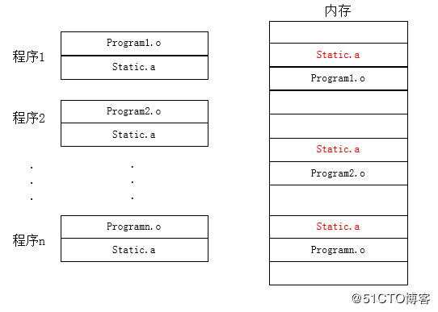
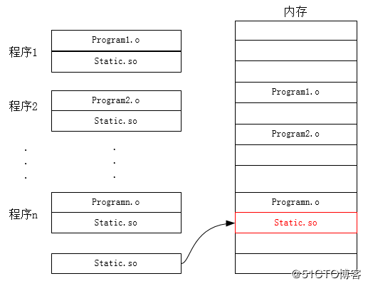

### 静态链接库：

- 扩展名：.a
- 编译行为：在编译的时候，将函数库直接整合到执行程序中（所以利用静态库编译生成的文档会更大）
- 独立执行的状态：编译成功的可执行文件可以独立运行，不需要再向外部要求读取函式库的内容
- 更新：如果函式库更新，需要将整个项目程序重新编译
- 好处：方便程序移植

### 动态链接库：

- 扩展名：.so
- 编译行为：在编译的时候，程序里面仅有指向动态库所在的指标，其内容并没有被整合到执行文件中。所以，在程序运行之初不需要加载所有代码，只有在用到函式库中的某个函数时，程序才会去读取动态库的内容（所以利用动态库编译生成的文档会小些）
- 独立执行的状态：编译成功的可执行文件不能独立执行，函式库必须存在，而且库所在的目录也不能改变。（移动之后，必须重新编译链接）
- 更新：如果函式库更新，不需要重新编译，因为执行文件里仅有库的位置（前提是函式库名称、位置都没变）
- 好处：
	- 只保留接口，将动态库和程序代码独立，提高代码的可复用性，降低程序耦合度。
	- **节约内存**，减少页面交换。

比如：计算机同时运行多个程序，都应用static.a，在内存中就会存在多份拷贝。一旦程序数量过多，就有可能内存不足。

而在动态库在内存中只存在一份拷贝，不会浪费空间。

