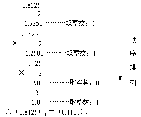
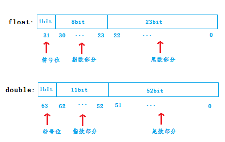

## 结论

float 可保证的精度为6位(注意不是 可精确到小数点6位 )

double 可保证的精度为15位

数值范围： 大约+-float:2^127, double: 2^1023,所以基本不担心溢出。

举个例子：

float a= 123456789.123  由于精度的损失实际的值a = 123456700 = 1.234567e8。 


## 十进制小数转换为二进制小数

十进制的**小数**部分转换为二进制采用的方法为：**乘2取整，顺序排列。**



## C/C++中float和double的存储结构

在C/C++中float是32位的，double是64位的，两者在内存中的存储方式和能够表示的精度均不同，目前C/C++编译器标准都遵照IEEE制定的浮点数表示法来进行float,double运算。

无论是float还是double，在内存中的存储主要分成三部分，分别是：

（1）符号位（Sign）：0代表正数，1代表负数

（2）指数位（Exponent）：用于存储科学计数法中的指数部分，并且采用移位存储方式

（3）尾数位（Mantissa）：用于存储尾数部分

对于两者在内存中的存储结构，如下图所示：



数字`float 9.125`在十进制中用科学计算的方式表示为`9.125*10^0 ` ，但是在计算机中，计算机只认识0和1，所以在计算机中是按照科学计算的二进制的方式表示的：

9的二进制表示为1001, 0.125的二进制表示为0.001, 所以`9.125`的表示成`1001.001` 。将其表示成二进制的科学计数方式为 `1.001001*2^3 `

在计算机中，任何一个数都可以表示成`1.xxxxxx*2^n` 这样的形式，其中`xxxxx`就表示尾数部分，`n`表示指数部分。其中，因为最高位`1`这里，由于任何的一个数表示成这种形式时这里都是1，所以在存储时实际上并不保存这一位，

### 单精度

float 类型变量在内存中的结构如上图，第 1 位是符号位(sign)，接下来 8 位是指数位(exponent)，剩下 23 位是小数位(fraction)。由于 2^{23}= 8388608，最大可以表示十进制的7位小数，但是不能表示所有的7位小数，所以可以保证的精度为6位。

### 双精度

double 类型变量在内存中的结构如上图，第 1 位是符号位(sign)，接下来 11 位是指数位(exponent)，剩下 52 位是小数位(fraction)。由于2^{52}= 4503599627370496，最大可以表示十进制的16位小数，但是不能表示所有的16位小数，所以可以保证的精度为15位。

### 指数部分

使用e表示指数位，在计算机中采用移位存储方式，即把原指数值加上一个特定数字。使某一数据类型能够表示的数值范围发生变动。e为一个无符号整数（unsigned int），这意味着，如果e为8位，它的取值范围为0~255；如果e为11位，它的取值范围为0~2047。但是，科学计数法中的e是可以出现负数的，所以IEEE 754规定，e的真实值等于指数值加上一个中间数，对于8位的e，这个中间数是127，指数取整范围变成了-127~128；对于11位的e，这个中间数是1023，指数取值范围变成了-1023~1024。而我们通过计算机内存读取浮点数指数值的时候，需要减去127/1023。


实验：

```cpp
#include <iostream>
#include <algorithm>
#include <vector>
#include <iomanip>

using namespace std;

int main() {
    //set standard deviation of position:
    float a = 12234.1234567800;
    double b = 12234.123456789123456789;
    cout << fixed << setprecision (30) << a << endl;
    cout << b;
    return 0;
};
```

