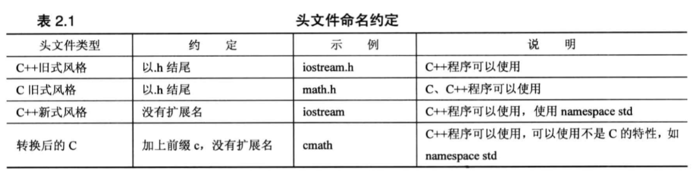

## 第一个c++ 程序

```cpp
// 第一个c++程序
#include <iostream>

int main()
{
	using namespace std;
	cout << "hello world.";
	cout << endl;

	return 0;
}
```

使用g++ 编译：
```shell
# cd 到文件目录
$ g++ main.cpp
```
运行：
```shell
$ a.exe
# 或者
$ a
```
- 无参数传递时，c++ 习惯使用 int main（），而不用 int main(void)，这样写并没有错误，只是不符合习惯。

- `""` 双引号为字符串

- `endl`表示重起一行，`/n` 换行符为旧式方法，区别在于，endl能确保程序继续向下运行前刷新输出，将内容显示在屏幕上。

- #include 编译指令使iostream文件的内容随源代码文件的内容一起被发送给编译器，实际上，iostream 文件内的内容将替换程序中的代码行#include<iostream>。

- 头文件：
C语言传统使用 .h 为拓展名的头文件，老标准C++也是用.h 为头文件拓展名，新C++ 头文件无拓展名，C++也可以使用.h 头文件。



> C++编译器标准组件都被放置在命名空间std中。只有不带.h 的头文件才可能具有命名空间

- 命名空间namespace ：
举例： 有两个封装好的产品，都包含一个wanda()函数，使用命名空间来区别两个函数
	- Microflop::wanda()
	- Piscine::wanda()

- cout 实际是std::cout

## 第二个程序
```cpp
//uses and displays a variable
#include <iostream>

int main()
{
	using namespace std;

	int carrots;
	carrots = 25;
	cout << "I have ";
	cout << carrots;
	cout << " carrots.";
	cout << endl;
	carrots = carrots - 1;
	cout << "Now I have " << carrots << " carrots." <<endl;

	return 0;
}
```
- 变量声明：`int carrots;`
	- 第一指出程序需要足够的存储空间来储存一个整数，编译器负责分配和标记内存的细节。
	- 第二给存储单元指定名称，此后程序将使用名称carrots来标识存储在该内存单元的值。

- C++中所有变量都必须声明
- 赋值语句:复制语句将值给存储单元
- 

