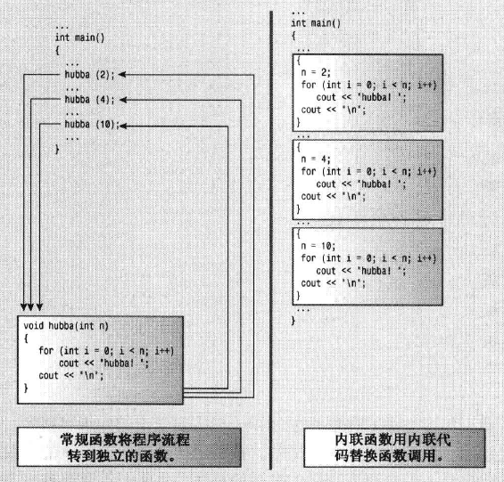
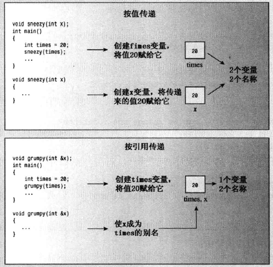

# 内联函数

- 程序在调用普通函数时需要在内存中进行跳转，这种跳转需要花费时间
- 编译器使用相应的函数代码替换函数调用
- 内联函数的运行速度比常规函数稍快
- 内联函数占用更多内存，因为存在多个副本
- 适合短函数



## 用法

- 通常省略原型，将整个定义（函数头和函数代码）放到原来的原型位置。
- 应在函数生命前加上关键字inline，在函数定义前加上关键字inline。

实例：

```cpp
// inline.cpp -- using an inline function
#include <iostream>

// an inline function definition
inline double square(double x) { return x * x; }
int main()
{
    using namespace std;
    double a, b;
    double c = 13.0;

    a = square(5.0);
    b = square(4.5 + 7.5);   // can pass expressions
    cout << "a = " << a << ", b = " << b << "\n";
    cout << "c = " << c;
    cout << ", c squared = " << square(c++) << "\n";
    cout << "Now c = " << c << "\n";
    return 0;  
}
```

```
a = 25, b = 144
c = 13, c squared = 169
Now c = 14
```

# 引用变量

- 引用变量是C++新增的一种复合类型
- 引用是已定义的变量的别名
- 引用变量的主要用途是作为函数的形参，通过将引用变量作为参数，函数将使用原始数据，而不是副本

## 创建引用变量

```cpp
int rates;
int & rodents = rats; //将rodents类型声明为`int &`，即指向int变量的引用
//rates 和 rodnets指向相同的内存单元
```

- 引用变量必须在声明引用变量时进行初始化

- 引用很接近const指针，一旦与某个变量关联起来，就无法改变

  `int & rodents = rats;`  相近于 `int * const pr = &rats;`

```cpp
// secref.cpp -- defining and using a reference
#include <iostream>
int main()
{
    using namespace std;
    int rats = 101;
    int & rodents = rats;   // rodents is a reference

    cout << "rats = " << rats;
    cout << ", rodents = " << rodents << endl;

    cout << "rats address = " << &rats;
    cout << ", rodents address = " << &rodents << endl;

    int bunnies = 50;
    rodents = bunnies;       // 将bunnies的值赋给rodents和rats指向的地址
    cout << "bunnies = " << bunnies;
    cout << ", rats = " << rats;
    cout << ", rodents = " << rodents << endl;

    cout << "bunnies address = " << &bunnies;
    cout << ", rodents address = " << &rodents << endl;
    return 0; 
}
```

```
rats = 101, rodents = 101
rats address = 0x6dfee8, rodents address = 0x6dfee8
bunnies = 50, rats = 50, rodents = 50
bunnies address = 0x6dfee4, rodents address = 0x6dfee8
```

## 将引用用作函数参数

当引用被用作函数参数时，函数中的变量成为调用程序中的变量的别名，这种传递参数的方法为**按引用传递**。按引用传递允许被调用函数能够访问调用函数中的变量。使用引用的效率更高。

> 对于基本数据类型尽量使用值传递而非引用传递



示例1：

```cpp
// swaps.cpp -- swapping with references and with pointers
#include <iostream>
void swapr(int & a, int & b);   // a, b are aliases for ints
void swapp(int * p, int * q);   // p, q are addresses of ints
void swapv(int a, int b);       // a, b are new variables
int main()
{
    using namespace std;
    int wallet1 = 300;
    int wallet2 = 350;
    cout << "wallet1 = $" << wallet1;
    cout << " wallet2 = $" << wallet2 << endl;

    cout << "使用引用交换值:\n";
    swapr(wallet1, wallet2);   // pass variables
    cout << "wallet1 = $" << wallet1;
    cout << " wallet2 = $" << wallet2 << endl;

    cout << "使用指针再次交换值:\n";
    swapp(&wallet1, &wallet2); // pass addresses of variables
    cout << "wallet1 = $" << wallet1;
    cout << " wallet2 = $" << wallet2 << endl;

    cout << "尝试使用值传递交换:\n";
    swapv(wallet1, wallet2);   // pass values of variables
    cout << "wallet1 = $" << wallet1;
    cout << " wallet2 = $" << wallet2 << endl;
    return 0; 
}

void swapr(int & a, int & b)    // use references
{
    int temp;
    temp = a;       // use a, b for values of variables
    a = b;
    b = temp;
}

void swapp(int * p, int * q)    // 使用指针
{
    int temp;
    temp = *p;      // use *p, *q for values of variables
    *p = *q;
    *q = temp;
}

void swapv(int a, int b)        // try using values
{
    int temp;
    temp = a;      // use a, b for values of variables
    a = b;
    b = temp; 
}
```

```
wallet1 = $300 wallet2 = $350
使用引用交换值:
wallet1 = $350 wallet2 = $300
使用指针再次交换值:
wallet1 = $300 wallet2 = $350
值传递:
wallet1 = $300 wallet2 = $350
```

### 返回值为引用的函数
```cpp
#include <iostream>
using namespace std;

int & test(int & n)
{
	return n += 1;
}

int main()
{
	int a = 10;
	int b = test(a);

	cout << "a: " << a << endl;
	cout << "&a: " << &a << endl;
	cout << "b: " << b << endl;
	cout << "&b: " << &b << endl;
	cout << "test: " << test(a) << endl;
	cout << "&test: " << &test(a) << endl;

	int * c = &test(a);
	cout << "c: " << c << endl;
	cout << "* c: " << *c << endl;

	return 0;
}
```

```
a: 11
&a: 0x6dfee8
b: 11
&b: 0x6dfee4
test: 12
&test: 0x6dfee8
c: 0x6dfee8
* c: 14
```

#### 临时变量，引用参数和const

对于形参为const引用的C++函数，如果实参与引用形参不匹配，C++在一定条件下将生成临时变量来存储值。

生成临时变量的条件：

- 实参类型正确，但不是左值。（常规变量和const变量都可视为左值）

- 实参类型不正确，但可以转换为正确的类型。

  > 什么是左值：左值参数是可以被引用的数据对象，例如变量，数组元素，结构成员，引用和解除引用的指针
  >
  > 什么为非左值：字面常量（用双引号括起来的字符串除外，它们由其地址表示）和包含多项的表达式。

临时变量属性:

- 临时匿名变量被函数引用
- 只在函数调用期间存在

```cpp
double refcube(const double &ra)
{
    return ra*ra*ra;
}
// 函数调用的情况
double side = 3.0;
double * pd = &side;
double & rd = side;
long edge = 5L;
double lens[4] = {2.0, 5.0, 10.0, 12.0}

double c1 = refcube(side);  //ra is side
double c2 = refcube(lens[2]); //ra is lens[2]
double c3 = refcube(rd); //ra is rd is side
double c4 = refcube(*pd); //重要 ra is *pd is side
double c5 = refcube(edge); //ra 是临时变量
double c6 = refcube(7.0); // ra是临时变量
double c7 = refcube(side + 10.0); // ra是临时变量
```

非const引用的一个例子：

```cpp
void swapr(int &a, int &b)
{
    int temp;
    temp = a;
    a = b;
    b = temp;
}
//函数调用
long a = 3, b = 5;
swapr(a,b);
// 编译器将发出警告，并停止编译：
invalid initialization of non-const reference of type 'int&' from an rvalue of type 'int' swapr(a,b);
```

> 原因： 如果函数接受引用参数的函数的意图是修改作为参数传递的变量，则如果像const引用那样创建临时变量就无法对被传递的变量进行修改，所以编译器拒绝这种行为。

#### 非const和const引用形参与返回引用的关系（自己的思考）

> 注意对于基本类型，需要通过函数修改某变量时，建议使用指针
>
> 这里使用const 引用只为为了演示

```cpp
// 允许
int & test( int & n, const int & m) //此处只为了演示，对于不修改值的int类型可以直接按值传递
{	
	return n;
}
// 允许
const int & test( int & n, const int & m)
{
	return n;
}

// 不允许，因为对m是const引用，返回m时需要使用 const int &
int & test( int & n, const int & m)
{
	return m;
}

// 允许
const int & test( int & n, const int & m)
{
	return m;
}

// 不允许
int & test( const int & n, const int & m)
{
	return n;
}
```

### 应尽可能使用const

将引用参数声明为常量数据的引用有三个理由：

- 使用const可以避免无意中修改数据的编程错误；
- 使用const使函数能够处理const和非const实参，非const只能接受非const数据
- 使用const引用使函数能够正确生成并使用临时变量。

## 将引用用于结构：

使用结构引用参数的方式与使用基本变量引用相同，只需在函数头和原型中声明结构参数时使用引用运算符&即可。

```cpp
struct free_throw
{
    std::string name;
    int made;
    int attempts;
    float percent;
}
// 函数原型：
void set_pc(free_throw & ft);
void display(const free_throws & ft);
```

示例：

```cpp
//strc_ref.cpp -- using structure references
#include <iostream>
#include <string>
struct free_throws
{
    std::string name;
    int made;
    int attempts;
    float percent;
};

void display(const free_throws & ft);
void set_pc(free_throws & ft);
free_throws & accumulate(free_throws &target, const free_throws &source);

int main()
{
    free_throws one = {"Ifelsa Branch", 13, 14};
    free_throws two = {"Andor Knott", 10, 16};
    free_throws three = {"Minnie Max", 7, 9};
    free_throws four = {"Whily Looper", 5, 9};
    free_throws five = {"Long Long", 6, 14};
    free_throws team = {"Throwgoods", 0, 0};
    free_throws dup;
    set_pc(one);
    display(one);
    accumulate(team, one);
    display(team);
// use return value as argument
    display(accumulate(team, two));
    accumulate(accumulate(team, three), four);
    display(team);
// use return value in assignment
    dup = accumulate(team,five);
    std::cout << "Displaying team:\n";
    display(team);
    std::cout << "Displaying dup after assignment:\n";
    display(dup);
    set_pc(four);
// ill-advised assignment 不推荐的方式，这里只是为了演示
    accumulate(dup,five) = four;
    std::cout << "Displaying dup after ill-advised assignment:\n";
    display(dup);
    return 0;
}

void display(const free_throws & ft)
{
    using std::cout;
    cout << "Name: " << ft.name << '\n';
    cout << "  Made: " << ft.made << '\t';
    cout << "Attempts: " << ft.attempts << '\t';
    cout << "Percent: " << ft.percent << '\n';
}

void set_pc(free_throws & ft)
{
    if (ft.attempts != 0)
        ft.percent = 100.0f * float(ft.made)/float(ft.attempts);
    else
        ft.percent = 0;
}

free_throws & accumulate(free_throws & target, const free_throws & source)
{
    target.attempts += source.attempts;
    target.made += source.made;
    set_pc(target);
    return target;
}
```

#### 返回引用与一般的返回值：

- 一般返回值：计算关键字return后面的表达式，并将结果返回给调用函数，这个结果的值被复制到一个临时位置，而调用程序将使用这个值。
- 返回引用的函数实际上是被引用的变量的别名。

#### 返回引用时需要注意的问题

- 应避免返回函数终止时不再存在的内存单元的引用
- 避免方法：
  - 返回一个作为参数传递给函数的引用，作为参数的引用将指向调用函数使用的数据，所以返回的引用也指向该数据
  - 使用new来分配新的内存空间（函数内指使用new申请空间，不使用delete释放）

错误的示例：

```cpp
const free_throws & clone2(free_throws & ft)
{
    free_throws newguy;
    newguy = ft;
    return newguy;
}
// 这个函数返回一个指向临时变量的引用，函数运行完毕后它将不再存在
```

> 同样也应避免返回指向临时变量的指针

#### 返回const引用

`accumulate(dup,five) = four;` 将five给dup，然后four覆盖dup的内容

在赋值语句中，左边必须是可以修改的左值。在赋值表达式中，左边的子表达式必须标识一个可修改的内存块。

常规非引用返回类型是右值（不能通过地址访问的值），这种返回值位于临时内存单元中，运行到下一条语句时，它可能能已经不再存在。

```cpp
const free_throws & accumulate(free_throws & target, const free_throws & source);

// 调用：
accumulate(dup,five) = four; // 不合法
// 因为返回类型为const，是不可修改的左值。
```

## 将引用用于类对象

将类对象传递给函数时，C++通常的做法是使用引用。

示例：

```cpp
// strquote.cpp  -- different designs
#include <iostream>
#include <string>
using namespace std;
string version1(const string & s1, const string & s2);
const string & version2(string & s1, const string & s2);  // has side effect,即s1被修改
 
int main()
{
    string input;
    string result;

    input = "Hello World!";
    cout << "Your string as entered: " << input << endl;
    result = version1(input, "***");
    cout << "Your string enhanced: " << result << endl;
    cout << "Your original string: " << input << endl;
 
    result = version2(input, "###");
    cout << "Your string enhanced: " << result << endl;
    cout << "Your original string: " << input << endl;
    return 0;
}

string version1(const string & s1, const string & s2)
{
    string temp;
    temp = s2 + s1 + s2;
    return temp;
}

const string & version2(string & s1, const string & s2)
{
    s1 = s2 + s1 + s2;
    return s1; 
}
```

```
Your string as entered: Hello World!
Your string enhanced: ***Hello World!***
Your original string: Hello World!
Your string enhanced: ###Hello World!###
Your original string: ###Hello World!###
```

注意：对于函数version1（）的形参为两个string&， 但是依然可以输入 C风格字符串（即const char &）。原因有两点，string类定了一种char * 到string的转换功能和C++自动创建的临时变量(const引用的形参的一个属性)。

 如果形参类型为const string & ，在调用函数时，使用的实参可以是string对象或C-风格字符串，如 `"Hello"`, 空字符结尾的char数组，指向char的指针变量。

## 对象，继承和引用

>  这一部分可以等学完类的继承之后再回看

略

## 何时使用引用参数

使用引用参数的主要原因：

- 需要修改调用函数中的数据对象
- 通过传递引用而不是传递整个数据对象，可以提高程序的运行速度

#### 使用建议：

对于使用传递的值而不作修改的函数：

- 如果数据对象小，如内置数据类型，小型结构，按值传递
- 如果数据对象时数组，则使用指针（唯一选择），并将指针声明为指向const的指针
- 如果数据对象是较大的结构，则使用const指针或const引用，以提高程序效率，以此节省复制结构所需要的时间和空间
- 如果数据对象是类对象，则使用const引用，传递类对象参数的标准方式是按引用传递

对于修改调用函数中的数据的函数：

- 如果数据对象是内置数据类型，则使用指针
- 如果数据对象是数组，只能使用指针
- 如果数据对象是结构，则使用引用或指针
- 如果数据对象是类对象，则使用引用

# 默认参数

函数默认参数指的是当函数调用中省略了实参时自动使用的一个值。

通过函数原型设置默认值。因为编译器通过查看原型来了解函数所使用的参数数目。

有默认参数的函数定义与没有默认参数时完全相同。

```cpp
char * left(const char * str, int n = 1);
// n的默认值为1，如果省略参数n，则n的值为1，否则，传递的值将覆盖1
```

对于带参数列表（多个参数）的函数，必须从右向左添加默认值。也就说从第一个带默认值的参数起，其右边的参数都必须带默认值。

```cpp
int harpo(int n, int m = 4, int j = 5);  //正确
int groucho(int k = 1, int m = 2, int n = 3); //正确

int chico(int n, int m = 6, int j); //错误
```

实参按从左到右依次被赋给相应的形参，不能跳过任何参数。

```cpp
beeps = harpo(2); // = harpo(2,4,5)
beeps = harpo(1,8); // = harpo(1,8,5)
beeps = harpo(8,7,6); //不使用默认值

//错误的调用
beeps = harpo(3, ,8); //错误
```

示例：

```cpp
// left.cpp -- string function with a default argument
#include <iostream>
const int ArSize = 80;
char * left(const char * str, int n = 1);
int main()
{
    using namespace std;
    char sample[ArSize] = {"Hello World!"};
    char *ps = left(sample, 4);
    cout << ps << endl;
    delete [] ps;       // free old string
    ps = left(sample);
    cout << ps << endl;
    delete [] ps;       // free new string
    return 0;
}

// This function returns a pointer to a new string
// consisting of the first n characters in the str string.
char * left(const char * str, int n)
{
    if(n < 0)
        n = 0;
    char * p = new char[n+1];
    int i;
    for (i = 0; i < n && str[i]; i++)
        p[i] = str[i];  // copy characters
    while (i <= n)
        p[i++] = '\0';  // set rest of string to '\0'
    return p; 
}
```

```
Hell
H
```

# 函数重载/多态

函数多态即函数重载

函数重载允许使用多个同名函数，但这些同名函数需要使用不同的参数列表。

函数重载的关键是函数的参数列表，也称为函数特征标识。

如果两个函数的参数数目和类型相同，同时参数的排列顺序也相同，则它们的特征标识相同，而变量名是无关紧要的。

C++ 允许定义名称相同的函数，条件是它们的特征标识不同。

```cpp
// 函数原型
void print(const char * str, int width); //#1
void print(double d, int width); //#2
void print(long l, int width); //#3
void print(int i, int width); //#4
void print(const char * str); //#5

// 函数调用
print("Panckages" , 5);//use #1
print("Hello"); //use #5
print(1999.0, 10); //use #2
print(1999, 12); //use #4
print(1999L, 15); //use #3

// 错误的函数调用
print(year, 6); //C++尝试使用标准类型转换进行强制匹配，但是有三个可选，所以编译器报错
```

引用和非引用具有相同特征标识：

```cpp
// 下面这两个函数原型，具有相同的特征标识
double cube(double x);
double cube(double &x);
```

const 和 非const 变量具有不同特征标识：

```cpp
// 下面两个函数使用重载
void dribble(char * bits);
void dribble(const char * cbits);

//函数调用
const char p1[20] = "Hello World!";
char p2[20] = "Hello World!";
dribble(p1); //dribble(const char * cbits)
dribble(p2); //dribble(char * bits)
```

```cpp
// 非const值赋给const变量是合法的，反之非法
void dabble(char * bits);
void drivel(const char * bits);
//函数调用
const char p1[20] = "Hello World!";
char p2[20] = "Hello World!";
dabble(p1); // 无匹配函数原型
dabble(p2); // dabble（char *）
drivel(p1); //void drivel(const char *)
drivel(p2); //void drivel(const char *)
```

# 函数模板
略
