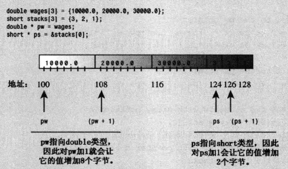

# 指针和自由存储空间

计算机程序在存储数据时必须跟踪3种基本属性：

- 信息存储在何处
- 存储的值为多少
- 存储的信息是什么类型

指针是一个变量，其存储的是值的地址，而不是值本身。

`&` 为取地址符，可以获取变量的地址，如home是一个变量`&home`是home的地址

`*` 运算符为间接值或解引用运算符。该运算符用于指针可以获取该地址存储的值，如 manly是一个指针，则manly表示的是一个地址，而`*manly`表示存储在该地址的值。

取地址实例：
```cpp
// address.cpp -- using the & operator to find addresses
#include <iostream>
int main()
{
    using namespace std;
    int donuts = 6;
    double cups = 4.5;

    cout << "donuts value = " << donuts;
    cout << " and donuts address = " << &donuts << endl;
    cout << "cups value = " << cups;
    cout << " and cups address = " << &cups << endl;
    return 0; 
}
```
结果：
```
donuts value = 6 and donuts address = 0x6dfeec
cups value = 4.5 and cups address = 0x6dfee0
```

> 可以看出0x6dfeec - 0x6dfee0 = 12，可知当前系统double类型使用了12个字节。

指针实例：
```cpp
// pointer.cpp -- our first pointer variable
#include <iostream>
int main()
{
    using namespace std;
    int updates = 6;        // declare a variable
    int * p_updates;        // declare pointer to an int

    p_updates = &updates;   // assign address of int to pointer

// express values two ways
    cout << "Values: updates = " << updates;
    cout << ", *p_updates = " << *p_updates << endl;

// express address two ways
    cout << "Addresses: &updates = " << &updates;
    cout << ", p_updates = " << p_updates << endl;

// use pointer to change value
    *p_updates = *p_updates + 1;
    cout << "Now updates = " << updates << endl;
    return 0; 
}
```
结果：
```
Values: updates = 6, *p_updates = 6
Addresses: &updates = 0x6dfee8, p_updates = 0x6dfee8
Now updates = 7
```

## 声明和初始化指针

指针声明必须指定指针指向的数据的类型

如 `int * p_updates;`:
`* p_updates`的类型为int，含义为：p_updates是指针，而`*p_updates`是int，而不是指针。

> 写法 `int *ptr;``int* ptr;`一样,C++ 偏向第二种风格

```cpp
int* p1, p2； //p1为指针， p2为变量
```

指针初始化：
```cpp
int higgens = 5;
int* pt = &higgens;
```

## 指针潜在的危险
在C++中创建指针时，计算机将分配用来存储地址的内存，但不会分配用来存储指针所指向的数据的内存。

例如：
```cpp
long * fellow; //创建指针
*fellow = 223323； //
```
> 223323将被放在哪里是未知的，是我无法确定的。

> 一定要在对指针应用解引用运算符之前，将指针初始化为一个确定的，适当的地址

## 使用new来分配内存

至此我们使用到的指针的功能： 将指针初始化为变量的地址，变量是在编译时分配的有名称的内存，而指针只是为可以通过名称直接访问的内存提供了有一个别名
指针的真正用武之地： 在运行阶段分配未命名的内存以储存值，在这种情况下，只能通过指针来访问内存。
在C语言中使用库函数malloc（）来分配内存，也适用于C++，但是C++有更好的办法---new运算符

### new运算符：

`int *pn = new int;`

- 运行阶段为一个int值分配未命名的内存
- 程序员要告诉new需要为哪种数据类型分配内存，new找到一个长度正确的内存块，并返回该内存块的地址。这里new运算符根据类型int来确定需要多少字节的内存
- 该内存块只能通过指针pn来访问

### new通用格式：

`typeName * pointer_name = new typeName;`

- 需要在两个地方指定数据类型，用来指定需要什么样的内存和用来声明合适的指针。
- 原因：地址本身只指出了对象存储地址的开始，而没有指出使用的字节数，需要根据指针类型来确定如何读取具有该地址的内存。
- new在堆heap（或者叫做自由存储区）内存区域分配内存。

### 使用delete 释放内存:

使用new申请的内存在使用完后需要将其归还给内存池，以供其他程序使用, 如：

```cpp
int * ps = new int; //allocate memory wiht new
...		//use the memory
delete ps;	//free memory with delete when done
```

- delete释放内存，但不会删除指针ps本身，可以将ps重新指向另一个新分配的内存块
- 一定要配对的使用new和delete,否则将发生内存泄漏。

```cpp
int * ps = new int; //ok
delete ps; //ok
delete ps; //not ok 不能重复释放内存
int jugs = 5; //ok
int * pi = &juge; //ok
delete pi; //不允许，该内存不是通过new申请的
```

## 使用new来创建动态数组

new的主要作用还是针对大型数据，如数组。

如果通过声明来创建数组，则在程序被编译时将为它分配内存空间，不管程序最终有没有使用这个数组，在编译时给数组分配内存被称为**静态联编**

使用new时，如果在运行阶段需要数组，就创建它，如果不需要就不创建，还可以在程序运行时选择数组的长度，这被称为**动态联编**

使用静态联编时，必须在编写程序时指定数组的长度。使用动态联编时，程序将在运行时确定数组长度。

### 创建动态数组

创建指针psome，它指向包含10个int值的内存块中的第一个元素：

```cpp
int * psome = new int [10]; //得到包含10个int的内存块
...
delete [] psome;
```
- new运算符返回数组第一个元素的地址，该地址被赋给指针psome。
- 使用delete时，方括号告诉程序，应该释整个数组
- new 语句提供了识别内存块中每个元素所需的全部信息，如向后移动4个字节（假设int占四个字节）指针将指向第二个元素

通用格式：

`type_name * pointer_name = new type_name [num_elements];`

### 使用动态数组

可以把指针psome作为数组名使用，如：

psome[0] 为第一个元素，psome[1]为第二个元素，依次类推

> C和C++内部都是使用指针来处理数组，所以数组和指针基本等价

```cpp
// arraynew.cpp -- using the new operator for arrays
#include <iostream>
int main()
{
    using namespace std;
    double * p3 = new double [3]; // space for 3 doubles
    p3[0] = 0.2;                  // treat p3 like an array name
    p3[1] = 0.5;
    p3[2] = 0.8;
    cout << "p3[1] is " << p3[1] << ".\n";
    p3 = p3 + 1;                  // increment the pointer
    cout << "Now p3[0] is " << p3[0] << " and ";
    cout << "p3[1] is " << p3[1] << ".\n";
    p3 = p3 - 1;                  // point back to beginning
    delete [] p3;                 // free the memory
    //这里必须返回初始位置，才能正确释放内存
    return 0; 
}
```

结果：

```
p3[1] is 0.5.
Now p3[0] is 0.5 and p3[1] is 0.8.
```

上面程序`p3=p3+1`指出了指针和数组名之前的根本区别：

不能修改数组名的值，但是可以修改指针的值，因为指针是变量。p3加1后，p3[0]指的是数组的第二个元素。这里注意指针加1是向后移动了一个int类型所占的长度。

## 指针,数组和指针算术

- 指针和数组基本等价的原因在于指针算术和C++内部处理数组的方式。
- 指针变量加1后，对于指向double的指针（假如系统使用8个字节存储double），数值实际上增加了8。
- C++ 将数组名解释为地址

```cpp
// addpntrs.cpp -- pointer addition
#include <iostream>
int main()
{
    using namespace std;
    double wages[3] = {10000.0, 20000.0, 30000.0};
    short stacks[3] = {3, 2, 1};

    double * pw = wages;     // name of an array = address
    short * ps = &stacks[0]; // or use address operator
    cout << "pw = " << pw << ", *pw = " << *pw << endl;
    pw = pw + 1;
    cout << "add 1 to the pw pointer:\n";
    cout << "pw = " << pw << ", *pw = " << *pw << "\n\n";

    cout << "ps = " << ps << ", *ps = " << *ps << endl;
    ps = ps + 1;
    cout << "add 1 to the ps pointer:\n";
    cout << "ps = " << ps << ", *ps = " << *ps << "\n\n";

    cout << "access two elements with array notation\n";
    cout << "stacks[0] = " << stacks[0] 
         << ", stacks[1] = " << stacks[1] << endl;
    cout << "access two elements with pointer notation\n";
    cout << "*stacks = " << *stacks
         << ", *(stacks + 1) =  " << *(stacks + 1) << endl;

    cout << sizeof(wages) << " = size of wages array\n";
    cout << sizeof(pw) << " = size of pw pointer\n";
    return 0; 
}
```

结果：

```cpp
pw = 0x6dfec0, *pw = 10000
add 1 to the pw pointer:
pw = 0x6dfec8, *pw = 20000

ps = 0x6dfeba, *ps = 3
add 1 to the ps pointer:
ps = 0x6dfebc, *ps = 2

access two elements with array notation
stacks[0] = 3, stacks[1] = 2
access two elements with pointer notation
*stacks = 3, *(stacks + 1) =  2
24 = size of wages array
4 = size of pw pointer
```

- 对于所有数组满足，如：`wages = &wages[0] = 组数第一个元素的地址`
- `*(stacks +1)`和`stacks[1]`是等价的



数组名和指针：

相同点：

- 使用数组表示法时，C++执行下面的转换：

  `arrayname[i] becomes *(arrayname + i)`

- 使用指针时，C++也执行类似的转换：

  `pintername[i] becomes *(pointername + i)`

不同点：

- 可以修改指针的值，而数组名为常量
- 对数组应用sizeof运算符得到的是数组长度，对指针应用sizeof得到是指针的长度

### 数组的地址

```cpp
short tell[10]; //声明一个占有20个字节的数组
cout << tell << endl; //显示 &tell[0]
cout << &tell << endl; //显示整个数组的地址
```

从数字上说，这两个地址相同，但是在概念上说，&tell[0] （即tell）是一个2字节内存块的地址，而&tell是一个20个字节内存块的地址。因此，表达式tell+1将地址加2，而表达式&tell+1将地址加20。

## 指针小结

### 声明指针

`typeName * pointerName;`

### 给指针赋值

应该把内存地址赋给指针

- 可以对变量名应用&运算符，来获得被命名的内存的地址
- new运算符返回未命名的内存地址

```cpp
double * pa;
double bubble = 3.2;
pn = &bubble;
pc = new char; //将申请的char内存地址赋给pc
pa = new double [30]; //将申请的含有30个double的数组的首元素地址赋给pa
```

### 对指针解除引用

对指针解引用意味着获取指针指向的值

```cpp
pc = new char;
*pc = 'S';
```

> 禁止对未被初始化为适当地址的指针解除引用。

## 指针和字符串

数组和指针的特殊关系可以拓展到C风格字符串：

```cpp
char flower[10] = "rose"; 
cout << flower << "s are red\n"; //这里的flower也是字符串的首地址
//即cout语句中的flower是包含字符r的char元素的地址。然后继续先后打印，直到遇到空字符（\0）.
//在C++中双引号括起来的字符串像数组名一样，也是第一个元素的地址
```

> 在cout和多数C++表达式中，char数组名，char指针以及用双引号括起来的字符串常量都被解释为字符串第一个字符的地址。


# 从这里插入


## 关于指针自己的思考
指针包括三个信息：
1. 指针指向的内存地址是什么，即指针的值
    - 打印出来是一个16进制表示的内存地址
2. 指针所指向的内存地址的内容是什么类型，即指针的类型
    - 指针类型将决定解引用时`*`的行为，因为指针指向的是对象的首地址，也就是说，程序需要指针类型来决定从从首地址向后读几位之后停止。比如，假设int变量长度为8个字节，指针储存的是该int变量内存的首地址，然后根据类型才知道除了首地址，后面紧跟着的7个字节也属于该int变量。 再比如数组，指针指向的是该数组首元素的首地址。
3. 指针本身的类型，如某变量是个指针（这一点不需要太多关注）
    - 对于指针这种类型的数据在不同的系统中可能占用2-4个字节

**指针进行赋值操作，被当作参数传递和作为函数返回值时等情况下，这三个信息都会被传递（不仅仅是地址的值）** 这一点尤为的重要。


