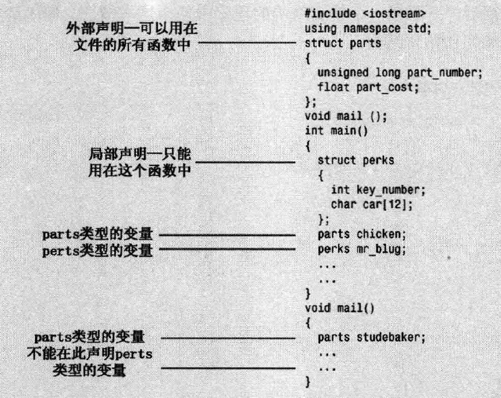

# 结构struct

结构是一种比数组更灵活的**数据格式**，同一个结构可以存储多种类型的数据。

创建结构分两步：
- 定义机构描述：描述并标记能够存储在结构中的各种数据类型
- 按照描述创建结构体

例：
```cpp
struct inflatable //structure declaration
{
  char name[20];
  float volume;
  double price;
}
```


- inflatble为标识符，是这种新数据格式的名称
- 定义了三个成员

使用上面定义的数据格式：
```cpp
inflatable hat; //定义inflatable类型的变量hat
inflatable woopie_cusion; //
inflatable mainframe; //

struct inflatable goose; //可以加关键字struct，也可以不加
```

struct成员访问：

使用 `.` 运算符访问成员，如 hat.volume 指结构的volume成员

## 在程序中使用结构
```cpp
// structur.cpp -- a simple structure
#include <iostream>
struct inflatable   // structure declaration
{
    char name[20];
    float volume;
    double price;
};

int main()
{
    using namespace std;
    inflatable guest =
    {
        "Glorious Gloria",  // name value
        1.88,               // volume value
        29.99               // price value
    };  // guest is a structure variable of type inflatable
// 初始化，注意使用逗号隔开，可以不换行。
    inflatable pal =
    {
        "Audacious Arthur",
        3.12,
        32.99
    };  // pal is a second variable of type inflatable
    cout << "Expand your guest list with " << guest.name;
    cout << " and " << pal.name << "!\n";
// pal.name is the name member of the pal variable
    cout << "You can have both for $";
    cout << guest.price + pal.price << "!\n";
    return 0; 
}
```
结果：
```
Length of string in charr before input: 3
Length of string in str before input: 0
```

### 结构体声明
在同一个文件中，结构体的声明有2种选择：
- 将声明放在main（）函数中，紧跟在开始括号后面
- 将声明放在main（）函数前面，这种方式叫做外部声明

> 通常应该使用外部声明



### C++11 结构体初始化
同数组一样，C++11也支持将列表初始化用于结构，且等号是可选的
> 不允许缩窄

```cpp
inflatable duch {"Daphe", 0.12, 9.98}; 

//将成员穿不设为零
inflatable mayor {}；
```

### 结构体其他属性
- 可以将结构体作为参数传递给函数
- 可以让函数返回一个结构
- （成员赋值）可以使用赋值运算符（=）将结构赋给另一个**同类型**的结构，元素将一一对应

### 结构数组

