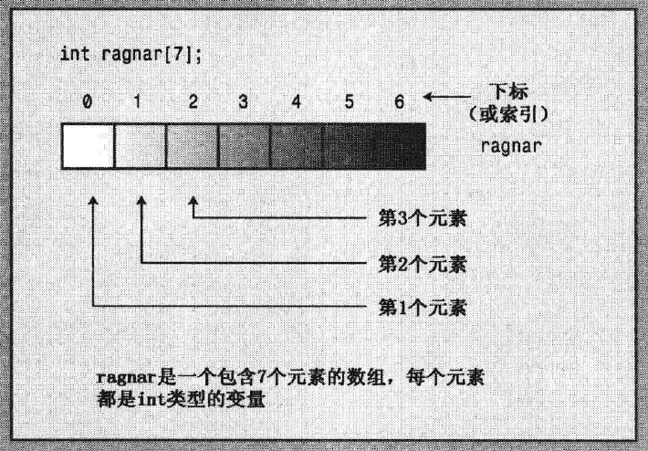
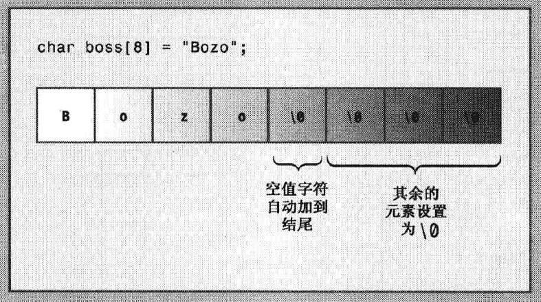

# 复合类型

复合类型是基于基本整型和浮点型创建的。

## 数组（array）

数组的通用声明：
`typeName arrayName[arraySize];`

arraySize 指定元素数目，必须为整型常数或const值，也可以式常量表达式（如 `8*sizeof(int)`）,即其中所有的值在编译时都是已知的。具体说，arraySize不能是变量，变量的值时在程序运行时设置的。（可使用new来避开这个限制）。

例：
```cpp
short months[12];
```
- 声明了一个名字为months的数组，该数组有12个元素，每个元素都可以存储一个short类型的值。
- 使用months[0]时months数组的第一个元素，months[11] 为最后一个元素。

> 注意编译器不会检查使用的下标是否有效，例如，如果将一个赋值给不存在的元素months[100],编译器并不会指出错误，但当程序运行后，程序会出问题。

数组示意图：




```cpp
// arrayone.cpp -- small arrays of integers
#include <iostream>
int main()
{
    using namespace std;
    int yams[3];    // creates array with three elements
    yams[0] = 7;    // assign value to first element
    yams[1] = 8;
    yams[2] = 6;

    int yamcosts[3] = {20, 30, 5}; //更快捷的初始化数组的方式
    cout << "Total yams = ";
    cout << yams[0] + yams[1] + yams[2] << endl;
    cout << "The package with " << yams[1] << " yams costs ";
    cout << yamcosts[1] << " cents per yam.\n";
    int total = yams[0] * yamcosts[0] + yams[1] * yamcosts[1];
    total = total + yams[2] * yamcosts[2];
    cout << "The total yam expense is " << total << " cents.\n";

    cout << "\nSize of yams array = " << sizeof yams;
    cout << " bytes.\n";
    cout << "Size of one element = " << sizeof yams[0];
    cout << " bytes.\n";
    return 0; 
}
```
结果：
```
Total yams = 21
The package with 8 yams costs 30 cents per yam.
The total yam expense is 410 cents.

Size of yams array = 12 bytes.
Size of one element = 4 bytes.
```
> 如果没有初始化函数中定义的数组，则其他元素将是不确定的，这意味着元素的值为以前驻留在该内存单元中的值。

> yams是一个数组，而yams[1] 只是一个int变量。

### 数组初始化规则

只有在定义数组时才能使用初始化，此后就不能使用了，也不能将一个数组赋给另一个数组：
```cpp
int cards[4] = {3, 6, 8, 10};  //允许
int hand[4]; //允许
hand[4] = {5, 6, 7, 9}; // 不允许
hand = cards; //不允许

//初始化可以不初始化全部元素，此时编译器就会把其他元素设置为0.
float hotelTips[5] = {5.0, 2.5}; 

//初始化时当[]括号内为空时，编译器将计算元素个数，用来初始化数组，尽量避免这种做法
short things[] = {1, 5, 3, 8};
```

如果想将数组中的所有元素都初始化为0，只需要显示的将第一个元素初始化为0，然后让编译器将其他元素都初始化为0：
```cpp
long totals[500] = {0};
```

### C++11数组初始化方法
- 初始化数组时，可以省略等号
- 可以不在大括号内包含任何东西，将把所以有元素都设置为零
- 列表初始化禁止缩窄转换

```cpp
double earnings[4] {1, 2, 3, 4}; //c++11新增

unsigned int counts[10] = {}; //所有元素置零
float balance[100] {}; //所有元素置零

long plifs[] = {25, 92, 3.0}; //不允许
char slifs[4] {'h', 'i', 1122011, '\0'}; //不允许
char tlifs[4] {'h', 'i', 112, '\0'}; //允许
```

> C++标准模板库（STL）提供了一种数组替代品--模板类vector； C++11 新增了模板类array。

## 字符串
字符串时存储在内存的连续字节中的一系列字符。这意味着可以将字符串存储在char数组中，其中每一个字符都位于数组的元素中。

C++处理字符串的方式有两种：
- 来自C语言的，常被称为C-风格字符串
- 基于string类库的方法

C风格字符串具有一种特殊的性质，以空字符结尾，空字符被写作`\0`，其ASCii码为0，用来标记字符串的结尾。
```cpp
char dog[8] = {'b','e','a','u','x',' ','I','I'}; //不是字符串
char cat[8] = {'f','a','t','e','s','s','a','\0'}; //是字符串
```
以上两个数组都是char数组，但只有第二个数组是字符串。
> cout处理c风格字符串，以空字符为停止标志。 不是字符串的字符数组没有这个停止标志，所以不能将它作为字符串处理

**更好的将字符数组初始化为字符串的方法：**
```cpp
char bird[11] = "Mr. Cheeps"; //手动指定字符数组长度，该长度包含最后的空字符
char fish[] = "Bubbles"; //让编译器自动计算数组长度
```
> 用双引号括起来的字符隐式的包含结尾的空字符。

> C++ 对字符串长度没有限制。

> 推荐让编译器自动计算数组长度



> 注意: 字符串常量(使用双引号)不能与字符常量(使用单引号)互换. 
    - 字符常量`'S'`代表了字符串编码83 (ASCii码)
    - 字符串常量`"S"`是两个字符`'S'``'\0'`组成字符串，并且`"S"`实际上表示的是字符串所在的内存地址。

### 拼接字符串常量
以下三种写法是等效的：
```cpp
cout << "Id give my right arm to be" "a great violinist.\n";
cout << "Id give my right arm to be a great violinist.\n";
cout << "Id give my right ar"
"m to be a great violinist.\n";
```
### 在数组中使用字符串
将字符串存储到数组中，最常用的方法：
- 直接在代码中书写，即，将数组初始化为字符串常量
- 将键盘或文件输入读入到数组中

```cpp
// strings.cpp -- storing strings in an array
#include <iostream>
#include <cstring>  // for the strlen() function
int main()
{
    using namespace std;
    const int Size = 15;
    char name1[Size];               // empty array
    char name2[Size] = "C++owboy";  // initialized array
    cout << "Howdy! I'm " << name2;
    cout << "! What's your name?\n";
    cin >> name1;
    cout << "Well, " << name1 << ", your name has ";
    cout << strlen(name1) << " letters and is stored\n";
    cout << "in an array of " << sizeof(name1) << " bytes.\n";
    cout << "Your initial is " << name1[0] << ".\n";
    name2[3] = '\0';                // set to null character
    cout << "Here are the first 3 characters of my name: ";
    cout << name2 << endl;
    return 0;
}
```
结果：
```
Howdy! I'm C++owboy! What's your name?
kun
Well, kun, your name has 3 letters and is stored
in an array of 15 bytes.
Your initial is k.
Here are the first 3 characters of my name: C++
```
> strlen(）返回数组中的字符串长度，只计算可见字符

> sizeof 返回整个数组长度

### 通过cin输入字符串
cin使用空白（空格，制表符和换行符）来确定字符串的结束位置，也就是说cin只能读入有一个单词。

```cpp
// instr1.cpp -- reading more than one string
#include <iostream>
int main()
{
    using namespace std;
    const int ArSize = 20;
    char name[ArSize];
    char dessert[ArSize];

    cout << "Enter your name:\n";
    cin >> name;
    cout << "Enter your favorite dessert:\n";
    cin >> dessert;
    cout << "I have some delicious " << dessert;
    cout << " for you, " << name << ".\n";
    return 0; 
}

```
结果：
```
Enter your name:
Kun Li
Enter your favorite dessert:
I have some delicious Li for you, Kun.
```
> 原本想将 "Kun Li" 给name，结果只有前面的Kun给了name，后面的Li给了dessert。原因第一个cin只读取了Kun给name，然后将Li留在输入列队中，然后Li紧接着被第二个cin接收。

### 每次读取一行字符串输入：
因为cin每次只能读取一个单词，不能满足读入如"Hallo  World"的需求。

istream中的类提供了getlin() 和 get()，这个两个函数都读取一行输入，直到到达换行符。

getline()丢弃换行符

get()保留换行符（这是指的是通过键盘回车键输入的）到输入序列中（输入序列中的内容会被下一个读入命令如cin捕获）

> 两个函数详细用法参见书籍p78

```cpp
cin.getline(name,20); //将内容读入一个包含20个元素的name数组中，其中20数目中包含自动添加的`\n`，即只能手动输入19个字符

cin.get(name,20); // 在此之后需要使用cin.get()吞掉输入序列中被保存的换行符。
cin.get();
cin.get(name1,20);
```

## string类简介
C++98标准添加了string类，string类用起来比数组简单。

要使用string类必须在程序中包含头文件string。string类位于命名空间std中，因此需要使用using编译指令或使用std::string。

有些方面，使用string对象的方式与使用字符数组相同：
- 可以使用C风格字符串来初始化string对象，如 `"Hello World"`
- 可以使用cin来将键盘输入存储到string对象中
- 可以使用cout来显示string对象
- 可以使用数组表示法来访问存储在string对象的中的字符，如 `str1[1]`


实例：
```cpp
// strtype1.cpp -- using the C++ string class
#include <iostream>
#include <string>               // make string class available
int main()
{
    using namespace std;
    char charr1[20];            // create an empty array
    char charr2[20] = "jaguar"; // create an initialized array
    string str1;                // create an empty string object
    string str2 = "panther";    // create an initialized string

    cout << "Enter a kind of feline: ";
    cin >> charr1;
    cout << "Enter another kind of feline: ";
    cin >> str1;                // use cin for input
    cout << "Here are some felines:\n";
    cout << charr1 << " " << charr2 << " "
         << str1 << " " << str2 // use cout for output
         << endl;
    cout << "The third letter in " << charr2 << " is "
         << charr2[2] << endl;
    cout << "The third letter in " << str2 << " is "
         << str2[2] << endl;    // use array notation
    // cin.get();
	// cin.get();

    return 0; 
}
```
结果
```
Enter a kind of feline: ocelot
Enter another kind of feline: tiger
Here are some felines:
ocelot jaguar tiger panther
The third letter in jaguar is g
The third letter in panther is n
```

### C++11 字符串初始化
C++11 允许将列表初始化用于C风格字符串和string对象，即`{}`

```cpp
char first_date[] = {"Le Chapon Dodu"};
char second_date[] = {"The Elegant Plate"};
string third_date = {"The Bread Bowl"};
string fourth_date {"Hanks Fine Eats"};
```

### 赋值，拼接和附加

不能将一个数组赋给另一个数组，但是可以将一个string对象赋给另一个string对象：

```cpp
char charr1[20]; // 建立一个空数组
char charr2[20] = "jaguar"; // 初始化数组
string str1; // 建立一个空string对象
string str2 = "panther"; // 初始化一个string对象
charr1 = charr2; // 不允许
str1 =str2; // 允许
```

string类使用 `+` 合并两个string对象

```cpp
string str3;
str3 = str1 + str2; //拼接两个str
str1 += str2; //把str2追加到str1后
```

### string类和C风格字符串的其他操作

C风格字符串可以使用cstring库完成复制和追加操作：
```cpp
strcpy(charr1, charr2); // 将charr2数组内容拷贝给charr1数组
strcat(cahrr1, charr2); // 将charr2数组内容追加到charr1数组
```
> 使用字符数组时，总是存在目标数组过小，无法存储指定信息的危险。当需要存入数组的长度大于目标数组长度，将覆盖邻近内存，导致程序出错。

> string类具有自动调整大小的功能，避免上述问题发生

确定字符串字符数的方法：
```cpp
int len1 = str1.size(); //string类方法
int len2 = strlen(charr1); //字符数组方法
```

### sting 类 I/O
