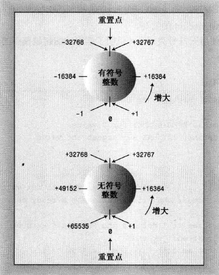

## 数据类型

内置的C++ 类型分为两组:
- 基本类型: 整数和浮点数
- 复合类型：数组 字符串 指针和结构

## 变量

变量名规则：
- 只能只能使用字符字符，数字和下划线
- 名字的第一个字符不能使数字
- 区分大小写
- 禁止使用C++关键字
- 单下划线和双下划线开头有特殊含义

## 整型
C++中的整型包含四种类型
- short
- int
- long
- long long

由于不同类型的长度在不同系统中不同，所以C++只规定最小长度：

- short 至少16位
- int至少与short一样长
- long至少32位，且至少与int一样长
- longlong字少64位，且至少与long一样长

注：
8 bit 范围  0/255 或-128/127
16bit 范围 0/65535 或-32768/32767
32bit 范围 0/4294672295 或 -2147336148/2147336147

### 系统中整数最大长度
系统中的整数的最大长度可以使用`sizeof`运算符返回类型或变量的长度，单位为字节。

头文件`climits`包含关于整型限制的信息。例如`INT_MAX` 为`int`的最大取值，`CHAR_BIT` 为字节位数

```cpp
//limits.cpp --some integer limits

#include <iostream>
#include <climits>

int main()
{	
	using namespace std;
	int n_int = INT_MAX;
	short n_short = SHRT_MAX;
	long n_long = LONG_MAX;
	long long n_llong = LLONG_MAX;

	// sizeof operator yields size of type or of variable
	cout << "int is " << sizeof(int) << " bytes. " <<endl;
	cout << "short is " << sizeof n_short << " bytes. " <<endl;
	cout << "long is " << sizeof n_long << " bytes. " <<endl;
	cout << "long long is " << sizeof n_llong << " bytes. " <<endl;
	cout << endl;

	cout << "Maximum values: " <<endl;
	cout << "int: " << n_int << endl;
	cout << "short: " << n_short << endl;
	cout << "long: " << n_long << endl;
	cout << "long long : " << n_llong << endl<< endl;

	cout << "Minimum int value = " << INT_MIN << endl;
	cout << "Bits per byte = " << CHAR_BIT << endl;

	return 0;
}
```
结果：
```
int is 4 bytes.
short is 2 bytes.
long is 4 bytes.
long long is 8 bytes.

Maximum values:
int: 2147483647
short: 32767
long: 2147483647
long long : 9223372036854775807

Minimum int value = -2147483648
Bits per byte = 8
```
> climits 文件中包含下面类似的语句：
```cpp
# define INT_MAX 32767
```
在C++编译过程中，首先将源代码传递给预处理器。在这里，#define 和 # include一样，也是一个预处理编译指令。该编译指令告诉预处理器：在程序中查找INT_MAX，并将所有的INT_MAX都替换为32767。因此#define编译指令的工作方式与文本编辑器的全局搜索并替换命令相似。修改后的程序将在完成这些替换后被编译。也可以使用#define 来定义自己的符号常量。
> #define 编译指令是C语言遗留下来的，C++中还有更好的创建符号常量的方法（const）。

### 初始化
初始化将赋值和声明合并在一起，如：`int n_int = INT_MAX;`

初始化的形式：
```cpp
int uncles = 5;
int aunts = uncles;
int chairs = aunts + uncles + 4;

//C++特性
int wren(432); //将432 值赋值给wren变量

//C++ 11 新特性:
int hamburgers = {24}; //24赋值给hamburgers
int emus{7} ;// 7赋值给emus，如果{}内为空，则初始化为0
int rheas = {7}; //与上面等价，如果{}内为空，则初始化为0
```
> 注意：当程序执行到该声明时，表达式中的所有值都必须是已知的。

> C++ 11 使大括号初始化器可用于任何类型，可以使用等号也可以不使用，是一种通用的初始化语法。如数组等

## 无符号类型
```cpp
unsigned short change;
unsigned int rovert;
unsigned quarterback; // 等价于 unsigned int quarterback
unsigned long gone;
unsigned long long lang_lang;
```

### 整型溢出

```cpp
// exceed.cpp -- exceeding some integer limits
#include <iostream>
#define ZERO 0      // makes ZERO symbol for 0 value
#include <climits>  // defines INT_MAX as largest int value
int main()
{
    using namespace std;
    short sam = SHRT_MAX;     // initialize a variable to max value
    unsigned short sue = sam;// okay if variable sam already defined

    cout << "Sam has " << sam << " dollars and Sue has " << sue;
    cout << " dollars deposited." << endl
         << "Add $1 to each account." << endl << "Now ";
    sam = sam + 1;
    sue = sue + 1; 
    cout << "Sam has " << sam << " dollars and Sue has " << sue;
    cout << " dollars deposited.\nPoor Sam!" << endl;
    sam = ZERO;
    sue = ZERO;
    cout << "Sam has " << sam << " dollars and Sue has " << sue;
    cout << " dollars deposited." << endl;
    cout << "Take $1 from each account." << endl << "Now ";
    sam = sam - 1;
    sue = sue - 1;
    cout << "Sam has " << sam << " dollars and Sue has " << sue;
    cout << " dollars deposited." << endl << "Lucky Sue!" << endl;
	// cin.get();
    return 0; 
}
```

结果：
```
Sam has 32767 dollars and Sue has 32767 dollars deposited.
Add $1 to each account.
Now Sam has -32768 dollars and Sue has 32768 dollars deposited.
Poor Sam!
Sam has 0 dollars and Sue has 0 dollars deposited.
Take $1 from each account.
Now Sam has -1 dollars and Sue has 65535 dollars deposited.
Lucky Sue!
```
典型的整型溢出行为：



## 整型字面值

说明：什么是字面值常量，一个形如`42`,`042`,`0.2`,`\n`,`'A'`或`"B"`的值,这样的值一望而知，每个字面值常量都对应一种数据类型，字面值常量的形式和值（外观）决定了它的类型。（编译器根据这个值的外观分配合适的内存来存储这个值，编译器按照一些默认的规则来决定这个值的类型。）

整型字面值（常量）是显式的书写的常量，如212。 C++中可以在代码中直接书写8进制，10进制和16进制的常量，如042，42 和 0x42.

```cpp
// hexoct1.cpp -- shows hex and octal literals
#include <iostream>
int main()
{
    using namespace std;
    int chest = 42;     // decimal integer literal
    int waist = 0x42;   // hexadecimal integer literal
    int inseam = 042;   // octal integer literal

    cout << "Monsieur cuts a striking figure!\n";
    cout << "chest = " << chest << " (42 in decimal)\n";
    cout << "waist = " << waist << " (0x42 in hex)\n";
    cout << "inseam = " << inseam << " (042 in octal)\n";
	// cin.get();
    return 0; 
}
```
结果
```
Monsieur cuts a striking figure!
chest = 42 (42 in decimal)
waist = 66 (0x42 in hex)
inseam = 34 (042 in octal)
```
> 默认情况下cout以10进制格式显示整数。

> cout 可使用控制符 dec,hex和oct格式显示整数

### C++ 如何确定常量的类型

- 整型变量通过声明告知编译器
- 整型常量如`cout << "a = " << 12 ;` 
	- 默认存储为int类型，如果太长则使用long或者long long
	- 可以通过后缀限定类型，如 `22022L ` 为long常量
	- l/L 表示long，u/U表示unsigned int，ul表示unsigned long 等等
> 对于8进制和16进制与10进制有所不同，详见书籍p47

## char 类型（字符和小整数）
char类型是专为存储字符（如字母和数字）而设计的。

计算机存储数字简单，但是存储字母就需要将字母编码成数字，然后才能存入内存中。

char类型是一种最短整型，但是也足够长用来表示计算机系统中所有的基本符号-所有字母，数字和标点符号等。在大多数系统上，只使用一个字节的内存。

char最常被用来处理字符，但是也可以也用做比short更短的整型

字符与整数密切相关，因为它们在内部其实是被存储为整数。每个可打印的字符以及许多不可打印的字符都被分配一个唯一的数字。用于编码字符的最常见方法是 ASCII（美国信息交换标准代码的首字母简写）。当字符存储在内存中时，它实际上是存储的数字代码。当计算机被指示在屏幕上打印该值时，它将显示与数字代码对应的字符。例如，数字 65 对应大写字母 A，66 对应大写字母 B


### 使用char类型
```cpp
// chartype.cpp -- the char type

#include <iostream>

int main()
{
	using namespace std;
	char ch; //declare a char variable

	cout << "Enter a character: " << endl;
	cin >> ch;
	cout << "Thank you for the " << ch << " character." <<endl;
	return 0;
}
```
结果：
输入一个字符，如M
```
Enter a character:
M
Thank you for the M character.
```
> cout cin 能智能的判断变量的类型，并且输出。
> 实际过程是将M存储为对应的编码77，然后输出是将77转化为M再打印到屏幕上

### 一个关于字符类型运算的实例
```cpp
// chartype.cpp -- the char type
#include <iostream>
int main( )
{
    using namespace std;
    char ch1 = '2'; //acsii = 50
    char ch2 = '3'; //acsii = 51
    char ch3;
    ch3 = ch1 + ch2;
    int ch4 = ch3;
    char ch5 = 50;

    // 'e' = 101
    cout << ch3 << endl;
    cout << ch4 << endl;
    cout << ch5 << endl;
    return 0;
}
```
输出：
```
e
101
2
```

### char 字面值
C++ 中书写字符常量的方式：
- 通过单引号括起来如`'A'` 或者 `'1'`
- 直接书写字符的ASCii码，如 `65` 代表`'A'`
> 注意，如果系统默认不是ASCii编码，第二种就会出错，所以推荐第一种，让计算机自动编码解码。

C++ 转义序列的编码：
\a 表示振铃字符
\n 表示换行
\b 表示退格
等等

例如：
```cpp
char alarm = '\a';
cout << alarm << "Dont do that again!\a\n";
```

换行符可代替endl：
```cpp
cout << endl;
cout << '\n'; //以字符方式
cout << "\n"; //以字符串方式
```

### 通用字符名
通用字符名可以用来输入和使用键盘上没有的字符。使用ISO10646标准。
ASCii码能表示的字符有限，所以C++可以使用其他字符集如Unicode。
> ASCii是Unicode的子集

通用字符集的用法类似于转义序列，以\u 或 \U 开头，紧接着跟着几个数字， \u后面是8个十六进制 \U后面是16个十六进制。

如：
```cpp
int k\u00F6rper; //körper
```

### signed char 和 unsigned char
char 在默认情况下是否有符号由C++ 实现决定。

如果由需要，可以显示的将类型设置为signed char 或者 unsigned char：

```cpp
char foto; //也许是有符号，也许是无符号
unsigned char bar; //定义无符号char
signed char snark; //定义有符号char
```

## bool 类型

布尔型的值为true 或 false

```cpp
bool is_ready = true; //初始化bool型变量
int ans = true; // 将ans初始化为1
int promise = false; //将promise初始化为0

//任何数字值或者指针值都可以被隐式转换为boo值，任何非零值都被转化为true，而零被转换为false
bool start = -100; //start值为true
bool stop = 0; //stop 值为false
```

# const 限定符
常量的符号名称指出常量表示的内容。
如果程序在多个位置使用同一个常量，比如月份 12，可以直接在每个需要的位置输12，但是如果想把月份改为11，则需要修改多个位置，所以可以使用符号常量来代表12这个数值，需要修改该常量时，只需要修改一个符号定义即可。

C++中提供了const限定符用来定义符号常量：
```cpp
const int Months = 12; //Months 是 12 符号名称
```

常量被初始化后，其值被固定，编译器将不允许再修改该常量的值。

## `#define` 与const 的差别
const的优点：
- const明确指定了类型
- 可以使用C++的作用域规则将定义限制在特定的函数或文件中
- 可以将const用于更复杂的类型，如果数组和结构

> 注意尽量使用const，而不使用`#define`

# 浮点数

C++ 中有三种浮点数类型：
float，double 和 long double

浮点数类型主要从两方面进行区分：
- 有效位数
- 允许指数最小范围(1.69e13 中的13)

> c++ 有效位数要求 float至少32位，double至少48位，且不少于float，long double 位数要大于等于double。
> 通常 folat为32位，double为64位

头文件cfloat（或float.h）
头文件cfloat中可以找到各种浮点数类型长度的系统的限制

## 浮点常量
在程序中书写浮点常量的时候如8.24 或者2.4E8，程序默认将浮点常量设定为double类型.

- 如果希望常量为float类型，需要使用f或F后缀
- 如果希望常量为long double类型，需要使用l或者L后缀
```cpp
1.234f //float常量
2.45E20F //folat常量
2.3455545E28 //double常量
2.2L //long double 常量
```

# C++ 算数运算符
整型（包括char）和浮点型统称为算数类型

- `+` `-` `*`
- `/` 除，如果两个操作数都是整数，则结果为商的整数部分；如果其中一个或者两个操作数是浮点值，则小数部分将保留，结果为浮点数。
- `%` 求模（取余），要求两个操作数必须都是整型。

```cpp
// arith.cpp -- some C++ arithmetic
#include <iostream>
int main()
{
    using namespace std;
    float hats, heads;

    cout.setf(ios_base::fixed, ios_base::floatfield); // fixed-point
    cout << "Enter a number: ";
    cin >> hats;
    cout << "Enter another number: ";
    cin >> heads;

    cout << "hats = " << hats << "; heads = " << heads << endl;
    cout << "hats + heads = " << hats + heads << endl;
    cout << "hats - heads = " << hats - heads << endl;
    cout << "hats * heads = " << hats * heads << endl;
    cout << "hats / heads = " << hats / heads << endl;
    // cin.get();
    // cin.get();
    return 0;
}
```
结果：
```
Enter a number: 50.25
Enter another number: 11.17
hats = 50.250000; heads = 11.170000
hats + heads = 61.419998
hats - heads = 39.080002
hats * heads = 561.292480
hats / heads = 4.498657
```
> cout 输出默认会删掉小数点后的零，使用cout.setf()来设置cout保留小数点后的零

> float 类型，C++只保证6位有效位

> 11.17+50.26 = 61.419998的原因先忽略，这本书讲的优点乱

## 类型转换
C++ 自动执行的类型转换包括：

- 将一种算数类型的值赋给另一种算数类型的变量时，C++将对值进行转换
- 表达式中包含不同类型时，C++对其值进行转换
- 将参数传递位函数时，C++将对其值进行转换

### 初始化和赋值进行的转换
C++允许将一种类型的值赋给另一个类型的变量。

例如：solong类型为long，thirty类型位short，可以通过语句`solong = thirty;`进行赋值。
> 将一个赋值给取值范围更大的类型通常不会导致问题。

> 如果将取值范围大的类型赋值给取值范围小的类型有可能导致精度损失，如：将long值（21112222333）赋值给float变量将降低精度，因为float只有6位有效数字，因此这个值会被四舍五入为2.11122E9.

### 以{}方式初始化时进行的转换（C++11）
C++11 将使用大括号的初始化称为列表初始化，因为这种初始化常用于给复杂数据类型提供值列表。

这种初始化对类型转换要求更严格，列表初始化不允许缩窄，即变量的类型可能无法表示赋给它的值。例如不允许将浮点型转换为整型。

在不同的整数之前转换可能被允许，条件是编译器知道目标变量能够正确地存储赋给它的值。

```cpp
const int code = 66;
int x = 66;
char c1 {31325}; // 不允许，因为31325超出一个字节长度
char c2 = {66}; //允许
char c3 {code}; //同上
char c4 = {x}; //不允许，因为x不是常量，虽然在我们看来x=66，但是编译器无法判断x的具体长度。

// 但是再一般的赋值赋值语句中允许
x = 31325;
char c5 = x //允许，但是数据会改变
```

### 表达式中的转换

1. 在计算表达式时，C++ 将boo,char,unsigned char,signed char 和 short值转换为int，这些转换称为整型提升：

```cpp
short a =20;
short b = 35;
shrot c = a + b;
```
> 在计算第三行时，C++程序获取a 和 b 的值，并将它们转换为int，然后计算完加法后，结果类型为int，最后将int转为short类型。

2. 将不同类型进行算数运算时，也会进行一些转换，例如将int和float相加时。但运算涉及两种类型是，较小的类型将被转换为较大的类型。

### 参数传递时的转换
传递参数时的类型转换通常由C++函数原型控制。

### 强制类型转换
C++还允许通过强制类型转换机制显示地进行类型转换。

强制类型转型的通用格式如下：
```
(typeName) value //来自C语言的格式
typeName (value) //C++格式，即函数调用式

如：
cout << int('Q'); //输出Q的编码
```

另外C++还引入了另一种强值转换 `static_cast<typeName> (value)`,后面讲

## C++ 中的auto声明
C++11 新增了一个工具，让编译器能够根据初始值的类型推断变量的类型。

如果使用关键字auto，而不指定变量的类型，编译器将把变量的类型设置为与初始值相同：

```cpp
auto n= 100; // int
auto x= 1.5; //double
auto y= 1.3e12L; //long double
```

> 注意auto并不是给这种简单情况设计的，而是为了更复杂的情况设计的，如标准模块库STL中类型。所以简单情况不要用auto。


