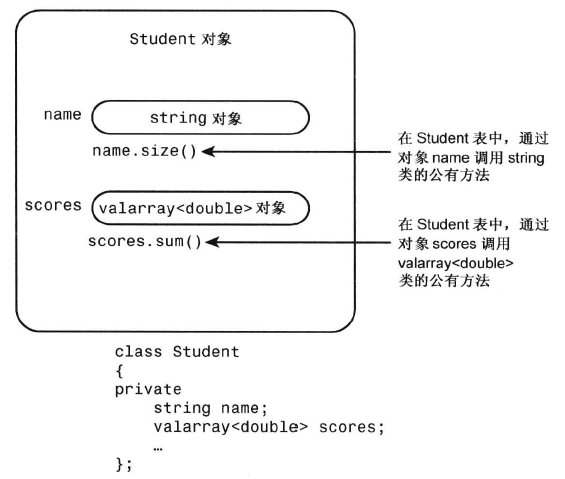

# 包含对象成员的类

要开发一个Student类

问题描述：

- 将学生简化为姓名和一组考试分数，即类包含两个数据成员
- 姓名使用string类表示
- 分数使用valarray类表示

## valarray类简介

- 需要包含头文件valarray
- 用于数据处理
- 为模板类

```cpp
valarray<int> q_values;
valarray<double> weights;

double gpa[5] = {3.2, 2.9, 3.8, 2.9, 3.3};
valarray<double> v1; // 长度为零
valarray<int> v2(8); //8个元素
valarray<int> v3(10,8); // 8个元素，值为全10
valarray<double> v4(gpa,4); //4个元素，使用gpa的前四个元素给v4

valarray<int> v5 = {20, 32, 17, 9}; //C++11
```

- 方法：
  - operator[] : 访问各个元素
  - size(): 返回元素个数
  - sum(): 返回所有元素的总合
  - max(): 返回最大的元素
  - min(): 返回最小的元素

## Student类设计

Student类适合建立has-a关系，即创建一个包含其他类对象的类。

```cpp
class Student
{
private:
    string name;
    valarray<double> scores;
    ...
};
```

同样，上述类将数据成员声明为私有的。这意味着Student类的成员函数可以使用string和
valarray<double>类的公有接来访问和修改name和scores对象，但在类的外面不能这样做，而只能通过Student类的公有接口访问name和score。对于这种情况，通常被描述为Student类获得了其成员对象的实现，但没有继承接口。



studentc.h
```cpp
// studentc.h -- defining a Student class using containment
#ifndef STUDENTC_H_
#define STUDENTC_H_

#include <iostream>
#include <string>   
#include <valarray>
class Student
{   
private:
    typedef std::valarray<double> ArrayDb;
    std::string name;       // contained object
    ArrayDb scores;         // contained object
    // private method for scores output
    std::ostream & arr_out(std::ostream & os) const;
public:
    Student() : name("Null Student"), scores() {}
    explicit Student(const std::string & s)
        : name(s), scores() {}
    explicit Student(int n) : name("Nully"), scores(n) {}
    Student(const std::string & s, int n)
        : name(s), scores(n) {}
    Student(const std::string & s, const ArrayDb & a)
        : name(s), scores(a) {}
    Student(const char * str, const double * pd, int n)
        : name(str), scores(pd, n) {}
    ~Student() {}
    double Average() const;
    const std::string & Name() const;
    double & operator[](int i);
    double operator[](int i) const;
// friends
    // input
    friend std::istream & operator>>(std::istream & is,
                                     Student & stu);  // 1 word
    friend std::istream & getline(std::istream & is,
                                  Student & stu);     // 1 line
    // output
    friend std::ostream & operator<<(std::ostream & os,
                                     const Student & stu);
};

#endif
```

- 在类定义的私有部分使用了typedef，所以类方法和友元函数可以使用ArrayDb类型，在Student类实现中也可以使用，但是在类外无法使用。
- 使用explicit 关闭构造函数的隐式转换

### 初始化被包含的对象

```cpp
Student(const char * str, const double * pd, int n)
    : name(str), scores(pd, n) {}
```

因为该构造函数初始化的是成员对象，而不是继承的对象，所以在初始化列表中使用的是成员名，而不是类名。

但初始化列表包含多个项目时，这些项目被初始化的顺序为它们被声明的顺序，而不是它们在初始化列表中的顺序：

```cpp
Student(const char * str, const double * pd, int n)
    : scores(pd, n), name(str) {}
// name 成员仍将首先被初始化，因为在类定义中它首先被声明
```

### 使用被包含对象的接口


