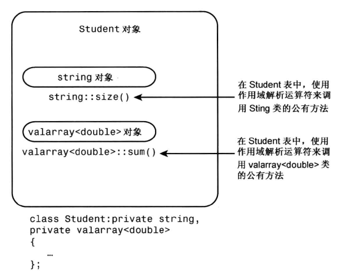
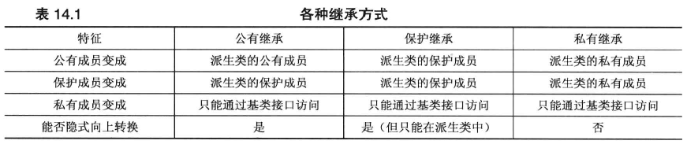
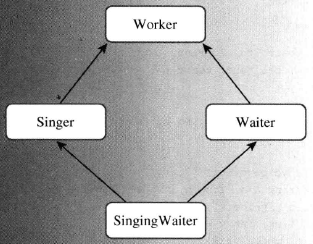

# has- a 关系

has-a关系：

- 新的类将包含另一个类的对象
- 获得实现，但不获得接口

实现方式：

- 包含
- 私有继承
- 保护继承

# 包含对象成员的类（包含）

包含（containment）

要开发一个Student类

问题描述：

- 将学生简化为姓名和一组考试分数，即类包含两个数据成员
- 姓名使用string类表示
- 分数使用valarray类表示

## valarray类简介

- 需要包含头文件valarray
- 用于数据处理
- 为模板类

```cpp
valarray<int> q_values;
valarray<double> weights;

double gpa[5] = {3.2, 2.9, 3.8, 2.9, 3.3};
valarray<double> v1; // 长度为零
valarray<int> v2(8); //8个元素
valarray<int> v3(10,8); // 8个元素，值为全10
valarray<double> v4(gpa,4); //4个元素，使用gpa的前四个元素给v4

valarray<int> v5 = {20, 32, 17, 9}; //C++11
```

- 方法：
  - operator[] : 访问各个元素
  - size(): 返回元素个数
  - sum(): 返回所有元素的总合
  - max(): 返回最大的元素
  - min(): 返回最小的元素

## 使用包含设计Student类

Student类适合建立has-a关系，即创建一个包含其他类对象的类。

```cpp
class Student
{
private:
    string name;
    valarray<double> scores;
    ...
};
```

同样，上述类将数据成员声明为私有的。这意味着Student类的成员函数可以使用string和
valarray<double>类的公有接来访问和修改name和scores对象，但在类的外面不能这样做，而只能通过Student类的公有接口访问name和score。对于这种情况，通常被描述为Student类获得了其成员对象的实现，但没有继承接口。


studentc.h
```cpp
// studentc.h -- defining a Student class using containment
#ifndef STUDENTC_H_
#define STUDENTC_H_

#include <iostream>
#include <string>   
#include <valarray>
class Student
{   
private:
    typedef std::valarray<double> ArrayDb;
    std::string name;       // contained object
    ArrayDb scores;         // contained object
    // private method for scores output
    std::ostream & arr_out(std::ostream & os) const;
public:
    Student() : name("Null Student"), scores() {}
    explicit Student(const std::string & s)
        : name(s), scores() {}
    explicit Student(int n) : name("Nully"), scores(n) {}
    Student(const std::string & s, int n)
        : name(s), scores(n) {}
    Student(const std::string & s, const ArrayDb & a)
        : name(s), scores(a) {}
    Student(const char * str, const double * pd, int n)
        : name(str), scores(pd, n) {}
    ~Student() {}
    double Average() const;
    const std::string & Name() const;
    double & operator[](int i);
    double operator[](int i) const;
// friends
    // input
    friend std::istream & operator>>(std::istream & is,
                                     Student & stu);  // 1 word
    friend std::istream & getline(std::istream & is,
                                  Student & stu);     // 1 line
    // output
    friend std::ostream & operator<<(std::ostream & os,
                                     const Student & stu);
};

#endif
```

- 在类定义的私有部分使用了typedef，所以类方法和友元函数可以使用ArrayDb类型，在Student类实现中也可以使用，但是在类外无法使用。
- 使用explicit 关闭构造函数的隐式转换

### 初始化被包含的对象

```cpp
Student(const char * str, const double * pd, int n)
    : name(str), scores(pd, n) {}
```

因为该构造函数初始化的是成员对象，而不是继承的对象，所以在初始化列表中使用的是成员名，而不是类名。

当初始化列表包含多个项目时，这些项目被初始化的顺序为它们被声明的顺序，而不是它们在初始化列表中的顺序：

```cpp
Student(const char * str, const double * pd, int n)
    : scores(pd, n), name(str) {}
// name 成员仍将首先被初始化，因为在类定义中它首先被声明
```

### 使用被包含对象的接口

被包含对象的接口不是公有的，但可以在类方法中使用它。

```cpp
double Student::Average() const
{
    if(scores.size() > 0)
        return scores.sum()/scores.size();
    else
        return 0;
}
// 这里，在类方法中使用了scores对象的size（）方法和sum（）方法
```

```cpp
ostream & operator<<(ostream & os, const Student & stu)
{
    os << "Scores for" << stu.name << ":\n";
    ...
}
// 这里，使用了 string类重载的 << 运算符
// 除此之外，也可以使用公有方法Name（），返回字符串来完成打印
```

注意，valarray类并没有实现 << 的定义，所以只能通过以下方式实现：

```cpp
// 私有方法 //用于辅助
ostream & Student::arr_out(ostream & os) const
{
    int i;
    int lim = scores.size();
    if(lim > 0)
    {
        for(i = 0; i<lim;i++)
        {
            os << scores[i] << "";
            if (i % 5 == 4)
                os << endl;
        }
        if(i % 5 != 0)
            os << endl;
    }
    else
        os << "empty array";
    return os;
}

ostream & operator<<(ostream & os, const Student & stu)
{
    os << "Scores for" << stu.name << ":\n";
    stu.arr_out(os);
    return os;
}
```

student.cpp

```cpp
// studentc.cpp -- Student class using containment
#include "studentc.h"
using std::ostream;
using std::endl;
using std::istream;
using std::string;

//public methods
double Student::Average() const
{
    if (scores.size() > 0)
        return scores.sum()/scores.size();  
    else
        return 0;
}

const string & Student::Name() const
{
    return name;
}

double & Student::operator[](int i)
{
    return scores[i];         // use valarray<double>::operator[]()
}

double Student::operator[](int i) const
{
    return scores[i];
}

// private method
ostream & Student::arr_out(ostream & os) const
{
    int i;
    int lim = scores.size();
    if (lim > 0)
    {
        for (i = 0; i < lim; i++)
        {
            os << scores[i] << " ";
            if (i % 5 == 4)
                os << endl;
        }
        if (i % 5 != 0)
            os << endl;
    }
    else
        os << " empty array ";
    return os; 
}

// friends

// use string version of operator>>()
istream & operator>>(istream & is, Student & stu)
{
    is >> stu.name;
    return is; 
}

// use string friend getline(ostream &, const string &)
istream & getline(istream & is, Student & stu)
{
    getline(is, stu.name);
    return is;
}

// use string version of operator<<()
ostream & operator<<(ostream & os, const Student & stu)
{
    os << "Scores for " << stu.name << ":\n";
    stu.arr_out(os);  // use private method for scores
    return os;
}
```

use_stuc.cpp

```cpp
// use_stuc.cpp -- using a composite class
// compile with studentc.cpp
#include <iostream>
#include "studentc.h"
using std::cin;
using std::cout;
using std::endl;

void set(Student & sa, int n);

const int pupils = 3;
const int quizzes = 5;

int main()
{
    Student ada[pupils] = 
        {Student(quizzes), Student(quizzes), Student(quizzes)};
    
    int i;
    for (i = 0; i < pupils; ++i)
        set(ada[i], quizzes);
    cout << "\nStudent List:\n";
    for (i = 0; i < pupils; ++i)
        cout << ada[i].Name() << endl;
    cout << "\nResults:";
    for (i = 0; i < pupils; ++i)
    {
        cout << endl << ada[i];
        cout << "average: " << ada[i].Average() << endl;
    }
    cout << "Done.\n";

    return 0;
}

void set(Student & sa, int n)
{
    cout << "Please enter the student's name: ";
    getline(cin, sa);
    cout << "Please enter " << n << " quiz scores:\n";
    for (int i = 0; i < n; i++)
        cin >> sa[i];
    while (cin.get() != '\n')
        continue; 
}
```

# 私有继承

私有继承是实现has-a的另一种方式。

- 使用私有继承，基类的公有成员和保护成员都将成为派生类的私有成员，即基类方法将不会成为派生类对象公有接口的一部分，但可以在派生类的成员函数中使用它们。
- 使用私有继承，类将继承实现，比如：如果string类派生出Student类，后者将有一个string类的组件，可用于保存字符串，Student 方法可以使用string方法来访问string组件。
- 包含将对象作为一个命名的成员对象添加到类中，而私有继承将对象作为一个未被命名的继承对象添加类中。（通过继承或包含添加的对象叫作子对象）
- 私有继承获得实现，不获得接口

## 使用私有继承设计Student类

私有继承可以使用关键字 private，也可以省略访问限定符（无限定符默认为私有继承）

使用string类和valarray类派生Student类：

```cpp
class Student : private std::string, private std::valarray<double>
{
public:
...
};
// 使用多个基类的继承被称为多重继承，后面再详细介绍
```

- Student类不需要私有数据，因为两个基类已经提供了所需的所有数据成员
- 这里的私有继承提供了两个无名称的子对象成员

### 初始化基类组件

构造函数中使用成员初始化列表时，使用类名而不是成员名来标识构造函数：

```cpp
Student(const char * str, const double * pd, int n)
    : std::string(str), ArrayDb(pd, n){}
```

student.h

```cpp
// studenti.h -- defining a Student class using private inheritance
#ifndef STUDENTC_H_
#define STUDENTC_H_

#include <iostream>
#include <valarray>
#include <string>   
class Student : private std::string, private std::valarray<double>
{   
private:
    typedef std::valarray<double> ArrayDb;
    // private method for scores output
    std::ostream & arr_out(std::ostream & os) const;
public:
    Student() : std::string("Null Student"), ArrayDb() {}
    explicit Student(const std::string & s)
            : std::string(s), ArrayDb() {}
    explicit Student(int n) : std::string("Nully"), ArrayDb(n) {}
    Student(const std::string & s, int n)
            : std::string(s), ArrayDb(n) {}
    Student(const std::string & s, const ArrayDb & a)
            : std::string(s), ArrayDb(a) {}
    Student(const char * str, const double * pd, int n)
            : std::string(str), ArrayDb(pd, n) {}
    ~Student() {}
    double Average() const;
    double & operator[](int i);
    double operator[](int i) const;
    const std::string & Name() const;
// friends
    // input
    friend std::istream & operator>>(std::istream & is,
                                     Student & stu);  // 1 word
    friend std::istream & getline(std::istream & is,
                                  Student & stu);     // 1 line
    // output
    friend std::ostream & operator<<(std::ostream & os,
                                     const Student & stu);
};
#endif
```

### 访问基类的方法

- 使用私有继承时，只能在派生类的方法中使用基类的方法。
- 私有继承时，派生类方法中能够使用类名和作用域解析运算符来调用基类的方法。

```cpp
double Student::Average() const
{
    if (ArraryDb::size() > 0)
        return ArrayDb::sum()/ArrayDb::size();
    else
        return 0;
}
```



### 访问基类对象

在使用私有继承时，比如string对象没有名称，Student类的代码可以通过强制类型转换访问内部的string对象。由于Student类是从string类派生而来，因此可以通过强制类型转换，将Student对象转换为string对象。

```cpp
const string & Student::Name() const
{
    return (const string &) * this; //这里使用强制类型转换来创建引用，是为了避免调用构造函数创建新的对象
}
// this 指针指向调用方法的对象
// 上述方法返回一个引用，该引用指向用于调用该方法的Student对象中的继承而来的string对象。
```

### 访问基类的友元函数

- 将派生类对象显式的转换为基类来调用基类的友元函数
- 在私有继承中，在不进行显式类型转换的情况下，不能将指向派生类的引用或指针赋给基类引用或指针

```cpp
ostream & operator<<(ostream & os, const Student & stu)
{
    os << "Socres for" << (const string &)stu << ":\n";
    ...
}
// 显式的将stu转换为string对象引用，进而调用函数operator<<(ostream&, const string&)
```

studenti.cpp

```cpp
// studenti.cpp -- Student class using private inheritance
#include "studenti.h"
using std::ostream;
using std::endl;
using std::istream;
using std::string;

// public methods
double Student::Average() const
{
    if (ArrayDb::size() > 0)
        return ArrayDb::sum()/ArrayDb::size();  
    else
        return 0;
}

const string & Student::Name() const
{
    return (const string &) *this;
}

double & Student::operator[](int i)
{
    return ArrayDb::operator[](i);         // use ArrayDb::operator[]()
}

double Student::operator[](int i) const
{
    return ArrayDb::operator[](i);
}

// private method
ostream & Student::arr_out(ostream & os) const
{
    int i;
    int lim = ArrayDb::size();
    if (lim > 0)
    {
        for (i = 0; i < lim; i++)
        {
            os << ArrayDb::operator[](i) << " ";
            if (i % 5 == 4)
                os << endl;
        }
        if (i % 5 != 0)
            os << endl;
    }
    else
        os << " empty array ";
    return os; 
}

// friends
// use String version of operator>>()
istream & operator>>(istream & is, Student & stu)
{
    is >> (string &)stu;
    return is; 
}

// use string friend getline(ostream &, const string &)
istream & getline(istream & is, Student & stu)
{
    getline(is, (string &)stu);
    return is;
}

// use string version of operator<<()
ostream & operator<<(ostream & os, const Student & stu)
{
    os << "Scores for " << (const string &) stu  << ":\n";
    stu.arr_out(os);  // use private method for scores
    return os;
}
```

use_stui.cpp

```cpp
// use_stui.cpp -- using a class with private inheritance
// compile with studenti.cpp
#include <iostream>
#include "studenti.h"
using std::cin;
using std::cout;
using std::endl;

void set(Student & sa, int n);

const int pupils = 3;
const int quizzes = 5;

int main()
{
    Student ada[pupils] = 
        {Student(quizzes), Student(quizzes), Student(quizzes)};

    int i;
    for (i = 0; i < pupils; i++)
        set(ada[i], quizzes);
    cout << "\nStudent List:\n";
    for (i = 0; i < pupils; ++i)
        cout << ada[i].Name() << endl;
    cout << "\nResults:";
    for (i = 0; i < pupils; i++)
    {
        cout << endl << ada[i];
        cout << "average: " << ada[i].Average() << endl;
    }
    cout << "Done.\n";
    return 0;
}

void set(Student & sa, int n)
{
    cout << "Please enter the student's name: ";
    getline(cin, sa);
    cout << "Please enter " << n << " quiz scores:\n";
    for (int i = 0; i < n; i++)
        cin >> sa[i];
    while (cin.get() != '\n')
        continue; 
}
```

## 使用包含还是私有继承？

- 私有继承和包含都可以建立has-a关系

- 通常，应使用包含来建立has-a关系
  - 易用，可能带来的问题少
- 如果新类需要访问原有类的保护成员，或需要重新定义虚函数，则应使用私有继承。
  - 私有继承提供的特性比包含多
  - 假设类有保护成员，则该保护成员在派生类中是可用的，但是在继承层次结构外是不可用的，如果将该类包含在另一个类中，则位于继承层次结构之外，因此不能访问保护成员。但通过继承得到将是派生类，因此它能够访问保护成员

## 保护继承

保护继承是私有继承的变体，使用关键字protected

- 使用保护继承时，基类的公有成员和保护成员都将成为派生类的保护成员
- 基类的接口在派生类中也是可用的，但是在继承层次结构之外是不可用的
- 对于从派生类再次派生类时，私有继承和保护继承主要区别就表现出来了：
  - 对于使用私有继承派生，然后再次派生，第三代类将不能使用基类的接口，因为基类的公有方法在第一次派生时在派生类中将变成私有方法
  - 对于使用保护继承（连续两次使用保护继承），基类的公有方法在第二代中变成保护方法，在第三代中该方法依旧是保护方法。

```cpp
class Student:protected std::string,protected std::valarray<double>
{...};
```



> 隐式向上转换表示无需进行显式类型转换，就可以将基类指针或引用指向派生类对象

## 使用using重新定义访问权限

使用保护派生或私有派生时，基类的公有成员将成为保护成员或私有成员。

如果需要让基类的方法在派生类外面可用，可使用如下两种方式：

- 在派生类中定一个使用该基类方法的派生类方法

  ```cpp
  double Student::sum() const
  {
      return std::valarray<double>::sum(); //使用基类名+作用域解析运算符使用基类的方法
  }
  ```

- 使用一个using声明来指出派生类可以使用特定的基类成员

  ```cpp
  class Student : private std::string, private std::valarray<double>
  {
  ...
  public:
  	using std::valarray<double>::min;
  	using std::valarray<double>::max;
  	using std::valarray<double>::operator[]; //将使const和非const版本都可以用
  	...
  };
  
  // using std::valarray<double>::max 的using声明允许如下操作：
  // ada为Student对象
  cout << "high score:" << ada[i].max() <<endl; 
  //ada[i]返回一个valarray对象，然后在类外就可以使用按照私有继承本应该是私有方法的max（）方法。
  ```

# 多重继承（MI）

- 公有多重继承表示的是is-a关系
- 私有MI和保护MI表示has-a关系

语法：

```cpp
class SingingWaiter : public Waiter, public Singer {....};
// Waiter 和 Singer都是公有继承

class SingingWaiter : public Waiter, Singer {....};
// Waiter是公有继承， Singer是私有继承
```

多重继承带来的两个主要的问题：

- 从两个不同基类继承同名方法
- 从两个或更多相关基类那里继承同一个类的多个实例

实例：

抽象基类Worker，派生出Waiter类和Singer类，然后再派生出SingingWaiter类



## 简练总结：

- 使用虚基类解决包含多个worker的问题
- 对于非虚基类，如果一个类从两个不同类继承了两个同名的成员，则该类中可以使用类名来限定要使用从哪个类继承来的方法


## 详细内容待整理


# 模板类

模板类为代码重用的另一种方式

## 定义模板类

将之前的Stack类改为模板类：

```cpp
typedef unsigned long Item;
class Stack
{
private:
    enum {MAX = 10};
    Item items[MAX];
    int top;
public:
    Stack();
    bool isempty() const;
    bool isfull() const;
    bool push(const Item & item);
    bool pop(Item & item);
};
```

注意不能将模板成员函数放在独立的实现文件中，即需要将模板类的声明和实现都放到一个文件中。

```cpp
// stacktp.h -- a stack template
#ifndef STACKTP_H_
#define STACKTP_H_
template <class Type> // or //template <typename Type>
// 用来告诉编译器这是一个模板
// Type 可以自定义符合规则的名字，但是 T 和 Type 用的表较多
    
class Stack
{
private:
    enum {MAX = 10};    // constant specific to class
    Type items[MAX];    // holds stack items
    int top;            // index for top stack item
public:
    Stack();
    bool isempty();
    bool isfull();
    bool push(const Type & item); // add item to stack
    bool pop(Type & item);        // pop top into item
};
// 在以上的类声明中，将之前的普通类中的Item类型都使用 Type 来替换。

template <class Type> //告诉编译器这是个模板
Stack<Type>::Stack() //要使用 Stack<Type> 来代替之前的Stack
{
    top = 0;
}

template <class Type>
bool Stack<Type>::isempty()
{
    return top == 0;
}

template <class Type>
bool Stack<Type>::isfull()
{
    return top == MAX;
}

template <class Type>
bool Stack<Type>::push(const Type & item)
{
    if (top < MAX)
    {
        items[top++] = item;
        return true;
    }
    else
        return false;
}

template <class Type>
bool Stack<Type>::pop(Type & item)
{
    if (top > 0)
    {
        item = items[--top];
        return true;
    }
    else
        return false; 
}
#endif
```

## 使用模板类

将模板实例化：

```cpp
//创建两个类，一个用于存储int，一个用于存储string对象
Stack<int> kernels;
Stack<string> colonels;
//上述声明后，编译器按 Stack<Type> 模板来生成两个独立的类声明和两组独立的类方法
```

```cpp
// stacktem.cpp -- testing the template stack class
#include <iostream>
#include <string>
#include <cctype>
#include "stacktp.h"
using std::cin;
using std::cout;

int main()
{
    Stack<std::string> st;   // create an empty stack
    char ch;
    std::string po;
    cout << "Please enter A to add a purchase order,\n"
         << "P to process a PO, or Q to quit.\n";
    while (cin >> ch && std::toupper(ch) != 'Q')
    {
        while (cin.get() != '\n')
            continue;
        if (!std::isalpha(ch))
        {
            cout << '\a';
            continue;
        }
        switch(ch)
        {
            case 'A':
            case 'a': cout << "Enter a PO number to add: ";
                      cin >> po;
                      if (st.isfull())
                          cout << "stack already full\n";
                      else
                          st.push(po);
                      break;
            case 'P':
            case 'p': if (st.isempty())
                          cout << "stack already empty\n";
                      else {
                          st.pop(po);
                          cout << "PO #" << po << " popped\n";
                          break;
                      }
        }
        cout << "Please enter A to add a purchase order,\n"
             << "P to process a PO, or Q to quit.\n";
    }
    cout << "Bye\n";
    return 0; 
}
```

## 深入模板类

内置类型或类对象可以用作上面定义的类模板Stack<Type>的类型，原则上指针也可以,但是上面定义的模板类Stack的方法并适合于指针。

下面设计一个可以使用指针为类型的模板类：

```cpp
// stcktp1.h -- modified Stack template
#ifndef STCKTP1_H_
#define STCKTP1_H_

template <class Type>
class Stack
{
private:
    enum {SIZE = 10};    // default size
    int stacksize;
    Type * items;       // holds stack items
    int top;            // index for top stack item
public:
    explicit Stack(int ss = SIZE);
    Stack(const Stack & st);
    ~Stack() { delete [] items; }
    bool isempty() { return top == 0; }
    bool isfull() { return top == stacksize; }
    bool push(const Type & item);   // add item to stack
    bool pop(Type & item);          // pop top into item
    Stack & operator=(const Stack & st);
};

template <class Type>
Stack<Type>::Stack(int ss) : stacksize(ss), top(0)
{
    items = new Type [stacksize];
}

template <class Type>
Stack<Type>::Stack(const Stack & st)
{
    stacksize = st.stacksize;
    top = st.top;
    items = new Type [stacksize];
    for (int i = 0; i < top; i++)
        items[i] = st.items[i];
}

template <class Type>
bool Stack<Type>::push(const Type & item)
{
    if (top < stacksize)
    {
        items[top++] = item;
        return true;
    }
    else
        return false;
}

template <class Type>
bool Stack<Type>::pop(Type & item)
{
    if (top > 0)
    {
        item = items[--top];
        return true;
    }
    else
        return false;
}

template <class Type>
Stack<Type> & Stack<Type>::operator=(const Stack<Type> & st)
{
    if (this == &st)
        return *this;
    delete [] items;
    stacksize = st.stacksize;
    top = st.top;
    items = new Type [stacksize];
    for (int i = 0; i < top; i++)
        items[i] = st.items[i];
    return *this; 
}
#endif
```

```cpp
// stkoptr1.cpp -- testing stack of pointers
#include <iostream>
#include <cstdlib>     // for rand(), srand()
#include <ctime>       // for time()
#include "stcktp1.h"
const int Num = 10;
int main()
{
    std::srand(std::time(0)); // randomize rand()
    std::cout << "Please enter stack size: ";
    int stacksize;
    std::cin >> stacksize;
// create an empty stack with stacksize slots
    Stack<const char *> st(stacksize);  //初始化一个char指针数组

// in basket //初始化一个char指针数组
    const char * in[Num] = {
            " 1: Hank Gilgamesh", " 2: Kiki Ishtar",
            " 3: Betty Rocker", " 4: Ian Flagranti",
            " 5: Wolfgang Kibble", " 6: Portia Koop",
            " 7: Joy Almondo", " 8: Xaverie Paprika",
            " 9: Juan Moore", "10: Misha Mache"
            };
 // out basket
    const char * out[Num];

    int processed = 0;
    int nextin = 0;
    while (processed < Num)
    {
        if (st.isempty())
            st.push(in[nextin++]); //nextin++ 先用值再加一
        else if (st.isfull())
            st.pop(out[processed++]);
        else if (std::rand() % 2  && nextin < Num)   // 50-50 chance
            st.push(in[nextin++]);
        else
            st.pop(out[processed++]);
    }
    for (int i = 0; i < Num; i++)
        std::cout << out[i] << std::endl;

    std::cout << "Bye\n";
	return 0; 
}
```

## 数组模板示例和非类型参数

