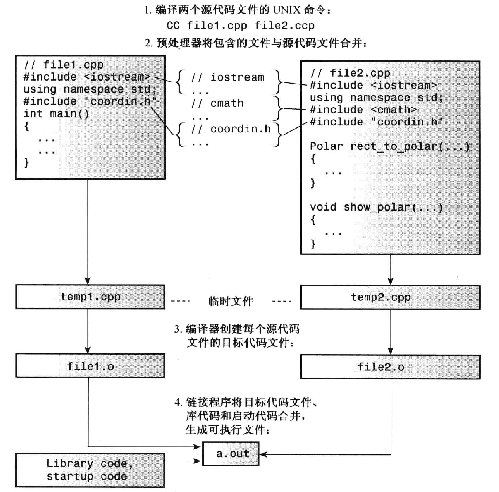

# 内存模型和命名空间

## 单独编译

通常C++大型程序都是由多个源代码文件组成，这些文件代码可能共享一些数据，这样的程序涉及到文件的单独编译。

C++鼓励将组件函数放到单独的文件中，然后可以单独编译这些文件，然后将它们链接成可执行程序。（C++编译器既编译程序，也管理链接器。）如果只修改了一个文件，则可以只重新编译该文件，然后将它与其他文件的编译版本链接。

C++ 代码文件的一般形式：（以对结构进行操作的函数为例）

- 头文件：包含结构声明和使用这些结构的函数原型

- 源代码文件：包含与结构相关的函数的代码

- 源代码文件（main）：包含调用与结构相关的函数的代码

这种组织方式也与OOP方法一致。 一个头文件包含了用户定义类型的定义，另一个文件包含操纵用户定义类型的函数的代码。这两个文件组成一个软件包，可用于各种程序中。

头文件中常包含以下内容：

- 函数原型
- 使用#define或const定义的符号常量
- 结构声明
- 类声明
- 模板声明
- 内联函数

> 结构声明放在头文件中是可以的，因为它们不创建变量
>
> 被声明为const的数据和内联函数有特殊的链接属性

**同一个文件中只能将同一个头文件包含一次**

头文件中include:

 `<func.h>` :编译器将在存储标准头文件的主机系统的文件系统中查找

`"func.h"` : 编译器将首先查找当前的工作目录或源代码目录，如果没有找到头文件，则将在标准位置查找。

> 在g++ 编译器中，只需要将源代码文件加入到项目中，而不用加入头文件，因为#include指令管理头文件。
>
> 不要使用#include来包含源代码文件，这样导致多重声明

示例：

- coordin.h

```cpp
// coordin.h -- structure templates and function prototypes
// structure templates
#ifndef COORDIN_H_
#define COORDIN_H_

struct polar
{
    double distance;    // distance from origin
    double angle;        // direction from origin
};
struct rect
{
    double x;        // horizontal distance from origin
    double y;        // vertical distance from origin
};

// prototypes
polar rect_to_polar(rect xypos);
void show_polar(polar dapos); 

#endif
```

- file1.cpp

```cpp
// file1.cpp -- example of a three-file program
#include <iostream>
#include "coordin.h" // structure templates, function prototypes
using namespace std;
int main()
{
    rect rplace;
    polar pplace;

    cout << "Enter the x and y values: ";
    while (cin >> rplace.x >> rplace.y)  // slick use of cin
    {
        pplace = rect_to_polar(rplace);
        show_polar(pplace);
        cout << "Next two numbers (q to quit): ";
    }
    cout << "Bye!\n";
    return 0; 
}
```


- file2.cpp

```cpp
// file2.cpp -- contains functions called in file1.cpp
#include <iostream>
#include <cmath>
#include "coordin.h" // structure templates, function prototypes

// convert rectangular to polar coordinates
polar rect_to_polar(rect xypos)
{
    using namespace std;
    polar answer;

    answer.distance =
        sqrt( xypos.x * xypos.x + xypos.y * xypos.y);
    answer.angle = atan2(xypos.y, xypos.x);
    return answer;      // returns a polar structure
}

// show polar coordinates, converting angle to degrees
void show_polar (polar dapos)
{
    using namespace std;
    const double Rad_to_deg = 57.29577951;

    cout << "distance = " << dapos.distance;
    cout << ", angle = " << dapos.angle * Rad_to_deg;
    cout << " degrees\n";
}
```

在Linux系统中编译上述例程的过程：



## 存储持续性，作用域 和 链接性

###  存储持续性

C++使用不同 的方案来存储数据，这些方案的区别在于数据保留在内存中的时间

- 自动存储持续性：在函数定义中声明的变量（包括函数参数）的内存持续性为自动的。它们在程序开始执行其所属的函数或代码块时被创建，在执行完函数或代码块时，它们使用的内存被释放。
- 静态存储持续性：在函数定义外定义的变量和使用关键字static定义的变量的存储持续性都为静态。它们在程序整个运行过程中都存在。
- 线程存储持续性（C++11）：变量使用关键字thread_local声明，其生命周期与所属的线程一样长。
- 动态存储持续性：用new运算符分配的内存将一直存在，直到使用delete运算将其释放或程序结束为止。也叫做自由存储或堆。

### 作用域（scope）和链接性

作用域描述了名称在文件（翻译单元）的多大范围内可见。例如：

- 函数中定义的变量可在函数中使用，但不能在其他函数使用
- 而在文件中的函数定义之前定义的变量则可在该文件内所有函数中使用

链接性描述了名称如何不同单元间共享。

- 链接性为外部的名称可在文件间共享
- 链接性为内部的名称只能由一个文件中的函数共享
- 自动变量的名称没有链接性，因为它们不能共享

C++变量的作用域：

- 作用域为局部的变量只在定义它的代码块中可用
  - 自动变量的作用域为局部
- 作用域为全局（也叫文件作用域）的变量在定义位置到文件结尾之间都可用
  - 静态变量的作用域可能是局部或者全局（取决于它的定义方式）

- 在函数原型作用域中使用的名称只在包含参数列表的括号内可用（即函数原型的名称不重要）
- 在类中声明的成员的作用域为整个类
- 在命名空间中的声明的变量的作用域为整个名称空间

> C++函数的作用域可以是整个类或整个名称空间（包括全局），但不能是局部的（因为不能再代码块内定义函数，如果函数作用域为局部，则只对它自己可见，因此不能被其他函数调用）

## 各种数据存储方案：

### 自动存储持续性

在默认情况下，在函数中声明的函数参数和变量的存储持续性为自动，作用域为局部，没有链接性。作用域的起点是其声明位置。

程序开始执行这些变量所属的代码块时，将为其分配内存，函数结束后，这些变量将自动消失。

如果再代码块中定义了变量，则该变量的存在时间和作用域都被将限制在该代码块内。

```cpp
int main()
{
	int teledeli = 5;
    {
        int websight = -2;
        cout << websight << teledeli << endl;
    }
    cout << teledeli << endl;
    ...
}
```

>  teledeli 在内部代码块和外部代码块都是可见的，而websight只在内部代码块中可见，它们的作用域是从 定义它的 位置到代码块的结尾。

如果在内部和外部代码块都定一个相同的变量时：

```cpp
int main()
{
	int teledeli = 5;
    {
        int teledeli = 2;
        int websight = -2;
        cout << websight << teledeli << endl;
    }
    cout << teledeli << endl;
    ...
}
```

> 在内部代码块中，新定义的teledeli会在内部代码块隐藏之前在外部代码块定义的teledeli。


