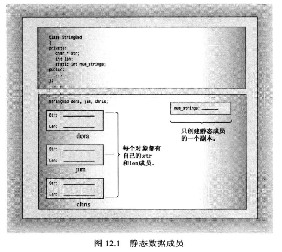
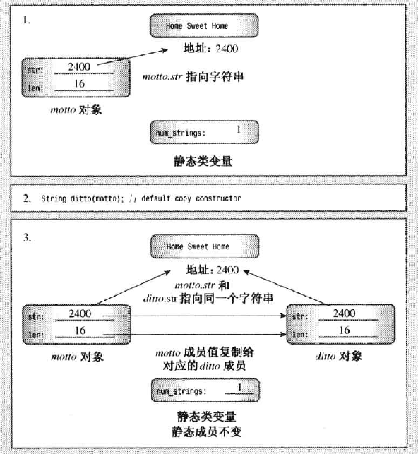
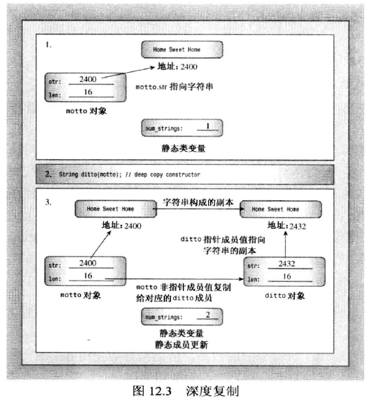

# 类和动态内存分配

使用new和delete处理动态内存的应用场景：

假设要创建一个类，一个数据成员字符数组要存储姓名，绝大多数名字短于14个字符，但是为了保险起见将，设置字符数组长度为40，但是如果需要创建几千个对象，就浪费了大量的内存。

> 常用方法使用string，string自动处理内存管理细节。（这里为了讲述内存管理方法，所以才不用string，呵呵哒）

## 动态内存和类

C++使用new和delete运算符来动态控制内存，但在类中使用它们需要注意，否则会带了问题。

### 静态类成员

```cpp
// 头文件stringbad.h
class StringBad
{
private:
    ....
    static int num_strings;  //声明
    ....
}

// 类方法文件stringbad.cpp
...
int StringBad::num_strings = 0; //初始化静态成员
...
```

- 静态数据成员不能在类声明中初始化，因为声明描述了如何分配内存，但并不分配内存
- 在类外部（类声明之外）使用单独语句进行初始化，需要使用作用域运算符
- 类静态成员是单独存储的，不是对象的组成部分

静态数据成员在类声明中声明，在包含类方法的文件中初始化，初始化时使用作用域运算符来指出静态成员所属的类。

但是如果静态成员是整型或枚举型const，则可以在类声明中初始化。



### 一个有问题的例子

- 用来说明复制构造函数和赋值运算符，可大致浏览以下。

strngbad.h

```cpp
// strngbad.h -- flawed string class definition
#include <iostream>
#ifndef STRNGBAD_H_
#define STRNGBAD_H_
class StringBad
{
private:
    char * str;                // pointer to string
    int len;                   // length of string
    static int num_strings;    // number of objects
public:
    StringBad(const char * s); // constructor
    StringBad();               // default constructor
    ~StringBad();              // destructor
// friend function
    friend std::ostream & operator<<(std::ostream & os, 
                       const StringBad & st);
};
#endif
```

strnbad.cpp

```cpp
// strngbad.cpp -- StringBad class methods
#include <cstring>                    // string.h for some
#include "strngbad.h"
using std::cout;

// initializing static class member
int StringBad::num_strings = 0;

// class methods
// construct StringBad from C string
StringBad::StringBad(const char * s)
{
    len = std::strlen(s);             // set size
    str = new char[len + 1];          // allot storage
    std::strcpy(str, s);              // initialize pointer
    num_strings++;                    // set object count
    cout << num_strings << ": \"" << str
         << "\" object created\n";    // For Your Information
}

StringBad::StringBad()                // default constructor
{
    len = 4;
    str = new char[4];
    std::strcpy(str, "C++");          // default string
    num_strings++;
    cout << num_strings << ": \"" << str
         << "\" default object created\n";  // FYI
}

StringBad::~StringBad()               // necessary destructor
{
    cout << "\"" << str << "\" object deleted, ";    // FYI
    --num_strings;                    // required
    cout << num_strings << " left\n"; // FYI
    delete [] str;                    // required
}

std::ostream & operator<<(std::ostream & os, const StringBad & st)
{
    os << st.str;
    return os; 
}
```

析构函数：

析构函数中的delete语句是必须的。 str 成员指向new分配的内存。当StringBad对象过期时，指针也将过期。但指向的内存仍被分配，除非使用delete将其释放。删除对象可以释放对象本身占用的内存，但并不能自动释放属于对象成员的指针指向的内存。因此，必须使用析构函数。在析构函数中使用delete语句可确保对象过期时，由构造函数使用new分配的内存被释放。

vegnews.cpp

```cpp
// vegnews.cpp -- using new and delete with classes
// compile with strngbad.cpp
#include <iostream>
using std::cout;
#include "strngbad.h"

void callme1(StringBad &);  // pass by reference
void callme2(StringBad);    // pass by value

int main()
{
    using std::endl;
    {
        cout << "Starting an inner block.\n";
        StringBad headline1("Celery Stalks at Midnight");
        StringBad headline2("Lettuce Prey");
        StringBad sports("Spinach Leaves Bowl for Dollars");
        cout << "headline1: " << headline1 << endl;
        cout << "headline2: " << headline2 << endl;
        cout << "sports: " << sports << endl;
        callme1(headline1);
        cout << "headline1: " << headline1 << endl;
        callme2(headline2);
        cout << "headline2: " << headline2 << endl;
        cout << "Initialize one object to another:\n";
        StringBad sailor = sports;
        cout << "sailor: " << sailor << endl;
        cout << "Assign one object to another:\n";
        StringBad knot;
        knot = headline1;
        cout << "knot: " << knot << endl; 
        cout << "Exiting the block.\n";
    }
    cout << "End of main()\n";
    // std::cin.get();
    return 0;
}

void callme1(StringBad & rsb)
{
    cout << "String passed by reference:\n";
    cout << "    \"" << rsb << "\"\n";
}

void callme2(StringBad sb)
{
    cout << "String passed by value:\n";
    cout << "    \"" << sb << "\"\n";
}
```

- 程序将在 `callme2(headline2);` 处开始出现问题，原因是默认复制构造函数被调用。

- `StringBad sailor = sports;` 等效于 `StringBad sailor = StringBad(sports);`

### 特殊成员函数

C++ 自动提供以下成员函数：

- 默认构造函数，如果没有定义构造函数
- 默认析构函数，如果没有定义
- 复制构造函数，如果没有定义
- 赋值运算符，如果没有定义
- 地址运算符，如果没有定义

### 复制构造函数

#### 类的复制构造函数原型如下

```cpp
Class_name(const Class_namme &);
// 示例：
StringBad(const StringBad &);
```

#### 何时调用复制构造函数

- 新建一个对象并将其初始化为同类现有对象时，复制构造函数都被调用

  ```cpp
  StringBad ditto(motto); //调用 StringBad(const StringBad &)
  StringBad metoo = motto; //调用 StringBad(const StringBad &)
  StringBad also = StringBad(motto); //调用StringBad(const StringBad &)
  StringBad * pStringBad = new StringBad(motto); //调用StringBad(const StringBad &)
  ```

> 其中中间的2种声明可能会使用复制构造函数直接创建metoo和also，也可能使用复制构造函数生成一个临时对象，然后将临时对象的内容赋给metoo和also，这取决于具体的实现。最后一种声明使用motto初始化一个匿名对象，并将新对象的地址赋给指针。

- 当函数按值传递对象或函数返回对象时，都将使用复制构造函数

  ```cpp
  void callme2(StringBad sb)
  {
      cout << "String passed by value:\n";
      cout << "    \"" << sb << "\"\n";
  }
  
  callme2(headline2);
  // 程序使用复制构造函数初始化sb
  ```

  > 引用传递对象可以节省调用构造函数的时间以及存储新对象的空间

#### 默认的复制构造函数的功能

默认的复制构造函数逐个复制非静态成员（成员复制也称为浅复制），复制的是成员的值。

- 如果成员本身就是类对象，则将使用这个类的复制构造函数来复制成员对象。
- 静态成员不受影响
- 数据成员如果是指针，复制前后都指向同一个地址
  - 也就是说motto对象和ditto对象的str指针都指向同一个地址
  - 当motto对象调用析构函数，将该内存释放掉之后，ditto对象的str指针将会带来问题，比如调用ditto调用析构函数，`delete []sprots.str `,会导致错误。



#### 定义显式复制构造函数

为了解决指针复制时浅复制的问题，使用显式复制构造函数对指针进行深度复制。

```cpp
// 使复制前后的对象中的str指针不再指向同一块内存
StringBad::StringBad(const StringBad & st)
{
    num_strings++;             // handle static member update
    len = st.len;              // same length
    str = new char [len + 1];  // allot space
    std::strcpy(str, st.str);  // copy string to new location
}
```

> 如果类中包含了使用new初始化的指针成员，必须定一个复制构造函数，以复制指针成员指向的数据，而不是指针，即深度复制。



## 赋值运算符

赋值运算符原型：

```cpp
Class_name & operator=(const Class_name &);
// 示例：
StringBad & operator=(const StringBad &);
```

赋值运算符使用情况：

- 将已有的对象赋值给另一个对象时，将使用重载的赋值运算符

  ```cpp
  StringBad headline1("Hello World");
  StringBad kont;
  knot = headline1; //此时将调用赋值运算符
  ```

- 特殊情况

  ```cpp
  // knot为已初始化StringBad对象
  StringBad metto = knot; //一定使用复制构造函数，可能使用赋值运算符，这取决于具体实现。
  ```

  > 因为对于上述的语句，对于不同编译器会有不同的处理方式：
  >
  > 第一种，直接使用复制构造函数初始化新对象。
  >
  > 第二种，先使用复制构造函数`StringBad(const StringBad &)` 创建一个临时对象，然后通过赋值将临时对象的值复制到新对象中。

赋值运算符定义：

- 其实现与复制构造函数相似，但是有差别
- 赋值运算符只能使用类成员函数重载
- 赋值和被赋值对象使用new申请的内存空间长度可能不同，需要使用delete先释放旧动态存储空间，然后再重新申请
- 应该避免将对象赋给自身的情况发生，因为在赋值类成员之前，由于delete被调用（看上一条），使用new申请的动态内存已经被释放掉了，指向该内存的成员就无法被正确处理。
- 函数返回一个指向调用对象的引用，以实现连续赋值。

```cpp
StringBad & StringBad::operator=(const StringBad & st)
{
    if (this == &st) //通过检查地址是否相同，以判断是否为自我复制
        return *this;
    delete [] str;
    len = st.len;
    str = new char[len + 1];
    std::strcpy(str, st.str);
    return *this;
}
```

## 实现一个简单的String类

string1.h

```cpp
// string1.h -- fixed and augmented string class definition

#ifndef STRING1_H_
#define STRING1_H_
#include <iostream>
using std::ostream;
using std::istream;

class String
{
private:
    char * str;             // pointer to string
    int len;                // length of string
    static int num_strings; // number of objects
    static const int CINLIM = 80;  // cin input limit
public:
// constructors and other methods
    String(const char * s); // constructor
    String();               // default constructor
    String(const String &); // copy constructor
    ~String();              // destructor
    int length () const { return len; }
// overloaded operator methods    
    String & operator=(const String &);
    String & operator=(const char *);
    char & operator[](int i);
    const char & operator[](int i) const;
// overloaded operator friends
    friend bool operator<(const String &st, const String &st2);
    friend bool operator>(const String &st1, const String &st2);
    friend bool operator==(const String &st, const String &st2);
    friend ostream & operator<<(ostream & os, const String & st);
    friend istream & operator>>(istream & is, String & st);
// static function
    static int HowMany();
};
#endif
```

string1.cpp

```cpp
// string1.cpp -- String class methods
#include <cstring>                 // string.h for some
#include "string1.h"               // includes <iostream>
using std::cin;
using std::cout;

// initializing static class member
int String::num_strings = 0;

// static method
int String::HowMany()
{
    return num_strings;
}

// class methods
String::String(const char * s)     // construct String from C string
{
    len = std::strlen(s);          // set size
    str = new char[len + 1];       // allot storage
    std::strcpy(str, s);           // initialize pointer
    num_strings++;                 // set object count
}

String::String()                   // default constructor
{
    len = 4;
    str = new char[1];
    str[0] = '\0';                 // default string
    num_strings++;
}

String::String(const String & st)
{
    num_strings++;             // handle static member update
    len = st.len;              // same length
    str = new char [len + 1];  // allot space
    std::strcpy(str, st.str);  // copy string to new location
}

String::~String()                     // necessary destructor
{
    --num_strings;                    // required
    delete [] str;                    // required
}

// overloaded operator methods    
    // assign a String to a String
String & String::operator=(const String & st)
{
    if (this == &st)
        return *this;
    delete [] str;
    len = st.len;
    str = new char[len + 1];
    std::strcpy(str, st.str);
    return *this;
}

    // assign a C string to a String
String & String::operator=(const char * s)
{
    delete [] str;
    len = std::strlen(s);
    str = new char[len + 1];
    std::strcpy(str, s);
    return *this;
}

    // read-write char access for non-const String
char & String::operator[](int i)
{
    return str[i];
}

    // read-only char access for const String
const char & String::operator[](int i) const
{
    return str[i];
}

// overloaded operator friends

bool operator<(const String &st1, const String &st2)
{
    return (std::strcmp(st1.str, st2.str) < 0);
}

bool operator>(const String &st1, const String &st2)
{
    return st2 < st1;
}

bool operator==(const String &st1, const String &st2)
{
    return (std::strcmp(st1.str, st2.str) == 0);
}

    // simple String output
ostream & operator<<(ostream & os, const String & st)
{
    os << st.str;
    return os; 
}

    // quick and dirty String input
istream & operator>>(istream & is, String & st)
{
    char temp[String::CINLIM];
    is.get(temp, String::CINLIM);
    if (is)
        st = temp;
    while (is && is.get() != '\n')
        continue;
    return is; 
}
```

### 代码解释

默认构造函数:

默认构造函数中使用`str = new char[1];` 而不使用`str = new char` ,是为了使用统一的析构函数形式`delete [] str;`

- C++  中可以使用表示空指针的方式：

  ```cpp
  int * str = 0;
  // C++ 11:
  int * str = nullptr;
  ```

比较函数成员：

比较成员函数采用友元函数的定义方式。

```cpp
friend bool operator<(const String &st, const String &st2);
friend bool operator>(const String &st1, const String &st2);
friend bool operator==(const String &st, const String &st2);
```

strcmp() 函数按照ascii大小比较字符串，如果第一个参数位于第二个参数之前，则返回一个负值。

```cpp
// 调用比较成员函数的示例：
if ("love" == answer);
// 上述语句被重载的比较运算符被转化为：
if (operator==("love", answer));
// 编译器可以使用某个构造函数将上述语句转化为：
if (operator==(String("love"), answer)); // 参考类类型的自动转换情况部分的内容
```

重载的 [] 运算符

```cpp
char & operator[](int i); // 可用于对象的修改
const char & operator[](int i) const; // 用于const对象
```

```cpp
// 调用示例：
String means("might");
means[0] = 'r';
String text("Hello World");
const String answer("futile");
cout << text[1]; // ok,使用 非const
cout << answer[1]; // ok，使用 const
cin  >> text[1];  // ok, 使用 非const
cin >> answer[1]; // 编译器报错
```

静态类成员函数

使用static关键字将成员函数声明为静态成员函数

- 不能通过对象调用静态成员函数
- 不能通过this指针调用静态成员函数
- 如果静态类成员函数是在公有部分声明的，则可以使用类名和作用域解析运算符来调用它
- 由于静态成员函数不与特定的对象关联，所以只能使用静态数据成员

```cpp
static int HowMany(){ return num_strings;} //内联形式
// 函数调用
int count = String::HowMany(); //注意使用作用域解析运算符
```

重载赋值运算符的两种形式

```cpp
//注意区别形参不同带来的影响
String & operator=(const String &); 
String & operator=(const char *);

//使用 const String & 作为形参时的一种调用情况
String name;
char temp[40];
cin.getline(temp,40);
name = temp; // 程序执行过程：
// 首先由于temp为C风格字符串，并且类内定义了 String(const char *)构造函数，C++使用此构造函数进行自动类型转换，也就是创建一个临时的String对象。
// 然后使用 String & operator=(const String &) 赋值运算符函数将临时对象赋值给name
// 程序调用析构函数~String()删除临时对象

// 这种方式的开销很大

//针对以上情况可以使用以 const char * 作为形参的赋值运算符
// 函数定义如下：
String & String::operator=(const char * s)
{
    delete [] str;
    len = std::strlen(s);
    str = new char[len + 1];
    std::strcpy(str, s);
    return *this;
}
// 调用：
name = temp; //此时temp直接被当作参数传递给函数，可以省下很多步骤。
```

sayings1.cpp

```cpp
// sayings1.cpp -- using expanded String class
// compile with string1.cpp
#include <iostream>
#include "string1.h" 
const int ArSize = 10;
const int MaxLen =81;
int main()
{
    using std::cout;
    using std::cin;
    using std::endl;
    String name;
    cout <<"Hi, what's your name?\n>> ";
    cin >> name;
    cout << name << ", please enter up to " << ArSize
         << " short sayings <empty line to quit>:\n";
    String sayings[ArSize];     // 对象数组
    char temp[MaxLen];          // temporary string storage
    int i;
    for (i = 0; i < ArSize; i++)
    {
        cout << i+1 << ": ";
        cin.get(temp, MaxLen);
        while (cin && cin.get() != '\n')
            continue;
        if (!cin || temp[0] == '\0')    // empty line?
            break;              // i not incremented
        else
            sayings[i] = temp;  // overloaded assignment
    }
    int total = i;              // total # of lines read

    if ( total > 0)
    {
        cout << "Here are your sayings:\n";
        for (i = 0; i < total; i++)
            cout << sayings[i][0] << ": " << sayings[i] << endl;

        int shortest = 0;
        int first = 0;
        for (i = 1; i < total; i++)
        {
            if (sayings[i].length() < sayings[shortest].length())
                shortest = i;
            if (sayings[i] < sayings[first])
                first = i;
        }
        cout << "Shortest saying:\n" << sayings[shortest] << endl;;
        cout << "First alphabetically:\n" << sayings[first] << endl;
        cout << "This program used "<< String::HowMany() 
             << " String objects. Bye.\n";
    }
    else
        cout << "No input! Bye.\n";
   return 0; 
}
```

## 在构造函数中使用new时应该注意的事项

在构造函数中使用new初始化对象的指针成员时：

- 如果在构造函数中使用new来初始化指针成员，则应该在析构函数中使用delete
  
- new 对应 delete， new[] 对应 delete[]
  
- 如果使用多个构造函数，必须使用相同的方式使用new，因为只有一个析构函数。
  
- 构造函数中空指针兼容两种情况，因为delete可以用于空指针
  
- 应定义一个复制构造函数，通过深度复制将一个对象初始化为另一个对象，避免默认复制构造函数只复制指针成员本身。

  - 复制构造函数应该更新受影响的静态类成员

  ```cpp
  String::String(const String & st)
  {
      num_strings++;             // handle static member update
      len = st.len;              // same length
      str = new char [len + 1];  // allot space
      std::strcpy(str, st.str);  // copy string to new location
  }
  ```

- 应定义一个赋值运算符，通过深度复制将一个对象复制给另一个对象。类比复制构造函数

  - 赋值运算符函数应返回一个指向调用对象的引用，以实现连续赋值
  - 赋值运算符函数应该防止自我复制

  ```cpp
  String & String::operator=(const String & st)
  {
      if (this == &st)
          return *this;
      delete [] str;
      len = st.len;
      str = new char[len + 1];
      std::strcpy(str, st.str);
      return *this;
  }
  ```

## 对象作为返回值

成员函数或独立函数返回对象的四种情况：

- 返回非const对象
- 返回const对象
- 返回指向对象的非const引用
- 返回指向对象的const引用

当方法和函数（如重载的赋值运算符）可以返回对象也可以返回指向对象的引用时，首选引用，因为引用效率高。

### 返回指向const对象的引用

如果函数返回传递给它的对象（通过调用对象的方法或将对象作为参数），可以通过返回引用的方式提高效率。

对比直接返回对象和返回指向const对象的const引用

> 返回 形参中const引用的对象 只能使用 const & ，即 返回指向const对象的引用只能使用 const引用

```cpp
// 函数调用示例：
Vector force1(50,60);
Vector force2(10,70);
Vector max;
max = Max(force1, force2);

// 第一种实现：
Vector Max(const Vector & v1, const Vector & v2)
{
    if (v1.magval() > v2.magval())
        return v1;
    else
        return v2;
}

// 第二种实现：
const Vector & Max(const Vector & v1, const Vector & v2)
{
    if (v1.magval() > v2.magval())
        return v1;
    else
        return v2;
}
```

- 第一种实现返回对象时，将调用复制构造函数
- 第二种实现返回对象的cosnt的引用，不需要调用复制构造函数，效率更高
- 第二种实现中，由于v1 和 v2 都被声明为const引用，因此返回类型必须为const。

### 返回指向非const对象的引用

- 如果方法或函数要返回一个没有公有(public)复制构造函数的类（如 ostream），则必须返回一个指向这种对象的引用

两种常见的返回非const对象引用的情况：

- 重载赋值运算符
  - 返回对象是为了连续赋值
  - 返回对象引用是为了提高效率
- 重载与cout一起使用的 << 运算符。
  - 必须这样

### 返回对象

- 如果被返回的对象是被调用函数中局部变量，则不应按引用方式返回。这种情况下程序将使用复制构造函数来生成返回的对象。

例如算术运算符重载

```cpp
Vector Vector::operator+(const Vector & b) const
{
    return Vector(x+b.x, y+b.y);
}
// 程序隐式调用复制构造函数创建被返回对象

// 函数调用：
Vector force1(50,60);
Vector force2(10,70);
Vector net;
net = force1 + force2;
// force1和force2的和被储存在一个新的临时对象中。
```

> 这种情况下调用复制构造函数的开销无法避免

### 返回const对象

返回const对象可以防止一些情况下的奇异的属性

```cpp
// 函数原型：
Vector Vector::operator+(const Vector & b) const
// 三个Vector对象
net = force1 + force2; //正常情况

// 特殊的情况，使用 返回const对象可以避免这种情况发生
// 这种代码只是为了演示。 
// 出现这种代码的一个可能的原因：force1 + force2 == net; 少写了一个等号
force1 + force2 = net; //此时程序计算force1 和force2的和，将结果复制到临时返回对象中，再使用net内容覆盖临时对象的内容，然后该临时对象被丢弃。
```

## 使用指向对象的指针

