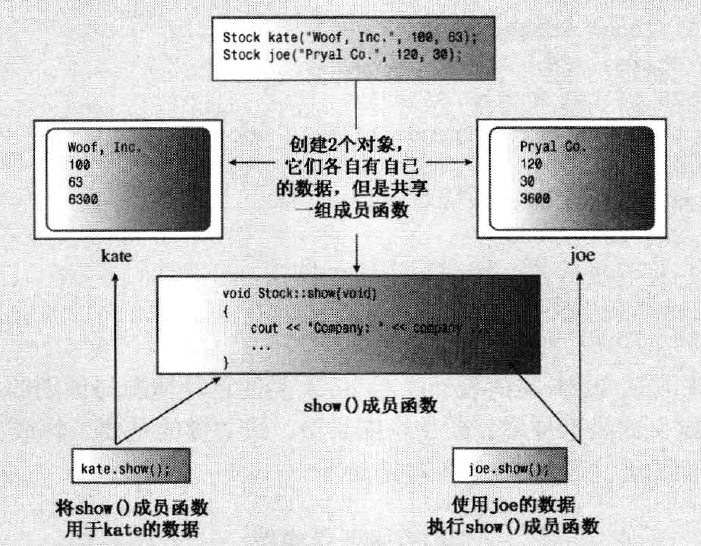
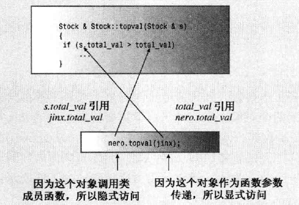

# 类和对象
## 类的引入

对于基本类型的思考：

指定基本类型，如int，实际完成了三项工作：

- 决定数据对象需要的内存数量
- 决定如何解释内存中的位
- 决定可使用数据对象执行的操作或方法

对于内置类型来说，有关操作的信息被内置到编译器中。

类成员包含：

- 数据成员
- 成员函数

创建类的2个步骤：

- 类的声明：

  - 一般单独放在一个头文件中

  ```cpp
  //典型形式
  class className
  {
  private:
      date menber declarations
  public：
      member function prototypes
  };
  ```

- 实现类成员函数：

  - 可以在类声明中提供完整的函数定义（此时为内联函数，不需要作用域解析运算符）
  - 但是，一般单独提供函数定义。

### 类的声明

- 类的声明类似结构的声明，可以包括数据成员和函数成员

```cpp
// stock00.h -- Stock class interface
// version 00
#ifndef STOCK00_H_
#define STOCK00_H_

#include <string>  

class Stock  // 类的声明
{
private: 
    std::string company;
    long shares;
    double share_val;
    double total_val;
    void set_tot() { total_val = shares * share_val; } //内联函数
public:
    void acquire(const std::string & co, long n, double pr);
    void buy(long num, double price);
    void sell(long num, double price);
    void update(double price);
    void show();
}; //注意不要忘记分号

#endif
```

- Stock 为定义的类名，使用Stock类型声明的变量称为 对象或实例

  ```cpp
  Stock sally; // sally即为类的实例或者对象
  ```

### 访问控制

关键字private和public描述了对类成员的访问控制：

- private区域为私有部分
- public区域为公有部分

- 使用类实例的程序都可以直接访问public共有部分
- 使用类实例的程序只能通过公有成员函数（或友元）来访问private私有成员

- 数据成员和成员函数都可以在类的公有部分或私有部分声明。

- 通常，数据成员被放在私有部分，成员函数被放在公有部分。

- C++的OOP思想建议将数据放到私有部分，组成类接口的成员函数放到公有部分

- 可以通过公有部分的成员函数使用私有部分的成员函数

- 类对象默认访问控制为私有，可省略关键字private：

  ```cpp
  class World
  {
  	float mass; //默认私有属性
  	char name[20]; //默认私有属性
  public:
      void tellall(void);
  	...
  };
  ```

### 实现类成员函数

类的成员函数相对于常规函数定义的不同之处：

- 定义成员函数时，使用作用域解析运算符`::`来标示函数所属的类。
- 类方法可以访问类的private组件。

函数头示例：

```cpp
void Stock::update(double price) 
//表示定义的update()函数时Stock类的成员
```

- 标识符update() 具有类作用域，Stock类的其他成员函数不必使用作用域运算符就可以使用update()方法。

```cpp
// stock00.cpp -- implementing the Stock class
// version 00
#include <iostream>
#include "stock00.h"

void Stock::acquire(const std::string & co, long n, double pr)
{
    company = co;
    if (n < 0)
    {
        std::cout << "Number of shares can't be negative; "
                  << company << " shares set to 0.\n";
        shares = 0;
    }
    else
        shares = n;
    share_val = pr;
    set_tot();
}

void Stock::buy(long num, double price)
{
     if (num < 0)
    {
        std::cout << "Number of shares purchased can't be negative. "
             << "Transaction is aborted.\n";
    }
    else
    {
        shares += num;
        share_val = price;
        set_tot();
    }
}

void Stock::sell(long num, double price)
{
    using std::cout;
    if (num < 0)
    {
        cout << "Number of shares sold can't be negative. "
             << "Transaction is aborted.\n";
    }
    else if (num > shares)
    {
        cout << "You can't sell more than you have! "
             << "Transaction is aborted.\n";
    }
    else
    {
        shares -= num;
        share_val = price;
        set_tot();
    }
}

void Stock::update(double price)
{
    share_val = price;
    set_tot();
}

void Stock::show()
{
    std::cout << "Company: " << company
              << "  Shares: " << shares << '\n'
              << "  Share Price: $" << share_val
              << "  Total Worth: $" << total_val << '\n';
}
```

- `set_tot()` 函数属于私有部分，类内成员函数可以调用。

内联方法：

- 如果函数定义位于类声明中，该函数将自动成为内联函数。

- 类声明常将短小的成员函数作为内联函数

- 可以通过inline限定符在类声明之外定义成员函数，并使其成为内联函数：

  ```cpp
  class Stock
  {
  private:
      ...
      void set_tot();
  public:
      ...
  };
  
  inline void Stock::set_tot()
  {
      total_val = shares * share_val;
  }
  ```

  > 内联函数要求在每个使用它们的文件中都对其进行定义，所以建议将内联定义放在定义类的头文件中。

创建的每个新对象都有自己的存储空间，用于存储其内部变量和类成员；但同一个类的所有对象共享同一组类方法，即每种方法只有一个副本。例如，假设kate和joe都是stock对象，则kate.shares将占据一个内存块，而joe.shares占用另一个内存块，但kate.show()和joe.show()都调用同一个方法，也就是说，它们将执行同一个代码块，只是将这些代码用于不同的数据。



### 使用类

- C++的目标是使得使用类与使用基本的内置类型（如int）尽可能的相同
- 可以使用声明类变量的方式创建类对象
- 可以使用new为类对象分配存储空间
- 可以将对象作为函数的参数和返回值
- 可以将一个对象赋值给另一个

```cpp
// usestok0.cpp -- the client program
// compile with stock.cpp
#include <iostream>
#include "stock00.h"

int main()
{
    Stock fluffy_the_cat;
    fluffy_the_cat.acquire("NanoSmart", 20, 12.50);
    fluffy_the_cat.show();
    fluffy_the_cat.buy(15, 18.125);
    fluffy_the_cat.show();
    fluffy_the_cat.sell(400, 20.00);
    fluffy_the_cat.show();
    fluffy_the_cat.buy(300000,40.125);
    fluffy_the_cat.show();
    fluffy_the_cat.sell(300000,0.125);
    fluffy_the_cat.show();
    return 0;
}
```


## 构造函数

- 类的对象不能像基本类型或者结构那样初始化，因为类的数据部分的访问状态可能是私有的，程序不能直接访问私有数据成员。
- 类构造函数用于构造新对象并将值赋给它们的数据成员
- 构造函数不声明类型

### 声明和定义构造函数：

示例：

```cpp
//构造函数原型(可带有默认参数值)
Stock(const string & co, long n = 0, double pr = 0.0);
//构造函数定义,形参名不能与数据成员名一样。
Stock::Stock(const string & co, long n, double pr)
{	
    ...
    share_val = pr;
    set_tot();
}
```

### 使用构造函数：

- 显式的调用构造函数:

  ```cpp
  Stock food = Stock("World Cabbage", 250, 1.25); 
  //编译器实现的两种方式：
  //第一种自动生成一个临时的类实例，然后该实例赋值给food
  //直接构造food对象
  ```

- 隐式的调用构造函数：

  ```cpp
  Stock food("World Cabbage", 250, 1.25);
  ```

- 使用new

  ```cpp
  Stock *pstock = new Stock("Electroshock Games", 18, 19.0);
  ```

  > 无法使用对象加`.` 点运算符调用构造函数，因为在构造函数构造出对象之前，对象不存在。

- C++11 列表初始化

  ```cpp
  Stock hot_tip = {"Hello World", 100, 45.0};
  Stock jock {"Hello"};
  Stock temp {}; //使用默认构造函数
  ```

### 默认构造函数

如果在类中没有手动定义任何构造函数时，C++将自动提供默认构造函数。

如果为类定义了构造函数后，程序员必须手动定义默认构造函数。

默认构造函数没有形参。例如：`Stock::Stock(){}`

- 默认构造函数时是未提供显示初始值时，用来创建对象的构造函数：

  ```cpp
  //此时手动定义了构造函数和默认构造函数 或 没有定任何构造函数 或只手动定义了默认构造函数
  Stock fluffy_the_cat; //使用默认构造函数
  ```

- 提供非默认构造函数，但是没有提供默认构造函数时：

  ```cpp
  Stock stock1 // 将会报错，因为没有对应的构造函数可用
  ```

定义默认构造函数的两种方式：

- 给已有的构造函数的所有参数提供默认值：

  ```cpp
  // 函数原型
  Stock(cosnt string & co = "Error", int n = 0, double pr = 0.0);
  ```

- 通过函数重载定义一个没有参数的构造函数：

  ```cpp
  // 函数原型
  Stock();
  
  // 此时可以给所有成员提供隐式的初始值(推荐做法)：
  // 在声明之外
  Stock::Stock()
  {
      company = "no name";
      shares = 0;
      share_val = 0.0;
      total_val = 0.0;
  }
  // 或者
  Stock::Stock(){}
  ```
```
  
  
  > 两种方法不能共存

创建对象(定义上述非默认构造函数和默认构造函数的一种时)：

​```cpp
Stock first; // 隐式的调用默认构造函数
Stock first = Stock(); // 显式的调用默认构造函数
Stock *prelief = new Stock; // 隐式的调用默认构造函数
Stock first("Hello World!");// 调用非默认函数
Stock second(); // 声明一个函数，返回值为一个类对象
```


## 析构函数

由于在类对象过期时析构函数将自动被调用，因此必须有一个析构函数，如果程序员没有提供析构函数，编译器将自动隐式的声明一个默认的析构函数。

- 构造函数使用new来分配内存时，需要在类中手动添加有delete语句的析构函数。
- 构造函数不使用new，析构函数不需要做任何事，所以可以不手动添加析构函数，此时编译器会自动生成一个隐式析构函数。

何时调用析构析构函数由编译器根据情况决定：

- 通常不应该显式的调用析构函数
- 如果创建的是静态存储类对象，则其析构函数将在程序结束是自动被调用
- 如果创建的是自动存储类对象，则其析构函数将在程序执行完代码块（该对象在其中定义的）时自动被调用。
- 如果对象是通过new创建的，则它将驻留在自由存储区中，当使用delete来释放内存时，其析构函数自动被调用。
- 如果对象是程序自动创建的临时对象，程序将在结束对该对象的使用时自动调用其析构函数。

析构函数：

```cpp
// 析构函数函数原型，标准形式（必须这样）
~Stock();

// 析构函数定义
Stock::~Stock()
{
    ...// 一些代码，可省略. 但new需要有delete
}
```

### const成员函数

```cpp
//下例代码将报错
const Stock land = Stock("Hello");
land.show();
//原因：
// 	show()的代码无法确保调用对象不被修改。所以不允许调用
```

解决方法：

```cpp
// 函数原型
void show() const; //保证调用对象不被修改

// 函数头
void Stock::show() const
```

应该尽量将不修改调用对象的方法声明为const。

### 特殊情况

如果构造函数只有一个参数，则将对象初始化为一个与参数的类型相同的值时，该构造函数被调用：

```cpp
// 构造函数原型
Bozo(int a);
// 初始化对象：
Bozo dribble = bozo(44);
Bozo roon(66);
Bozo tubby = 32;
```

> 这种特性容易带来意外，建议关闭。

## 类实例001

stock10.h

```cpp
// stock10.h – Stock class declaration with constructors, destructor added
#ifndef STOCK1_H_
#define STOCK1_H_
#include <string>

class Stock
{
private:
    std::string company;
    long shares;
    double share_val;
    double total_val;
    void set_tot() { total_val = shares * share_val; }
public:
    Stock();        // default constructor
    Stock(const std::string & co, long n = 0, double pr = 0.0);
    ~Stock();       // noisy destructor
    void buy(long num, double price);
    void sell(long num, double price);
    void update(double price);
    void show();
};

#endif
```

stock10.cpp

```cpp
// stock1.cpp – Stock class implementation with constructors, destructor added
#include <iostream>
#include "stock10.h"

// constructors (verbose versions)
Stock::Stock()        // default constructor
{
    std::cout << "Default constructor called\n";
    company = "no name";
    shares = 0;
    share_val = 0.0;
    total_val = 0.0;
}

Stock::Stock(const std::string & co, long n, double pr)
{
    std::cout << "Constructor using " << co << " called\n";
    company = co;

    if (n < 0)
    {
        std::cout << "Number of shares can't be negative; "
                   << company << " shares set to 0.\n";
        shares = 0;
    }
    else
        shares = n;
    share_val = pr;
    set_tot();
}
// class destructor
Stock::~Stock()        // verbose class destructor
{
    std::cout << "Bye, " << company << "!\n";
}

// other methods
void Stock::buy(long num, double price)
{
     if (num < 0)
    {
        std::cout << "Number of shares purchased can't be negative. "
             << "Transaction is aborted.\n";
    }
    else
    {
        shares += num;
        share_val = price;
        set_tot();
    }
}

void Stock::sell(long num, double price)
{
    using std::cout;
    if (num < 0)
    {
        cout << "Number of shares sold can't be negative. "
             << "Transaction is aborted.\n";
    }
    else if (num > shares)
    {
        cout << "You can't sell more than you have! "
             << "Transaction is aborted.\n";
    }
    else
    {
        shares -= num;
        share_val = price;
        set_tot();
    }
}

void Stock::update(double price)
{
    share_val = price;
    set_tot();
}

void Stock::show()
{
    using std::cout;
    using std::ios_base;
    // set format to #.###
    ios_base::fmtflags orig = 
        cout.setf(ios_base::fixed, ios_base::floatfield); 
    std::streamsize prec = cout.precision(3);

    cout << "Company: " << company
        << "  Shares: " << shares << '\n';
    cout << "  Share Price: $" << share_val;
    // set format to #.##
    cout.precision(2);
    cout << "  Total Worth: $" << total_val << '\n';

    // restore original format
    cout.setf(orig, ios_base::floatfield);
    cout.precision(prec);
}
```

usestock1.cpp

```cpp
// usestok1.cpp -- using the Stock class
// compile with stock10.cpp
#include <iostream>
#include "stock10.h"

int main()
{
    {
    using std::cout;
    cout << "Using constructors to create new objects\n";
    Stock stock1("NanoSmart", 12, 20.0);            // syntax 1
    stock1.show();
    Stock stock2 = Stock ("Boffo Objects", 2, 2.0); // syntax 2
    stock2.show();

    cout << "Assigning stock1 to stock2:\n";
    stock2 = stock1;
    cout << "Listing stock1 and stock2:\n";
    stock1.show();
    stock2.show();

    cout << "Using a constructor to reset an object\n";
    stock1 = Stock("Nifty Foods", 10, 50.0);    // temp object
    cout << "Revised stock1:\n";
    stock1.show();
    cout << "Done\n";
    }
    return 0; 
}
```

```cpp
Using constructors to create new objects
Constructor using NanoSmart called
Company: NanoSmart  Shares: 12
  Share Price: $20.000  Total Worth: $240.00
Constructor using Boffo Objects called
Company: Boffo Objects  Shares: 2
  Share Price: $2.000  Total Worth: $4.00
Assigning stock1 to stock2:
Listing stock1 and stock2:
Company: NanoSmart  Shares: 12
  Share Price: $20.000  Total Worth: $240.00
Company: NanoSmart  Shares: 12
  Share Price: $20.000  Total Worth: $240.00
Using a constructor to reset an object
Constructor using Nifty Foods called
Bye, Nifty Foods!
Revised stock1:
Company: Nifty Foods  Shares: 10
  Share Price: $50.000  Total Worth: $500.00
Done
Bye, NanoSmart!
Bye, Nifty Foods!
```

- `stock1 = Stock("Nifty Foods", 10, 50.0)` 程序先调用构造函数生成一个临时对象，并赋给Stock，然后调用析构，删除该临时对象。

- 当main（）函数结束时，局部变量stock1和stock2将消失，它们位于栈中，先创建的对象后被删除。

## this指针

有些类的成员函数可能涉及到两个对象，在这种情况下需要使用this指针。

示例：

```cpp
// 函数原型
const Stock & topval(const Stock & s) const;
```

- 该函数隐式的访问一个对象，而显式的访问另一个对象，并返回其中一个对象的引用。
- 括号中的const表明，该函数不会修改被显示访问的对象
- 括号后的const表明，该函数不会修改被隐式的访问的对象
- 函数返回两个const对象之一的引用，因此返回类型也应该为const引用。

```cpp
// 函数调用
top = stock1.topval(stock2);
top = stock2.topval(stock1);
```



- this指针指向调用成员函数的对象（this被作为隐藏参数传递给方法）
- 一般来讲，所有类的方法都将this指针设置为调用它的对象的地址。
- 每个成员函数（包括构造函数和析构函数）都有一个this指针，this指针指向调用对象。
- 所以函数调用stock.topval(stock2)将this设置为stock1对象的地址，所以这个指针可以用于topval（）方法。
- 如果方法需要引用整个调用对象，则可以使用表达式`*this` ，同时可以使用const限定符。
- this的值是对象的地址，*this 的值是对象本身。

```cpp
// 函数定义
const Stock & Stock::topcal(const Stock & s) const
{
    if (s.total_val > total_val)
        return s; //返回被显式调用的对象
    else
        return *this; //返回调用对象
}
```

## 对象数组

对象数组可以用来创建同一个类的多个对象

```cpp
Stock mystuff[4]; //数组mystuff包含4个Stock对象

mystuff[0].update();
mystuff[3].show();
const Stock * tops = mystuff[2].topval(mystuff[1]);

// 可以使用构造函数初始化数组元素
const int STKS = 6;
Stock stocks[STKS] = {
    Stock("NanoSmart", 12.5, 20),
    Stock(),
    Stock("Monolithic Obelisks", 130, 3.25),
    Stock("Fleep Enterprises", 60, 6.5)
};
// 剩余的stocks[4],stocks[5] 使用默认的构造函数初始化。
```

> 初始化对象数组的方案：首先使用默认构造函数创建数组元素，然后花括号中的构造函数将创建临时的对象，然后将临时的对象的内容复制到相应的元素中。

## 指向对象的指针

```cpp
Stock stocks = Stock();
Stock * pstocks = &stocks;
const Stock * top = &stocks;

//访问成员：
top->show();
pstocks->share_val = 10.0;
```


## 类实例002

## stock20.h

- 类声明

```cpp
// stock20.h -- augmented version
#ifndef STOCK20_H_
#define STOCK20_H_
#include <string>

class Stock
{
private:
    std::string company;
    int shares;
    double share_val;
    double total_val;
    void set_tot() { total_val = shares * share_val; }
public:
    Stock();        // default constructor
    Stock(const std::string & co, long n = 0, double pr = 0.0);
    ~Stock();       // do-nothing destructor
    void buy(long num, double price);
    void sell(long num, double price);
    void update(double price);
    void show()const;
    const Stock & topval(const Stock & s) const;
};

#endif
```

## stock20.cpp

- 类定义

```cpp
// stock20.cpp -- augmented version
#include <iostream>
#include "stock20.h"
using namespace std;
// constructors
Stock::Stock()        // default constructor
{
    company = "no name";
    shares = 0;
    share_val = 0.0;
    total_val = 0.0;
}

Stock::Stock(const std::string & co, long n, double pr)
{
    company = co;
    if (n < 0)
    {
        std::cout << "Number of shares can't be negative; "
                   << company << " shares set to 0.\n";
        shares = 0;
    }
    else
        shares = n;
    share_val = pr;
    set_tot();
}

// class destructor
Stock::~Stock()        // quiet class destructor
{
    //cout << "call ~Stock " << endl;
}

// other methods
void Stock::buy(long num, double price)
{
     if (num < 0)
    {
        std::cout << "Number of shares purchased can't be negative. "
             << "Transaction is aborted.\n";
    }
    else
    {
        shares += num;
        share_val = price;
        set_tot();
    }
}

void Stock::sell(long num, double price)
{
    using std::cout;
    if (num < 0)
    {
        cout << "Number of shares sold can't be negative. "
             << "Transaction is aborted.\n";
    }
    else if (num > shares)
    {
        cout << "You can't sell more than you have! "
             << "Transaction is aborted.\n";
    }
    else
    {
        shares -= num;
        share_val = price;
        set_tot();
    }
}

void Stock::update(double price)
{
    share_val = price;
    set_tot();
}

void Stock::show() const
{
    using std::cout;
    using std::ios_base;
    // set format to #.###
    ios_base::fmtflags orig = 
        cout.setf(ios_base::fixed, ios_base::floatfield); 
    std::streamsize prec = cout.precision(3);

    cout << "Company: " << company
        << "  Shares: " << shares << '\n';
    cout << "  Share Price: $" << share_val;
    // set format to #.##
    cout.precision(2);
    cout << "  Total Worth: $" << total_val << '\n';

    // restore original format
    cout.setf(orig, ios_base::floatfield);
    cout.precision(prec);
}

const Stock & Stock::topval(const Stock & s) const
{
    if (s.total_val > total_val)
        return s;
    else
        return *this; 
}
```

## usestok2.cpp

- 使用类

```cpp
// usestok2.cpp -- using the Stock class
// compile with stock20.cpp
#include <iostream>
#include "stock20.h"

const int STKS = 4;
int main()
{{
// create an array of initialized objects
    Stock stocks[STKS] = {
        Stock("NanoSmart", 12, 20.0),
        Stock("Boffo Objects", 200, 2.0),
        Stock("Monolithic Obelisks", 130, 3.25),
        Stock("Fleep Enterprises", 60, 6.5)
        };

    std::cout << "Stock holdings:\n";
    int st;
    for (st = 0; st < STKS; st++)
        stocks[st].show();
// set pointer to first element
    const Stock * top = &stocks[0]; //
    for (st = 1; st < STKS; st++)
        top = &top->topval(stocks[st]); 
    //top->topval(stocks[st]) 返回类实例的const引用
    //&top->topval(stocks[st]) 为该实例的地址
    //因为返回值为const引用,所以top指针必须也是const
// now top points to the most valuable holding
    std::cout << "\nMost valuable holding:\n";
	top->show();
// 将top指针指向的类实例赋值给新的实例
    Stock stocktop;
    stocktop = *top;
    stocktop.show();
}
    return 0; 
}
```


## 类作用域

全局（文件）作用域和局部（代码块）作用域：

- 可以在全局变量所属文件的任何地方使用它
- 局部变量只能在其所属的代码块中使用。
- 函数名称的作用域也可以是全局的，但不能是局部的。

c++类引入了一种新的作用域：类作用域。

在类中定义的名称（如类数据成员名和类成员函数名）的作用域都为整个类，作用域为整个类的名称只在该类中是已知的，在类外是不可知的。因此，可以在不同类中使用相同的类成员名而不会引起冲突。另外，类作用域意味着不能从外部直接访问类的成员，公有成员函数也是如此。也就是说，要调用公有成员函数，必须通过对象。

在类声明或成员函数定义中，可以使用未修饰的成员名。

```cpp
class Ik
{
private:
    int fuss; //class cope
public:
    Ik(int f = 9){fuss = f;} //fuss 在类作用域
    void ViewIk() const; //ViewIk 有类作用域
};

void Ik::ViewIk() const // Ik:: 将ViewIk放入到类作用域中
{
    cout << fuss << endl; //在类方法属于类作用域
}
...
int main()
{
    Ik * pik = new Ik;
    Ik ee = Ik(8); 
    ee.ViewIk(); // 类对象将ViewIk放入类作用域中
    pik->ViewIk(); //指向ViewIk的指针将ViewIk放入类作用域中
    ...
}
```

### 作用域为类的常量

使符号常量的作用域为类的方式：

- 在类中声明一个枚举，在类声明中声明的枚举的作用域为整个类。

  ```cpp
  class Bakery
  {
  private:
      enum {Months = 12};
      double costs[Months];
      ...
  }
  ```

- 使用关键字static:

  ```cpp
  class Bakery
  {
  private:
      static const int Months = 12;
      double const[Months];
      ...
  }
  ```

  > Months常量与其他静态变量储存在一起，而不是存储在对象中。因此，只有一个Months变量，被所有Bakery对象共享。

### 作用域内枚举

传统的枚举存在一些问题，如两个枚举定义中的枚举量可能发生冲突。

```cpp
enum egg {Small, Medium};
enum t_shirt {Small, Medium};
// 无法通过编译，因为egg的Small和t_shirt的Small位于同一个定义域中。
```

C++11中可以使枚举的作用域为类

```cpp
// class 与 struct 可以互换
enum class egg {Small, Medium, Large, Jumbo};
enum class t_shirt {Small, Medium, Large, Xlarge};

egg choice = egg::Large;
t_shirt Floyd = t_shirt::Large;
```

> 作用域内枚举不能隐式的转换为整型，必须显式类型转换。
