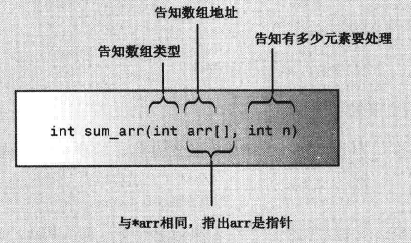
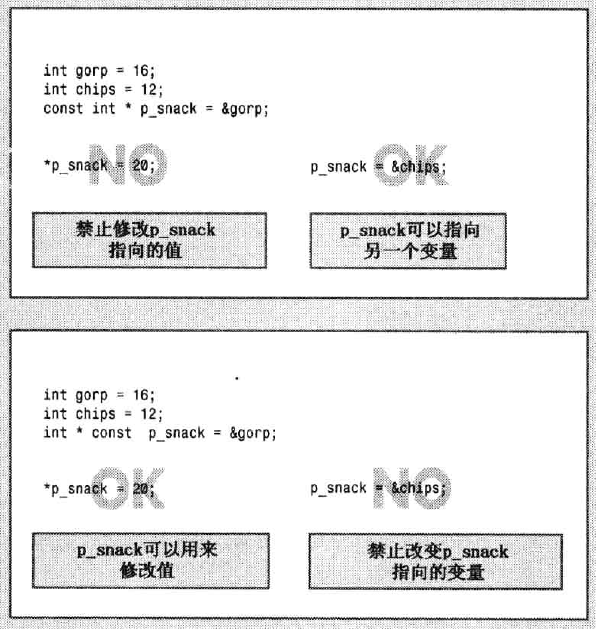

# 函数

## 函数基础知识

- 函数定义
- 函数原型（函数声明）
- 调用函数

```cpp
// calling.cpp -- defining, prototyping, and calling a function
#include <iostream>

void simple();    // function prototype 函数原型

int main()
{
    using namespace std;
    cout << "main() will call the simple() function:\n";
    simple();     // function call 函数调用
	cout << "main() is finished with the simple() function.\n";
    return 0;
}

// function definition 函数定义
void simple()
{
    using namespace std;
    cout << "I'm but a simple function.\n";
}
```

```
main() will call the simple() function:
I'm but a simple function.
main() is finished with the simple() function.
```

## 函数定义：

#### 无返回值

```cpp
void functionName(parameterList)
{
    statement(s)
    return; //可以不写return
}

//例如：
void cheers(int n)
{
    for (int i = 0; i < n; i++)
        std::cout << "Cheers!";
    std::cout << std::endl;
}
```

有返回值

```cpp
typeName functionName(parameterList)
{
    statements
    return value; //return 语句可以是常量，变量，表达式
}
```

- 返回值类型必须为typeName或者可以转换为typeName
- C++不允许直接返回数组，但是可以将数组做为结构或对象的组成部分来返回

返回值机制：

通常函数通过将返回值复制到指定的CPU寄存器或内存单元中来将其返回，随后调用程序将查看该内存单元，函数原型将返回值类型告知调用程序，并从这个位置取得返回值。

多个返回值

```cpp
int bigger(int a, int b)
{
    if (a > b)
        return a;
    else
        return b;
}
```

## 函数原型和函数调用

```cpp
// protos.cpp -- using prototypes and function calls
#include <iostream>
void cheers(int);       // prototype: no return value
double cube(double x);  // prototype: returns a double
int main()
{
    using namespace std;
    cheers(5);          // function call
    cout << "Give me a number: ";
    double side;
    cin >> side;
    double volume = cube(side);    // function call
    cout << "A " << side <<"-foot cube has a volume of ";
    cout << volume << " cubic feet.\n";
    cheers(cube(2));    // prototype protection at work
    return 0;
}

void cheers(int n)
{
    using namespace std;
    for (int i = 0; i < n; i++)
        cout << "Cheers! ";
    cout << endl;
}

double cube(double x)
{
    return x * x * x; 
}
```

### 函数原型

原型描述了函数到编译器的接口，它将函数返回值的类型以及参数的类型和数量告诉编译器

功能：

- 确保编译器能够正确处理函数的返回值
- 确保编译器能够检查使用的参数数目是否正确
- 确保编译器能够检查使用的参数类型是否正确，如果不正确，转化为正确类型（前提是该该参数能够进行转化）

```cpp
double cube(double x); //可以直接复制函数头
double cube(double); //可以去掉变量名
```

## 函数参数和按值传递

```cpp
// 函数头
double cube(double x);
//函数调用
double volume = cube(side);
```

- 用于接受传递值的变量叫形参（parameter）
- 传递给函数的值叫实参（argument）
- 函数被调用时，该函数将创建一个新的名为x的变量
- cube()执行的操作不会影响main（）中的数组，即cube（）使用的是side的副本，而不是原来的数据。
- 再函数中声明的变量和参数都是该函数私有的，即局部变量，在函数被调用时，计算机将为这些变量分配内存，函数结束时，计算机释放这些内存。

按值传递示意图：


#### 多个参数

```cpp
//函数原型
void n_chars(char c, int n);
// 函数调用
n_chars('R', 25);
```

## 函数和数组

可以将数组名作为参数传递给函数

```cpp
// 函数头实例：
int sum_arr(int arr[], int n) // arr是数组名，n为数组大小
    //方括号指出arr是一个数组，而方括号为空则表明，可以将任何长度的数组传递给该函数
    // 再函数sum_arr内可以直接把arr当作数组用
```

```cpp
// arrfun1.cpp -- functions with an array argument
#include <iostream>
const int ArSize = 8;
int sum_arr(int arr[], int n);        // prototype
int main()
{
    using namespace std;
    int cookies[ArSize] = {1,2,4,8,16,32,64,128};
    int sum = sum_arr(cookies, ArSize);
    cout << "Total cookies eaten: " << sum <<  "\n";
    return 0;
}

// return the sum of an integer array
int sum_arr(int arr[], int n)
{
    int total = 0;

    for (int i = 0; i < n; i++)
        total = total + arr[i];
    return total; 
}
```

指针和数组：

- C++将数组名解释为第一个元素的地址：`cookies == &cookies[0]`
- `&cookies` 返回整个数组的地址
- `int sum_arr(int arr[], int n)`与 `int sum_arr(int * arr, int n)`等效
- 注意仅当再函数头或函数原型中，`int *arr`和`int arr[]`含义才相同
- 在sum_arr内等效： `arr[i] == *(arr + i)`

数组作为参数的含义：

- 传递常规变量时，函数将使用该变量的拷贝（值传递）
- 传递数组时，函数将使用原来的数组（值传递）

传递数组其实也是值传递：

函数调用sum_arr(coolies, ArSize) 实际上并没有将数组内容传递给函数，而是将数组的位置（地址），包含的元素种类（类型）以及元素数目（n变量）提交给函数，函数便可以依此使用原来的数组。

> 数组的值传递要区别常规变量的值传递
>
> 数组的这种传递方式有利于节省内存空间



#### 修改数组的例子：

```cpp
void revalue(double r, double ar[], int n)
{
    for (int i = 0; i < n; i++)
        ar[i] *= r;
}
//运行完之后原组数将被修改
```


#### 使用const保护数组：

有时候函数传递数组只是为了显示数组的内容，为了避免函数无意中修改数组的内容，可以再声明形参时使用关键字const

```cpp
void show_array(const double ar[], int n);
```

- 原始数组不一定是常量，只是意味着不能通过show_array修改这些数据

#### 使用数组区间的函数：

通过传递两个指针来给函数提供所需要的信息：

- 一个指针标识数组的开头
- 一个指针表示数组的尾部

```cpp
// arrfun4.cpp -- functions with an array range
#include <iostream>
const int ArSize = 8;
int sum_arr(const int * begin, const int * end);
int main()
{
    using namespace std;
    int cookies[ArSize] = {1,2,4,8,16,32,64,128};
    
    int sum = sum_arr(cookies, cookies + ArSize);
    cout << "Total cookies eaten: " << sum <<  endl;
    sum = sum_arr(cookies, cookies + 3);        // first 3 elements
    cout << "First three eaters ate " << sum << " cookies.\n";
    sum = sum_arr(cookies + 4, cookies + 8);    // last 4 elements
    cout << "Last four eaters ate " << sum << " cookies.\n";
    return 0;
}

// return the sum of an integer array
int sum_arr(const int * begin, const int * end)
{
    const int * pt;
    int total = 0;

    for (pt = begin; pt != end; pt++)
        total = total + *pt;
    return total; 
}
```

## 指针和const

有两种不同的方式将const关键字应用于指针：

- 让指针指向一个常量对象，防止使用该指针来修改所指向的值
- 将指针本身声明为常量，防止改变指针指向的位置

将指针声明为指向常量数据的指针的原因：

- 避免无意间修改数据而导致的编程错误
- 使用const使得函数能够处理const和非const实参

指向常量的指针：

```cpp
int age = 39;
const int * pt = &age; //不能通过pt修改age的值
age = 20; //允许
int sage = 80;
pt = &sage; //允许，可更改指针的指向
//如下为操作不合法
*pt += 1; //不允许
cin >> *pt; //不允许 
```

将指针本身声明为常量：

```cpp
int sloth = 3;
int * const finger = &sloth; //指针finger只能指向sloth
```



将指针声明为指向const对象的const指针：

```cpp
double trouble = 2.3E30;
const double * const stick = &trouble;
// stick 只能指向trouble，而且stick不能用来修改trouble的值。
```

## 函数和二维数组

```cpp
//二维数组函数原型
int sum(int (*ar2)[4], int size); //函数原型
int sum(int ar2[][4], int size); //函数原型，与以上等效

//调用函数
int data[3][4] = {{1,2,3,4}, {9,8,7,6}, {2,4,6,8}};
int total = sum(data, 3);

int a[100][4];
int total1 = sum(a, 100);
int total2 = sum(a+10, 20); //计算10~30行的和
```

- data 的类型是指向由4个int组成的数组的指针
- 指针类型指定了列数为4，所以sum函数只能接受由4列组成的数组
- 参数ar2是指向数组的指针，可以再函数定义时，将ar2作为二维数组的名称使用

```cpp
ar[r][c] == *(*(ar2 + r) + c) //两者等效
    
ar2 //指向第一行包含4个int的数组
ar2 + r //指向第r 行包含4个int的数组
*(ar2 + r) // 第r行 数组的名字，指向该数组首元素
*(ar2 + r) + c // 指向第r行数组的第c的元素的地址
*(*(ar2 + r) + c) // ar2[r][c] 的值
```

## 函数和C风格字符串

因为C风格字符串是一种特殊的字符数组，所以有关数组函数的操作也适用于字符串函数：

- 将字符串作为参数时意味着传递的是地址
- 可以使用const来禁止对字符串参数进行修改

字符串作为参数传递给函数时有三种形式：（本质上传递的都是字符串第一个字符的地址）

- char数组
- 用双引号括起来的字符串常量（字符串字面值）
- 被设置为字符串的地址的char指针

```cpp
// 以strlen() 函数为例
char ghost[15] = "galloping";
char * str = "galumphing"; //str是字符串指针，指向常量字符串首字母的地址
int n1 = strlen(ghost); // 传递数组名，等效于 &gost[0]
int n2 = strlen(str); // 传递char指针
int n3 = strlen("gamboling"); //字符串字面值，即地址
```

> C风格字符串以空字符结尾，所以不需要向函数传递长度

实例1：

```cpp
// strgfun.cpp -- functions with a string argument
#include <iostream>
unsigned int c_in_str(const char * str, char ch);
int main()
{
    using namespace std;
    char mmm[15] = "minimum";    // string in an array

    char *wail = "ululate";    // wail points to string

    unsigned int ms = c_in_str(mmm, 'm');
    unsigned int us = c_in_str(wail, 'u');
    cout << ms << " m characters in " << mmm << endl;
    cout << us << " u characters in " << wail << endl;
    return 0;
}

// 或者 unsigned int c_in_str(const char str[], char ch) 
unsigned int c_in_str(const char * str, char ch) 
{
    unsigned int count = 0;

    while (*str)        // quit when *str is '\0'
    {
        if (*str == ch)
            count++;
        str++;        // move pointer to next char
    }
    return count; 
}
```

实例2：返回C风格字符串

函数无法返回一个字符串，但是可以返回字符串的地址。

```cpp
// strgback.cpp -- a function that returns a pointer to char
#include <iostream>
char * buildstr(char c, int n);     // prototype
int main()
{
    using namespace std;
    int times = 46;
    char ch = 'V';

    char *ps = buildstr(ch, times);
    cout << ps << endl;
    delete [] ps;                   // free memory
    ps = buildstr('+', 20);         // reuse pointer
    cout << ps << "-DONE-" << ps << endl;
    delete [] ps;                   // free memory
    return 0;
}

// builds string made of n c characters
char * buildstr(char c, int n)
{
    char * pstr = new char[n + 1];
    pstr[n] = '\0';         // terminate string
    while (n-- > 0)
        pstr[n] = c;        // fill rest of string
    return pstr; 
}
```

```
VVVVVVVVVVVVVVVVVVVVVVVVVVVVVVVVVVVVVVVVVVVVVV
++++++++++++++++++++-DONE-++++++++++++++++++++
```

- 包含n个字符的字符串需要n+1个字符空间
- `n-- >0` 先比较是否大于零，再将其递减
- 数组指针变量pstr 作用域在buildstr函数内，函数结束后，pstr使用的内存将被释放，但指向的字符串将保留，因此程序仍然可以通过main（）中的指针ps来访问该字符串。
- 使用new申请的内存空间需要手动使用delete释放。

## 函数和结构

使用结构编程时，最直接的方式就像处理基本类型那样来处理结构，也就是说将结构作为参数传递，也可以将结构作为返回值使用。默认采用值传递。

按值传递结构有一个缺点，增大内存占用和降低程序运行速度，所以可以采用按引用传递（后续有详解）

实例：

```cpp
// travel.cpp -- using structures with functions
#include <iostream>
struct travel_time
{
    int hours;
    int mins;
};
const int Mins_per_hr = 60;

travel_time sum(travel_time t1, travel_time t2);
void show_time(travel_time t);

int main()
{
    using namespace std;
    travel_time day1 = {5, 45};    // 5 hrs, 45 min
    travel_time day2 = {4, 55};    // 4 hrs, 55 min

    travel_time trip = sum(day1, day2);
    cout << "Two-day total: ";
    show_time(trip);

    travel_time day3= {4, 32};
    cout << "Three-day total: ";
    show_time(sum(trip, day3));
    return 0;
}

travel_time sum(travel_time t1, travel_time t2)
{
    travel_time total;

    total.mins = (t1.mins + t2.mins) % Mins_per_hr;
    total.hours = t1.hours + t2.hours +
                 (t1.mins + t2.mins) / Mins_per_hr;
    return total;
}

void show_time(travel_time t)
{
    using namespace std;
    cout << t.hours << " hours, "
         << t.mins << " minutes\n";
}
```

### 传递结构的地址

传递结构的地址，可以直接修改被传递的结构，以节省时间和内存空间

```cpp
//结构定义：
// structure templates
struct polar
{
    double distance;      // distance from origin
    double angle;         // direction from origin
};
struct rect
{
    double x;             // horizontal distance from origin
    double y;             // vertical distance from origin
};

//函数原型
// prototypes
void rect_to_polar(const rect * pxy, polar * pda);
void show_polar (const polar * pda);

// 使用结构
int main()
{
    using namespace std;
    rect rplace = {30, 40};
    polar pplace;
    rect_to_polar(&rplace, &pplace);    // pass addresses
    show_polar(&pplace);        // pass address
    cout << "Done.\n";
    return 0;
}
// 函数定义
// show polar coordinates, converting angle to degrees
void show_polar (const polar * pda)
{
    using namespace std;
    const double Rad_to_deg = 57.29577951;

    cout << "distance = " << pda->distance;
    cout << ", angle = " << pda->angle * Rad_to_deg;
    cout << " degrees\n";
}
// convert rectangular to polar coordinates
void rect_to_polar(const rect * pxy, polar * pda)
{
    using namespace std;
    pda->distance =
        sqrt(pxy->x * pxy->x + pxy->y * pxy->y);
    pda->angle = atan2(pxy->y, pxy->x); 
}
```

```
distance = 50, angle = 53.1301 degrees
Done.
```

## 函数和string对象

string对象在函数方面的应用与结构很相似。

略

## 函数与array对象

略

## 递归

C++函数可以调用自己，这种功能被称为递归

一个典型的形式：

```cpp
void recurs(argumentlist)
{
    statements1
    if (test)
        recurs(arguments)
    statements2
}
```

实例：

```cpp
// recur.cpp -- using recursion
#include <iostream>
void countdown(int n);

int main()
{
    countdown(4);           // call the recursive function
    return 0;
}

void countdown(int n)
{
    using namespace std;
    cout << "Counting down ... " << n << endl;
    if (n > 0)
        countdown(n-1);     // function calls itself
    cout << n << ": Kaboom!\n";
}
```

```
Counting down ... 4
Counting down ... 3
Counting down ... 2
Counting down ... 1
Counting down ... 0
0: Kaboom!
1: Kaboom!
2: Kaboom!
3: Kaboom!
4: Kaboom!
```

## 函数指针

与数据相似，函数也有地址。函数地址是存储其机器语言代码的内存的开始地址。

略。

