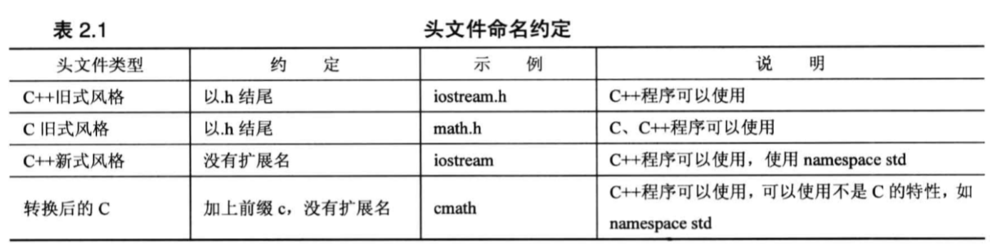
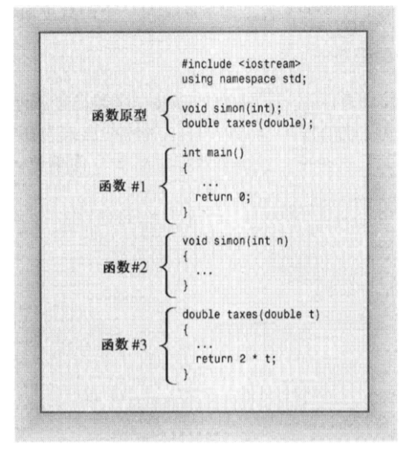

## 第一个c++ 程序

```cpp
// 第一个c++程序
#include <iostream>

int main()
{
	using namespace std;
	cout << "hello world.";
	cout << endl;

	return 0;
}
```

使用g++ 编译：
```shell
# cd 到文件目录
$ g++ main.cpp
```
运行：
```shell
$ a.exe
# 或者
$ a
```
- 无参数传递时，c++ 习惯使用 int main（），而不用 int main(void)，这样写并没有错误，只是不符合习惯。

- `""` 双引号为字符串

- `endl`表示重起一行，`/n` 换行符为旧式方法，区别在于，endl能确保程序继续向下运行前刷新输出，将内容显示在屏幕上。

- #include 编译指令使iostream文件的内容随源代码文件的内容一起被发送给编译器，实际上，iostream 文件内的内容将替换程序中的代码行#include<iostream>。

- 头文件：
C语言传统使用 .h 为拓展名的头文件，老标准C++也是用.h 为头文件拓展名，新C++ 头文件无拓展名，C++也可以使用.h 头文件。



> C++编译器标准组件都被放置在命名空间std中。只有不带.h 的头文件才可能具有命名空间

- 命名空间namespace ：
举例： 有两个封装好的产品，都包含一个wanda()函数，使用命名空间来区别两个函数
	- Microflop::wanda()
	- Piscine::wanda()

- cout 实际是std::cout

## 第二个程序
```cpp
//uses and displays a variable
#include <iostream>

int main()
{
	using namespace std;

	int carrots;
	carrots = 25;
	cout << "I have ";
	cout << carrots;
	cout << " carrots.";
	cout << endl;
	carrots = carrots - 1;
	cout << "Now I have " << carrots << " carrots." <<endl;

	return 0;
}
```
- 变量声明：`int carrots;`
	- 第一指出程序需要足够的存储空间来储存一个整数，编译器负责分配和标记内存的细节。
	- 第二给存储单元指定名称，此后程序将使用名称carrots来标识存储在该内存单元的值。

- C++中所有变量都必须声明
- 赋值语句:复制语句将值给存储单元
- cout 与printf()
	- printf() 为c语言的打印函数
	- cout能够自动识别类型，另外cout是可以拓展的，比如可以重新定义<< 运算符，使cout能够识别和显示所开发的新数据类型。
	
- cout与cin
	cout与cin分别使istream 和 ostream类的实例，这两个类在iostream文件中定义的。

## cin
```cpp
//uses and displays a variable
#include <iostream>

int main()
{
	using namespace std;

	int carrots;
	cout << "How many carrots do you have? " << endl;
	cin >> carrots;
	cout << "Here are two more. ";
	carrots = carrots + 2;
	cout << "Now I have " << carrots << " carrots." <<endl;

	return 0;
}
```
> 有IDE中需要在cin前后各添加一个cin.get()。
- Cin 也是一个智能对象，能判断carrots的类型

## 使用库函数
```cpp
// sqrt.cpp -- using the sqrt() function
#include <iostream>
#include <cmath> //or math.h

int main()
{
	using namespace std;

	double area;
	cout << "Enter the area: ";
	cin >> area;
	double side;
	side = sqrt(area);
	cout << "That is the equivalent of a square " << side
			<< " feet to the side. " << endl;
	cout << "fascinating!" << endl;

	return 0;
}
```
- C++ 库函数存储在库文件中。如果使用需要include

## 定义无返回值函数
```cpp
// curfunc.cpp -- defining your own function

#include <iostream>
void simon(int);

int main()
{
	using namespace std;
	simon(3);
	cout << "Pich an integer: ";
	int count;
	cin >> count;
	simon(count);
	cout << "Done! " <<endl;

	return 0;
}

void simon(int n)
{
	using namespace std;
	cout << "Simon says touch your toes " << n << " times." << endl;
}
```
- 函数格式：
```
type functionname(argumentlist)
{
	statements
}
```

- 函数头：
```
void simon(int n)
```
> 开头void表明simon()没有返回值

- C++ 不允许将函数定义嵌套在另一个函数定义中，每个函数都是独立的。



- 函数原型：声明函数的返回类型，说明函数接收的参数数量和类型

### main函数返回值问题
`int mai() `开头为`int`，`main（）`返回一个整数值，空括号表明没有参数， `return 0` 来提供返回值。

`main（）`函数的返回值并不是返回给程序的其他部分，而是返回给操作系统，因为`main（）`函数被计算机操作系统调用，操作系统可以看作调用程序。
操作系统调用程序并测试他们的返回值时(通常叫做退出值)，通常约定退出值为0意味着程序运行成功，非零意味着存在问题。

## 定义有返回值的函数
```cpp
// convert.cpp -- converts stone to pounds

#include <iostream>

int stonetolb(int);

int main()
{
	using namespace std;
	int stone;
	cout << "Enter the weight in stone: ";
	cin >> stone;
	int pounds = stonetolb(stone);
	cout << stone << " stone = ";
	cout << pounds << " pounds. " << endl;
	
	return 0;
} 

int stonetolb(int sts)
{
	return 14 * sts;
}
```

可以使用如下形式调用有返回值函数：
```cpp
int aunt = stonetolb(20);
int aunts = aunt + stonetolb(10);
```

## 在多函数程序中使用using编译命令
将using namespace 放在两个函数之前，就可以使两个函数都能够访问命名空间std。

```cpp
// curfunc.cpp -- defining your own function

#include <iostream>
using namespace std; //affects all function definitions in this file
void simon(int);

int main()
{
	simon(3);
	cout << "Pich an integer: ";
	int count;
	cin >> count;
	simon(count);
	cout << "Done! " <<endl;

	return 0;
}

void simon(int n)
{
	cout << "Simon says touch your toes " << n << " times." << endl;
}
```

使用命名空间的四种方式：
- 直接使用全名如： `std::cout << "hello world";`
- 使用 `using namespace std；`放在函数定义之前，让文件中的所有函数都能使用命名空间std中所有的元素
- 使用 `using namespace std；`放在特定函数中，让该函数能够使用命名空间std中的所有元素
- 使用：`using std::cout;` ` using std::endl;` 让函数能后使用指定元素如`cout` `endl`: `cout << "hello world";`

## 补充

C++程序的模块叫作函数
