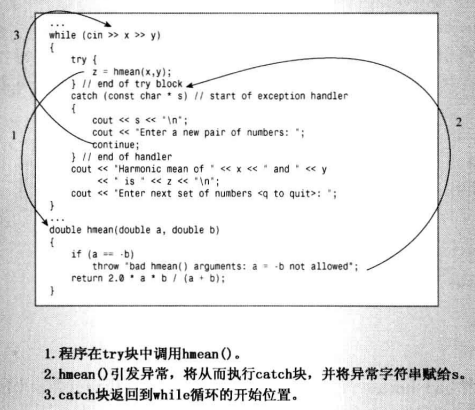

## 异常

程序有时候在运行阶段出现错误，导致程序无法正常运行下去。

比如计算公式：`2*X*Y / (X+Y)` ,当 X+Y的值为零时，程序就会出现问题。

主流编译器会生成一个特殊字符来处理这种情况，结果为`inf`; 但有的编译器没有这个功能，此时程序遇到这种情况就会崩溃。

所以需要采取一定的措施，如：

- 调用abort（）
- 手动返回错误码
- 使用异常处理机制

### 调用abort()

如果 X+Y等于零时，调用`abort()` 函数，该函数的作用是向标准错误流发送消息“程序异常终止“（abnormal program termination），然后终止程序。它还返回一个随实现而异的值，告诉操作系统或父进程，处理失败。

例程：

```cpp
#include <iostream>
#include <cstdlib>
double hmean(double a, double b);

int main()
{
    double x, y, z;
    x = 10;
    y = -10;
    z = hmean(x,y);
	std::cout << "z: " << z << std::endl;
    return 0;
}

double hmean(double a, double b)
{
    if (a == -b)
    {
        std::cout << "untenable arguments to hmean()\n";
        std::abort(); // 用于终止程序
    }
    return 2.0 * a * b / (a + b);
}
```

结果：

```
untenable arguments to hmean()
Process finished with exit code 134 (interrupted by signal 6: SIGABRT)
```

如果不使用abort函数的运行结果为：

```
untenable arguments to hmean()
z: -inf
Process finished with exit code 0
```

### 手动返回错误码

该方法就是将`hmean`函数的返回值定义为`bool`，让返回值指出程序运行成功还是失败了。

```cpp
#include <iostream>
#include <cfloat>  // (or float.h) for DBL_MAX

bool hmean(double a, double b, double * ans);

int main()
{
    double x, y, z;
    x = 10;
    y = -10;
    if (hmean(x,y,&z))
        std::cout << 'z: ' << z << std::endl;
    else
        std::cout << "error z: " << z << std::endl;
    return 0;
}

bool hmean(double a, double b, double * ans)
{
    if (a == -b)
    {
        *ans = DBL_MAX;
        return false;
    }
    else
    {
        *ans = 2.0 * a * b / (a + b);
        return true;
    }
}
```

结果：

```
error z: 1.79769e+308
```

### 异常机制

异常机制提供了将控制权从程序的一个部分传递给另一个部分的途径。

异常机制有三个组成部分：

- 引发异常
- 使用处理程序捕捉异常
- 使用try块

异常机制使用：

-  定义一个throw，用于抛出定义的异常(异常的类型可以是字符串或其他C++类型)

- 将包含throw的语句放到try包含的块内

- 定义catch块，即异常处理程序

  出现异常时，throw将抛出定义的类型，catch捕获异常，然后处理。

例程：

```cpp
#include <iostream>
double hmean(double a, double b);

int main()
{
    double x, y, z;

    std::cout << "Enter two numbers: ";
    while (std::cin >> x >> y)
    {
        try {                   // try 块开始
            z = hmean(x,y);
        }                       // try 块结束
        catch (const char * s)  // 异常处理函数
        {
            std::cout << s << std::endl;
            std::cout << "输入一对数: ";
            continue;
        }
        std::cout << "结果为： "<< z << std::endl;
        std::cout << "输入下一对数 <q to quit>: ";
    }
    std::cout << "Bye!\n";
    return 0;
}

double hmean(double a, double b)
{
    if (a == -b)
        throw "参数不合法: a = -b ";
    return 2.0 * a * b / (a + b);
}
```

结果为：

```
Enter two numbers: 10 -10
参数不合法: a = -b 
```

- 上例中被引发的异常是字符串` "参数不合法: a = -b "` 。
- 如果只定义了try块，而没有匹配的catch处理程序，在默认情况下程序最终将调用`abort()`函数，但可以修改此行为。
- 

### 将对象用作异常类型

通常情况下引发异常的函数将传递一个对象。传递对象的优点：

- 可以使用不同的异常类型来区分不同的函数在不同情况下引发的异常
- 对象可以携带信息，程序员可以根据这些信息来确定引发异常的原因
- catch块可以根据这些信息来决定采取什么样的措施

例如，针对上面问题设计一个可以用来传递的对象：

```cpp
class bad_hmean
{
private:
    double v1;
    double v2;
public:
    bad_hmean(double a = 0, double b = 0) : v1(a), v2(b){}
    void mesg();
};

inline void bad_hmean::mesg()
{   
    std::cout << "hmean(" << v1 << ", " << v2 <<"): "
              << "invalid arguments: a = -b\n";
}
```

在`throw`语句中使用`bad_hmean`对象：

```cpp
if(a == -b)
    throw bad_hmean(a,b);
```

- 代码将调用构造函数`bad_hmean()`,以初始化对象，使其存储参数值。

在catch语句中使用`bad_hmean`对象：

```cpp
catch (bad_hmean & bg)
{
    bg.mesg();
    cout << "Try again.\n";
    continue;
} 
```

例程：

- 定义了两个异常类
- 定以了两个处理函数

exc_mean.h

```cpp
// exc_mean.h
#include <iostream>

class bad_hmean
{
private:
    double v1;
    double v2;
public:
    bad_hmean(double a = 0, double b = 0) : v1(a), v2(b){}
    void mesg();
};

inline void bad_hmean::mesg()
{   
    std::cout << "hmean(" << v1 << ", " << v2 <<"): "
              << "invalid arguments: a = -b\n";
}

class bad_gmean
{
public:
    double v1;
    double v2;
    bad_gmean(double a = 0, double b = 0) : v1(a), v2(b){}
    const char * mesg();
};

inline const char * bad_gmean::mesg()
{  
    return "gmean() arguments should be >= 0\n";
}
```

error4.cpp

```cpp
//error4.cpp
#include <iostream>
#include <cmath> // or math.h, unix users may need -lm flag
#include "exc_mean.h"
double hmean(double a, double b);
double gmean(double a, double b);
int main()
{
    using std::cout;
    using std::cin;
    using std::endl;
    
    double x, y, z;

    cout << "Enter two numbers: ";
    while (cin >> x >> y)
    {
        try {                  // start of try block
            z = hmean(x,y);
            cout << "Harmonic mean of " << x << " and " << y
                << " is " << z << endl;
            cout << "Geometric mean of " << x << " and " << y
                << " is " << gmean(x,y) << endl;
            // 注意如果gmean函数抛出异常，则上面语句不会打印东西
            cout << "Enter next set of numbers <q to quit>: ";
        }// end of try block
        catch (bad_hmean & bg)    // start of catch block
        {
            bg.mesg();
            cout << "Try again.\n";
            continue;
        }                  
        catch (bad_gmean & hg) 
        {
            cout << hg.mesg();
            cout << "Values used: " << hg.v1 << ", " 
                 << hg.v2 << endl;
            cout << "Sorry, you don't get to play any more.\n";
            break;
        } // end of catch block
    }
    cout << "Bye!\n";
    return 0;
}

double hmean(double a, double b)
{
    if (a == -b)
        throw bad_hmean(a,b);
    return 2.0 * a * b / (a + b);
}

double gmean(double a, double b)
{
    if (a < 0 || b < 0)
        throw bad_gmean(a,b);
    return std::sqrt(a * b); 
}
```

```
Enter two numbers: 10 -10
hmean(10, -10): invalid arguments: a = -b
Try again.
-10 -10
Harmonic mean of -10 and -10 is -10
gmean() arguments should be >= 0
Values used: -10, -10
Sorry, you don't get to play any more.
Bye!
```

### 栈解退


## RTTI 运行阶段类型识别

