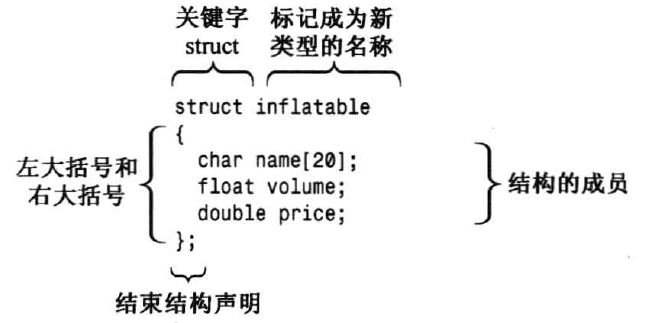
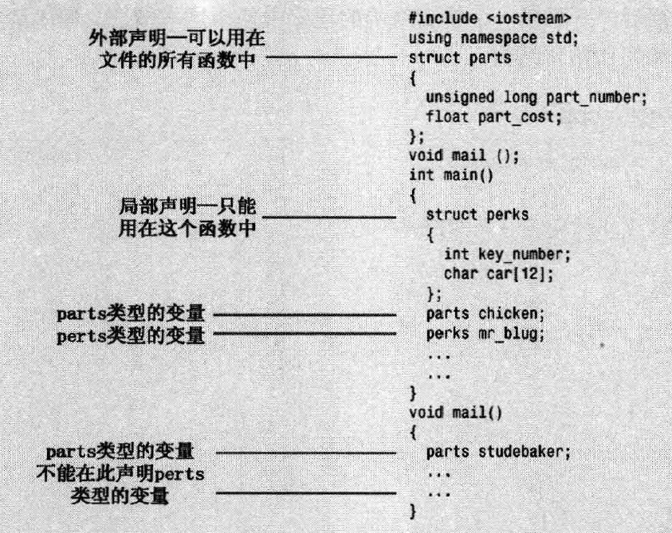

# 结构struct

结构是一种比数组更灵活的**数据格式**，同一个结构可以存储多种类型的数据。

创建结构分两步：
- 定义结构描述：描述并标记能够存储在结构中的各种数据类型
- 按照描述创建结构体

例：
```cpp
struct inflatable //structure declaration
{
  char name[20];
  float volume;
  double price;
};
```


- inflatble为标识符，是这种新数据格式的名称
- 定义了三个成员

使用上面定义的数据格式：
```cpp
inflatable hat; //定义inflatable类型的变量hat
inflatable woopie_cusion; //
inflatable mainframe; //

struct inflatable goose; //可以加关键字struct，也可以不加
```

struct成员访问：

使用 `.` 运算符访问成员，如 hat.volume 指结构的volume成员

## 在程序中使用结构
```cpp
// structur.cpp -- a simple structure
#include <iostream>
struct inflatable   // structure declaration
{
    char name[20];
    float volume;
    double price;
};

int main()
{
    using namespace std;
    inflatable guest =
    {
        "Glorious Gloria",  // name value
        1.88,               // volume value
        29.99               // price value
    };  // guest is a structure variable of type inflatable
// 初始化，注意使用逗号隔开，可以不换行。
    inflatable pal =
    {
        "Audacious Arthur",
        3.12,
        32.99
    };  // pal is a second variable of type inflatable
    cout << "Expand your guest list with " << guest.name;
    cout << " and " << pal.name << "!\n";
// pal.name is the name member of the pal variable
    cout << "You can have both for $";
    cout << guest.price + pal.price << "!\n";
    return 0; 
}
```
结果：
```
Length of string in charr before input: 3
Length of string in str before input: 0
```

### 结构体声明
在同一个文件中，结构体的声明有2种选择：
- 将声明放在main（）函数中，紧跟在开始括号后面
- 将声明放在main（）函数前面，这种方式叫做外部声明

> 通常应该使用外部声明



### C++11 结构体初始化
同数组一样，C++11也支持将列表初始化用于结构，且等号是可选的
> 不允许缩窄

```cpp
inflatable duch {"Daphe", 0.12, 9.98}; 

//将成员穿不设为零
inflatable mayor {}；
```

### 结构体其他属性
- 可以将结构体作为参数传递给函数
- 可以让函数返回一个结构
- （成员赋值）可以使用赋值运算符（=）将结构赋给另一个**同类型**的结构，元素将一一对应

## 结构数组
infatable 结构包含一个数组（name）。也可以创建元素为结构的数组，方法和创建基本类型完全相同

如：创建一个包含100个inflatable结构的数组：
```cpp
inflatable gifts[100]; 

```
> 结构数组gifts每个元素（从gift[0]到gift[99]）都是inflatable对象。

```cpp
cin >> gifts[0].volume;
cout << gifts[99].price << endl;

//初始化结构数组
infatable guests[2] = 
{
  {"Bambi", 0.5, 21.99}, //第一个结构
  {"Godzilla", 2000, 565.99} //第二个结构
};
```

## 结构中的位字段
与C语言一样，C++ 允许指定占用特定位数的结构成员，这使得创建与某个硬件设备上的寄存器对应的数据结构非常方便。

如：
```cpp
struct torgle_register
{
  unsigned int SN : 4; //4bits 给 SN的值
  unsigned int : 4; //4bits 空着不用
  bool goodIn : 1; // 1bits 给googIn
  bool goodTorgle : 1; // 1bits 给googTorgle
}

torgle_register tr = {14, true, false};
....
if (tr.goodIn)
....
```

# 共用体union
共用体也是是一种数据格式，它能够存储不同的数据类型，但是只能同时存储其中的一种类型。

例如：
```cpp
union one4all
{
  int int_val;
  long long_val;
  double double_val;
};

//使用方法：
one4all pail;
pail.int_val = 15; //存储 一个整型
cout << pail.int_val;
pail.double_val = 1.38; //存储一个double，但是之前的int被清空
cout << pail.double_val;
```

因此，pail有时可以是int变量，有时可以是double变量。 由于共用体每次只能存储一个值，所以它必须有足够的空间来存储最大的成员，即共用体长度为其最大成员的长度。

> 共用体通常用于节省内存，这对于嵌入式系统意义很大。

# 枚举enum
c++的enum工具提供了另一种创建符号常量的方式，这种方式可以代替const。enum允许定义新类型。使用enum的句法与使用结构相似。

定义默认枚举类型：

```cpp
enum spectrum {red,  orange, yellow, green, blue, violet, indigo, ultraviolet};
// 默认情况下，将整数赋给枚举量，从0开始。
// 含义 相当于定义了一系列符号常量 red = 0， orange = 1 等
```

- spectrum被称为枚举，是新类型的名称。
- 将red，orange等作为符号常量，它们对应整数值0~7，这些常量叫作枚举量。

使用枚举名声明定义的枚举类型的变量：

```cpp
spectrum band; //band的类型为 spectrum
//band的取值只能在spectrum范围内
band = blue;  // band = 4
band = 2000; //错误
```

枚举只定义了赋值运算：

```cpp
band = orange; //band = 1
```

枚举量是整型，可被提升为int类型，但int类型不能自动转换为枚举类型。

```cpp
int color = blue;
color = 3 + red; // color = 3 //red 被自动转换为int再进行加法运算
```

可以同强制类型转换使赋值给枚举变量的int值有效：

```cpp
band = spectrum(3); //等效于 band = green
```

如果打算只使用常量，而不创建枚举类型的变量，则可以省略枚举类型的名称：

```cpp
enum {red,  orange, yellow, green, blue, violet, indigo, ultraviolet};
//此时就可以使用red,oringe 等对应的值。
int a = orange; // a = 1
```

示例：

```cpp
#include <iostream>

enum spectrum {red,  orange, yellow, green, blue, violet, indigo, ultraviolet};
enum {convar1, convar2, convar3};

int main()
{
	using namespace std;
	spectrum band;
	band = blue;
	cout << "band = "<< band << endl;
	band = orange;
	cout << "band = "<< band << endl;

	int color = blue;
	color = 3 + red;
	cout << "color = "<< color << endl;

	band = spectrum(3);
	cout << "band = "<< band << endl;

	int a = convar2;
	cout << "a = " << a << endl;

	return 0;
}
```

```
band = 4
band = 1
color = 3
band = 3
a = 1
```

## 设置枚举量的值

```cpp
enum bits{one = 1, two = 2, four = 4, eight = 8};
enum bigstep{first, second = 100, third}; //first默认值为0，third默认值为101
enum {zero, null = 0, one, numero = 1}; //zero和null为0，one和numero为1
```

## 枚举的取值范围：

每个枚举都有取值范围，通过强制类型转换，可以将取值范围中的任何整数值赋给枚举变量，即使这个值不是枚举值。

取值范围计算：

- 上限：大于最大值2的幂的最小取值减1
- 下限：
  - 不小于零 则下限为0
  - 方法同上限，然后加负号

```cpp
enum bits{one = 1, two = 2, four = 4, eight = 8}; 
bits myflag;
myflag = bits(6); //myflag = 6 //6属于取值范围
```


