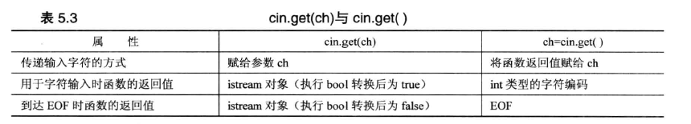

# 表达式和语句

表达式：

- 表示式由一个或多个运算对象组成，对表达式求值将得到一个结果。
- 字面值和变量是最简单的表达式，其结果就是字面值和变量的值。
- 把一个运算符和一个或多个运算对象组合起来可以生成较为复杂的表达式

语句：

- 空语句
  - ` ;//空语句`
- 简单语句
  - C++ 语言中的大多数语句都以分号结束
  - 一个表示式末尾加上一个分号就变成了表示式语句，如`ival + 5`
  - 任何一个表达式加上分号都是语句，反过来就不对，如返回语句，声明语句
  - 表达式语句的作用是执行表达式并丢弃求值结果
- 复合语句（块）
  - 复合语句是指用括号括起来的（可能为空的）语句和声明的序列，也被称为块
  - 一个块就是一个作用域
  - 空块等价于空语句

举例：

表达式：`x = 20` 由两个值和一个赋值运算符组成，C++将赋值表达式的值定义为左侧成员的值，因此这个表达式的值为20。

语句：`maids = (cooks = 4) + 3` 表达式cooks = 4 的值为4，因此maids的值为7. 

# for 循环

```cpp
// forloop.cpp -- introducing the for loop
#include <iostream>
int main()
{
    using namespace std;
    int i;  // create a counter
//   initialize; test ; update
    for (i = 0; i < 5; i++)
        cout << "C++ knows loops.\n";
    cout << "C++ knows when to stop.\n";
    return 0;
}
```

> 只有一条语句时可以不使用块{}
>
> i 的作用域不只在for循环内，如果想限定i作用域只在for循环体内可以使用这种声明方式：`for (int i = 0; i < 5; i++)`

一般形式：

```cpp
for (initialization; test-expression; update-expression)
    statement

//或
for (expression; expression; expression)
    statement
```

- for括号内包含三个表达式
- initialization,循环只执行一次初始化
- test-expression: 决定循环体是否被执行，这里可以使任意表达式，C++将表达式结果强制转换为bool类型。
- update-expression：在每轮循环结束时执行，即循环体已经执行完毕时； 可以是任何有效的C++表达式


### for循环实例1：

```cpp
// formore.cpp -- more looping with for
#include <iostream>
const int ArSize = 16;      // example of external declaration
int main()
{
    long long factorials[ArSize];
    factorials[1] = factorials[0] = 1LL;
    for (int i = 2; i < ArSize; i++)
        factorials[i] = i * factorials[i-1];
    for (int i = 0; i < ArSize; i++)
        std::cout << i << "! = " << factorials[i] << std::endl;
    return 0;
}
```

```cpp
0! = 1
1! = 1
2! = 2
...
14! = 87178291200
15! = 1307674368000
```

> 程序在main（）的外面声明了const int 变量 ArSize。这样可以使ArSize成为外部数据，它在整个程序周期内都存在，程序文件中所有的函数都可以使用它。

### for循环访问数组

```cpp
// forstr1.cpp -- using for with a string
#include <iostream>
#include <string>
int main()
{
    using namespace std;
    cout << "Enter a word: ";
    string word;
    cin >> word;

    // display letters in reverse order
    for (int i = word.size() - 1; i >= 0; i--)
        cout << word[i];
    cout << "\nBye.\n";
    return 0; 
}
```

```
Enter a word: Hello
olleH
Bye.
```

## 递增运算符（++）和递减运算符（--）

- 前缀，如++x，先将b的值加1，然后使用新的值来计算表达式
- 后缀，如x++，使用x的当前值计算表达式，然后将x的值加1

```cpp
int x = 5;
int y = ++x;  //先计算x，再赋值给y
			// y = 6, x=6
int z = 5;
int y = z++; //先赋值，再改变z的值
			// y=5,z=6
```

## 副作用和顺序点

副作用指的是在计算表达式时，对某些东西（如存储在变量中的值）进行了修改。

顺序点是程序执行过程中的一个点，在这里，进入下一步之前将确保对所有的副作用都进行了评估。 语句中的分号就是一个顺序点，这意味着程序处理下一条语句之前，赋值运算符，递增运算符和递减运算符执行的所有修改都必须完成。任何完整的表达式末尾都是一个顺序点。

例如：`y = (4 + x++) + (6 + x++);`,此处分号标记了顺序点，C++不能保障x的值在计算子表达式`4 + x++`后立刻加1，所以这个赋值语句含义不明确。

在for循环中：

`for (n = lin; n>0; --n)` 与 `for (n = lin; n>0; n--)` 效果相同

## 递增/递减运算符和指针

- 递增和递减运算符可用于指针
- 前缀递增，前缀递减和解引用运算符优先级相同，以从右向左方式进行结合
  - `*++pt` : ++先将应用于pt，然后再是`*`
- 后缀递增和后缀递减优先级相同，比前缀优先级高，以从左到右的方式结合

```cpp
double arr[5] = {21.1, 32.8, 23.4, 45.2, 37.4};
double *pt = arr; //pt 指向arr[0]
++pt; // pt 指向arr[1]
double x = *++pt; // 此时x=23.4
++*pt; //此时arr[2]=24.4
(*pt)++; // 此时arr[2]=25.4,pt仍指向arr[2]
x= *pt++; // ++运算符是对指针递增，然而后缀运算符意味着将对原来的地址而不是新增后的新地址解除引用，因此x=25.4，但该语句执行完毕后，pt的值将为arr[3]的地址。
```

## 组合赋值运算符

```cpp
i += by; //等价于 i = i + by; 

int k = 5;
k += 3 // k =8
int *pa = new int[10];
pa[4] = 12;
pa[4] += 6; // p[4] =18
*(pa + 4) += 7; //p[4] = 25
pa += 2; //pa指向pa[2]
```


## 复合语句（块/语句块）

```cpp
// block.cpp -- use a block statement
#include <iostream>
int main()
{
    using namespace std;
    cout << "Please enter five values:\n";
    double number;
    double sum = 0.0;
    for (int i = 1; i <= 5; i++)
    {                                   // block starts here
        cout << "Value " << i << ": ";
        cin >> number;
        sum += number;
    }                                   // block ends here
    cout << "They sum to " << sum << endl;
    cout << "and average to " << sum / 5 << ".\n";
    return 0; 
}
```

```
Please enter five values:
Value 1: 1942
Value 2: 1948
Value 3: 1957
Value 4: 1974
Value 5: 1980
They sum to 9801
and average to 1960.2.
```

> 如果在语句块中定义一个新的变量，则仅当程序执行该语句块中语句时，该变量才存在，执行完该语句块后，变量将被释放。如这里的number变量。

```cpp
# include <iostream>
int main()
{
    using std::cout;
    using std::endl;
    int x = 20;
    {
        cout << x << endl; //使用x=20
        int x = 100; //定义新的x
        cout << x << endl; //使用新的x=100，原来的x被隐藏
    }
    cout << x <<endl; //使用x=20 的x
    return 0;
}
```

## 逗号运算符

逗号运算符允许将两个表达式放到C++句法只允许放一个表达式的地方。

```cpp
// forstr2.cpp -- reversing an array
#include <iostream>
#include <string>
int main()
{
    using namespace std;
    cout << "Enter a word: ";
    string word;
    cin >> word;

    char temp;
    int i, j;
    for (j = 0, i = word.size() - 1; j < i; --i, ++j)
    {                       // start block
        temp = word[i];
        word[i] = word[j];
        word[j] = temp;
    }                       // end block
    cout << word << "\nDone\n";
    return 0; 
}
```

```
Enter a word: Hello
olleH
Done
```

> 注意不能在for()小括号内用逗号运算符将两个声明组合起来，所以在外部进行了声明。

逗号不是运算符而是分隔符时，如：`int i, j;` 同时声明 i 和 j 。

## 关系运算符


## C风格字符串的比较

C风格字符串无法使用关系运算符进行比较，原因是C++将C风格字符串视为地址。

使用strcmp() 函数进行比较：

- 接受两个字符串地址为参数（可以是指针，字符串常量，字符数组名）
- 字符串相同返回零
- 第一个字符串按照编码顺序排在字符串之前，返回负数
- 第一个字符串按照编码顺序排在第二个字符串之后，返回正数

## string类的字符串的比较

string类重载了关系运算符

要求：至少有一个操作数是string对象，另一个操作数可以是string对象，也可以是C风格字符串。

```cpp
string word = "?ate";
word != "mate"; 
```

# while循环

while循环只有测试条件和循环体：

```cpp
while (test-condition)
    body
```


```cpp
// while.cpp -- introducing the while loop
#include <iostream>
const int ArSize = 20;
int main()
{
    using namespace std;
    char name[ArSize];

    cout << "Your first name, please: ";
    cin >> name;
    cout << "Here is your name, verticalized and ASCIIized:\n";
    int i = 0;                  // start at beginning of string
    while (name[i] != '\0')     // 等效于 while (name[i])
    {
        cout << name[i] << ": " << int(name[i]) << endl;
        i++;                    // don't forget this step
    }
    return 0; 
}
```

### for与while的等效形式

for 循环与while循环几乎等效，但使用习惯不同

- for循环来为循环计数
- 无法预先知道循环执行次数通常使用while循环

```cpp
for (init-expression; test-expression; update-expression)
{
    statement(s)
}

// 等效于
init-expression;
while (test-expresiion)
{
    statement(s)
    update-expression;
}
```

```cpp
while(test-expresion)
    body

//等效于
for ( ; test-expression; )
    body
```

```cpp
// 如果for的（）内都是空表示是，则for循环一直执行
for ( ; ; )
    body
```

### clock（） 延时函数

clock（） 函数：

- 头文件ctime中被定义
- clock() 返回当前系统时间
-  符号常量 CLOCKS_PER_SEC 在ctime被定义
- clock（）返回值 除以 符号常量 CLOCKS_PER_SEC 得到秒数
- ctime将clock_t 作为clock（）返回值类型的别名

```cpp
// waiting.cpp -- using clock() in a time-delay loop
#include <iostream>
#include <ctime> // describes clock() function, clock_t type
int main()
{
    using namespace std;
    cout << "Enter the delay time, in seconds: ";
    float secs;
    cin >> secs;
    clock_t delay = secs * CLOCKS_PER_SEC;  // convert to clock ticks
    cout << "starting\a\n";
    clock_t start = clock();
    while (clock() - start < delay )        // wait until time elapses
        ;                                   // note the semicolon
    cout << "done \a\n";
    return 0; 
}
```

## 类型别名

C++ 为类型建立别名的方式有两种

第一种：预处理器

```cpp
# define BYTE char 
//预处理器将在编译程序时用char替换所有的BYTE，从而使BYTE成为char的别名
```

第二种：使用关键字​typedef创建别名

```cpp
typedef char byte;
typedef char * byte_pointer;
//通用格式
typedef typeName aliasName;
```

> typedef 受限制更小，推荐使用typedef

## do while循环

先执行循环体然后再判断测试条件。


## 基于范围的for循环（C++11）

```cpp
double prices[5] = {4.99, 10.99, 6.87, 7.99, 8.49};
for (double x : prices)
    std::cout << x << std::endl;

//修改数组元素的变式：
for (double &x : prices)
    x = x * 0.80;

// 初始化列表形式：
for (int x : {3, 5, 2, 8, 6})
    cout << x << " ";
```

> 这种形式可以用于数组或容器类如vector和array


# 循环和文本输入

## 使用原始的cin进行输入

```cpp
// textin1.cpp -- reading chars with a while loop
#include <iostream>
int main()
{
    using namespace std;
    char ch;
    int count = 0;      // use basic input
    cout << "Enter characters; enter # to quit:\n";
    cin >> ch;          // get a character
    while (ch != '#')   // test the character
    {
        cout << ch;     // echo the character
        ++count;        // count the character
        cin >> ch;      // get the next character
    }
    cout << endl << count << " characters read\n";
    return 0; 
}
```

```
Enter characters; enter # to quit:
see ken run #really fast
seekenrun
9 characters read
```

> cin 再读取char值时，与读取其他基本类型一样，cin将忽略空格和换行符。
>
> 一次输入多个字符，剩余的字符被保存到输入序列中，可被下一个cin读取

## 使用cin.get(char)进行输入

成员函数cin.get（char）读取输入中的字符（即使是空格），并将其赋值给变量ch。

相比于cin，cin.get（char）不会忽略输入的空格，制表符

 ```cpp
// textin2.cpp -- using cin.get(char)
#include <iostream>
int main()
{
    using namespace std;
    char ch;
    int count = 0;

    cout << "Enter characters; enter # to quit:\n";
    cin.get(ch);        // use the cin.get(ch) function
    while (ch != '#')
    {
        cout << ch;
        ++count;
        cin.get(ch);    // use it again
    }
    cout << endl << count << " characters read\n";
    return 0; 
}
 ```

```
Enter characters; enter # to quit:
Did you use a #2 pencil?
Did you use a
14 characters read
```

## 文件尾条件

如果输入来自文件，则可以通过检测文件尾（EOF）来自动判断输入何时结束，即文件到达末尾。

windows允许通过键盘输入Ctrl+Z来模拟文件尾条件。

检测到EOF之后，cin将两位（eofbit和failbit）都设置为1

- 如果检测到EOF，则cin.eof()将返回bool值true，否则返回false。
- 如果检测到EOF，则cin.fail()返回true，否则返回false。
- cin.fail() 更常用
- cin方法检测到EOF时，cin将不读取输入，再次调用cin也不管用。

```cpp
// textin3.cpp -- reading chars to end of file
#include <iostream>
int main()
{
    using namespace std;
    char ch;
    int count = 0;
    cin.get(ch);        // attempt to read a char
    while (cin.fail() == false)  // test for EOF
    {
        cout << ch;     // echo character
        ++count;
        cin.get(ch);    // attempt to read another char
    }
    cout << endl << count << " characters read\n";
    return 0; 
}
```

```
Hello <ENTER>
Hello
^Z <ENTER>

6 characters read
```

> `while (cin.fail() == false) ` 可以改为更好的形式 `while (cin)`

上述例程可以使用精简的形式：

```cpp
while (cin.get(ch))
{
    ...
}
// cin.get(ch) 返回值为cin。
```

## 使用无参数cin.get()版本

无参数cin.get() 返回输入中的下一个字符：

```cpp
ch = cin.get();
```

当该函数到达EOF时，将没有可返回的字符，此时无参数cin.get返回一个用符号常量EOF表示的特殊值（特殊值通常 = -1）

```cpp
// textin3.cpp -- reading chars to end of file
#include <iostream>
int main()
{
    using namespace std;
    char ch;
    int count = 0;
    ch = cin.get();        // attempt to read a char
    while (ch != EOF)  // test for EOF
    {
        cout << ch;     // echo character
        ++count;
        ch = cin.get();    // attempt to read another char
    }
    cout << endl << count << " characters read\n";
    return 0; 
}
```

> 需要 使用C++11 编译




## 嵌套循环和二维数组

```cpp
int maxtemps [4][5]; //声明二维数组
// 该数组是一个包含四个元素的数组，其中每个元素都是一个由5个整数组成的数组。
```


使用for循环打印二维数组

```cpp
for (int row = 0; row < 4; row++)
{
    for (int col = 0; col < 5; co++)
    {
        cout << maxtemps[row][col] << "\t";
    }
    cout << endl;
}
```

### 初始化二维数组

```cpp
int maxtemps[4][5] = 
{
    {96, 100, 87, 101, 105},   // values for maxtemps[0]
    {96, 98, 91, 107, 104},   // values for maxtemps[1]
    {97, 101, 93, 108, 107}, // values for maxtemps[2]
    {98, 103, 95, 109, 108}   // values for maxtemps[3]
};
```

### 使用二维数组

```cpp
// nested.cpp -- nested loops and 2-D array
#include <iostream>
const int Cities = 5;
const int Years = 4;
int main()
{
    using namespace std;
    //将cities声明为一个char指针数组，并将指针数组初始化为一组字符串常量
    //编译器给字符串常量分配具体的地址，字符串就是地址。
    const char * cities[Cities] = 
    {
        "Gribble City",
        "Gribbletown",
        "New Gribble",
        "San Gribble",
        "Gribble Vista"
    };

    int maxtemps[Years][Cities] =   // 2-D array
    {
        {96, 100, 87, 101, 105},   // values for maxtemps[0]
        {96, 98, 91, 107, 104},   // values for maxtemps[1]
        {97, 101, 93, 108, 107}, // values for maxtemps[2]
        {98, 103, 95, 109, 108}   // values for maxtemps[3]
    };

    cout << "Maximum temperatures for 2008 - 2011\n\n";
    for (int city = 0; city < Cities; ++city)
    {
        cout << cities[city] << ":\t";
        for (int year = 0; year < Years; ++year)
            cout << maxtemps[year][city] << "\t";
        cout << endl;
    }
    return 0;
}
```

```
Maximum temperatures for 2008 - 2011

Gribble City:	96	96	97	98	
Gribbletown:	100	98	101	103	
New Gribble:	87	91	93	95	
San Gribble:	101	107	108	109	
Gribble Vista:	105	104	107	108	
```

