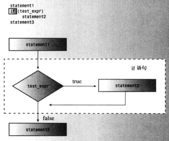
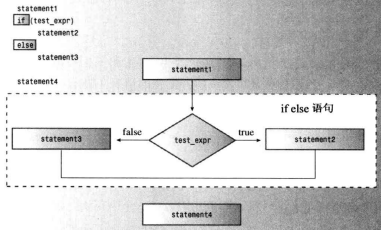
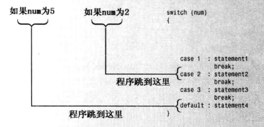
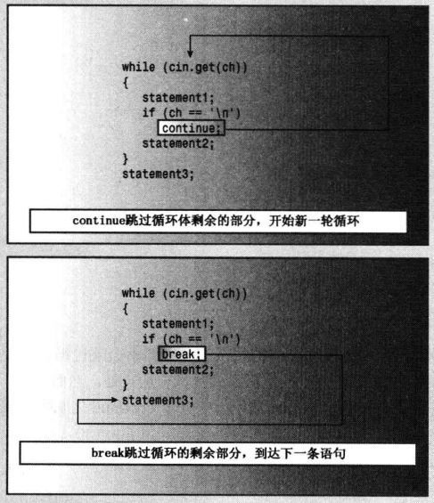

## if 语句

语法：

```cpp
if (test-condition)
    statement
```

- if 的测试条件也将被强制转换为bool值，即0为false,非零为true。

  

## if else 语句

```cpp
if (test-condition)
    statement1
else
    statement2
```



## 格式化if else 语句

如果上述的语句超过一条，则需要使用语句块：

```cpp
// 有两种缩进格式，可任选：
// 一种缩进格式：
if (ch == 'Z')
{
    zorro++;
    cout << "Another Zorro";
}
else
{
    dull++;
    cout << "Not a Zorro";
}

// 另一种缩进格式：
if (ch == 'Z'){
    zorro++;
    cout << "Another Zorro";
	}
else{
    dull++;
    cout << "Not a Zorro";
	}
```

## 逻辑表达式

C++ 提供了3种逻辑运算符，来组合或修改已有的表达式。

- （OR）或 `||` 
- （AND）与 `&&`
-  (NOT) 非 ` ！` 

### 逻辑OR运算符：

```cpp
// 比如：
5 == 5 || 5 == 9
```

- `||`的优先级比关系运算符低，所以不需要在表达式中使用括号。
- C++ 规定`||`运算符是顺序点，也就是说，先修该左侧的值，再对右侧的值进行判定(C++11: 运算符左边的子表达式先于右边的子表达式）
- 如果左侧表达式为真，则c++将不会去判定右侧的表达式。（有一真即为真）

### 逻辑AND运算符：

```cpp
// 比如：
5 > 8 && 5 < 10
```

- `&&`的优先级比关系运算符低，所以不需要在表达式中使用括号。
- C++ 规定`&&`运算符是顺序点，也就是说，先修该左侧的值，再对右侧的值进行判定。
- 如果左侧为false，则整个逻辑表达式必定为false，这种情况下，C++将不会再对右侧进行判定。

### 逻辑NOT运算符：

```cpp
if( !(x>5) )
```

### 逻辑运算要点

- 逻辑运算OR和AND运算符的 优先级都低于关系运算符

  `x > 5 && x< 10`  被解释为： `(x > 5) && (x < 10)`

- 逻辑运算NOT `！`运算符的优先级高于所有的关系运算符和算数运算符，所以要对表达式求反时，必须将表达式括起来。

  ```cpp
  !(x > 5); // 没问题
  !x > 5; // 有问题，结果恒为false，因为！x的值转换为0或1
  ```

- 逻辑AND运算符的优先级高于逻辑OR运算符。

  ```cpp
  // 表达式1：
  age > 30 && age < 45 || weight > 300;
  // 被解释为：
  (age > 30 && age < 45) || weight > 300;
  
  // 表达式2：
  age > 50 || weight > 300 && donation > 1000;
  // 被解释为：
  age > 50 || (weight > 300 && donation > 1000);
  ```

### 逻辑运算符的其他写法：

- `&& ` 等效于 `and`
- `||` 等效于 `or`
- `！` 等效于 `not`

## 字符函数库 cctype

cctype 函数库可以用于判断大小写字符，数字，标点符号等。

例如判断字符是否为字母字符：

```cpp
// 判断方式1：
if((ch >= 'a' && ch <= 'z') || (ch >= 'A' && ch <= 'Z'))
// 使用 cctype库函数：
#include <cctype>
...
if (isalpha(ch))
```

例程（统计输入中的数字，空格，点等的数量）：

```cpp
// cctypes.cpp -- using the ctype.h library
#include <iostream>
#include <cctype> 
int main()
{
    using namespace std;
    cout << "输入需要分析的内容, and type @"
            " to terminate input.\n";
    char ch;  
    int whitespace = 0;
    int digits = 0;
    int chars = 0;
    int punct = 0;
    int others = 0;

    cin.get(ch);                // get first character
    while (ch != '@')            // test for sentinel
    {
        if(isalpha(ch))         // 字母?
            chars++;
        else if(isspace(ch))    // 空格?
            whitespace++;
        else if(isdigit(ch))    // 是否为数字?
            digits++;
        else if(ispunct(ch))    // 点?
            punct++;
        else
            others++;
        cin.get(ch);            // get next character
    }
    cout << chars << " letters, "
         << whitespace << " whitespace, "
         << digits << " digits, "
         << punct << " punctuations, "
         << others << " others.\n";
    return 0; 
}
```

## ？： 运算符

可用来替代 ifelse 语句

```cpp
expression1 ? expression2 : expression3
```

- 如果 expression1 为 true，则整个表达式的值为expression2的值，否则整个表达式的值为expression3的值。

例如：

```cpp
5 > 3 ? 10 : 12 //表达式的值为10
3 == 9？ 25 : 18 //表达式的值为18
```

```cpp
int c = a > b ? a : b;

// 等效于：
int c;
if (a > b)
    c = a;
else
    c = b;
```

## switch 语句

C++ 的switch语句能够比`if else if else` 序列更容易地从大型列表中进行选择。

如果选项超过两个，switch 语句的效率更高。

```cpp
switch (integer-expression)
{
    case label1 : statement(s)
    case label2 : statement(s)
    ...
    default : statement(s)
}
```

- integer-expression 必须是一个结果为整数值的表达式。
- 每个label都必须是整数常量表达式，最常见的标签是int或char常量（如1或'q'），也可以是枚举量。
- 如果 integer-expression与 某case的label 匹配，则程序将执行case所在的那行;
- 如果integer-expression不与任何label匹配，则程序将跳到default的那一行。
- default标签可选，如果省略，而且没有匹配的标签，程序会跳过switch。
- 程序跳到switch中的特定代码行后，将依次执行switch中之后的所有语句，除非使用break。使用break可以使程序跳到switch后面的语句处执行。



例程：

```cpp
#include <iostream>
using namespace std;
void showmenu();
int main()
{
    showmenu();
    int choice;
    cin >> choice;
    while (choice != 5)
    {
        switch(choice)
        {
            case 1  :   cout << "1\n";
                break;
            case 2  :   cout << "2\n";
                break;
            case 3  :   cout << "3\n";
                break;
            case 4  :   cout << "4\n";
                break;
            default :   cout << "That's not a choice.\n";
        }
        showmenu();
        cin >> choice;
    }
    cout << "Bye!\n";
    return 0;
}

void showmenu()
{
    cout << "Please enter 1, 2, 3, 4, or 5 for quit:\n";
}
```

### 将枚举量用作标签

例程：

```cpp
// enum.cpp -- using enum
#include <iostream>
// create named constants for 0 - 6
enum {red, orange, yellow, green, blue, violet, indigo};

int main()
{
    using namespace std;
    cout << "Enter color code (0-6): ";
    int code;
    cin >> code;
    while (code >= red && code <= indigo)
    {
        switch (code)
        {
            case red     : cout << "Her lips were red.\n"; break;
            case orange  : cout << "Her hair was orange.\n"; break;
            case yellow  : cout << "Her shoes were yellow.\n"; break;
            case green   : cout << "Her nails were green.\n"; break;
            case blue    : cout << "Her sweatsuit was blue.\n"; break;
            case violet  : cout << "Her eyes were violet.\n"; break;
            case indigo  : cout << "Her mood was indigo.\n"; break;
        }
        cout << "Enter color code (0-6): ";
        cin >> code;
    }
    cout << "Bye\n";
    return 0;
}
```

- 通常cin无法识别枚举类型，因此上面的程序要求输入一个整数，switch语句将int值和枚举量标签进行比较时，将枚举量提升为int。
- 在while循环测试条件中也会将枚举量提升为int类型。

## break 和 continue 语句

- break：用于switch或循环，使程序跳到switch或循环后面的语句处执行
- continue: 用于循环，让程序跳过当前循环中循环体中余下的代码，并开始新的一轮循环。
- 注意，如果多层循环嵌套或者switch嵌套在循环中，两者都只能跳出一层。
- 对与continue: 在for循环中，continue语句使程序直接跳到更新表达式处，然后跳到测试表达式处。对于while循环，continue将使程序直接跳到测试表达式处。



