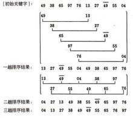

# 排序算法

简单排序算法的复杂度为：O（n^2）

排序算法的最优复杂度为：

为什么要学习O（n^2）级别的算法：

- 学习O（n^2）级别的算法是有必要的，任何复杂的问题一开始都可以先用基础算法实现，然后再使用高级算法进行优化。
- O（n^2）级别的算法编码简单，易于实现，是一些简单情景的首选。
- 简单的排序算法思想衍生出复杂的排序算法（比如希尔算法就是衍生自插入排序）
- 作为子过程,改进更复杂的排序算法

## 选择排序法（Selection Sort）

选择排序法的算法复杂度为 O（n^2）

基本思路（默认从小到大）：

1. 首先在所有元素中找到最小的元素，然后放到开头的位置

2. 接着，从剩下的元素即第2个元素到最后一个元素中找到最小的元素，然后放到第二的位置
3. 接着，从剩下的元素即第3个元素到最后一个元素中找到最小的元素，然后放到第3的位置
4. 以此类推直到倒数第二个元素，最后一个元素自动就是排好的

选择排序算法的最简C++实现：

```cpp
#include <iostream>
// #include <algorithm>

using namespace std;

void selectionSort(int arr[], int n){
    for(int i = 0 ; i < n ; i ++){
        // 寻找[i, n)区间里的最小值
        int minIndex = i; //用与保存此处遍历中的最小值的索引
        //内层for循环负责找到最小值的索引
        for( int j = i + 1 ; j < n ; j ++ )
            if( arr[j] < arr[minIndex] )
                minIndex = j;
        swap( arr[i] , arr[minIndex] );
    }
}

int main() {
    int a[10] = {10,9,8,7,6,5,4,3,2,1};
    selectionSort(a,10); //调用排序算法
    for( int i = 0 ; i < 10 ; i ++ )
        cout<<a[i]<<" ";
    cout<<endl;
    return 0;
}
```

```
0 1 2 3 4 5 6 7 8 9 
```

- 如果想要从大到小排序，可以将`if( arr[j] < arr[minIndex] )` 改为：

  `if( arr[j] > arr[minIndex] )`

## 插入排序法（Insertion Sort）

- 插入排序法的算法复杂度为 O（n^2）
- 对于完全有序的数列，插入算法的复杂度降到O（n），即每个内循环只循环一次
- 插入排序可以提前中止内层循环，所以对于某些情况，插入排序算法有可能（比如数列很有序）比高级排序算法还要快
- 插入排序法对近似有序的数列很有效，即越有序用的时间越少
- 插入排序法尤其适用于近似有序的数列
- 插入排序有可能在高级排序算法中作为子过程

基本思路（默认从小到大）：

1. 比较第二个元素与第一个元素的大小，如果第二个元素小则与第一个元素交换位置，否则第一个元素和第二个元素都保持不变
2. 比较第三个元素与第二个元素的大小，如果第三个元素比第二个元素小，则交换位置，再比较第二个元素与第一个元素的大小，如果第二个元素小，则交换第一个和第二个元素的位置，之后停止; 如果比较中第3个元素打于第2个则停止; 如果3<2,则比较 2与1大小，如果2>1 则停止。
3. 接着第四个元素，以此类推...

插入排序算法的最简C++实现：

```cpp
#include <iostream>
// #include <algorithm>
using namespace std;

//写法1：
void insertionSort(int arr[], int n){
    for( int i = 1 ; i < n ; i ++ ) {
        // 寻找元素arr[i]合适的插入位置
       for( int j = i ; j > 0 ; j-- )
           if( arr[j] < arr[j-1] )
               swap( arr[j] , arr[j-1] );
           else
               break; //如果满足j>j-1，则说明顺序已是正确的则提前停止
    }
    return;
}
    
//写法2：
void insertionSort(int arr[], int n){
    for( int i = 1 ; i < n ; i ++ ) {
        // 寻找元素arr[i]合适的插入位置
        for( int j = i ; j > 0 && arr[j] < arr[j-1] ; j -- )
            swap( arr[j] , arr[j-1] );
    }
    return;
}

int main() {
    int a[10] = {10,9,8,7,6,5,4,3,2,1};
    insertionSort(a,10); //调用排序算法
    for( int i = 0 ; i < 10 ; i ++ )
        cout<<a[i]<<" ";
    cout<<endl;
    return 0;
}
```

- 在上面的实现中使用了swap函数即交换操作，交换操作相当于三次赋值操作。

## 插入排序算法的优化

虽然上面实现的插入排序算法可以提前结束循环，而不用像选择排序法一样历便所有的元素，但是速度可能并没有选择排序高。究其原因是因为，swap操作，所以可以将swap改为赋值操作，进一步提高插入排序算法的效率。

优化后的插入排序算法的最简C++实现：

```cpp
#include <iostream>
// #include <algorithm>
using namespace std;

// 一次swap相当于三次赋值，所以优化这里的swap为赋值操作
// 在内层循环只使用一次赋值
void insertionSort(int arr[], int n){
    for( int i = 1 ; i < n ; i ++ ) {
        int e = arr[i];
        int j; // j保存元素e应该插入的位置
        for (j = i; j > 0 && arr[j-1] > e; j--)
            arr[j] = arr[j-1];
        arr[j] = e;
    }
    return;
}

int main() {
    int a[10] = {10,9,8,7,6,5,4,3,2,1};
    insertionSort(a,10); //调用排序算法
    for( int i = 0 ; i < 10 ; i ++ )
        cout<<a[i]<<" ";
    cout<<endl;
    return 0;
}
```

## 冒泡排序法（Bubble Sort）

冒泡排序的平均时间复杂度为O(n2)

对于完全有序的数组，冒泡排序法也将成为O(n)级别的算法

插入排序法和冒泡排序法在完全有序的情况下都将成为O(n)算法

基本思路（默认从小到大）

1. 比较相邻的元素。如果第一个比第二个大，就交换他们两个。
2. 对每一对相邻元素做同样的工作，从开始第一对到结尾的最后一对。在这一点，最后的元素应该会是最大的数。
3. 针对所有的元素重复以上的步骤，除了最后一个。
4. 持续每次对越来越少的元素重复上面的步骤，直到没有任何一对数字需要比较。

冒泡排序算法的最简C++实现：

```cpp
#include <iostream>
// #include <algorithm>
using namespace std;

// 冒泡排序算法写法1：
void BubbleSort(int arr[], int n){
	for (int i = 0; i < n-1; i++)
	{
		for(int j=0; j<n-i-1; j++)
			if(arr[j]>arr[j+1])
				swap(arr[j],arr[j+1]);
	}
}
// 冒泡排序算法写法2：
void BubbleSort2( int arr[] , int n){
    bool swapped;
    do{
        swapped = false;
        for( int i = 1 ; i < n ; i ++ )
            if( arr[i-1] > arr[i] ){
                swap( arr[i-1] , arr[i] );
                swapped = true;
            }
        // 优化, 每一趟Bubble Sort都将最大的元素放在了最后的位置
        // 所以下一次排序, 最后的元素可以不再考虑
        n --;
    }while(swapped);
}

int main() {
    int a[10] = {10,9,8,7,6,5,4,3,2,1};
    BubbleSort(a,10); //调用排序算法
    for( int i = 0 ; i < 10 ; i ++ )
        cout<<a[i]<<" ";
    cout<<endl;
    return 0;
}
```

优化冒泡排序算法：

记录最后一次的交换位置,在此之后的元素在下一轮扫描中均不考虑

```cpp
void bubbleSort2( int arr[] , int n){
    int newn; // 使用newn进行优化
    do{
        newn = 0;
        for( int i = 1 ; i < n ; i ++ )
            if( arr[i-1] > arr[i] ){
                swap( arr[i-1] , arr[i] );
                // 记录最后一次的交换位置,
                // 在此之后的元素在下一轮扫描中均不考虑
                newn = i;
            }
        n = newn;
    }while(newn > 0);
}
```

## 希尔排序算法（Shell Sort）

希尔排序(Shell's Sort)是插入排序的一种又称“缩小增量排序”（Diminishing Increment Sort），是直接插入排序算法的一种更高效的改进版本。希尔排序是非稳定排序算法。希尔排序是把记录按下标的一定增量分组，对每组使用直接插入排序算法排序；随着增量逐渐减少，每组包含的关键词越来越多，当增量减至1时，整个文件恰被分成一组，算法便终止。

该方法实质上是一种分组插入方法

希尔排序算法的时间复杂度为    O(n^（1.3—2))

基本思想：

先取一个小于n的整数d1作为第一个增量，把文件的全部记录分组。所有距离为d1的倍数的记录放在同一个组中。先在各组内进行直接插入排序；然后，取第二个增量d2<d1重复上述的分组和排序，（可以使用dt-1等于dt/2取整）直至所取的增量dt=1(dt<dt-1...<d2<d1)，即所有记录放在同一组中进行直接插入排序为止。

例如：49，38，65，97，76，13，27，49，55，04。

- 取初始增量为5,每隔5个取一个数进行分组，即分为5组（{49,13}，{38,27}，{65,49}，{97,55}，{76,04}），然对五个组进行排序。排序之后序列变为：{13,27,49,55,04,49,38,65,97,76}

- 取曾量为2,则分为两组（{13,49,04,38,97}, {27,55,49,65,76}）,排序之后的序列为：

  {04,27,13,49,38,55,49,65,97,76}

- 取增量为1,即最终只有一个分组，对全组进行排序。



以上实例的C++实现：

```cpp
#include <iostream>

using namespace std;

// 实现方法1：即将各组单独提取出来排序
void ShellSort(int arr[], int n){
	int inc = 5; //设置初始的增量
	while(inc >= 1){
		int b = 0;
		while(b < inc){
			for (int i = b+inc; i < n; i = i+inc)
			{	
				int min = arr[i];
				int j;
				for(j=i; j>b && arr[j-inc]>min; j = j-inc)
					arr[j]=arr[j-inc];
				arr[j] = min;
			}
			b++;
		}
		inc = inc/2;
	}
}

// 实现方法2：直接依次排序（与1增量不同）
void ShellSort2(int arr[], int n){
    // 计算 increment sequence: 1, 4, 13, 40, 121, 364, 1093...
    int h = 1;
    while( h < n/3 )
        h = 3 * h + 1;
    
    while( h >= 1 ){
        // h-sort the array
        for( int i = h ; i < n ; i ++ ){
            // 对 arr[i], arr[i-h], arr[i-2*h], arr[i-3*h]... 使用插入排序
            int e = arr[i];
            int j;
            for( j = i ; j >= h && e < arr[j-h] ; j -= h )
                arr[j] = arr[j-h];
            arr[j] = e;
        }
        h /= 3;
    }
}

int main() {
    int a[10] = {10,9,8,7,6,5,4,3,2,1};
    ShellSort(a,10); //调用排序算法
    for( int i = 0 ; i < 10 ; i ++ )
        cout<<a[i]<<" ";
    cout<<endl;
    return 0;
}
```

- 比较SelectionSort, InsertionSort和BubbleSort和ShellSort四种排序算法的性能效率，ShellSort是这四种排序算法中性能最优的排序算法


## 将函数写成模板

- 为了能使排序算法函数适用于多种数据类型，比如int， float，string和自定义类等。

- 在自定义类中需要重载 `<`  运算符，已使用排序函数

对应的泛型（模板）函数：

`Student.h`

```cpp
#include <iostream>
#include <string>
using namespace std;

struct Student{
    string name;
    int score;
    // 重载小于运算法,定义Student之间的比较方式
    // 如果分数相等，则按照名字的字母序排序
    // 如果分数不等，则分数高的靠前
    bool operator<(const Student& otherStudent){
        return score != otherStudent.score ?
               score > otherStudent.score : name < otherStudent.name;
    }

    // 重载<<符号, 定义Student实例的打印输出方式
    friend ostream& operator<<(ostream &os, const Student &student){
        os<<"Student: "<<student.name<<" "<<student.score<<endl;
        return os;
    }
};
```

`main.cpp`

```cpp
#include <iostream>
#include "Student.h"

using namespace std;
// 对应的模板函数
template<typename T>
void selectionSort(T arr[], int n){

    for(int i = 0 ; i < n ; i ++){
        int minIndex = i;
        for( int j = i + 1 ; j < n ; j ++ )
            if( arr[j] < arr[minIndex] )
                minIndex = j;
        swap( arr[i] , arr[minIndex] );
    }
}

int main() {
    // 测试模板函数，传入整型数组
    int a[10] = {10,9,8,7,6,5,4,3,2,1};
    selectionSort( a , 10 );
    for( int i = 0 ; i < 10 ; i ++ )
        cout<<a[i]<<" ";
    cout<<endl;
    // 测试模板函数，传入浮点数数组
    float b[4] = {4.4,3.3,2.2,1.1};
    selectionSort(b,4);
    for( int i = 0 ; i < 4 ; i ++ )
        cout<<b[i]<<" ";
    cout<<endl;
    // 测试模板函数，传入字符串数组
    string c[4] = {"D","C","B","A"};
    selectionSort(c,4);
    for( int i = 0 ; i < 4 ; i ++ )
        cout<<c[i]<<" ";
    cout<<endl;
    // 测试模板函数，传入自定义结构体Student数组
    Student d[4] = { {"D",90} , {"C",100} , {"B",95} , {"A",95} };
    selectionSort(d,4);
    for( int i = 0 ; i < 4 ; i ++ )
        cout<<d[i];
    cout<<endl;

    return 0;
}
```


## 所有基础排序算法测试代码

项目包含：


