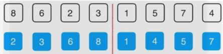

# 高级排序算法

即，O(n*logn)的排序算法

nlogn 的排序算法比 n^2排序算法快多少：


nlogn 的排序算法 n 越大，优势越明显

## 归并排序法（Merge Sort）

### 归并排序的思想：

1. 有数组{8,6,2,3,1,5,7,4},先将数组逐次一分为2,直到分为n组，也就是一个元素一个组，总共需要分log2(n)次,这里即3次

   > nlog(n)来源即在这里，即通过二分法得到log2(n)级，然后每级内的排序复杂度为O(n),最终得到的算法复杂度即为O(nlog(n)).

2. 最后一次分出的组不需要进行排序，因为每个元素都被看作独立的组

3. 随后上归并，归并时排序，即下层归并到上层之后，上层组内就应该已经时排好的数组

   >
   >
   >归并问题的核心问题是：对于归并过程能否使用O(n)复杂度的过程完成。

   分组：


​	排序并向上归并：





归并过程：

- 归并过程需要开辟一个临时的空间，即数组的副本，来帮助完成归并过程。对与空间复杂度而言，要使用O(n)的额外的空间。时间的指标要比空间指标重要，即一般优先考虑时间复杂度。

- 需要三个索引跟踪原素组和待归并的数组，i，j 分别表示待归并的元素，k表示归并元素应该存放的位置。

- 需要两个界限即最左端L和最右端R

  

### C++代码实现：

```cpp

```

