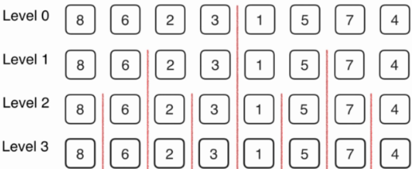
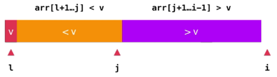

# 高级排序算法

即，O(n*logn)的排序算法

nlogn 的排序算法比 n^2排序算法快多少：


nlogn 的排序算法 n 越大，优势越明显

## 归并排序法（Merge Sort）-自顶向下

### 归并排序的思想：

1. 有数组{8,6,2,3,1,5,7,4},先将数组逐次一分为2,直到分为n组，也就是一个元素一个组，总共需要分log2(n)次,这里即3次

   > nlog(n)来源即在这里，即通过二分法得到log2(n)级，然后每级内的排序复杂度为O(n),最终得到的算法复杂度即为O(nlog(n)).

2. 最后一次分出的组不需要进行排序，因为每个元素都被看作独立的组

3. 随后上归并，归并时排序，即下层归并到上层之后，上层组内就应该已经时排好的数组

   >
   >
   >归并问题的核心问题是：对于归并过程能否使用O(n)复杂度的过程完成。

   分组：



​	排序并向上归并：


归并过程：

- 归并过程需要开辟一个临时的空间，即数组的副本，来帮助完成归并过程。对与空间复杂度而言，要使用O(n)的额外的空间。时间的指标要比空间指标重要，即一般优先考虑时间复杂度。

- 需要三个索引跟踪原素组和待归并的数组，i，j 分别表示待归并的元素，k表示归并元素应该存放的位置。

- 需要两个界限即最左端L和最右端R

  

### C++代码实现：

```cpp
#include <iostream>
#include "SortTestHelper.h"
#include "InsertionSort.h"

using namespace std;


// 将arr[l...mid]和arr[mid+1...r]两部分进行归并
template<typename  T>
void __merge(T arr[], int l, int mid, int r){
    
    T aux[r-l+1];
    //T *aux = new T[r-l+1];

    for( int i = l ; i <= r; i ++ )
        aux[i-l] = arr[i];

    // 初始化，i指向左半部分的起始索引位置l；j指向右半部分起始索引位置mid+1
    int i = l, j = mid+1;
    for( int k = l ; k <= r; k ++ ){

        if( i > mid ){  // 如果左半部分元素已经全部处理完毕
            arr[k] = aux[j-l]; j ++;
        }
        else if( j > r ){  // 如果右半部分元素已经全部处理完毕
            arr[k] = aux[i-l]; i ++;
        }
        else if( aux[i-l] < aux[j-l] ) {  // 左半部分所指元素 < 右半部分所指元素
            arr[k] = aux[i-l]; i ++;
        }
        else{  // 左半部分所指元素 >= 右半部分所指元素
            arr[k] = aux[j-l]; j ++;
        }
    }
    //delete[] aux;
}

// 递归使用归并排序,对arr[l...r]的范围进行排序
template<typename T>
void __mergeSort(T arr[], int l, int r){

    if( l >= r )
        return;

    int mid = (l+r)/2;
    __mergeSort(arr, l, mid);
    __mergeSort(arr, mid+1, r);
    __merge(arr, l, mid, r);
}

template<typename T>
void mergeSort(T arr[], int n){
    __mergeSort( arr , 0 , n-1 );
}


// 比较InsertionSort和MergeSort两种排序算法的性能效率
// 整体而言, MergeSort的性能最优, 对于近乎有序的数组的特殊情况, 见测试2的详细注释
int main() {

    // Merge Sort是我们学习的第一个O(nlogn)复杂度的算法
    // 可以在1秒之内轻松处理100万数量级的数据
    // 注意：不要轻易尝试使用SelectionSort, InsertionSort或者BubbleSort处理100万级的数据
    // 否则，你就见识了O(n^2)的算法和O(nlogn)算法的本质差异：）
    int n = 50000;

    // 测试1 一般性测试
    cout<<"Test for random array, size = "<<n<<", random range [0, "<<n<<"]"<<endl;
    int* arr1 = SortTestHelper::generateRandomArray(n,0,n);
    int* arr2 = SortTestHelper::copyIntArray(arr1, n);

    SortTestHelper::testSort("Insertion Sort", insertionSort, arr1, n);
    SortTestHelper::testSort("Merge Sort",     mergeSort,     arr2, n);

    delete[] arr1;
    delete[] arr2;

    cout<<endl;
    // 测试2 测试近乎有序的数组
    // 对于近乎有序的数组, 数组越有序, InsertionSort的时间性能越趋近于O(n)
    // 所以可以尝试, 当swapTimes比较大时, MergeSort更快
    // 但是当swapTimes小到一定程度, InsertionSort变得比MergeSort快
    int swapTimes = 10;
    assert( swapTimes >= 0 );

    cout<<"Test for nearly ordered array, size = "<<n<<", swap time = "<<swapTimes<<endl;
    arr1 = SortTestHelper::generateNearlyOrderedArray(n,swapTimes);
    arr2 = SortTestHelper::copyIntArray(arr1, n);

    SortTestHelper::testSort("Insertion Sort", insertionSort, arr1, n);
    SortTestHelper::testSort("Merge Sort",     mergeSort,     arr2, n);

    delete[] arr1;
    delete[] arr2;

    return 0;
}
```

## 归并排序法（Merge Sort）-自底向上

自底向上与自顶向下的区别在于，自顶向下使用递归，自底向上使用递推，但是核心的merge函数相同。

在统计学意义上，使用递归的归并排序要比使用递推的归并排序要快一些。

### C++代码实现：

```cpp
#include <iostream>
// #include <algorithm>
using namespace std;

// 将arr[l...mid]和arr[mid+1...r]两部分进行归并
template<typename  T>
void __merge(T arr[], int l, int mid, int r){

    T aux[r-l+1];
    //T *aux = new T[r-l+1];

    for( int i = l ; i <= r; i ++ )
        aux[i-l] = arr[i];

    // 初始化，i指向左半部分的起始索引位置l；j指向右半部分起始索引位置mid+1
    int i = l, j = mid+1;
    for( int k = l ; k <= r; k ++ ){

        if( i > mid ){  // 如果左半部分元素已经全部处理完毕
            arr[k] = aux[j-l]; j ++;
        }
        else if( j > r ){  // 如果右半部分元素已经全部处理完毕
            arr[k] = aux[i-l]; i ++;
        }
        else if( aux[i-l] < aux[j-l] ) {  // 左半部分所指元素 < 右半部分所指元素
            arr[k] = aux[i-l]; i ++;
        }
        else{  // 左半部分所指元素 >= 右半部分所指元素
            arr[k] = aux[j-l]; j ++;
        }
    }

    //delete[] aux;
}

template <typename T>
void mergeSortBU(T arr[], int n){

	//Merge Sort Bottom Up 无优化版本
	//对于n比较的子序列可以使用插入排序优化
	for( int sz = 1; sz <= n ; sz += sz )
	   for( int i = 0 ; i < n - sz ; i += sz+sz )
	       // 对 arr[i...i+sz-1] 和 arr[i+sz...i+2*sz-1] 进行归并
           // 要注意防止越界
	       __merge(arr, i, i+sz-1, min(i+sz+sz-1,n-1) );
}

int main(){
	int a[10] = {10,9,8,7,6,5,4,3,2,1};
    mergeSortBU(a,10); //调用排序算法
    for( int i = 0 ; i < 10 ; i ++ )
        cout<<a[i]<<" ";
    cout<<endl;

	return 0;
}
```

## 快速排序（Quick Sort）

### 算法思想：

1. 首先选取一个元素（比如这里选取第一个元素，以第一个元素4为例），然后想办法将该元素放到一个位置，这个位置应该是数组完全排好序之后该元素应该在的位置。


2. 在该元素即4被放到该位置之后，数组应该具有如下性质：即4之前的元素都小于或等于4, 4之后的元素都大于或等于4,然后再分别对小与< 4 和 大于> 4的部分分别继续使用快速排序的思想，进行排序，如此递归下去，完成整个数组的排序。


### 核心问题：

快速排序的核心问题就是如何将选定元素即4移动到它应该在的位置；并且保证左边子数组都小与或等于该元素4,右边子数组都大于或等于该元素4。即Partition过程。

（为了简化问题，假设数组中没有重复元素）通常选定第一个数组的元素作为第一次分界的基准元素。将该元素值使用一个变量`v`保存起来，然后向后逐渐遍历所有元素，并进行整理数组，使数组满足上面的两个要求。此过程中我们需要使用几个变量来帮助保存信息，`l `为子数组的最左的索引，`r`为子数组最右的索引，`j `为`v`的分界位置(**`j` 所在位置为小与v的最后一个元素**)，`i`指向待整理的剩余部分的开头元素 `e`。

即 `[l+1, j]  < v`， `[j+1,i-1] > v`


现在需要讨论对于`i`位置的元素`e`，我们需要做怎样的处理：

1. 如果`e>v`,`e` 就可以保持不动。然后 `i`向后移动一位，去考察下一个元素。


2. 如果`e<v`,需要将`e` 放到小于` v`的那部分子数组中，即图中的橙色部分。然后 `i`向后移动一位，去考察下一个元素。

   具体做法为：

   将`e`元素与`j`后的第一个元素与交换，即将`j+1`与`i`元素互换，实现了将一个小于v的元素移到黄色区域，将一个大于v的元素移到紫色区域。

   

   之后`j`需要 `j++`，以保证`j`指向分界点，然后 `i`向后移动一位。

   

当所有元素都遍历完成一遍之后，数组或子数组呈现如下形态：



接下来需要做的就是直接交换`l` 与 `j` 对应的数组元素，然后指向元素`v`的即为`j`。至此就完成了一次 Partition，最后的效果是，数组或子数组被分成三个部分，即大于，等于和小于 v 的三个部分。


### C++代码实现：

```cpp
#include <iostream>
// #include <algorithm>
using namespace std;

// 对arr[l...r]部分进行partition操作
// 返回p，使得arr[l...p-1] < arr[p]; arr[p+1...r] > arr[p]
template <typename T>
int __partition(T arr[], int l, int r){
	T v = arr[l];
	// arr[l+1...j] < v; arr[j+1...i] > v
	int j = l;
	for(int i = l+1 ; i <=r ; i++ ){
		if(arr[i] < v){
			swap(arr[j+1],arr[i]);
			j ++;
		}
	}
	swap(arr[l] , arr[j]);
	return j;
}

// 对arr[l....r]部分进行快速排序
template <typename T>
void __quickSort(T arr[], int l, int r){

	if(l >= r)
		return;
	int p = __partition(arr, l, r);
	__quickSort(arr, l, p-1);
	__quickSort(arr, p+1, r);
}

template <typename T>
void quickSort(T arr[], int n){
	__quickSort(arr, 0, n-1);
}

int main(){
	int a[10] = {10,9,8,7,6,5,4,3,2,1};
    quickSort(a,10);

    for( int i = 0 ; i < 10 ; i ++ )
        cout<<a[i]<<" ";
    cout<<endl;

	return 0;
}
```

### 快速排序（Quick Sort）算法优化：

由于上面的简单实现会出现分配不均的情况，所以快速排序最差的情况会退化为O(n2)级别。

比如：对于一个完全有序的序列，只有右半部分有元素，所以需要分n个层级，每个层级内的复杂度又为O(n).


要解决这个问题，可以随机选取锚点(而不是使用第一个元素作为锚点)，这样快速排序算法复杂度的数学期望（统计学意义上的，不代表每次都是）即为O(nlogn)。

C++代码实现：

```cpp
#include <iostream>
// #include <algorithm>
#include <ctime>
using namespace std;

// 对arr[l...r]部分进行partition操作
// 返回p，使得arr[l...p-1] < arr[p]; arr[p+1...r] > arr[p]
template <typename T>
int __partition(T arr[], int l, int r){
	// 优化描点位置
	swap( arr[l] , arr[rand() % (r-l+1)+l] );

	T v = arr[l];
	// arr[l+1...j] < v; arr[j+1...i] > v
	int j = l;
	for(int i = l+1 ; i <=r ; i++ ){

		if(arr[i] < v){
			swap(arr[j+1],arr[i]);
			j ++;
		}
	}

	swap(arr[l] , arr[j]);
	return j;
}

// 对arr[l....r]部分进行快速排序
template <typename T>
void __quickSort(T arr[], int l, int r){

	if(l >= r)
		return;
	int p = __partition(arr, l, r);
	__quickSort(arr, l, p-1);
	__quickSort(arr, p+1, r);
}

template <typename T>
void quickSort(T arr[], int n){

	srand(time(NULL));
	__quickSort(arr, 0, n-1);
}

int main(){
	int a[10] = {10,9,8,7,6,5,4,3,2,1};
    quickSort(a,10);
    for( int i = 0 ; i < 10 ; i ++ )
        cout<<a[i]<<" ";
    cout<<endl;
	return 0;
}
```

