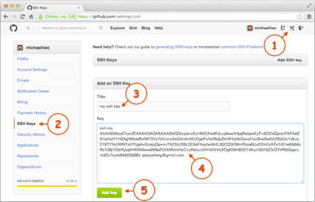

### 在Linux上安装Git

```shell
sudo apt-get install git
```

### 设置本机的用户信息

```shell
git config --global user.name "likun1993630"
git config --global user.email "sdlclk93@gmail.com"
```

> 因为Git是分布式版本控制系统，所以，每个机器都必须自报家门：你的名字和Email地址。

> 注意`git config`命令的`--global`参数，用了这个参数，表示你这台机器上所有的Git仓库都会使用这个配置，当然也可以对某个仓库指定不同的用户名和Email地址。

### 在github上关联当前主机

> 本地Git仓库和GitHub仓库之间的传输是通过SSH加密
>
> 为什么GitHub需要SSH Key呢？因为GitHub需要识别出你推送的提交确实是你推送的，而不是别人冒充的，而Git支持SSH协议，所以，GitHub只要知道了你的公钥，就可以确认只有你自己才能推送。
>
> 当然，GitHub允许你添加多个Key。假定你有若干电脑，你一会儿在公司提交，一会儿在家里提交，只要把每台电脑的Key都添加到GitHub，就可以在每台电脑上往GitHub推送了。

1. 创建SSH Key：

   在用户主目录下，看看有没有.ssh目录，如果有，再看看这个目录下有没有`id_rsa`和`id_rsa.pub`这两个文件，如果已经有了，可直接跳到下一步。

   ```shell
   ssh-keygen -t rsa -C "sdlclk93@gmail.com"
   # 然后一路回车，让设置保持默认
   # 完成之后会在.ssh目录创建id_rsa和id_rsa.pub两个文件
   ```

   - `id_rsa`是私钥，不能泄露出去，
   - `id_rsa.pub`是公钥，可以放心地告诉任何人。

2. 登陆GitHub，打开“Account settings”，“SSH Keys”页面：

   然后，点“Add SSH Key”，填上任意Title，比如某个电脑名字，在Key文本框里粘贴`id_rsa.pub`文件的内容：

   
   
   点“Add Key”，你就应该看到已经添加的Key：
   
   

### 添加Github远程库

0. 准备工作：

   现在Github网页上，创建一个Repository，使用README文件将它初始化，随便向README文件里写点东西。

   或者把别人的Repository fork到自己的账户下。

   注意，只有把别人的项目fork到自己的账户下之后，才能将修改的代码提交到自己账户下的版本的库，在修改完成后，可以请求pull request将自己的版本并入到原作者的master分支中。

1. 首先cd到想放项目的目录下，然后使用git clone 命令将Github远程库的项目下载到本地

   ```shell
   git clone git@github.com:likun1993630/HelloWorld.git
   ```

   下载完成之后，HelloWorld就是一个git库

### 修改代码并提交到Github库中

1. 编辑README文件

2. 使用git status 查看有哪些文件被修改但是还未提交到本地git库中

   ```shell
   git status
   ```

   ```
   位于分支 master
   您的分支与上游分支 'origin/master' 一致。
   尚未暂存以备提交的变更：
     （使用 "git add <文件>..." 更新要提交的内容）
     （使用 "git checkout -- <文件>..." 丢弃工作区的改动）
   
   	修改：     README.md
   
   修改尚未加入提交（使用 "git add" 和/或 "git commit -a"）
   ```

3. 将README文件添加到 “本地库待提交列表" 中,即暂存区：

   ```shell
   git add README.md
   ## 可以一次添加多个文件
   # git add file1.txt file2.txt
   ## 也可以使将整个目录都添加到暂存区
   # git add -A
   ## 添加所有新建或修改的文件，目录结构结构会保持
   # git add .
   ```
   
4. 将README文件提交到本地git库中

   ```shell
   git commit -m "wrote a readme file"
   # -m 表示要备注的信息，也就是在github上显示的修改的备注信息
   ```

   

5. 将本地git库推送到Github库中

   ```shell
   git push -u origin master
   ## origin 表示远程库
   ## master 表示master分支
   ## 第一次推送master分支时，加上了-u参数，Git不但会把本地的master分支内容推送的远程新的master分支，还会把本地的master分支和远程的master分支关联起来，在以后的推送或者拉取时就可以简化命令。
   
   ## 第一次之后推送只需要：
   # git push origin master
   ```

   此时，github上的库就和本地git库的内容完全一样了。

### 使用git命令行在github创建一个库

首先先在github上新建一个库，比如名字为learngit的库，注意不使用README初始化库。

该库的github首页显示：

```shell
# …or create a new repository on the command line
echo "# learngit" >> README.md
git init
git add README.md
git commit -m "first commit"
git remote add origin git@github.com:likun1993630/learngit.git
git push -u origin master

#…or push an existing repository from the command line
git remote add origin git@github.com:likun1993630/learngit.git
git push -u origin master

#…or import code from another repository
#You can initialize this repository with code from a Subversion, Mercurial, or TFS project.
```

接下来要做的是：

在本地初始化一个同名的本地git库，并推送到github

```shell
mkdir learngit
cd learngit
echo "# learngit" >> README.md
git init # 初始化git仓库
# 接下来需要将本地的git仓库与github仓库关联起来
git remote add origin git@github.com:likun1993630/learngit.git

# 将README文件推送到github库
git add README.md
git commit -m "first commit"
git push -u origin master # 用作第一次向某一个库提交更改
# 之后如果需要向该库提交更改只需要：
git push origin master
```


