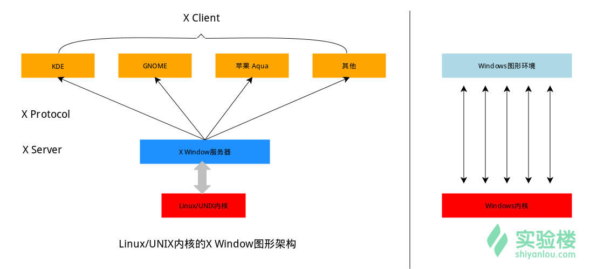
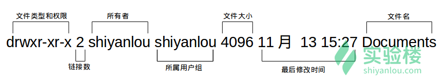

# 实验楼教程
## Linux 桌面环境介绍
相对于现在的 Windows 系统，UNIX/Linux 本身是没有图形界面的，我们通常在 UNIX/Linux 发行版上看到的图形界面实际都只是运行在 Linux 系统之上的一套软件，类似 Windows95 之前的 Windows 的图形界面实则也只是运行在 DOS 环境的一套软件。实现了客户端功能的桌面环境有 KDE，GNOME，XFCE，LXDE。


## shell
UNIX/Linux 操作系统下的 Shell 既是用户交互的界面，也是控制系统的脚本语言。当然这一点也有别于 Windows 下的命令行，虽然该命令行也提供了很简单的控制语句。UNIX/Linux 操作系统下的 Shell 既是用户交互的界面，也是控制系统的脚本语言。当然这一点也有别于 Windows 下的命令行，虽然该命令行也提供了很简单的控制语句。

## 命令行操作体验 
```shell
#创建一个名为 file 的文件，touch是一个命令
$ touch file 

#进入一个目录，cd是一个命令
$ cd /etc/

#查看当前所在目录
$ pwd
```

### 常用快捷键
| 按键          | 作用                                       |
|---------------|--------------------------------------------|
| Ctrl+c        | 强制终止当前程序                           |
| Ctrl+d        | 键盘输入结束或退出终端                     |
| Ctrl+s        | 暂停当前程序，暂停后按下任意键恢复运行     |
| Ctrl+z        | 将当前程序放到后台运行，恢复到前台为命令fg |
| Ctrl+a        | 将光标移至输入行头，相当于Home键           |
| Ctrl+e        | 将光标移至输入行末，相当于End键            |
| Ctrl+k        | 删除从光标所在位置到行末                   |
| Alt+Backspace | 向前删除一个单词                           |
| Shift+PgUp    | 将终端显示向上滚动                         |
| Shift+PgDn    | 将终端显示向下滚动                         |

### 利用历史输入命令
使用上下键选择之前的命令

### 使用通配符
```shell
$ cd /home/shiyanlou
$ touch asd.txt fgh.txt
# 列出当前文件夹内的.txt 文件
$ ls *.txt
```
在创建文件的时候，如果需要一次性创建多个文件，比如：“love_1_linux.txt，love_2_linux.txt，... love_10_linux.txt”
```shell
$ touch love_{1..10}_shiyanlou.txt
```

Shell 常用通配符：

| 字符                  | 含义                                        |
|-----------------------|---------------------------------------------|
| *                     | 匹配 0 或多个字符                           |
| ?                     | 匹配任意一个字符                            |
| [list]                | 匹配 list 中的任意单一字符                  |
| [^list]               | 匹配 除list 中的任意单一字符以外的字符      |
| [c1-c2]               | 匹配 c1-c2 中的任意单一字符 如：[0-9] [a-z] |
| {string1,string2,...} | 匹配 string1 或 string2 (或更多)其一字符串  |
| {c1..c2}              | 匹配 c1-c2 中全部字符 如{1..10}             |

### 在命令行中获取帮助
可以通过执行man命令调用手册页
```shell
$ man <command_name>
```

```shell
man man
```
可以查看man手册本身的详细信息。手册通常被分为8个区段，安排如下：

| 区段 | 说明                                     |
|------|------------------------------------------|
| 1    | 一般命令                                 |
| 2    | 系统调用                                 |
| 3    | 库函数，涵盖了C标准函数库                |
| 4    | 特殊文件（通常是/dev中的设备）和驱动程序 |
| 5    | 文件格式和约定                           |
| 6    | 游戏和屏保                               |
| 7    | 杂项                                     |
| 8    | 系统管理命令和守护进程                   |

比如想查看位于man 1 区段的ls 命令的详细信息：
```shell
$ man 1 ls
```
一般包括以下部分内容：
- NAME（名称）
> 该命令或函数的名称，接着是一行简介。
- SYNOPSIS（概要）
> 对于命令，正式的描述它如何运行，以及需要什么样的命令行参数。对于函数，介绍函数所需的参数，以及哪个头文件包含该函数的定义。
- DESCRIPTION（说明）
>命令或函数功能的文本描述。
- EXAMPLES（示例）
> 常用的一些示例。
- SEE ALSO（参见）
> 相关命令或函数的列表。

想要获得更详细的帮助，你还可以使用info命令，不过通常使用man就足够了。如果你知道某个命令的作用，只是想快速查看一些它的某个具体参数的作用，那么你可以使用--help参数，大部分命令都会带有这个参数，如：
```shell
$ ls --help
```

### 小工具banner
可以在shell 打印想打印的大字符

#先使用如下命令安装：
$ sudo apt-get update
$ sudo apt-get install sysvbanner
$ banner shiyanlou

或者你觉得这字体不好看，那么你还可以使用默认已经安装的一个命令printerbanner：

$ printerbanner -w 50 A

## Linux 用户管理 
Linux 是一个可以实现多用户登录的操作系统，比如“李雷”和“韩梅梅”都可以同时登录同一台主机，他们共享一些主机的资源，但他们也分别有自己的用户空间，用于存放各自的文件。但实际上他们的文件都是放在同一个物理磁盘上的甚至同一个逻辑分区或者目录里，但是由于 Linux 的 用户管理 和 权限机制，不同用户不可以轻易地查看、修改彼此的文件。

### 查看用户 

```shell
#要查看当前登录用户的用户
$ who i am
```

who 命令其它常用参数:

| 参数 | 说明                       |
|------|----------------------------|
| -a   | 打印能打印的全部           |
| -d   | 打印死掉的进程             |
| -m   | 同am i,mom likes           |
| -q   | 打印当前登录用户数及用户名 |
| -u   | 打印当前登录用户登录信息   |
| -r   | 打印运行等级               |

### 创建用户 
在 Linux 系统里， root 账户拥有整个系统至高无上的权利，比如 新建/添加 用户。

> root 权限，系统权限的一种，与 SYSTEM 权限可以理解成一个概念，但高于 Administrator 权限，root 是 Linux 和 UNIX 系统中的超级管理员用户帐户，该帐户拥有整个系统至高无上的权力，所有对象他都可以操作，所以很多黑客在入侵系统的时候，都要把权限提升到 root 权限，用 Windows 的方法理解也就是将自己的非法帐户添加到 Administrators 用户组。更比如安卓操作系统中（基于 Linux 内核）获得 root 权限之后就意味着已经获得了手机的最高权限，这时候你可以对手机中的任何文件（包括系统文件）执行所有增、删、改、查的操作。

我们一般登录系统时都是以普通账户的身份登录的，要创建用户需要 root 权限，这里就要用到 sudo 这个命令了。不过使用这个命令有两个大前提，一是你要知道当前登录用户的密码，二是当前用户必须在 sudo 用户组。

su，su- 与 sudo:

su <user> 可以切换到用户 user，执行时需要输入目标用户的密码，sudo <cmd> 可以以特权级别运行 cmd 命令，需要当前用户属于 sudo 组，且需要输入当前用户的密码。su - <user> 命令也是切换用户，同时环境变量也会跟着改变成目标用户的环境变量。
  
现在我们新建一个叫 lilei 的用户：
```shell
$ sudo adduser lilei
```
修改用户密码：
```shell
sudo passwd <user>
```
查看home下不同用户的文件夹
```shell
$ ls /home
```
使用如下命令切换登录用户：
```shell
$ su -l lilei
```

输入刚刚设置的 lilei 的密码，然后输入如下命令并查看输出：
```shell
$ who am i
$ whoami
$ pwd
```
退出当前用户跟退出终端一样可以使用 exit 命令或者使用快捷键 Ctrl+d。

### 用户组 
在 Linux 里面每个用户都有一个归属（用户组），用户组简单地理解就是一组用户的集合，它们共享一些资源和权限，同时拥有私有资源，就跟家的形式差不多，你的兄弟姐妹（不同的用户）属于同一个家（用户组），你们可以共同拥有这个家（共享资源），爸妈对待你们都一样（共享权限），你偶尔写写日记，其他人未经允许不能查看（私有资源和权限）。当然一个用户是可以属于多个用户组的，正如你既属于家庭，又属于学校或公司。

查看所属用户组：

方法一：使用 groups 命令
```shell
$ groups shiyanlou
```

其中冒号之前表示用户，后面表示该用户所属的用户组。这里可以看到 shiyanlou 用户属于 shiyanlou 用户组，每次新建用户如果不指定用户组的话，默认会自动创建一个与用户名相同的用户组（差不多就相当于家长的意思，或者说是老总）。默认情况下在 sudo 用户组里的可以使用 sudo 命令获得 root 权限。shiyanlou 用户也可以使用 sudo 命令，为什么这里没有显示在 sudo 用户组里呢？可以查看下 /etc/sudoers.d/shiyanlou 文件，我们在 /etc/sudoers.d 目录下创建了这个文件，从而给 shiyanlou 用户赋予了 sudo 权限：
```shell
sudo cat /etc/sudoers.d/shiyanlou
```

方法二：查看 /etc/group 文件
```shell
$ cat /etc/group | sort
```
这里 cat 命令用于读取指定文件的内容并打印到终端输出，后面会详细讲它的使用。 | sort 表示将读取的文本进行一个字典排序再输出，然后你将看到如下一堆输出，你可以在最下面看到 shiyanlou 的用户组信息：
没找到，没关系，你可以使用命令过滤掉一些你不想看到的结果：

$ cat /etc/group | grep -E "shiyanlou"

此处输入图片的描述
/etc/group 文件格式说明

/etc/group 的内容包括用户组（Group）、用户组口令、GID 及该用户组所包含的用户（User），每个用户组一条记录。格式如下：

`group_name:password:GID:user_list`

你看到上面的 password 字段为一个 x 并不是说密码就是它，只是表示密码不可见而已。

这里需要注意，如果用户主用户组，即用户的 GID 等于用户组的 GID，那么最后一个字段 user_list 就是空的，比如 shiyanlou 用户，在 /etc/group 中的 shiyanlou 用户组后面是不会显示的。lilei 用户，在 /etc/group 中的 lilei 用户组后面是不会显示的。


将其它用户加入 sudo 用户组

默认情况下新创建的用户是不具有 root 权限的，也不在 sudo 用户组，可以让其加入 sudo 用户组从而获取 root 权限：

# 注意 Linux 上输入密码是不会显示的
$ su -l lilei
$ sudo ls

会提示 lilei 不在 sudoers 文件中，意思就是 lilei 不在 sudo 用户组中，至于 sudoers 文件（/etc/sudoers）你现在最好不要动它，操作不慎会导致比较麻烦的后果。

使用 usermod 命令可以为用户添加用户组，同样使用该命令你必需有 root 权限，你可以直接使用 root 用户为其它用户添加用户组，或者用其它已经在 sudo 用户组的用户使用 sudo 命令获取权限来执行该命令。

这里我用 shiyanlou 用户执行 sudo 命令将 lilei 添加到 sudo 用户组，让它也可以使用 sudo 命令获得 root 权限：

$ su shiyanlou # 此处需要输入 shiyanlou 用户密码，shiyanlou 的密码可以通过 `sudo passwd shiyanlou` 进行设置。
$ groups lilei
$ sudo usermod -G sudo lilei
$ groups lilei

然后你再切换回 lilei 用户，现在就可以使用 sudo 获取 root 权限了。

### 删除用户 
```shell
$ sudo deluser lilei --remove-home
```

## 文件权限 
文件权限就是文件的访问控制权限，即哪些用户和组群可以访问文件以及可以执行什么样的操作。

Unix/Linux系统是一个典型的多用户系统，不同的用户处于不同的地位，对文件和目录有不同的访问权限。为了保护系统的安全性，Unix/Linux系统除了对用户权限作了严格的界定外，还在用户身份认证、访问控制、传输安全、文件读写权限等方面作了周密的控制。

在 Unix/Linux中的每一个文件或目录都包含有访问权限，这些访问权限决定了谁能访问和如何访问这些文件和目录。

### 查看文件权限

我们之前已经很多次用到 ls 命令了，如你所见，我们用它来列出并显示当前目录下的文件，当然这是在不带任何参数的情况下，它能做的当然不止这么多，现在我们就要用它来查看文件权限。

使用较长格式列出文件：
```shell
$ ls -l
```



文件类型
- 关于文件类型，这里有一点你必需时刻牢记 Linux 里面一切皆文件，正因为这一点才有了设备文件（ /dev 目录下有各种设备文件，大都跟具体的硬件设备相关）这一说。 socket：网络套接字，具体是什么，感兴趣的用户可以自己去了解或期待实验楼的后续相关课程。pipe 管道，这个东西很重要，我们以后将会讨论到，这里你先知道有它的存在即可。软链接文件：链接文件是分为两种的，另一种当然是“硬链接”（硬链接不常用，具体内容不作为本课程讨论重点，而软链接等同于 Windows 上的快捷方式,你记住这一点就够了）。

文件权限
- 读权限，表示你可以使用 cat <file name> 之类的命令来读取某个文件的内容；写权限，表示你可以编辑和修改某个文件； 执行权限，通常指可以运行的二进制程序文件或者脚本文件，如同 Windows 上的 exe 后缀的文件，不过 Linux 上不是通过文件后缀名来区分文件的类型。你需要注意的一点是，一个目录同时具有读权限和执行权限才可以打开并查看内部文件，而一个目录要有写权限才允许在其中创建其它文件，这是因为目录文件实际保存着该目录里面的文件的列表等信息。

- 所有者权限，这一点相信你应该明白了，至于所属用户组权限，是指你所在的用户组中的所有其它用户对于该文件的权限，比如，你有一个 iPad，那么这个用户组权限就决定了你的兄弟姐妹有没有权限使用它破坏它和占有它。

链接数
- 链接到该文件所在的 inode 结点的文件名数目（关于这个概念涉及到 Linux 文件系统的相关概念知识，不在本课程的讨论范围，感兴趣的用户可以自己去了解）。

文件大小
- 以 inode 结点大小为单位来表示的文件大小，你可以给 ls 加上 -lh 参数来更直观的查看文件的大小。

ls 命令的一些其它常用的用法：
 - 显示除了 .（当前目录）和 ..（上一级目录）之外的所有文件，包括隐藏文件（Linux 下以 . 开头的文件为隐藏文件）。
```shell
$ ls -A
$ ls -Al
```

