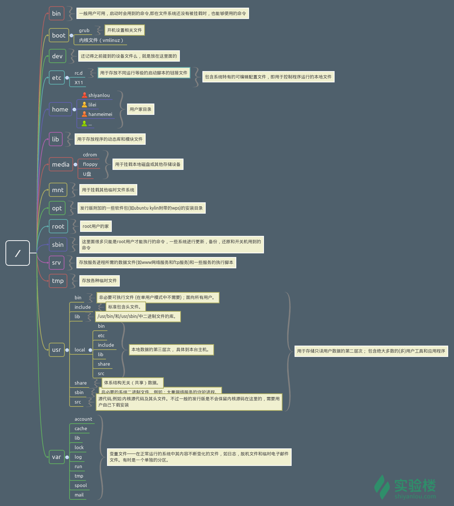

## Linux 目录结构 

### 背景知识
在讲 Linux 目录结构之前，你首先要清楚一点，那就是 Linux 的目录与 Windows 的目录的区别，或许对于一般操作上的感受来说没有多大不同，但从它们的实现机制来说是完全不同的。

一种不同是体现在目录与存储介质（磁盘，内存，DVD 等）的关系上，以往的 Windows 一直是以存储介质为主的，主要以盘符（C 盘，D 盘...）及分区来实现文件管理，然后之下才是目录，目录就显得不是那么重要，除系统文件之外的用户文件放在任何地方任何目录也是没有多大关系。所以通常 Windows 在使用一段时间后，磁盘上面的文件目录会显得杂乱无章（少数善于整理的用户除外吧）。然而 UNIX/Linux 恰好相反，UNIX 是以目录为主的，Linux 也继承了这一优良特性。 Linux 是以树形目录结构的形式来构建整个系统的，可以理解为树形目录是一个用户可操作系统的骨架。虽然本质上无论是目录结构还是操作系统内核都是存储在磁盘上的，但从逻辑上来说 Linux 的磁盘是“挂在”（挂载在）目录上的，每一个目录不仅能使用本地磁盘分区的文件系统，也可以使用网络上的文件系统。举例来说，可以利用网络文件系统（Network File System，NFS）服务器载入某特定目录等。


### FHS 标准 
Linux大部分目录结构是规定好了的（FHS 标准），是死的，当你掌握后，你在里面的一切操作都会变得井然有序。

FHS 定义了两层规范：
- 第一层是， / 下面的各个目录应该要放什么文件数据，例如 /etc 应该放置设置文件，/bin 与 /sbin 则应该放置可执行文件等等。
- 第二层则是针对 /usr 及 /var 这两个目录的子目录来定义。例如 /var/log 放置系统日志文件，/usr/share 放置共享数据等等。



```shell
# 使用 tree 命令查看目录树
$ tree -L 1 /
```
> -L 表示使用层级参数， 1表示只打印第一层目录， /表示linux根目录

FHS 是根据以往无数 Linux 用户和开发者的经验总结出来的，并且会维持更新，FHS 依据文件系统使用的频繁与否以及是否允许用户随意改动（注意，不是不能，学习过程中，不要怕这些），将目录定义为四种交互作用的形态，如下表所示：

！[](./res/FHS_folder.png)

### 目录路径
顾名思义，路径就是你要去哪儿的路线。

使用 cd 命令可以切换目录，在 Linux 里面使用 . 表示当前目录，.. 表示上一级目录（注意，我们上一节介绍过的，以 . 开头的文件都是隐藏文件，所以这两个目录必然也是隐藏的，你可以使用 ls -a 命令查看隐藏文件）, - 表示上一次所在目录，～ 通常表示当前用户的 home 目录。使用 pwd 命令可以获取当前所在路径（绝对路径）。

```shell
#进入上一级目录：
$ cd ..

#进入你的 home 目录：
$ cd ~ 
# 或者 cd /home/<你的用户名> 

#使用 pwd 获取当前路径：
$ pwd
```

绝对路径

关于绝对路径，简单地说就是以根" / "目录为起点的完整路径，以你所要到的目录为终点，表现形式如： /usr/local/bin，表示根目录下的 usr 目录中的 local 目录中的 bin 目录。


