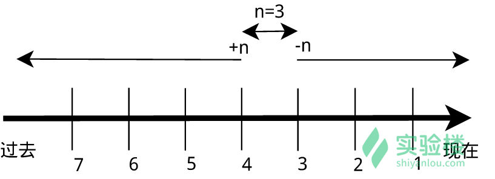

## 搜索文件
与搜索相关的命令常用的有 whereis，which，find 和 locate

- whereis 简单快速
```shell
$ whereis who
$ whereis find

who: /usr/bin/who /usr/share/man/man1/who.1.gz
find: /usr/bin/find /usr/share/man/man1/find.1.gz /usr/share/info/find.info.gz
```
> 你会看到 whereis find 找到了三个路径，两个可执行文件路径和一个 man 在线帮助文件所在路径，这个搜索很快，因为它并没有从硬盘中依次查找，而是直接从数据库中查询。whereis 只能搜索二进制文件(-b)，man 帮助文件(-m)和源代码文件(-s)。如果想要获得更全面的搜索结果可以使用 locate 命令。

- locate 快而全

通过“ /var/lib/mlocate/mlocate.db ”数据库查找，不过这个数据库也不是实时更新的，系统会使用定时任务每天自动执行 updatedb 命令更新一次，所以有时候你刚添加的文件，它可能会找不到，需要手动执行一次 updatedb 命令（在我们的环境中必须先执行一次该命令）。它可以用来查找指定目录下的不同文件类型，如查找 /etc 下所有以 sh 开头的文件：
```shell
$ sudo apt-get update
$ sudo apt-get install locate
$ locate /etc/sh

/etc/shadow
/etc/shadow-
/etc/shells
```
> 注意，它不只是在 /bin 目录下查找，还会自动递归子目录进行查找。

查找 /usr/share/ 下所有 jpg 文件：

```shell
$ locate /usr/share/\*.jpg

/usr/share/backgrounds/160218-deux-two_by_Pierre_Cante.jpg
/usr/share/backgrounds/Black_hole_by_Marek_Koteluk.jpg
.....
```
> 注意要添加 * 号前面的反斜杠转义，否则会无法找到。
> 如果想只统计数目可以加上 -c 参数，-i 参数可以忽略大小写进行查找，whereis 的 -b、-m、-s 同样可以使用。

```shell
$ locate -c /usr/share/\*.jpg

779
```

- which 小而精
which 本身是 Shell 内建的一个命令，我们通常使用 which 来确定是否安装了某个指定的软件，因为它只从 PATH 环境变量指定的路径中去搜索命令：
```shell
$ which man
```

- find 精而细

find 应该是这几个命令中最强大的了，它不但可以通过文件类型、文件名进行查找而且可以根据文件的属性（如文件的时间戳，文件的权限等）进行搜索。find 命令强大到，要把它讲明白至少需要单独好几节课程才行，我们这里只介绍一些常用的内容。

这条命令表示去 /etc/ 目录下面 ，搜索名字叫做 interfaces 的文件或者目录。这是 find 命令最常见的格式，千万记住 find 的第一个参数是要搜索的地方：
```shell
$ sudo find /etc/ -name interfaces
```
> 注意 find 命令的路径是作为第一个参数的， 基本命令格式为 find [path] [option] [action] 。

与时间相关的命令参数：

| 参数   | 说明                   |
|--------|------------------------|
| -atime | 最后访问时间           |
| -ctime | 最后修改文件内容的时间 |
| -mtime | 最后修改文件属性的时间 |

下面以 -mtime 参数举例：
- -mtime n：n 为数字，表示为在 n 天之前的“一天之内”修改过的文件
- -mtime +n：列出在 n 天之前（不包含 n 天本身）被修改过的文件
- -mtime -n：列出在 n 天之内（包含 n 天本身）被修改过的文件
- -newer file：file 为一个已存在的文件，列出比 file 还要新的文件名



列出 home 目录中，当天（24 小时之内）有改动的文件：
```shell
$ find ~ -mtime 0
```

列出用户家目录下比 Code 文件夹新的文件：
```shell
$ find ~ -newer /home/likun/Code
```

## 文件打包与压缩

### 基本概念
在 Windows 上最常见的不外乎这两种 `*.zip`，`*.7z` 后缀的压缩文件。而在 Linux 上面常见的格式除了以上两种外，还有 `.rar，*.gz，*.xz，*.bz2，*.tar，*.tar.gz，*.tar.xz，*.tar.bz2`，简单介绍如下：

| 文件后缀名 | 说明                           |
|------------|--------------------------------|
| *.zip      | zip 程序打包压缩的文件         |
| *.rar      | rar 程序压缩的文件             |
| *.7z       | 7zip 程序压缩的文件            |
| *.tar      | tar 程序打包，未压缩的文件     |
| *.gz       | gzip 程序（GNU zip）压缩的文件 |
| *.xz       | xz 程序压缩的文件              |
| *.bz2      | bzip2 程序压缩的文件           |
| *.tar.gz   | tar 打包，gzip 程序压缩的文件  |
| *.tar.xz   | tar 打包，xz 程序压缩的文件    |
| *tar.bz2   | tar 打包，bzip2 程序压缩的文件 |
| *.tar.7z   | tar 打包，7z 程序压缩的文件    |

> 我们一般只需要掌握几个命令即可，包括 zip，tar。

### zip 压缩打包程序 
- 使用 zip 打包文件夹：
```shell
$ cd /home/likun
$ zip -r -q -o test.zip /home/likun/test
$ du -h test.zip
$ file test.zip
```
> 上面命令将目录 /home/likun/test 打包成一个文件，并查看了打包后文件的大小和类型。第一行命令中，-r 参数表示递归打包包含子目录的全部内容，-q 参数表示为安静模式，即不向屏幕输出信息，-o，表示输出文件，需在其后紧跟打包输出文件名。后面使用 du 命令查看打包后文件的大小（后面会具体说明该命令）。

- 设置压缩级别为 9 和 1（9 最大，1 最小），重新打包：
```shell
$ zip -r -9 -q -o test_9.zip /home/likun/test -x ~/*.zip
$ zip -r -1 -q -o test_1.zip /home/likun/test -x ~/*.zip
```
> 这里添加了一个参数用于设置压缩级别 -[1-9]，1 表示最快压缩但体积大，9 表示体积最小但耗时最久。最后那个 -x 是为了排除我们上一次创建的 zip 文件，否则又会被打包进这一次的压缩文件中，注意：这里只能使用绝对路径，否则不起作用。

我们再用 du 命令分别查看默认压缩级别、最低、最高压缩级别及未压缩的文件的大小：
```shell
$ du -h -d 0 *.zip ~ | sort

27G	/home/likun
8.0K	test_1.zip
8.0K	test_9.zip
8.0K	test.zip
```
通过 man 手册可知：
- h， --human-readable（顾名思义，你可以试试不加的情况）
- d， --max-depth（所查看文件的深度），0表示只差看给定的根目录，1代表该目录下的所有目录和文件，依次类推
- 可以同时查看多个文件或者目录

> 这样一目了然，理论上来说默认压缩级别应该是最高的，但是由于文件不大，这里的差异不明显（几乎看不出差别），不过你在环境中操作之后看到的压缩文件大小可能跟图上的有些不同，因为系统在使用过程中，会随时生成一些缓存文件在当前用户的家目录中，这对于我们学习命令使用来说，是无关紧要的，可以忽略这些不同。

```shell
#查看 当前目录下的*.zip 和 目录home/home/abc
#并查看到第二层
$ du -h -d 2 *.zip ~/abc | sort

164K	/home/likun/abc/redis-4.0.10/utils
16M	/home/likun/abc
3.2M	/home/likun/abc/redis-4.0.10/src
4.1M	/home/likun/abc/redis-4.0.10/deps
780K	/home/likun/abc/redis-4.0.10/tests
8.0K	test_1.zip
8.0K	test_9.zip
8.0K	test.zip
```


- 创建加密 zip 包
使用 -e 参数可以创建加密压缩包
```shell
$ zip -r -e -o test_encryption.zip /home/likun/test
```
- 创建兼容windows的zip文件
```shell
$ zip -r -l -o test.zip /home/likun/test
```
> 需要加上 -l 参数


### 使用 unzip 命令解压缩 zip 文件 
将 shiyanlou.zip 解压到当前目录：
```shell
$ unzip test.zip
```
使用安静模式，将文件解压到指定目录：
```shell
$ unzip -q test.zip -d ziptest
```
上述指定目录不存在，将会自动创建。如果你不想解压只想查看压缩包的内容你可以使用 -l 参数：
```shell
$ unzip -l test.zip
```

注意： 使用 unzip 解压文件时我们同样应该注意兼容问题,原因在与中文编码的问题，通常 Windows 系统上面创建的压缩文件，如果有有包含中文的文档或以中文作为文件名的文件时默认会采用 GBK 或其它编码，而 Linux 上面默认使用的是 UTF-8 编码，如果不加任何处理，直接解压的话可能会出现中文乱码的问题（有时候它会自动帮你处理），为了解决这个问题，我们可以在解压时指定编码类型。

使用 -O（英文字母，大写 o）参数指定编码类型：
```shell
unzip -O GBK 中文压缩文件.zip
```

### tar 打包工具 
打包是指将一大堆文件或目录什么的变成一个总的文件，压缩则是将一个大的文件通过一些压缩算法变成一个小文件。为什么要区分这 两个概念呢？其实这源于Linux中的很多压缩程序只能针对一个文件进行压缩，这样当你想要压缩一大堆文件时，你就得先借助另外的工具将这一大堆文件先打 成一个包，然后再就原来的压缩程序进行压缩。

在 Linux 上面更常用的是 tar 工具，tar 原本只是一个打包工具，只是同时还是实现了对 7z、gzip、xz、bzip2 等工具的支持，这些压缩工具本身只能实现对文件或目录（单独压缩目录中的文件）的压缩，没有实现对文件的打包压缩，

- 创建一个 tar 包：
```shell
$ cd /home/likun
$ tar -cf test.tar /home/likun/test
```
> 上面命令中，-c 表示创建一个 tar 包文件，-f 用于指定创建的文件名，注意文件名必须紧跟在 -f 参数之后，比如不能写成 `tar -fc shiyanlou.tar`，可以写成 `tar -f shiyanlou.tar -c ~`。你还可以加上 -v 参数以可视的的方式输出打包的文件。上面会自动去掉表示绝对路径的 /，你也可以使用 -P 保留绝对路径符。

- 解包一个文件（-x 参数）到指定路径的已存在目录（-C 参数）：
```shell
$ mkdir tardir
$ tar -xf test.tar -C tardir
```

- 只查看不解包文件 -t 参数：
```shell
$ tar -tf test.tar
```

- 保留文件属性和跟随链接（符号链接或软链接）
有时候我们使用 tar 备份文件当你在其他主机还原时希望保留文件的属性（-p 参数）和备份链接指向的源文件而不是链接本身（-h 参数）：
```shell
$ tar -cphf etc.tar /etc
```
- 创建压缩文件
对于创建不同的压缩格式的文件，对于 tar 来说是相当简单的，需要的只是换一个参数，这里我们就以使用 gzip 工具创建 *.tar.gz 文件为例来说明。

只需要在创建 tar 文件的基础上添加 -z 参数，使用 gzip 来压缩文件
```shell
$ tar -czf test.tar.gz /home/likun/test
```

- 解压 `*.tar.gz` 文件
```shell
$ tar -xzf test.tar.gz

# 解压到指定目录 (可以使用相对路径和绝对路径)
$ tar -xzf test.tar.gz -C ./unziptest
```

现在我们要使用其它的压缩工具创建或解压相应文件只需要更改一个参数即可：

| 压缩文件格式 | 参数 |
|--------------|------|
| *.tar.gz     | -z   |
| *.tar.xz     | -J   |
| *tar.bz2     | -j   |

> tar 命令的参数很多，不过常用的就是上述这些，需要了解更多你可以查看 man 手册获取帮助。

### 总结

- zip：
 - 打包 ：zip something.zip something （目录请加 -r 参数）
 - 解包：unzip something.zip
 - 指定路径：-d 参数
- tar：
 - 打包：tar -cf something.tar something
 - 解包：tar -xf something.tar
 - 指定路径：-C 参数

