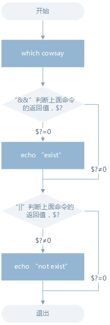

## 命令执行顺序的控制

通常情况下，我们每次只能在终端输入一条命令，按下回车执行，执行完成后，我们再输入第二条命令，然后再按回车执行……,当有时候我们会一次输入多条命令，这个时候的执行过程又是如何的呢？


- 顺序执行多条命令 
  当我们需要使用apt-get安装一个软件，然后安装完成后立即运行安装的软件（或命令工具），又恰巧你的主机才更换的软件源还没有更新软件列表,那么你可能会有如下一系列操作：
  
  ```shell
  $ sudo apt-get update
  # 等待——————————然后输入下面的命令
  $ sudo apt-get install some-tool //这里some-tool是指具体的软件包，例如：banner
  # 等待——————————然后输入下面的命令
  $ some-tool
  ```
  简单的顺序执行你可以使用;来完成，比如上述操作你可以：
  
  ```shell
  $ sudo apt-get update;sudo apt-get install some-tool;some-tool
  # 让它自己运行
  ```
  
- 有选择的执行命令 
  对与上述简单的顺序执行，在让它自动顺序执行命令时，前面的命令执行不成功，而后面的命令又依赖于上一条命令的结果，那么就会造成花了时间，最终却得到一个错误的结果，而且有时候直观的看你还无法判断结果是否正确。那么我们需要能够有选择性的来执行命令，比如上一条命令执行成功才继续下一条，或者不成功又该做出其它什么处理,比如我们使用which来查找是否安装某个命令，如果找到就执行该命令，否则什么也不做
  ```shell
  $ which cowsay>/home/likun/test && cowsay -f head-in ohch~
  ```
  > 如果没有安装cowsay，第二条命令不被执行，安装cowsay后，再执行一次上述命令，第二条命令将会被执行
  > which cowsay 返回一个cowsay的路径，并将路径写入到test文件中
  > 上面的&&就是用来实现选择性执行的，它表示如果前面的命令执行结果（不是表示终端输出的内容，而是表示命令执行状态的结果）返回0则执行后面的，否则不执行.
  使用`$?`环境变量获取上一次命令的返回结果：
  
  ```shell
  $ which cat
  $ echo $?
  # cowsay未安装
  $ which cowsay
  
  /bin/cat
  0
  cowsay not found
  1
  ```
  > 在 C 语言里面&&表示逻辑与，而且还有一个||表示逻辑或，同样 Shell 也有一个||，它们的区别就在于，shell中的这两个符号除了也可用于表示逻辑与和或之外，就是可以实现这里的命令执行顺序的简单控制。||在这里就是与&&相反的控制效果，当上一条命令执行结果为≠0($?≠0)时则执行它后面的命令：
  
  ```shell
  $ which cowsay>/dev/null || echo "cowsay has not been install, please run 'sudo apt-get install cowsay' to install"
  
  ```
  
  可以结合着&&和||来实现一些操作，比如：
  ```shell
  $ which cowsay>/dev/null && echo "exist" || echo "not exist"
  
  # cowsay未安装
  not exist
  ```
  
  流程如下：
  
  
## 管道
管道是一种通信机制，通常用于进程间的通信（也可通过socket进行网络通信），它表现出来的形式就是将前面每一个进程的输出(stdout)直接作为下一个进程的输入(stdin)。
管道又分为匿名管道和具名管道，我们在使用一些过滤程序时经常会用到的就是匿名管道，在命令行中由|分隔符表示，|在前面的内容中我们已经多次使用到了。具名管道简单的说就是有名字的管道，通常只会在源程序中用到具名管道。

- 用与一行一行查看命令的输出
  ```shell
  $ ls -al /etc | less
  ```
- cut 命令，打印每一行的某一字段 
  打印/etc/passwd文件中以:为分隔符的第1个字段和第6个字段分别表示用户名和其家目录：
  
  ```shell
  # likun:x:1000:1000:LiKun,,,:/home/likun:/usr/bin/zsh
  $ cut /etc/passwd -d ':' -f 1,6
  
  likun:/home/likun
  ...
  ```
  打印/etc/passwd文件中每一行的前N个字符：
  
  ```shell
  # 前五个（包含第五个）
  $ cut /etc/passwd -c -5
  # 前五个之后的（包含第五个）
  $ cut /etc/passwd -c 5-
  # 第五个
  $ cut /etc/passwd -c 5
  # 2到5之间的（包含第五个）
  $ cut /etc/passwd -c 2-5
  ```
- grep 命令，在文本中或 stdin 中查找匹配字符串 
  grep命令是很强大的，也是相当常用的一个命令，它结合正则表达式可以实现很复杂却很高效的匹配和查找。
  
  grep命令的一般形式为：
  ```shell
  grep [命令选项]... 用于匹配的表达式 [文件]...
  ```
  
  搜索/home/likun目录下所有包含"likun"的文本文件，并显示出现在文本中的行号：
  ```shell
  $ grep -rnI "likun" ~
  ```
  > -r 参数表示递归搜索子目录中的文件,-n表示打印匹配项行号，-I表示忽略二进制文件。
  
  匹配字段中使用正则表达式:
  ```shell
  # 查看环境变量中以"kun"结尾的字符串
  $ export | grep ".*kun$"
  ```
  > 其中$就表示一行的末尾
  
- wc 命令，简单小巧的计数工具 
  wc 命令用于统计并输出一个文件中行、单词和字节的数目，比如输出/etc/passwd文件的统计信息:
  
  

  
  
  
  
  
