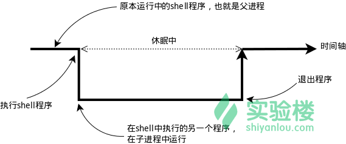

## 环境变量

### 变量

要解释环境变量，得先明白变量是什么，准确的说应该是 Shell 变量，所谓变量就是计算机中用于记录一个值（不一定是数值，也可以是字符或字符串）的符号，而这些符号将用于不同的运算处理中。通常变量与值是一对一的关系，可以通过表达式读取它的值并赋值给其它变量，也可以直接指定数值赋值给任意变量。为了便于运算和处理，大部分的编程语言会区分变量的类型，用于分别记录数值、字符或者字符串等等数据类型。Shell 中的变量也基本如此，有不同类型（但不用专门指定类型名），可以参与运算，有作用域限定。

> 变量的作用域即变量的有效范围（比如一个函数中、一个源文件中或者全局范围），在该范围内只能有一个同名变量。一旦离开则该变量无效，如同不存在这个变量一般。

变量类型

运行shell时，会同时存在三种变量：
- 局部变量 局部变量在脚本或命令中定义，仅在当前shell实例中有效，其他shell启动的程序不能访问局部变量。
- 环境变量 所有的程序，包括shell启动的程序，都能访问环境变量，有些程序需要环境变量来保证其正常运行。必要的时候shell脚本也可以定义环境变量。
- shell变量 shell变量是由shell程序设置的特殊变量。shell变量中有一部分是环境变量，有一部分是局部变量，这些变量保证了shell的正常运行

在 Shell 中如何创建一个变量,使用 declare 命令创建一个变量名为 tmp 的变量：

```shell
$ declare tmp
```
> 其实也可以不用 declare 预声明一个变量，直接即用即创建，这里只是告诉你 declare 的作用，这在创建其它指定类型的变量（如数组）时会用到。

使用 = 号赋值运算符，将变量 tmp 赋值为 likun：

```shell
$ tmp=likun
```

读取变量的值，使用 echo 命令和 $ 符号（$ 符号用于表示引用一个变量的值）：

```shell
$ echo $tmp
```
> 注意：并不是任何形式的变量名都是可用的，变量名只能是英文字母、数字或者下划线，且不能以数字作为开头。

### 环境变量
简单理解了变量的概念，就很容易理解环境变量了。环境变量的作用域比自定义变量的要大，如 Shell 的环境变量作用于自身和它的子进程。在所有的 UNIX 和类 UNIX 系统中，每个进程都有其各自的环境变量设置，且默认情况下，当一个进程被创建时，除了创建过程中明确指定的话，它将继承其父进程的绝大部分环境设置。Shell 程序也作为一个进程运行在操作系统之上，而我们在 Shell 中运行的大部分命令都将以 Shell 的子进程的方式运行。



通常我们会涉及到的变量类型有三种：
- 当前 Shell 进程私有用户自定义变量，如上面我们创建的 tmp 变量，只在当前 Shell 中有效。
- Shell 本身内建的变量。
- 从自定义变量导出的环境变量。

也有三个与上述三种环境变量相关的命令：set，env，export。这三个命令很相似，都是用于打印环境变量信息，区别在于涉及的变量范围不同。详见下表：

| 命 令  | 说 明 |
|--------|-----------------------------------------------|
| set    | 显示当前 Shell 所有变量，包括其内建环境变量（与 Shell 外观等相关），用户自定义变量及导出的环境变量。 |
| env    | 显示与当前用户相关的环境变量，还可以让命令在指定环境中运行。|
| export | 显示从 Shell 中导出成环境变量的变量，也能通过它将自定义变量导出为环境变量。 |


你可以更直观的使用 vimdiff 工具比较一下它们之间的差别：
```shell
$ temp=likun
$ export temp_env=likun
$ env|sort>env.txt
$ export|sort>export.txt
$ set|sort>set.txt
$ ls *.txt
```
> 上述操作将命令输出通过管道 | 使用 sort 命令排序，再重定向到对象文本文件中。

使用 vimdiff 工具比较导出的几个文件的内容：
```shell
$ vimdiff env.txt export.txt set.txt
```

关于哪些变量是环境变量，可以简单地理解成在当前进程的子进程有效则为环境变量，否则不是（有些人也将所有变量统称为环境变量，只是以全局环境变量和局部环境变量进行区分，我们只要理解它们的实质区别即可）。这里用 export 命令来体会一下，先在 Shell 中设置一个变量 temp=likun，然后再新创建一个子 Shell 查看 temp 变量的值：
```shell
➜  ~ temp=likun
➜  ~ echo $temp
likun
➜  ~ bash
likun@Ubuntu16:~$ echo $temp

likun@Ubuntu16:~$ zsh
➜  ~ export temp
➜  ~ bash
likun@Ubuntu16:~$ echo $temp

# 结果不对。。。
```
> 注意：为了与普通变量区分，通常我们习惯将环境变量名设为大写。

### 永久生效

按变量的生存周期来划分，Linux 变量可分为两类：
- 永久的：需要修改配置文件，变量永久生效；
- 临时的：使用 export 命令行声明即可，变量在关闭 shell 时失效。

这里介绍两个重要文件 /etc/bashrc（有的 Linux 没有这个文件） 和 /etc/profile ，它们分别存放的是 shell 变量和环境变量。

还有要注意区别的是每个用户目录下的一个隐藏文件：
```shell
#.profile 可以用 ls -a 查看
$ cd /home/likun
$ ls -a 
$ cat .profile
```
> 这个 .profile 只对当前用户永久生效。而写在 /etc/profile 里面的是对所有用户永久生效，所以如果想要添加一个永久生效的环境变量，只需要打开 /etc/profile，在最后加上你想添加的环境变量就好啦。

## 命令的查找路径与顺序 
你可能很早之前就有疑问，我们在 Shell 中输入一个命令，Shell 是怎么知道去哪找到这个命令然后执行的呢？这是通过环境变量 PATH 来进行搜索的，熟悉 Windows 的用户可能知道 Windows 中的也是有这么一个 PATH 环境变量。这个 PATH 里面就保存了 Shell 中执行的命令的搜索路径。

查看 PATH 环境变量的内容：
```shell
$ echo $PATH

/opt/ros/kinetic/bin:/home/likun/bin:/home/likun/.local/bin:/usr/local/sbin:/usr/local/bin:/usr/sbin:/usr/bin:/sbin:/bin:/usr/games:/usr/local/games:/snap/bin
```
>通常这一类目录下放的都是可执行文件，当我们在 Shell 中执行一个命令时，系统就会按照 PATH 中设定的路径按照顺序依次到目录中去查找，如果存在同名的命令，则执行先找到的那个。

下面我们将练习创建一个最简单的可执行 Shell 脚本和一个使用 C 语言创建的“ hello world ”程序:
创建一个 Shell 脚本文件：
```shell
$ cd /home/likun
$ touch hello_shell.sh
$ gedit hello_shell.sh
```
在脚本中添加如下内容，保存并退出（注意不要省掉第一行，这不是注释）
```
#!/bin/bash

for ((i=0; i<10; i++));do
    echo "hello shell"
done

exit 0
```
为文件添加可执行权限：

```shell
$ chmod 755 hello_shell.sh
```
执行脚本：
```shell
$ cd /home/likun
$ ./hello_shell.sh

hello shell
hello shell
....
```

创建一个 C 语言“ hello world ”程序：
```shell
$ cd /home/likun
$ gedit hello_world.c
```
```c
#include <stdio.h>

int main(void)
{
    printf("hello world!\n");
    return 0;
}
```
保存后使用 gcc 生成可执行文件：
```shell
$ gcc -o hello_world hello_world.c
```
> gcc 生成二进制文件默认具有可执行权限，不需要修改

在 /home/likun 家目录创建一个 mybin 目录，并将上述 hello_shell.sh 和 hello_world 文件移动到其中,并运行：
```shell
$ cd /home/shiyanlou
$ mkdir mybin
$ mv hello_shell.sh hello_world mybin/
$ cd mybin
$ ./hello_shell.sh
$ ./hello_world
```

> 回到上一级目录，也就是 likun 家目录，当再想运行那两个程序时，会发现提示命令找不到，除非加上命令的完整路径，但那样很不方便，如何做到像使用系统命令一样执行自己创建的脚本文件或者程序呢？那就要将命令所在路径添加到 PATH 环境变量了。

### 添加自定义路径到“ PATH ”环境变量
在前面我们应该注意到 PATH 里面的路径是以 `:` 作为分割符的，所以我们可以这样添加自定义路径：
```shell
$ PATH=$PATH:/home/likun/mybin
```
> 注意这里一定要使用绝对路径。

现在你就可以在任意目录执行那两个命令了（注意需要去掉前面的 ./）。
```shell
$ hello_shell.sh
$ hello_world
```

你可能会意识到这样还并没有很好的解决问题，因为我给 PATH 环境变量追加了一个路径，它也只是在当前 Shell 有效，我一旦退出终端，再打开就会发现又失效了。有没有方法让添加的环境变量全局有效？或者每次启动 Shell 时自动执行上面添加自定义路径到 PATH 的命令？下面我们就来说说后一种方式——让它自动执行。

在每个用户的 home 目录中有一个 Shell 每次启动时会默认执行一个配置脚本，以初始化环境，包括添加一些用户自定义环境变量等等。zsh 的配置文件是 .zshrc，相应 Bash 的配置文件为 .bashrc 。它们在 etc 下还都有一个或多个全局的配置文件，不过我们一般只修改用户目录下的配置文件。

我们可以简单地使用下面命令直接添加内容到 .zshrc 中：
```shell
$ echo "PATH=$PATH:/home/likun/mybin" >> .zshrc
```
> 上述命令中 `>>` 表示将标准输出以追加的方式重定向到一个文件中，注意前面用到的 `>` 是以覆盖的方式重定向到一个文件中，使用的时候一定要注意分辨。在指定文件不存在的情况下都会创建新的文件。

### 修改和删除已有变量 
变量修改

变量的修改有以下几种方式：

| 变量设置方式                 | 说明                                         |
|------------------------------|----------------------------------------------|
| ${变量名#匹配字串}           | 从头向后开始匹配，删除符合匹配字串的最短数据 |
| ${变量名##匹配字串}          | 从头向后开始匹配，删除符合匹配字串的最长数据 |
| ${变量名%匹配字串}           | 从尾向前开始匹配，删除符合匹配字串的最短数据 |
| ${变量名%%匹配字串}          | 从尾向前开始匹配，删除符合匹配字串的最长数据 |
| ${变量名/旧的字串/新的字串}  | 将符合旧字串的第一个字串替换为新的字串       |
| ${变量名//旧的字串/新的字串} | 将符合旧字串的全部字串替换为新的字串         |

比如要修改我们前面添加到 PATH 的环境变量。为了避免操作失误导致命令找不到，我们先将 PATH 赋值给一个新的自定义变量 path：

```shell
$ path=$PATH
$ echo $path
$ path=${path%/home/likun/mybin}
# 或使用通配符,*表示任意多个任意字符
$ path=${path%*/mybin}
```

变量删除

可以使用 unset 命令删除一个环境变量：
```shell
$ unset temp
```

### 如何让环境变量立即生效
前面我们在 Shell 中修改了一个配置脚本文件之后（比如 zsh 的配置文件 home 目录下的 .zshrc），每次都要退出终端重新打开甚至重启主机之后其才能生效，很是麻烦，我们可以使用 source 命令来让其立即生效，如：
```shell
$ cd /home/shiyanlou
$ source .zshrc
```
source 命令还有一个别名就是 .，上面的命令如果替换成 . 的方式就该是：
```shell
$ . ./.zshrc
```
> 在使用.的时候，需要注意与表示当前路径的那个点区分开。
> 注意第一个点后面有一个空格，而且后面的文件必须指定完整的绝对或相对路径名，source 则不需要。


### source命令（.命令）

```shell
$ source filename    # filename必须是可执行的脚本文件
# 或者
$ . filename         # 注意“.”号后面还有一个空格
```

功能：
 - **通知当前shell读入路径为filename的文件并依次执行文件中的所有语句**。
 - 通常用于重新执行刚修改的初始化文件，使之立即生效，而不必注销并重新登录。例如，当我们修改了/etc/profile文件，并想让它立刻生效，而不用重新登录，就可以使用source命令，如“source /etc/profile”。再如，修改了zsh-shell 的 .zshrc 文件，使用“source .zshrc” 使修改立即生效。
 - source命令是bash shell的内置命令。而点命令（即“.”命令）则是source的另一名称。这两个命令都以一个脚本为参数，该脚本将作为当前shell的环境执行，即不会启动一个新的子进程。所有在脚本中设置的变量将成为当前Shell的一部分。

比较：

“source filename”与“sh filename”、“./filename”这三个命令都可以用于执行一个脚本文件，那么它们之间的区别又如何呢？
> 当前文件夹的一个脚本文件

- 当shell脚本具有可执行权限时，用sh filename (rw即可)与./filename是没有区别的。./filename是因为当前目录没有在PATH中，所以”.”是用来表示当前目录的。
- sh filename和./filename会重新建立一个子shell，在子shell中执行脚本里面的语句，该子shell继承父shell的环境变量，但子shell是新建的，其改变的变量不会被带回父shell，除非使用export。
- source filename读取脚本里面的语句依次在当前shell里面执行，没有建立新的子shell。那么脚本里面所有新建、改变变量的语句都会保存在当前shell里面。

举例：
```shell
#新建一个test.sh脚本，内容为:A=1；
$ touch test.sh
$ echo '#!/bin/bash\nA=1' > test.sh

#修改其可执行权限：chmod +x test.sh；
$ chmod u+x test.sh

#运行sh test.sh后，echo $A，显示为空，因为A=1并未传回给当前shell；
$ sh test.sh
$ echo $A

#运行./test.sh后，也是一样的效果；
$ ./test.sh
$ echo $A

#运行source test.sh 或者 . test.sh，然后echo $A，则会显示1，说明A=1的变量在当前shell中；
$ source test.sh
$ echo $A

1
```

如果使用export命令从shell子进程中声明该变量到环境变量（临时的，并且只在该父shell中有效），父进程shell就可以使用该变量

```shell
$ echo '#!/bin/bash\nA=1\nexport A' > test.sh
$ sh test.sh
$ echo $A

1
```

> 如果将环境变量写进一个脚本文件，就需要使用source命令来执行，否则，该环境变量无法在当前shell中使用。

> /home/likun/.zshrc（.bashrc）中的内容在每次自动shell的时候会被shell自动被运行。


## source命令的另一个应用
在开发中，经常会需要重复在shell输入并运行多行命令，比如编译工程，安装软件等。此时可以借助source 命令完成。

在编译工程时，经常要在shell运行多行命令，比如：
```shell
$ make mrproper
$ make menuconfig
$ make dep
.....
```
可以将这些命令写到一个脚本文件中，直接使用source命令执行这个脚本文件就省去多次输入多条命令的操作。

make_command.sh
```shell
make mrproper &&
make menuconfig &&
make dep &&
cp arch/i386/boot/bzImge /boot/vmlinuz_new &&
cp System.map /boot
```
在shell中运行:

```shell
$ source make_command.sh
```

> &&表示与，||表示或。把两个命令用&&联接起来，如 make mrproper && make menuconfig，表示要第一个命令执行成功才能执行第二个命令。对执行顺序有要求的命令能保证一旦有错误发生，下面的命令不会盲目地继续执行。


再比如创建，初始化并编译ros工作空间：

ros_workspace.sh:

```shell
#!/bin/bash
mkdir -p ~/catkin_ws/src &&
cd ~/catkin_ws/src &&
catkin_init_workspace &&
cd ~/catkin_ws &&
catkin_make &&
```

