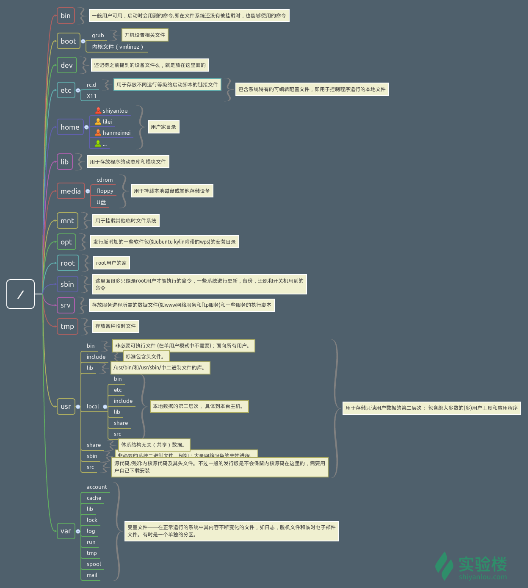

## Linux 目录结构 

### 背景知识
在讲 Linux 目录结构之前，你首先要清楚一点，那就是 Linux 的目录与 Windows 的目录的区别，或许对于一般操作上的感受来说没有多大不同，但从它们的实现机制来说是完全不同的。

一种不同是体现在目录与存储介质（磁盘，内存，DVD 等）的关系上，以往的 Windows 一直是以存储介质为主的，主要以盘符（C 盘，D 盘...）及分区来实现文件管理，然后之下才是目录，目录就显得不是那么重要，除系统文件之外的用户文件放在任何地方任何目录也是没有多大关系。所以通常 Windows 在使用一段时间后，磁盘上面的文件目录会显得杂乱无章（少数善于整理的用户除外吧）。然而 UNIX/Linux 恰好相反，UNIX 是以目录为主的，Linux 也继承了这一优良特性。 Linux 是以树形目录结构的形式来构建整个系统的，可以理解为树形目录是一个用户可操作系统的骨架。虽然本质上无论是目录结构还是操作系统内核都是存储在磁盘上的，但从逻辑上来说 Linux 的磁盘是“挂在”（挂载在）目录上的，每一个目录不仅能使用本地磁盘分区的文件系统，也可以使用网络上的文件系统。举例来说，可以利用网络文件系统（Network File System，NFS）服务器载入某特定目录等。


### FHS 标准 
Linux大部分目录结构是规定好了的（FHS 标准），是死的，当你掌握后，你在里面的一切操作都会变得井然有序。

FHS 定义了两层规范：
- 第一层是， / 下面的各个目录应该要放什么文件数据，例如 /etc 应该放置设置文件，/bin 与 /sbin 则应该放置可执行文件等等。
- 第二层则是针对 /usr 及 /var 这两个目录的子目录来定义。例如 /var/log 放置系统日志文件，/usr/share 放置共享数据等等。



```shell
# 使用 tree 命令查看目录树
$ tree -L 1 /
```
> -L 表示使用层级参数， 1表示只打印第一层目录， /表示linux根目录

FHS 是根据以往无数 Linux 用户和开发者的经验总结出来的，并且会维持更新，FHS 依据文件系统使用的频繁与否以及是否允许用户随意改动（注意，不是不能，学习过程中，不要怕这些），将目录定义为四种交互作用的形态，如下表所示：


### 目录路径
顾名思义，路径就是你要去哪儿的路线。

使用 cd 命令可以切换目录，在 Linux 里面使用 . 表示当前目录，.. 表示上一级目录（注意，我们上一节介绍过的，以 . 开头的文件都是隐藏文件，所以这两个目录必然也是隐藏的，你可以使用 ls -a 命令查看隐藏文件）, - 表示上一次所在目录，～ 通常表示当前用户的 home 目录。使用 pwd 命令可以获取当前所在路径（绝对路径）。

```shell
#进入上一级目录：
$ cd ..

#进入你的 home 目录：
$ cd ~ 
# 或者 cd /home/<你的用户名> 

#使用 pwd 获取当前路径：
$ pwd
```

绝对路径

关于绝对路径，简单地说就是以根" / "目录为起点的完整路径，以你所要到的目录为终点，表现形式如： /usr/local/bin，表示根目录下的 usr 目录中的 local 目录中的 bin 目录。

相对路径

相对路径，也就是相对于你当前的目录的路径，相对路径是以当前目录 . 为起点，以你所要到的目录为终点，表现形式如： usr/local/bin （这里假设你当前目录为根目录）。你可能注意到，我们表示相对路径实际并没有加上表示当前目录的那个 . ，而是直接以目录名开头，因为这个 usr 目录为 / 目录下的子目录，是可以省略这个 . 的（以后会讲到一个类似不能省略的情况）；如果是当前目录的上一级目录，则需要使用 .. ，比如你当前目录为 home 目录，根目录就应该表示为 ../../ ，表示上一级目录（ home 目录）的上一级目录（ / 目录）。

以home目录为起点，分别以绝对路径和相对路径的方式进入 /usr/local/bin 目录：
```shell
# 绝对路径
$ cd /usr/local/bin
# 相对路径
$ cd ../../usr/local/bin
```

## Linux 文件的基本操作 Linux 文件的基本操作 
文件常用的基本操作，包括：新建、复制、删除、移动文件与文件重命名、查看文件、查看文件类型、以及编辑文件。

### 新建

新建空白文件

使用 touch 命令创建空白文件，关于 touch 命令，其主要作用是来更改已有文件的时间戳的（比如，最近访问时间，最近修改时间），但其在不加任何参数的情况下，只指定一个文件名，则可以创建一个指定文件名的空白文件（不会覆盖已有同名文件），当然你也可以同时指定该文件的时间戳

创建名为 test 的空白文件，因为在其它目录没有权限，所以需要先 cd ~ 切换回用户的 /home/likun 目录：
```python
$ cd /home/likun
# 或者 cd ~
$ touch test
```
新建目录

使用 mkdir（make directories）命令可以创建一个空目录，也可同时指定创建目录的权限属性。

创建名为“ mydir ”的空目录：
```shell
$ mkdir mydir
```

使用 -p 参数，同时创建父目录（如果不存在该父目录），如下我们同时创建一个多级目录（这在安装软件、配置安装路径时非常有用）：
```shell
$ mkdir -p father/son/grandson
```

### 复制
复制文件

使用 cp（copy）命令复制一个文件到指定目录。

将之前创建的“ test ”文件复制到“ /home/likun/father/son/grandson ”目录中：
```shell
$ cp test father/son/grandson
```
复制目录

如果直接使用 cp 命令复制一个多层目录的话，会出现如下错误：
```shell
mkdir family
cp father family
```
要成功复制目录需要加上 -r 或者 -R 参数，表示递归复制，就是说有点“株连九族”的意思：
```shell
$ cd /home/shiyanlou
$ mkdir family
$ cp -r father family
```

### 删除
删除文件

使用 rm（remove files or directories）命令删除一个文件：
```shell
$rm test
```
有时候你会遇到想要删除一些为只读权限的文件，直接使用 rm 删除会显示一个提示，如下：
```shell
$touch test
$chmod 444 test
$ll test
$rm test
$rm -f test
```
> 你如果想忽略这提示，直接删除文件，可以使用 -f 参数强制删除：`rm -f test`

删除目录

跟复制目录一样，要删除一个目录，也需要加上 -r 或 -R 参数：
```shell
$ rm -r family
```

### 移动文件与文件重命名
移动文件

使用 mv（move or rename files）命令移动文件（剪切）。将文件“ file1 ”移动到 Documents 目录：

mv 源目录文件 目的目录：
```shell
$ mkdir Documents
$ touch file1
$ mv file1 Documents
```
重命名文件

将文件“ file1 ”重命名为“ myfile ”：

mv 旧的文件名 新的文件名：
```shell
$ mv file1 myfile
```
批量重命名

要实现批量重命名，mv 命令就有点力不从心了，我们可以使用一个看起来更专业的命令 rename 来实现。不过它要用 perl 正则表达式来作为参数，这里只做演示.

```shell
$ cd /home/likun/

# 使用通配符批量创建 5 个文件:
$ touch file{1..5}.txt

# 批量将这 5 个后缀为 .txt 的文本文件重命名为以 .c 为后缀的文件:
$ rename 's/\.txt/\.c/' *.txt

# 批量将这 5 个文件，文件名和后缀改为大写:
$ rename 'y/a-z/A-Z/' *.c
```
> rename 是先使用第二个参数的通配符匹配所有后缀为 .txt 的文件，然后使用第一个参数提供的正则表达式将匹配的这些文件的 .txt 后缀替换为 .c

### 查看文件 
使用 cat，tac 和 nl 命令查看文件
- 前两个命令都是用来打印文件内容到标准输出（终端），其中 cat 为正序显示，tac 为倒序显示。
> 标准输入输出：当我们执行一个 shell 命令行时通常会自动打开三个标准文件，即标准输入文件（stdin），默认对应终端的键盘、标准输出文件（stdout）和标准错误输出文件（stderr），后两个文件都对应被重定向到终端的屏幕，以便我们能直接看到输出内容。进程将从标准输入文件中得到输入数据，将正常输出数据输出到标准输出文件，而将错误信息送到标准错误文件中。

比如我们要查看之前从 /etc 目录下拷贝来的 passwd 文件：
```shell
$ cd /home/likun
$ cp /etc/passwd passwd
$ cat passwd
```
可以加上 -n 参数显示行号：
```shell
$ cat -n passwd
```

`nl`命令，添加行号并打印，这是个比 `cat -n` 更专业的行号打印命令。

这里简单列举它的常用的几个参数：
```shell
-b : 指定添加行号的方式，主要有两种：
    -b a:表示无论是否为空行，同样列出行号("cat -n"就是这种方式)
    -b t:只列出非空行的编号并列出（默认为这种方式）
-n : 设置行号的样式，主要有三种：
    -n ln:在行号字段最左端显示
    -n rn:在行号字段最右边显示，且不加 0
    -n rz:在行号字段最右边显示，且加 0
-w : 行号字段占用的位数(默认为 6 位)
```
```shell
$ nl -b a passwd
```
使用 more 和 less 命令分页查看文件

使用 more 命令打开 passwd 文件：
```shell
$ more passwd
```
> 打开后默认只显示一屏内容，终端底部显示当前阅读的进度。可以使用 Enter 键向下滚动一行，使用 Space 键向下滚动一屏，按下 h 显示帮助，q 退出。

使用 head 和 tail 命令查看文件

只查看文件的头几行（默认为 10 行，不足 10 行则显示全部）和尾几行。
```shell
$ tail /etc/passwd

# 甚至更直接的只看一行， 加上 -n 参数，后面紧跟行数：
$ tail -n 1 /etc/passwd
```
> 关于 tail 命令，不得不提的还有它一个很牛的参数 -f，这个参数可以实现不停地读取某个文件的内容并显示。这可以让我们动态查看日志，达到实时监视的目的。

### 查看文件类型 
在 Linux 中文件的类型不是根据文件后缀来判断的，我们通常使用 file 命令查看文件的类型：

```shell
$ file /bin/ls

/bin/ls: ELF 64-bit LSB executable, x86-64, version 1 (SYSV), dynamically linked, interpreter /lib64/l, for GNU/Linux 2.6.32, BuildID[sha1]=d0bc0fb9b3f60f72bbad3c5a1d24c9e2a1fde775, stripped
```
> 说明这是一个可执行文件，运行在 64 位平台，并使用了动态链接文件（共享库）。

### 编辑文件 
在 Linux 下面编辑文件通常我们会直接使用专门的命令行编辑器比如（emacs，vim，nano）,同时也可以使用类似与window系统下的记事本程序编辑，如sublime text， gedit。
vim作为文本编辑器十分强大，可以只使用键盘进行操作，但是需要一定时间练习。
