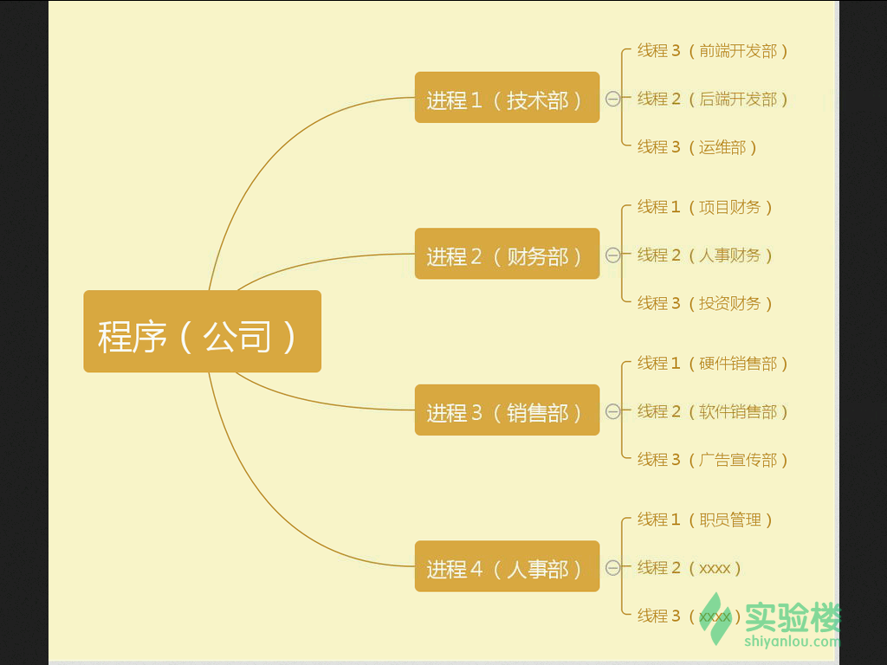

## 概念

首先程序与进程是什么？程序与进程又有什么区别？

- 程序（procedure）：
  不太精确地说，程序就是执行一系列有逻辑、有顺序结构的指令，帮我们达成某个结果。就如我们去餐馆，给服务员说我要牛肉盖浇饭，她执行了做牛肉盖浇饭这么一个程序，最后我们得到了这么一盘牛肉盖浇饭。它需要去执行，不然它就像一本武功秘籍，放在那里等人翻看。
- 进程（process）：
  进程是程序在一个数据集合上的一次执行过程，在早期的UNIX、Linux 2.4及更早的版本中，它是系统进行资源分配和调度的独立基本单位。同上一个例子，就如我们去了餐馆，给服务员说我要牛肉盖浇饭，她执行了做牛肉盖浇饭这么一个程序，而里面做饭的是一个进程，做牛肉汤汁的是一个进程，把牛肉汤汁与饭混合在一起的是一个进程，把饭端上桌的是一个进程。它就像是我们在看武功秘籍这么一个过程，然后一个篇章一个篇章地去练。

简单来说，程序是为了完成某种任务而设计的软件，比如 vim 是程序。什么是进程呢？进程就是运行中的程序。

程序只是一些列指令的集合，是一个静止的实体，而进程不同，进程有以下的特性：

- 动态性：进程的实质是一次程序执行的过程，有创建、撤销等状态的变化。而程序是一个静态的实体。
- 并发性：进程可以做到在一个时间段内，有多个程序在运行中。程序只是静态的实体，所以不存在并发性。
- 独立性：进程可以独立分配资源，独立接受调度，独立地运行。
- 异步性：进程以不可预知的速度向前推进。
- 结构性：进程拥有代码段、数据段、PCB（进程控制块，进程存在的唯一标志）。也正是因为有结构性，进程才可以做到独立地运行。

> 并发：在一个时间段内，宏观来看有多个程序都在活动，有条不紊的执行（每一瞬间只有一个在执行，只是在一段时间有多个程序都执行过）
> 并行：在每一个瞬间，都有多个程序都在同时执行，这个必须有多个 CPU 才行

引入进程是因为传统意义上的程序已经不足以描述 OS 中各种活动之间的动态性、并发性、独立性还有相互制约性。程序就像一个公司，只是一些证书，文件的堆积（静态实体）。而当公司运作起来就有各个部门的区分，财务部，技术部，销售部等等，就像各个进程，各个部门之间可以独立运做，也可以有交互（独立性、并发性）。

而随着程序的发展越做越大，又会继续细分，从而引入了线程的概念，当代多数操作系统、Linux 2.6及更新的版本中，进程本身不是基本运行单位，而是线程的容器。就像上述所说的，每个部门又会细分为各个工作小组（线程），而工作小组需要的资源需要向上级（进程）申请。

> 线程（thread）是操作系统能够进行运算调度的最小单位。它被包含在进程之中，是进程中的实际运作单位。一条线程指的是进程中一个单一顺序的控制流，一个进程中可以并发多个线程，每条线程并行执行不同的任务。因为线程中几乎不包含系统资源，所以执行更快、更有效率。

简而言之,一个程序至少有一个进程,一个进程至少有一个线程。线程的划分尺度小于进程，使得多线程程序的并发性高。另外，进程在执行过程中拥有独立的内存单元，而多个线程共享内存，从而极大地提高了程序的运行效率。就如下图所示：

