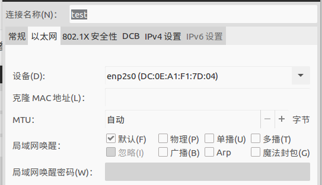
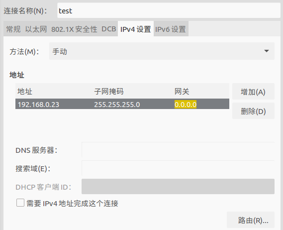

## driver package install
```shell
mkdir -p ~/ifF/src
cd ~/ifF/src
catkin_init_workspace
cd ~/ifF
catkin_make
echo "source ~/ifF/devel/setup.zsh" >> ~/.zshrc
cd ~/ifF/src
git clone https://github.com/astuff/network_interface
git clone https://github.com/astuff/ibeo_core
git clone https://github.com/astuff/ibeo_lux.git
git clone https://github.com/astuff/astuff_sensor_msgs.git
cd ~/ifF
# rosdep install --from-paths src --ignore-src --rosdistro=kinetic -y
catkin_make
```

## Package的结构

```
➜  ibeo_lux git:(master) tree
.
├── CHANGELOG.rst
├── CMakeLists.txt
├── include
│   └── ibeo_lux
│       ├── ibeo_lux_common.h
│       └── ibeo_lux_ros_msg_handler.h
├── launch
│   ├── ibeo_lux.launch
│   └── ibeo_lux_transform.launch
├── LICENSE
├── package.xml
├── README.md
└── src
    ├── ibeo_lux_ros_msg_handler.cpp
    └── ros_ibeo_lux.cpp
```

## launch files

### ibeo_lux节点的参数：

`~ip_address`
  The IP address of the sensor or ECU. 

`~port`
  The TCP port on which to listen for the data from the sensor or ECU. 

`~is_fusion`
  Whether the IP address above points to a fusion ECU (`true`) or a single sensor (`false`). 

`~sensor_frame_id`
  The frame_id to be used for all published data from the sensor. 

### ibeo ECU参数：

ibeo ECU的ip默认配置为：

- Eth1(与电脑链接或其他采集设备)：192.168.0.100
- Eth2(与激光传感器的集线器连接)：10.152.36.100

### ibeo_lux.launch

```xml
<?xml version="1.0"?>
<launch>
  <arg name="lux_frame_id" default="ibeo_lux"/>
  <arg name="is_fusion" default="false"/>
  <arg name="name" default="ibeo_lux"/>
  <arg name="ip_address" default="192.168.0.1"/>
  <arg name="port" default="12002"/>

  <node pkg="ibeo_lux" type="ibeo_lux" name="$(arg name)">
    <param name="ip_address" value="$(arg ip_address)"/>
    <param name="port" type="int" value="$(arg port)"/>
    <param name="sensor_frame_id" value="$(arg lux_frame_id)"/>           
    <param name="is_fusion" type="bool" value="$(arg is_fusion)"/>           
  </node>
</launch>
```

### ibeo_lux_transform.launch

```xml
<?xml version="1.0"?>
<launch>
  <arg name="veh_frame_id" default="base_link"/>
  <arg name="lux_frame_id" default="ibeo_lux"/>
  <arg name="is_fusion_ecu" default="false"/>
  <arg name="name" default="ibeo_lux"/>
  <arg name="ip_address" default="192.168.0.1" />
  <arg name="port" default="12002" />

  <node pkg="tf" type="static_transform_publisher" name="$(arg veh_frame_id)_to_$(arg lux_frame_id)" args="0 0 0 0 0 0 $(arg veh_frame_id) $(arg lux_frame_id) 100"/>

  <include file="$(find ibeo_lux)/launch/ibeo_lux.launch">
    <arg name="ip_address" value="$(arg ip_address)"/>
    <arg name="port" value="$(arg port)"/>
    <arg name="lux_frame_id" value="$(arg lux_frame_id)"/>           
    <arg name="is_fusion" value="$(arg is_fusion_ecu)"/>           
    <arg name="name" value="$(arg name)"/>           
  </include>
</launch>
```

- 如果想采集Fusion ECU的数据需要修改ibeo_lux_transform.launch参数
  - ` <arg name="is_fusion_ecu" default="true"/>`
  - `<arg name="ip_address" default="192.168.0.100" />`


参考：

http://wiki.ros.org/ibeo_lux

https://www.jianshu.com/p/2abb9db80d6c


Ubuntu主机IP地址配置：

前提条件：Fusion ECU的ip地址为 `192.168.0.100`，属于C类IP地址，C类IP地址的子网掩码为255.255.255.0

设置Ubuntu主机的以太网（即有线连接）为静态IP地址，并且需要与Fusion ECU在同一子网中（`192.168.0.xxx`）：

IP地址：`192.168.0.xxx`

子网掩码：`255.255.255.0`

网关：`0.0.0.0`

另外，MTU可以设置为9000（MTU的最大值为9000）, 以获得最佳运行时的性能。






使用ifconfig查看网络状态

- 其中 enp2s0 即为有限网卡和其连接信息

```shell
$ ifconfig

enp2s0    Link encap:以太网  硬件地址 dc:0e:a1:f1:7d:04  
          inet 地址:192.168.0.23  广播:192.168.0.255  掩码:255.255.255.0
          inet6 地址: fe80::2f91:8a4b:4091:624b/64 Scope:Link
          UP BROADCAST RUNNING MULTICAST  MTU:1500  跃点数:1
          接收数据包:1354 错误:0 丢弃:10 过载:0 帧数:0
          发送数据包:1708 错误:0 丢弃:0 过载:0 载波:0
          碰撞:0 发送队列长度:1000 
          接收字节:894663 (894.6 KB)  发送字节:1516481 (1.5 MB)
          中断:16 

lo        Link encap:本地环回  
          inet 地址:127.0.0.1  掩码:255.0.0.0
          inet6 地址: ::1/128 Scope:Host
          UP LOOPBACK RUNNING  MTU:65536  跃点数:1
          接收数据包:26944 错误:0 丢弃:0 过载:0 帧数:0
          发送数据包:26944 错误:0 丢弃:0 过载:0 载波:0
          碰撞:0 发送队列长度:1000 
          接收字节:1693657 (1.6 MB)  发送字节:1693657 (1.6 MB)

wlp3s0    Link encap:以太网  硬件地址 9c:4e:36:14:6a:b4  
          UP BROADCAST MULTICAST  MTU:1500  跃点数:1
          接收数据包:43 错误:0 丢弃:0 过载:0 帧数:0
          发送数据包:64 错误:0 丢弃:0 过载:0 载波:0
          碰撞:0 发送队列长度:1000 
          接收字节:5592 (5.5 KB)  发送字节:9061 (9.0 KB)
```


使用ping 命令测试是否连通

```shell
# Fusion ECU 的ip地址为 192.168.0.100
$ ping 192.168.0.100

PING 192.168.0.100 (192.168.0.100) 56(84) bytes of data.
64 bytes from 192.168.0.100: icmp_seq=1 ttl=128 time=0.396 ms
64 bytes from 192.168.0.100: icmp_seq=2 ttl=128 time=0.311 ms
64 bytes from 192.168.0.100: icmp_seq=3 ttl=128 time=0.326 ms
......
```

