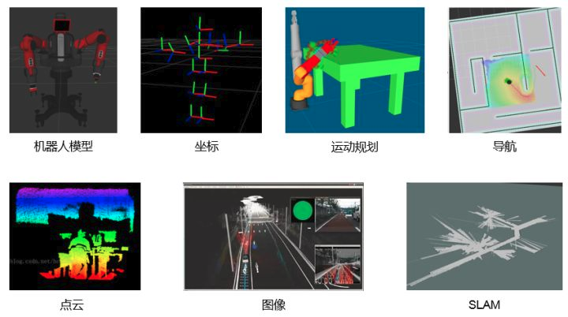
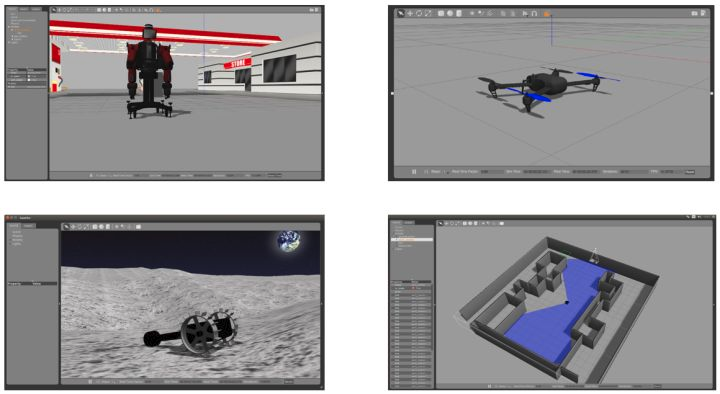
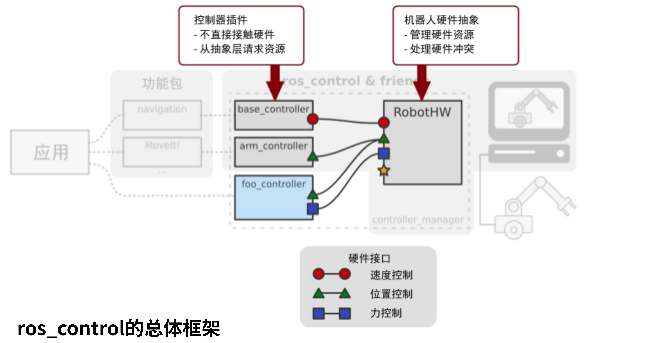

# Gazebo物理仿真环境搭建

## rviz与Gazebo的区别

rviz是**三维可视化工具**，强调把已有的数据可视化显示；

gazebo是**三维物理仿真平台**，强调的是创建一个虚拟的仿真环境。

rviz需要**已有数据**。

rviz提供了很多插件，这些插件可以显示图像、模型、路径等信息，但是前提都是这些数据已经以话题、参数的形式发布，rviz做的事情就是订阅这些数据，并完成可视化的渲染，让开发者更容易理解数据的意义。

gazebo不是显示工具，强调的是仿真，**它不需要数据，而是创造数据**。

我们可以在gazebo中免费创建一个机器人世界，不仅可以仿真机器人的运动功能，还可以仿真机器人的传感器数据。而这些数据就可以放到rviz中显示，所以使用gazebo的时候，经常也会和rviz配合使用。当我们手上没有机器人硬件或实验环境难以搭建时，仿真往往是非常有用的利器。

## ros_costrol

- 提供机器人控制中间件
- 包含一些列的控制器接口，传动装置接口，硬件接口，控制器工具箱等等
- 可以帮助机器人应用功能包快速落地，提高开发效率

## 参考链接

http://wiki.ros.org/urdf/Tutorials/Using%20a%20URDF%20in%20Gazebo

http://wiki.ros.org/urdf/XML/Transmission

http://gazebosim.org/tutorials?tut=ros_gzplugins

http://gazebosim.org/tutorials/?tut=ros_urdf#Tutorial:UsingaURDFinGazebo

http://wiki.ros.org/gazebo_plugins

http://gazebosim.org/tutorials/?tut=ros_control

http://www.guyuehome.com/890

