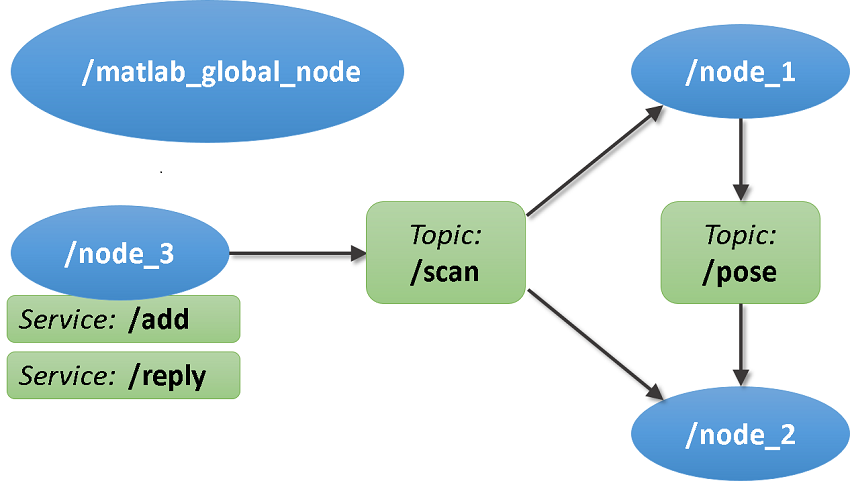
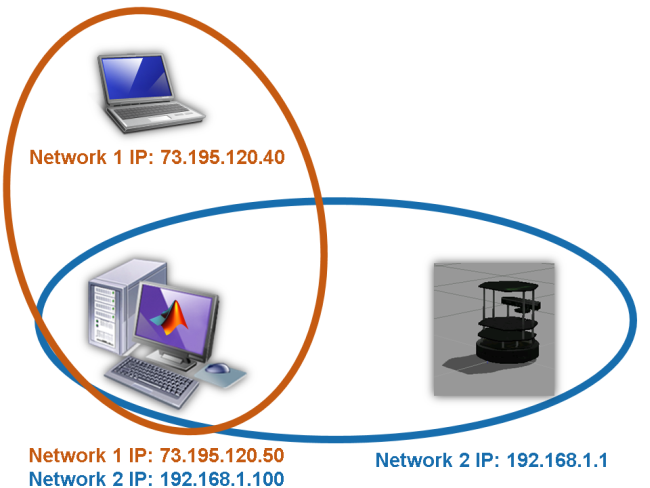

## Get Started with ROS

Initialize ROS Network // 启动ros Master

```matlab
rosinit
# 默认情况下，rosinit在MATLAB中创建ROS Master 并启动连接到ROS Master的“global node”。 “global node”由其他ROS功能自动使用。
```

```
Initializing ROS master on http://bat800207glnxa64:36681/.
Initializing global node /matlab_global_node_61183 with NodeURI http://bat800207glnxa64:39841/
```



### Shut Down ROS Network / 停止ROS Master

```matlab
rosshutdown
```

```
Shutting down global node /matlab_global_node_06846 with NodeURI http://bat800616glnxa64:37441/
Shutting down ROS master on http://bat800616glnxa64:37425/.
```

### Connect to an External ROS Master

可以使用rosinit命令连接到外部ROS主服务器（例如，在机器人或虚拟机上运行）。可以通过两种方式指定主服务器的地址：通过IP地址或运行主服务器的计算机的主机名。

如果一台主机使用rosinit启动了一个ROS Master，其他主机则需要使用rosinit(host_name) 来连接ROS Master。

host name 主机名

port 11311 是ROS Master默认端口，可以更改：

```matlab
# 连接到名为'master_host'的计算机的ROS Master，端口为12000
rosinit('master_host', 12000)

# 或者使用ROS Master 的URI
rosinit('http://192.168.1.1:12000')
```

### Node Host Specification/ 节点主机规范



左下角的计算机运行MATLAB并连接到两个不同的网络。 在一个子网中，其IP地址为73.195.120.50，而在另一个子网中，其IP为192.168.1.100。 此计算机希望连接到TurtleBot®计算机上的ROS Master，IP地址为192.168.1.1。 MATLAB的 global node作为向ROS Master注册的一部分，必须指定其他ROS节点可以到达的IP地址或主机名。 TurtleBot上的所有节点都将使用此地址将数据发送到MATLAB中的global node。

当使用ROS Master的IP地址调用rosinit时，它将尝试检测用于联系ROS Master的网络接口，并将其用作global node的IP地址。

如果此自动检测失败，可以使用调用rosinit并使用 `NodeHost` name-value pair 显式地指定IP地址或主机名。 

```matlab
# 三种方式都可以
rosinit('192.168.1.1', 'NodeHost', '192.168.1.100')
rosinit('http://192.168.1.1:11311', 'NodeHost', '192.168.1.100')
rosinit('master_host', 'NodeHost', '192.168.1.100')
```

### ROS Environment Variables

可以通过ROS环境变量指定ROS主服务器的地址和通告的节点地址。

如果没有为rosinit提供参数，该函数还将检查ROS环境变量的值。 

这些变量是ROS_MASTER_URI，ROS_HOSTNAME和ROS_IP

ROS_MASTER_URI： 指定ROS Master的地址

ROS_HOSTNAME和ROS_IP：都代表global node节点的地址。 不需要同时设置ROS_HOSTNAME和ROS_IP。 如果两者都设置，则ROS_HOSTNAME优先。

```matlab
# 使用getenv命令查看其当前值：
getenv('ROS_MASTER_URI')
getenv('ROS_HOSTNAME')
getenv('ROS_IP')
# 使用setenv命令设置这些变量
setenv('ROS_MASTER_URI','http://192.168.1.1:11311')
setenv('ROS_IP','192.168.1.100')
```

> 注意：ROS作用的节点通过URI进行连接通讯，即IP和端口：
>
> ```
> /node_1 URI:(http://bat800207glnxa64:45189/)
> /node_2 URI:(http://bat800207glnxa64:35097/)
> ```

参考：

ROS Simulink Support and Limitations

https://ww2.mathworks.cn/help/robotics/ug/simulink-support-and-limitations.html

Simulink and ROS Interaction

https://ww2.mathworks.cn/help/robotics/ug/simulink-and-ros-interaction.html

Get Started with ROS in Simulink®

https://ww2.mathworks.cn/help/robotics/examples/get-started-with-ros-in-simulink.html

Configure ROS Network Addresses

https://ww2.mathworks.cn/help/robotics/ug/configure-ros-network-addresses.html

Get Started with Gazebo and a Simulated TurtleBot

https://ww2.mathworks.cn/help/robotics/examples/get-started-with-gazebo-and-a-simulated-turtlebot.html