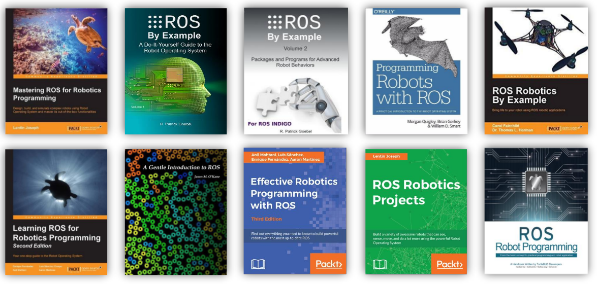

# ROS 学习网站

官方中文入门教程：
http://wiki.ros.org/cn/ROS/Tutorials

实验楼官方中文中级教程搬运：
https://www.shiyanlou.com/courses/938

Turtlesim官方教程：
http://wiki.ros.org/turtlesim?distro=kinetic

Rospy官方教程：
http://wiki.ros.org/rospy_tutorials

CKZZ教程：
https://www.ncnynl.com/beginning.html

CKZZros-python教程：
https://www.ncnynl.com/category/ros-python/

中科院与Xbot视频教程+gitbook书籍（5星推荐）

- https://www.bilibili.com/video/av24585414
- https://legacy.gitbook.com/book/sychaichangkun/ros-tutorial-icourse163/details
- https://github.com/sychaichangkun/ROS-Academy-for-Beginners
- https://www.icourse163.org/learn/ISCAS-1002580008?tid=1002759011#/learn/announce

# 书籍推荐

Uda推荐的书籍
https://cse.sc.edu/~jokane/agitr/

https://blog.csdn.net/ZhangRelay/article/details/52244746

# ros 官网列出的书籍列表（比较权威）

http://wiki.ros.org/Books

# 大神推荐书单

