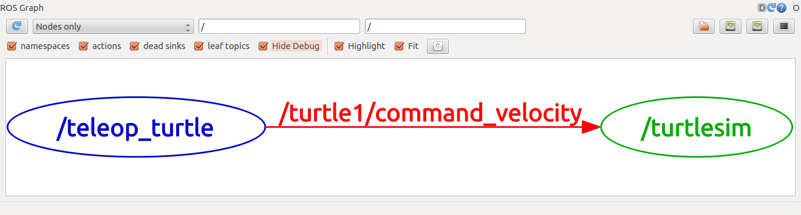

# 创建ROS工作空间

```shell
$ mkdir -p ~/catkin_ws/src
$ cd ~/catkin_ws/src
$ catkin_init_workspace
```
创建完成后的目录：
```
catkin_ws
└── src
    └── CMakeLists.txt -> /opt/ros/kinetic/share/catkin/cmake/toplevel.cmake
```

> 即使这个工作空间是空的（在'src'目录中没有任何软件包，只有一个CMakeLists.txt链接文件），你依然可以编译它：
```shell
$ cd ~/catkin_ws/
$ catkin_make
```
make编译之后的目录：
```
catkin_ws
├── build
│   ├── catkin
│   ├── catkin_generated
│   ├── CATKIN_IGNORE
│   ├── catkin_make.cache
│   ├── CMakeCache.txt
│   ├── CMakeFiles
│   ├── cmake_install.cmake
│   ├── CTestTestfile.cmake
│   ├── gtest
│   ├── Makefile
│   └── test_results
├── devel
│   ├── env.sh
│   ├── lib
│   ├── setup.bash
│   ├── setup.sh
│   ├── _setup_util.py
│   └── setup.zsh
└── src
    └── CMakeLists.txt -> /opt/ros/kinetic/share/catkin/cmake/toplevel.cmake

```
catkin_make命令在catkin 工作空间中是一个非常方便的工具。如果你查看一下当前目录应该能看到'build'和'devel'这两个文件夹。在'devel'文件夹里面你可以看到几个setup.*sh文件。source这些文件中的任何一个都可以将当前工作空间设置在ROS工作环境的最顶层，想了解更多请参考catkin文档。

接下来首先source一下新生成的setup.*sh文件： 

```shell
$ source devel/setup.zsh
```

要想保证工作空间已配置正确需确保ROS_PACKAGE_PATH环境变量包含你的工作空间目录，采用以下命令查看： 
```shell
$ echo $ROS_PACKAGE_PATH

/home/likun/catkin_ws/src:/opt/ros/kinetic/share
#两个路径，一个是刚刚创建的catkin_ws/src，即存放package的地方，另一个是ROS的共享package库文件夹。
#并且每个路径之间用冒号分隔开来,你可以在ROS_PACKAGE_PATH中添加更多其它路径，每条路径使用冒号':'分隔。
```

# ROS文件系统
- Packages: 软件包，是ROS应用程序代码的组织单元，每个软件包都可以包含程序库、可执行文件、脚本或者其它手动创建的东西。
- Manifest (package.xml): 清单，是对于'软件包'相关信息的描述,用于定义软件包相关元信息之间的依赖关系，这些信息包括版本、维护者和许可协议等

本教程中我们将会用到ros-tutorials程序包，请先安装：
```shell
$ sudo apt-get install ros-kinetic-ros-tutorials
```
## 文件系统工具
目的：用来简化 ls cd等的操作

### 使用rospack
rospack允许你获取软件包的有关信息。在本教程中，我们只涉及到rospack中find参数选项，该选项可以返回软件包的路径信息。 

用法：
```shell
rospack find [包名称]
```

示例：
```shell
$ rospack find roscpp

/opt/ros/kinetic/share/roscpp
```

### 使用 roscd
roscd是rosbash命令集中的一部分，它允许你直接切换(cd)工作目录到某个软件包或者软件包集当中。 

用法：
```shell
$ roscd [本地包名称[/子目录]]
```
示例：
```shell
$ roscd roscpp
```
> 为了验证我们已经切换到了roscpp软件包目录下，现在我们可以使用Unix命令pwd来输出当前工作目录：
> ```shell
> $ pwd
> 
> /opt/ros/kinetic/share/roscpp
> # 你可以看到 /opt/ros/kinetic/share/roscpp和之前使用rospack find得到的路径名称是一样的。
> ```
> 注意，就像ROS中的其它工具一样，roscd只能切换到那些路径已经包含在ROS_PACKAGE_PATH环境变量中的软件包.

#### roscd到子目录

使用roscd也可以切换到一个软件包或软件包集的子目录中。

示例：
```shell
$ roscd roscpp/cmake
$ pwd

/opt/ros/kinetic/share/roscpp/cmake
```

### 使用roscd log
使用roscd log可以切换到ROS保存日记文件的目录下。
> 需要注意的是，如果没有执行过任何ROS程序，系统会报错说该目录不存在。

示例：
```shell
$ roscd log
```
### 使用rosls
rosls是rosbash命令集中的一部分，它允许你直接按软件包的名称而不是绝对路径执行ls命令（罗列目录）。

用法：
```shell
$ rosls [本地包名称[/子目录]]
```

示例：
```shell
$ rosls roscpp_tutorials

cmake  launch  package.xml  srv
```

# 创建ROS程序包

## 一个catkin程序包由什么组成?
一个程序包要想称为catkin程序包必须符合以下要求：
- 该程序包必须包含catkin compliant package.xml文件
  - 这个package.xml文件提供有关程序包的元信息。 
- 程序包必须包含一个catkin 版本的CMakeLists.txt文件，而Catkin metapackages中必须包含一个对CMakeList.txt文件的引用。
- 每个目录下只能有一个程序包。
  - 这意味着在同一个目录下不能有嵌套的或者多个程序包存在。 
  
最简单的程序包也许看起来就像这样：
```
 my_package/
      CMakeLists.txt
      package.xml
```

## 在catkin工作空间中的程序包（catkin工作空间的目录结构）
开发catkin程序包的一个推荐方法是使用catkin工作空间，一个简单的工作空间也许看起来像这样：

```
workspace_folder/        -- WORKSPACE
  src/                   -- SOURCE SPACE
    CMakeLists.txt       -- 'Toplevel' CMake file, provided by catkin
    package_1/
      CMakeLists.txt     -- CMakeLists.txt file for package_1
      package.xml        -- Package manifest for package_1
    ...
    package_n/
      CMakeLists.txt     -- CMakeLists.txt file for package_n
      package.xml        -- Package manifest for package_n
```

## 创建一个catkin程序包
首先切换到之前通过创建catkin工作空间教程创建的catkin工作空间中的src目录下： 

```shell
$ cd ~/catkin_ws/src
```
现在使用catkin_create_pkg命令来创建一个名为'beginner_tutorials'的新程序包，这个程序包依赖于std_msgs、roscpp和rospy：
```shell
$ catkin_create_pkg beginner_tutorials std_msgs rospy roscpp
```
> 这将会创建一个名为beginner_tutorials的文件夹，这个文件夹里面包含一个package.xml文件和一个CMakeLists.txt文件，这两个文件都已经自动包含了部分你在执行catkin_create_pkg命令时提供的信息,如依赖。
> std_msgs rospy roscpp 依赖包的信息保存在package.xml文件中

src目录将变为：

```
src
├── beginner_tutorials
│   ├── CMakeLists.txt
│   ├── include
│   │   └── beginner_tutorials
│   ├── package.xml
│   └── src
└── CMakeLists.txt -> /opt/ros/kinetic/share/catkin/cmake/toplevel.cmake
```
catkin_create_pkg命令会要求你输入package_name，如果有需要你还可以在后面添加一些需要依赖的其它程序包： 
```shell
$ catkin_create_pkg <package_name> [depend1] [depend2] [depend3]
```

## 程序包依赖关系
### 一级依赖

之前在使用catkin_create_pkg命令时提供了几个程序包作为依赖包，现在我们可以使用rospack命令工具来查看一级依赖包。 
```shell
$ rospack depends1 beginner_tutorials 

std_msgs
rospy
roscpp
```
> rospack列出了在运行catkin_create_pkg命令时作为参数的依赖包，这些依赖包保存在package.xml文件中。

查看package.xml
```shell
$ roscd beginner_tutorials
$ cat package.xml

<package>
...
  <buildtool_depend>catkin</buildtool_depend>
  <build_depend>roscpp</build_depend>
  <build_depend>rospy</build_depend>
  <build_depend>std_msgs</build_depend>
...
</package>
```

### 间接依赖
在很多情况中，一个依赖包还会有它自己的依赖包，比如，rospy还有其它依赖包。 

```shell
$ rospack depends1 rospy

genpy
roscpp
rosgraph
rosgraph_msgs
roslib
std_msgs
```

一个程序包还可以有好几个间接的依赖包，幸运的是使用rospack可以递归检测出所有的依赖包:
```shell
$ rospack depends beginner_tutorials

cpp_common
rostime
roscpp_traits
roscpp_serialization
genmsg
genpy
message_runtime
rosconsole
std_msgs
rosgraph_msgs
xmlrpcpp
roscpp
rosgraph
catkin
rospack
roslib
rospy
```

## 自定义程序包
接下来将剖析catkin_create_pkg命令生成的每个文件并详细描述这些文件的组成部分以及如何自定义这些文件。 
> 文件中这样的符号内的内容为注释 ` <!--  --> `

### 自定义 package.xml
自动生成的package.xml文件应该在你的新程序包中。现在让我们一起来看看新生成的package.xml文件以及每一个需要你注意的标签元素。 

- 描述标签
```
<description>The beginner_tutorials package</description>
```
> 将描述信息修改为任何你喜欢的内容，但是按照约定第一句话应该简短一些，因为它覆盖了程序包的范围。如果用一句话难以描述完全那就需要换行了。

- 维护者标签

```
  <!-- One maintainer tag required, multiple allowed, one person per tag --> 
  <!-- Example:  -->
  <!-- <maintainer email="jane.doe@example.com">Jane Doe</maintainer> -->
  <maintainer email="user@todo.todo">user</maintainer>
```
- 许可标签：
```
  <!-- One license tag required, multiple allowed, one license per tag -->
  <!-- Commonly used license strings: -->
  <!--   BSD, MIT, Boost Software License, GPLv2, GPLv3, LGPLv2.1, LGPLv3 -->
  <license>TODO</license>
```
> 选择一种许可协议并填写到这里。一些常见的开源许可协议有BSD、 MIT、 Boost Software License、 GPLv2、 GPLv3、 LGPLv2.1和LGPLv3。
> 比如`<license>BSD</license>`

- 依赖项标签：
用来描述程序包的各种依赖项，这些依赖项分为build_depend、 buildtool_depend、 run_depend、 test_depend。在之前的操作中，因为我们将 std_msgs、 roscpp、 和 rospy作为catkin_create_pkg命令的参数，所以生成的依赖项看起来如下： 

```
<!-- The *_depend tags are used to specify dependencies -->
<!-- Dependencies can be catkin packages or system dependencies -->
<!-- Examples: -->
<!-- Use build_depend for packages you need at compile time: -->
<!--   <build_depend>genmsg</build_depend> -->
<!-- Use buildtool_depend for build tool packages: -->
<!--   <buildtool_depend>catkin</buildtool_depend> -->
<!-- Use exec_depend for packages you need at runtime: -->
<!--   <exec_depend>python-yaml</exec_depend> -->
<!-- Use test_depend for packages you need only for testing: -->
<!--   <test_depend>gtest</test_depend> -->
<buildtool_depend>catkin</buildtool_depend>
<build_depend>roscpp</build_depend>
<build_depend>rospy</build_depend>
<build_depend>std_msgs</build_depend>
```
除了catkin中默认提供的buildtool_depend，所有我们列出的依赖包都已经被添加到build_depend标签中。在本例中，因为在编译和运行时我们需要用到所有指定的依赖包，因此还需要将每一个依赖包分别添加到run_depend标签中：

```
<buildtool_depend>catkin</buildtool_depend>

<build_depend>roscpp</build_depend>
<build_depend>rospy</build_depend>
<build_depend>std_msgs</build_depend>

<exec_depend>roscpp</exec_depend>
<exec_depend>rospy</exec_depend>
<exec_depend>std_msgs</exec_depend>
```
-  最后完成的 package.xml
   现在看下面最后去掉了注释和未使用标签后的package.xml文件就显得更加简洁了： 
```
<?xml version="1.0"?>
<package format="2">
  <name>beginner_tutorials</name>
  <version>0.1.0</version>
  <description>The beginner_tutorials package</description>

  <maintainer email="you@yourdomain.tld">Your Name</maintainer>
  <license>BSD</license>
  <url type="website">http://wiki.ros.org/beginner_tutorials</url>
  <author email="you@yourdomain.tld">Jane Doe</author>

  <buildtool_depend>catkin</buildtool_depend>

  <build_depend>roscpp</build_depend>
  <build_depend>rospy</build_depend>
  <build_depend>std_msgs</build_depend>

  <exec_depend>roscpp</exec_depend>
  <exec_depend>rospy</exec_depend>
  <exec_depend>std_msgs</exec_depend>

</package>
```

> 注意：当创建包时如果不填加任何依赖项，则package.xml内只会自动生成一项buildtool_depend `<buildtool_depend>catkin</buildtool_depend>`

# 编译ROS程序包
## 使用 catkin_make

catkin_make 是一个命令行工具，它简化了catkin的标准工作流程。你可以认为catkin_make是在CMake标准工作流程中依次调用了cmake 和 make。 

使用方法:
```shell
# 在catkin工作空间下
$ catkin_make [make_targets] [-DCMAKE_VARIABLES=...]
```

CMake标准工作流程主要可以分为以下几个步骤：
```shell
# 在一个CMake项目里
$ mkdir build
$ cd build
$ cmake ..
$ make
$ make install  # (可选)
```

多个catkin项目可以放在工作空间中一起编译：
```shell
# In a catkin workspace
$ catkin_make
$ catkin_make install  # (可选)
```

## 开始编译你的程序包
按照之前的创建一个ROS程序包教程，你应该已经创建好了一个catkin 工作空间 和一个名为beginner_tutorials的catkin 程序包。

```shell
$ cd ~/catkin_ws/
$ catkin_make


```
你可以看到很多cmake 和 make 输出的信息： 

```
Base path: /home/user/catkin_ws
Source space: /home/user/catkin_ws/src
Build space: /home/user/catkin_ws/build
Devel space: /home/user/catkin_ws/devel
Install space: /home/user/catkin_ws/install
####
#### Running command: "cmake /home/user/catkin_ws/src
-DCATKIN_DEVEL_PREFIX=/home/user/catkin_ws/devel
-DCMAKE_INSTALL_PREFIX=/home/user/catkin_ws/install" in "/home/user/catkin_ws/build"
####
-- The C compiler identification is GNU 4.2.1
-- The CXX compiler identification is Clang 4.0.0
-- Checking whether C compiler has -isysroot
-- Checking whether C compiler has -isysroot - yes
-- Checking whether C compiler supports OSX deployment target flag
-- Checking whether C compiler supports OSX deployment target flag - yes
-- Check for working C compiler: /usr/bin/gcc
-- Check for working C compiler: /usr/bin/gcc -- works
-- Detecting C compiler ABI info
-- Detecting C compiler ABI info - done
-- Check for working CXX compiler: /usr/bin/c++
-- Check for working CXX compiler: /usr/bin/c++ -- works
-- Detecting CXX compiler ABI info
-- Detecting CXX compiler ABI info - done
-- Using CATKIN_DEVEL_PREFIX: /tmp/catkin_ws/devel
-- Using CMAKE_PREFIX_PATH: /opt/ros/groovy
-- This workspace overlays: /opt/ros/groovy
-- Found PythonInterp: /usr/bin/python (found version "2.7.1") 
-- Found PY_em: /usr/lib/python2.7/dist-packages/em.pyc
-- Found gtest: gtests will be built
-- catkin 0.5.51
-- BUILD_SHARED_LIBS is on
-- ~~~~~~~~~~~~~~~~~~~~~~~~~~~~~~~~~~~~~~~~~~~~~
-- ~~  traversing packages in topological order:
-- ~~  - beginner_tutorials
-- ~~~~~~~~~~~~~~~~~~~~~~~~~~~~~~~~~~~~~~~~~~~~~
-- +++ add_subdirectory(beginner_tutorials)
-- Configuring done
-- Generating done
-- Build files have been written to: /home/user/catkin_ws/build
####
#### Running command: "make -j4" in "/home/user/catkin_ws/build"
####
```
> catkin_make首先输出它所使用到的每个空间所在的路径。需要注意的是由于这些空间存在默认配置的原因，有几个文件夹已经在catkin工作空间自动生成了
> build 目录是build space的默认所在位置，同时cmake 和 make也是在这里被调用来配置并编译你的程序包。
> devel 目录是devel space的默认所在位置, 同时也是在你安装程序包之前存放可执行文件和库文件的地方。 

# 理解 ROS节点
## 图概念概述
- Nodes:节点,一个节点即为一个**可执行文件**，它可以通过ROS与其它节点进行通信。
- Messages:消息，消息是一种ROS数据类型，用于订阅或发布到一个话题。
- Topics:话题,节点可以发布消息到话题，也可以订阅话题以接收消息。
- Master:节点管理器，ROS名称服务 (比如帮助节点找到彼此)。
- rosout: ROS中相当于stdout/stderr。
- roscore: 主机+ rosout + 参数服务器 (参数服务器会在后面介绍)。 

## 节点：
一个节点其实只不过是ROS程序包中的一个可执行文件。ROS节点可以使用ROS客户库与其他节点通信。节点可以发布或接收一个话题。节点也可以提供或使用某种服务。

## 客户端库
ROS客户端库允许使用不同编程语言编写的节点之间互相通信:
- rospy = python 客户端库
- roscpp = c++ 客户端库 

## roscore
roscore 是你在运行所有ROS程序前首先要运行的命令。

##  使用rosnode
rosnode 显示当前运行的ROS节点信息。rosnode list 指令列出活跃的节点: 
```shell
# 提前运行roscore
$ rosnode list

/rosout
```
> 这表示当前只有一个节点在运行: rosout。因为这个节点用于收集和记录节点调试输出信息，所以它总是在运行的。 

rosnode info 命令返回的是关于一个特定节点的信息。
```shell
$ rosnode info /rosout


Node [/rosout]
Publications: 
 * /rosout_agg [rosgraph_msgs/Log]
Subscriptions: 
 * /rosout [unknown type]
Services: 
 * /rosout/get_loggers
 * /rosout/set_logger_level
contacting node http://Ubuntu16:35409/ ...
Pid: 11287
```

## 使用 rosrun
rosrun 允许你使用包名直接运行一个包内的节点(而不需要知道这个包的路径)。
用法:
```shell
$ rosrun [package_name] [node_name]
```
现在我们可以运行turtlesim包中的 turtlesim_node。
然后, 在一个 新的终端:

```shell
$ rosrun turtlesim turtlesim_node
```
在一个 新的终端:
```shell
$ rosnode list

/rosout
/turtlesim
```
# 理解ROS话题
## 运行小海龟历程：

```shell
$ roscore
$ rosrun turtlesim turtlesim_node
$ rosrun turtlesim turtle_teleop_key
```

## ROS Topics
turtlesim_node节点和turtle_teleop_key节点之间是通过一个ROS话题来互相通信的。 turtle_teleop_key在一个话题上发布按键输入消息，而turtlesim则订阅该话题以接收该消息。下面让我们使用rqt_graph来显示当前运行的节点和话题。 

在一个新终端中运行:
```shell
$ rosrun rqt_graph rqt_graph
```


如果你将鼠标放在/turtle1/command_velocity上方，相应的ROS节点（蓝色和绿色）和话题（红色）就会高亮显示。正如你所看到的，turtlesim_node和turtle_teleop_key节点正通过一个名为 /turtle1/command_velocity的话题来互相通信。



## rostopic命令
rostopic命令工具能让你获取有关ROS话题的信息。

你可以使用帮助选项查看rostopic的子命令：

```shell
$ rostopic -h


rostopic bw     display bandwidth used by topic
rostopic echo   print messages to screen
rostopic hz     display publishing rate of topic
rostopic list   print information about active topics
rostopic pub    publish data to topic
rostopic type   print topic type
```

## 使用 rostopic echo
rostopic echo可以显示在某个话题上发布的数据。

用法：

```shell
rostopic echo [topic]
```

让我们在一个新终端中看一下turtle_teleop_key节点在/turtle1/cmd_vel话题上发布的数据。

```shell
$ rostopic echo /turtle1/cmd_vel


linear: 
  x: 2.0
  y: 0.0
  z: 0.0
angular: 
  x: 0.0
  y: 0.0
  z: 0.0
---
```
rostopic echo(红色显示部分）现在也订阅了turtle1/command_velocity话题。


## 使用 rostopic list

rostopic list能够列出所有当前订阅和发布的话题。
让我们查看一下list子命令需要的参数，在一个新终端中运行：

```shell
$ rostopic list -h

Usage: rostopic list [/topic]

Options:
  -h, --help            show this help message and exit
  -b BAGFILE, --bag=BAGFILE
                        list topics in .bag file
  -v, --verbose         list full details about each topic
  -p                    list only publishers
  -s                    list only subscribers

```

```shell
$ rostopic list -v


Published topics:
* /turtle1/color_sensor [turtlesim/Color] 1 publisher
* /turtle1/cmd_vel [geometry_msgs/Twist] 1 publisher
* /rosout [rosgraph_msgs/Log] 2 publishers
* /rosout_agg [rosgraph_msgs/Log] 1 publisher
* /turtle1/pose [turtlesim/Pose] 1 publisher

Subscribed topics:
* /turtle1/cmd_vel [geometry_msgs/Twist] 1 subscriber
* /rosout [rosgraph_msgs/Log] 1 subscriber
```

## ROS Messages
消息，即通过topic发送和接受的内容。

话题之间的通信是通过在节点之间发送ROS消息实现的。对于发布器(turtle_teleop_key)和订阅器(turtulesim_node)之间的通信，发布器和订阅器之间必须发送和接收相同类型的消息。这意味着话题的类型是由发布在它上面的消息类型决定的。

### 使用 rostopic type
使用rostopic type命令可以查看发布在某个话题上的消息类型：

用法:
```shell
$ rostopic type [topic]
```

```shell
$ rostopic type /turtle1/cmd_vel

geometry_msgs/Twist
```

我们可以使用rosmsg命令来查看消息的详细情况：
```shell
$ rosmsg show geometry_msgs/Twist

geometry_msgs/Vector3 linear
  float64 x
  float64 y
  float64 z
geometry_msgs/Vector3 angular
  float64 x
  float64 y
  float64 z
```

### 使用 rostopic pub
rostopic pub可以把数据发布到当前某个正在广播的话题上。 

用法：`rostopic pub [topic] [msg_type] [args]`

```shell
$ rostopic pub -1 /turtle1/cmd_vel geometry_msgs/Twist "linear:
  x: 2
  y: 0.0
  z: 0.0
angular:
  x: 0.0
  y: 0.0
  z: 2.8"
# -1 这个参数选项使rostopic发布一条消息后马上退出。 
```

```shell
rostopic pub /turtle1/cmd_vel geometry_msgs/Twist -r 1 "linear:
  x: 2
  y: 0.0
  z: 0.0
angular:
  x: 0.0
  y: 0.0
  z: 2.8"
# -r 1 一个稳定的频率为1Hz的命令流来保持移动状态。
```
我们也可以看一下rqt_graph中的情形，可以看到rostopic发布器节点（红色）正在与rostopic echo节点（绿色）进行通信：


> turtle正沿着一个圆形轨迹连续运动。我们可以在一个新终端中通过rostopic echo命令来查看turtlesim所发布的数据。 

### 使用 rostopic hz
`rostopic hz [topic]`

我们看一下turtlesim的节点发布/turtle/pose时有多快：
```shell
$ rostopic hz /turtle1/pose

subscribed to [/turtle1/pose]
average rate: 59.354
    min: 0.005s max: 0.027s std dev: 0.00284s window: 58
average rate: 59.459
    min: 0.005s max: 0.027s std dev: 0.00271s window: 118
```
> 现在我们可以知道了turtlesim正以大约60Hz的频率发布数据给turtle.

### 使用管道结合rostopic type和rosmsg show命令
```shell
$ rostopic type /turtle1/cmd_vel | rosmsg show

geometry_msgs/Vector3 linear
float64 x
float64 y
float64 z
geometry_msgs/Vector3 angular
float64 x
float64 y
float64 z
```

# 理解ROS服务和参数

## ROS Services
服务（services）是节点之间通讯的另一种方式。服务允许节点发送请求（request） 并获得一个响应（response）

### 使用rosservice
rosservice可以很轻松的使用 ROS 客户端/服务器框架提供的服务。rosservice提供了很多可以在topic上使用的命令，如下所示：

- rosservice list         输出可用服务的信息
- rosservice call         调用带参数的服务
- rosservice type         输出服务类型
- rosservice find         依据类型寻找服务find services by service type
- rosservice uri          输出服务的ROSRPC uri

### 使用rosservice list

```shell
$ rosservice list

/clear
/kill
/reset
/rosout/get_loggers
/rosout/set_logger_level
/spawn
/teleop_turtle/get_loggers
/teleop_turtle/set_logger_level
/turtle1/set_pen
/turtle1/teleport_absolute
/turtle1/teleport_relative
/turtlesim/get_loggers
/turtlesim/set_logger_level
```
> list 命令显示turtlesim节点提供了9个服务：重置（reset）, 清除（clear）, 再生（spawn）, 终止（kill）, turtle1/set_pen, /turtle1/teleport_absolute, /turtle1/teleport_relative, turtlesim/get_loggers, and turtlesim/set_logger_level. 同时还有另外两个rosout节点提供的服务: /rosout/get_loggers and /rosout/set_logger_level. 

### rosservice type
用法：`rosservice type [service]`

查看clear服务的类型:
```shell
$ rosservice type /clear

std_srvs/Empty
```
> 服务的类型为空（empty),这表明在调用这个服务是不需要参数（比如，请求不需要发送数据，响应也没有数据）。

下面我们使用rosservice call命令调用服务。

### rosservice call
rosservice call命令调用服务

方法：`rosservice call [service] [args]`

```shell
# 因为服务类型是空，所以进行无参数调用

$ rosservice call clear
# 服务清除了turtlesim_node的背景上的轨迹。
```

### rosservice call 有参数调用
```shell
# 查看再生（spawn）服务的信息
$ rosservice type /spawn | rossrv show

float32 x
float32 y
float32 theta
string name
---
string name
```
> 这个服务使得我们可以在给定的位置和角度生成一只新的乌龟。名字参数是可选的，这里我们不设具体的名字，让turtlesim自动创建一个。 

```shell
$ rosservice call /spawn "x: 2.0
y: 2.0
theta: 0.2
name: "" 

# 服务返回了新产生的乌龟的名字：
name:turtle2
```

## 使用 rosparam
rosparam使得我们能够存储并操作ROS 参数服务器（Parameter Server）上的数据。参数服务器能够存储整型、浮点、布尔、字符串、字典和列表等数据类型。rosparam使用YAML标记语言的语法。一般而言，YAML的表述很自然：1 是整型, 1.0 是浮点型, one是字符串, true是布尔, [1, 2, 3]是整型列表, {a: b, c: d}是字典. rosparam有很多指令可以用来操作参数，如下所示:

- rosparam set            设置参数
- rosparam get            获取参数
- rosparam load           从文件读取参数
- rosparam dump           向文件中写入参数
- rosparam delete         删除参数
- rosparam list           列出参数名

### rosparam list

```shell
$ rosparam list

/background_b
/background_g
/background_r
/roslaunch/uris/aqy:51932
/run_id
```
### rosparam set , rosparam get
使用：

`rosparam set [param_name]`

`rosparam get [param_name]`

修改背景颜色的红色通道：
```shell
$ rosparam set /background_r 150
```
上述指令修改了参数的值，现在我们调用清除服务使得修改后的参数生效：
```shell
$ rosservice call clear
```
现在我们来查看参数服务器上的参数值——获取背景的绿色通道的值：
```shell
$ rosparam get background_g 

86
```
使用`rosparam get /`来显示参数服务器上的所有内容：
```shell
$ rosparam get /

background_b: 255
background_g: 86
background_r: 150
roslaunch:
uris: {'aqy:51932': 'http://aqy:51932/'}
run_id: e07ea71e-98df-11de-8875-001b21201aa8
```

### rosparam dump , rosparam load
使用方法：
```
rosparam dump [file_name]
rosparam load [file_name] [namespace]
```

将所有的参数写入params.yaml文件：
```shell
$ rosparam dump params.yaml
```

> 在当前目录下生成一个 params.yaml 文件，文件内记录着参数服务器参数的信息。


# roslaunch

roslaunch可以用来启动定义在launch文件中的多个节点。 

用法： ` roslaunch [package] [filename.launch] `

```shell
# 先切换到beginner_tutorials程序包目录下：
$ roscd beginner_tutorials

# 然后创建一个launch文件夹：
$ mkdir launch
$ cd launch

# 创建一个名为turtlemimic.launch的launch文件并复制粘贴以下内容到该文件里面： 
$ touch turtlemimic.launch
$ chmod u+x turtlemimic.launch

```
turtlemimic.launch
```
<launch>

  <group ns="turtlesim1">
    <node pkg="turtlesim" name="sim" type="turtlesim_node"/>
  </group>

  <group ns="turtlesim2">
    <node pkg="turtlesim" name="sim" type="turtlesim_node"/>
  </group>

  <node pkg="turtlesim" name="mimic" type="mimic">
    <remap from="input" to="turtlesim1/turtle1"/>
    <remap from="output" to="turtlesim2/turtle1"/>
  </node>

</launch>
```

## Launch 文件解析
```
 <launch>
 # 在这里我们以launch标签开头以表明这是一个launch文件。 

  <group ns="turtlesim1">
    <node pkg="turtlesim" name="sim" type="turtlesim_node"/>
  </group>

  <group ns="turtlesim2">
    <node pkg="turtlesim" name="sim" type="turtlesim_node"/>
  </group>
  # 在这里我们创建了两个节点分组并以'命名空间（namespace)'标签来区分，即group指定的ns，其中一个名为turtulesim1，另一个名为turtlesim2，两个组里面都使用相同的turtlesim节点并命名为'sim'。这样可以让我们同时启动两个turtlesim模拟器而不会产生命名冲突，因为虽然节点名字相同，但属于不同的命名空间。
  # 每个<node> 标签包括了声明ROS图中节点的各种属性
  # pkg="turtlesim"，指定该节点所在的包名。
  # name="sim"，指定节点的名字
  # type="turtlesim_node" ，指定了该节点的类型，也就是可执行程序的文件名

  <node pkg="turtlesim" name="mimic" type="mimic">
    <remap from="input" to="turtlesim1/turtle1"/>
    <remap from="output" to="turtlesim2/turtle1"/>
  </node>
  # 在这里我们启动模仿节点，并将所有话题的输入和输出分别重命名为turtlesim1和turtlesim2，这样就会使turtlesim2模仿turtlesim1。 
  # remap是launch文件中重映射命令，可以用来重命名。格式： <remap from="original-name" to="new-name" />
  # 如果这个 remap 是 launch 元素的一个child（子类），与 node 元素同一层级， 并在 launch 元素内的最顶层。那么这个 remapping 将会作用于后续所有的节点。
  # 这个 remap 元素也可以作为 node 元素的一个child（子类）出现，这里就是node minic的子类。
  # <remap from="input" to="turtlesim1/turtle1"/> 将minic节点订阅的话题 /input/pose 重新映射为 /turtlesim1/turtle1/pose， 用于获取乌龟1（turtlesim1/sim） 的位置。
  # <remap from="output" to="turtlesim2/turtle1"/> 将minic节点发布的话题 /output/cmd_vel重新映射为/turtlesim2/turtle1/cmd_vel, 用于发布给乌龟2移动命令。
</launch>
	//这个是launch文件的结束标签。 

```
## roslaunch运行
roslaunch命令来启动launch文件：

```shell
$ roslaunch beginner_tutorials turtlemimic.launch
```
现在将会有两个turtlesims被启动，然后我们在一个新终端中使用rostopic命令发送速度设定消息：

```shell
$ rostopic pub /turtlesim1/turtle1/cmd_vel geometry_msgs/Twist -r 1 "linear:
  x: 2.0
  y: 0.0
  z: 0.0
angular:
  x: 0.0
  y: 0.0
  z: 2"
```

> 两个turtlesims会同时开始移动，虽然发布命令只是给turtlesim1发送了速度设定消息。

通过rqt_graph可以看到各个节点之间的通信关系:


