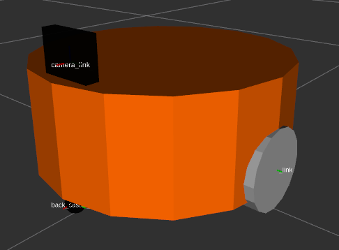

# 使用urdf创建一个简单的机器人仿真模型

URDF（Unified Robot Description Format）统一机器人描述格式，URDF使用XML格式描述机器人文件。URDF语法规范，[参考链接](http://wiki.ros.org/urdf/XML)，URDF组件，是由不同的功能包和组件组成：

 

> 其中urdf_parser和urder_interface已经在hydro之后的版本中去除了。urdf_paser_plugin是URDF基础的插件，衍生出了urdfdom（面向URDF文件）和collar_parser（面向相互文件）。

## 建模基本要素
- `<link>`
	- 描述机器人某个刚体部分的外观和物理属性
	- 尺寸（size），颜色（color），形状（shape），惯性矩阵（inertial matrix），碰撞参数（collision properties）等。
```
<visual>   描述机器人link部分的外观参数
<inertial> 描述link的惯性参数
<collision> 描述link的碰撞属性
```

- `<joint>`
	- 描述机器人关节的运动学和动力学属性
	- 描述关节运动的位置和速度限制
	- 根据关节运动形势，可以分为6类

```
<calibration>  关节的参考位置，用来校准关节的绝对位置
<dynamics> 描述关节的物理属性，例如阻尼值，物理静默擦
<limit> 描述运动的一些极限值，包括关节运动的上下限位置，速度限制，例句限制等
<minic> 描述关节与已有关节的关系
<safety_controller> 描述安全控制器参数
```

 


## 目录结构

urdf功能包一般包括如下几个文件夹：

- urdf： 存放机器人模型的URDF或者xarco文件
- meshes： 放置URDF引用的模型渲染文件，如贴图
- launch： 保存相关启动文件
- config： 保存rviz的配置文件，一般使用rviz保存该文件

## 创建ROS硬件描述包

创建机器人建模功能包：
```shell
$ cd catkin_ws/src

# 一般机器人描述包使用_description命名
# 需要添加 urdf依赖
# xacro依赖不是必须（如果用到就要添加）
$ catkin_create_pkg mbot_description urdf xacro

# 创建urdf, launch, config 文件夹
$ roscd mbot_description
$ mkdir urdf launch config
```
> 注意创建时第一运行rviz在config文件夹内并没有rviz的配置文件，需要初次运行之后，配置rviz之后，然后保存到该文件夹下。
## 创建urdf文件

```shell
$ roscd mbot_description
$ cd urdf
$ touch mbot_with_camera.urdf
$ subl mbot_with_camera.urdf
```

mbot_with_camera.urdf 内容如下：

```xml
<?xml version="1.0" ?>
<robot name="mbot">

    <link name="base_link">
        <visual>
            <origin xyz=" 0 0 0" rpy="0 0 0" />
            <geometry>
                <cylinder length="0.16" radius="0.20"/>
            </geometry>
            <material name="yellow">
                <color rgba="1 0.4 0 1"/>
            </material>
        </visual>
    </link>

    <joint name="left_wheel_joint" type="continuous">
        <origin xyz="0 0.19 -0.05" rpy="0 0 0"/>
        <parent link="base_link"/>
        <child link="left_wheel_link"/>
        <axis xyz="0 1 0"/>
    </joint>

    <link name="left_wheel_link">
        <visual>
            <origin xyz="0 0 0" rpy="1.5707 0 0" />
            <geometry>
                <cylinder radius="0.06" length = "0.025"/>
            </geometry>
            <material name="white">
                <color rgba="1 1 1 0.9"/>
            </material>
        </visual>
    </link>

    <joint name="right_wheel_joint" type="continuous">
        <origin xyz="0 -0.19 -0.05" rpy="0 0 0"/>
        <parent link="base_link"/>
        <child link="right_wheel_link"/>
        <axis xyz="0 1 0"/>
    </joint>

    <link name="right_wheel_link">
        <visual>
            <origin xyz="0 0 0" rpy="1.5707 0 0" />
            <geometry>
                <cylinder radius="0.06" length = "0.025"/>
            </geometry>
            <material name="white">
                <color rgba="1 1 1 0.9"/>
            </material>
        </visual>
    </link>

    <joint name="front_caster_joint" type="continuous">
        <origin xyz="0.18 0 -0.095" rpy="0 0 0"/>
        <parent link="base_link"/>
        <child link="front_caster_link"/>
        <axis xyz="0 1 0"/>
    </joint>

    <link name="front_caster_link">
        <visual>
            <origin xyz="0 0 0" rpy="0 0 0"/>
            <geometry>
                <sphere radius="0.015" />
            </geometry>
            <material name="black">
                <color rgba="0 0 0 0.95"/>
            </material>
        </visual>
    </link>

    <joint name="back_caster_joint" type="continuous">
        <origin xyz="-0.18 0 -0.095" rpy="0 0 0"/>
        <parent link="base_link"/>
        <child link="back_caster_link"/>
        <axis xyz="0 1 0"/>
    </joint>

    <link name="back_caster_link">
        <visual>
            <origin xyz="0 0 0" rpy="0 0 0"/>
            <geometry>
                <sphere radius="0.015" />
            </geometry>
            <material name="black">
                <color rgba="0 0 0 0.95"/>
            </material>
        </visual>
    </link>

    <link name="camera_link">
        <visual>
            <origin xyz=" 0 0 0 " rpy="0 0 0" />
            <geometry>
                <box size="0.03 0.04 0.04" />
            </geometry>
            <material name="black">
                <color rgba="0 0 0 0.95"/>
            </material>
        </visual>
    </link>

    <joint name="camera_joint" type="fixed">
        <origin xyz="0.17 0 0.10" rpy="0 0 0"/>
        <parent link="base_link"/>
        <child link="camera_link"/>
    </joint>

</robot>
```

上述内容的主要结构如下：
```xml
<?xml version="1.0" ?>
<robot name="mbot">
    <link name="base_link">
    ...
    </link>
    
    <joint name="left_wheel_joint" type="continuous">
    ...
    </joint>
    
    <link name="left_wheel_link">
        ...
    </link>
...
</robot>
```

在link中定义了小车的外观，以base_link为例:
```xml
    <link name="base_link">
        <visual>	 <!--视觉信息-->
            <origin xyz=" 0 0 0" rpy="0 0 0" />		<!--rpy代表欧拉角，绕着xyz轴转动的角度；xyz代表在xyz三轴上的位移-->
            <geometry> 		<!--几何形状信息-->
                <cylinder length="0.16" radius="0.20"/>	
            </geometry>
            <material name="yellow"> 	<!--材料信息-->
                <color rgba="1 0.4 0 1"/>	<!--定义颜色信息，a为透明度-->
            </material>
        </visual>
    </link>
```

在joint中定义两个link的连接信息，以left_wheel_joint为例：
```xml
    <joint name="left_wheel_joint" type="continuous">
        <origin xyz="0 0.19 -0.05" rpy="0 0 0"/>		<!--连接位置-->
        <parent link="base_link"/>
        <child link="left_wheel_link"/>
        <axis xyz="0 1 0"/>
    </joint>

```

## 创建launch文件
```shell
$ roscd mbot_description
$ cd launch
$ touch display_mbot_with_camera_urdf.launch
$ subl display_mbot_with_camera_urdf.launch
```

代码如下：
```xml
<launch>
	<!-- 将模型描述文件内容赋值给robot_description参数 -->
	<param name="robot_description" textfile="$(find mbot_description)/urdf/mbot_with_camera.urdf" />

	<!-- 设置joint_state_publisher的参数，用来打开或关闭关节GUI关节运动控制插件 -->
	<param name="use_gui" value="true"/>
	
	<!-- 运行joint_state_publisher节点，发布机器人的关节状态  -->
	<node name="joint_state_publisher" pkg="joint_state_publisher" type="joint_state_publisher" />
	
	<!-- 运行robot_state_publisher节点，发布tf  -->
	<node name="robot_state_publisher" pkg="robot_state_publisher" type="state_publisher" />
	
	<!-- 运行rviz可视化界面 -->
	<node name="rviz" pkg="rviz" type="rviz" args="-d $(find mbot_description)/config/mbot_urdf.rviz" required="true" />
</launch>
```
lannch文件解释：

参考：

- http://wiki.ros.org/roslaunch/XML/param
- http://wiki.ros.org/roslaunch/XML/node
- http://wiki.ros.org/joint_state_publisher
- http://wiki.ros.org/robot_state_publisher

```xml
<node name="rviz" pkg="rviz" type="rviz" args="-d $(find mbot_description)/config/mbot_urdf.rviz" required="true" />
```
- `args="arg1 arg2 arg3"(optional)  ` 向node传递参数，相当与直接在终端运行node时，直接加在node名字后面的参数。
- `required="true"(optional)` 如果node停止，则自动杀掉整个roslaunch
- 另外 -d的含义为：

```
$ rosrun rviz rviz --help

 -d [ --display-config ] arg A display config file (.rviz) to load(加载一个rviz显示配置文件)。
```

```xml
<param name="robot_description" textfile="$(find mbot_description)/urdf/mbot_with_camera.urdf" />
```

- 将urdf文件内容赋值给robot_description参数，urdf即为内容即为参数值，并将该参数放到参数服务器。
- `textfile="$(find pkg-name)/path/file.txt"`*(optional)* 
  - The  contents of the file will be read and stored as a string. The file must  be locally accessible, though it is strongly recommended that you use  the package-relative `$(find)/file.txt` syntax to specify the location. 

```xml
	<!-- 运行joint_state_publisher节点，发布机器人的关节状态  -->
	<node name="joint_state_publisher" pkg="joint_state_publisher" type="joint_state_publisher" />
```

- joint_state_publisher软件包包含一个用于设置和发布给定URDF文件中的关节状态值的工具。

- 该包发布机器人的sensor_msgs / JointState消息，该包读取robot_description参数（在第一行中定义的robot_description，即以.urdf文件内容为值的一个特定参数robot_description），查找所有非固定关节，发布一个包含这些关节的JointState的消息：(注意消息变量为数组，以包含所有节点的状态)

  ```
  header: 
    seq: 876
    stamp: 
      secs: 1563877932
      nsecs:  34810066
    frame_id: ''
  name: [left_wheel_joint, right_wheel_joint, front_caster_joint, back_caster_joint]
  position: [0.0, 0.0, 0.0, 0.0]
  velocity: []
  effort: []
  ```

  ```
  Type: sensor_msgs/JointState
  
  Publishers:  # 用来发布关节状态来控制关节运动
   * /joint_state_publisher (http://Ubuntu16:38657/)
  
  Subscribers: # 用来接收关节状态
   * /robot_state_publisher (http://Ubuntu16:46231/)
  ```

- 可以与robot_state_publisher节点一起使用，用来发布所有关节状态到tf。

- 节点包含参数：

  - `robot_description` (, default: None) 
    - Contents of the URDF file for the robot 
  - `use_gui` (, default: False) 
    - Whether to use the GUI or not 

- 详细内容参考官方文档

```xml
<!-- 运行robot_state_publisher节点，发布tf  -->
<node name="robot_state_publisher" pkg="robot_state_publisher" type="state_publisher" />
```
- robot_state_publisher功能包允许程序员将机器人的状态发布到tf。 状态发布后，系统中也使用tf的所有组件都可以使用它。 该包采用机器人的关节角度作为输入，并使用机器人的运动树模型发布机器人组件（links）的3D位姿。 该包既可以用作库，也可以用作ROS节点。
- robot_state_publisher功能包使用 “参数robot_description指定的URDF” 和“来自joint_state话题的关节位置” 来计算机器人的运动并通过tf发布结果。
- robot_state_publisher当作节点运行的条件：：
  - A [urdf](http://wiki.ros.org/urdf) xml robot description loaded on the [Parameter Server](http://wiki.ros.org/Parameter Server).  
  - A source that publishes the joint positions as a [sensor_msgs/JointState](http://docs.ros.org/api/sensor_msgs/html/msg/JointState.html).  

- robot_state_publisher节点订阅的话题：joint_states (sensor_msgs/JointState) 


## 运行rviz并进行初次配置

```shell
$ roslaunch mbot_description display_mbot_base_urdf.launch
```
结果：

 

配置rviz：

- 将`Global Options`内的 Fixed Frame 选择为 `base_link`
- 点击`Add a new display`,选择添加`RobotModel`
- 点击`Add a new display`,选择添加`TF`

 

最后保存配置文件到config文件夹。

## 查看tf

```shell
rosrun rqt_tf_tree rqt_tf_tree
```


## 检查urdf模型结构
```shell
# 此命令会在终端当前文件夹建立一个pdf文件
$ urdf_to_graphiz  mbot_with_camera.urdf
```

四轮模型可参考：
https://blog.csdn.net/qq_16775293/article/details/88189184#_303

___

___
# 制作xacro模型

URDF建模存在的问题：

- 模型冗长，重复内容过多
- 修改参数麻烦，不便于二次开发
- 没有参数计算的功能

### 常量

常量的定义：

```xml
<xacro:property name = "M_PI" value="3.14159" />
```

常量的使用：

- 使用 ` ${}` 引用定义的常量

```xml
<origin xyz="0 0 0" rpy="${M_PI/2} 0 0" />
```

### 数学计算 

在 `${}` 内进行数学计算

```xml
<origin xyz="0 0 ${base_length/2 + caster_radius*2}" rpy="0 0 0" />
```

> 所有的数学计算都会转换成浮点数进行，以保证运算精度

### 宏定义：（类似C++的函数）

宏定义

```xml
<!-- 定义有参数宏 -->
<xacro:macro name="func1" params="A B C">
	...
    <!-- 使用参数 A B C-->
    ...
</xacro:macro>

<!-- 定义无参数宏  -->
<xacro:macro name="func2">
    ...
</xacro:macro>
```

宏调用

```xml
<!-- 调用有参数宏  -->
<xacro:func1 A="A_value" B="B_value" C="C_value"/>
<!-- xacro:可省略  -->
<func1 A="A_value" B="B_value" C="C_value"/>

<!-- 调用无参数宏  -->
<xacro:func2/>
<!-- xacro:可省略  -->
<func2/>
```

示例：

```xml
<!-- 定义名为wheel的宏  -->
<xacro:macro name="wheel" params="prefix reflect">
    <joint name="${prefix}_wheel_joint" type="continuous">
        <origin xyz="0 ${reflect*wheel_joint_y} ${-wheel_joint_z}" rpy="0 0 0"/>
        <parent link="base_link"/>
        <child link="${prefix}_wheel_link"/>
        <axis xyz="0 1 0"/>
    </joint>

    <link name="${prefix}_wheel_link">
        <visual>
            <origin xyz="0 0 0" rpy="${M_PI/2} 0 0" />
            <geometry>
                <cylinder radius="${wheel_radius}" length = "${wheel_length}"/>
            </geometry>
            <material name="gray" />
        </visual>
    </link>
</xacro:macro>

<!-- 使用名为wheel的宏  -->
<wheel prefix="left" reflect="-1"/>
```

### 文件包含

xacro允许使用include包含其他的xacro文件，以将小模型组成一个更大的模型。

```xml
<xacro:include filename="$(find mbot_description)/urdf/xacro/mbot_base.xacro"/><xacro:include filename="$(find mbot_description)/urdf/xacro/sensors/camera.xacro"/>
```

### 使用xacro文件

方法一（不推荐）:

将xacro文件转换为urdf文件后，使用urdf文件

```xml
$ rosrun xacro xacro.py mbot.xacro > mbot.urdf
```

方法二：

在launch文件中调用xacro文件解析器

```xml
<!-- 定义一个arg参数  -->
<arg name="model" default="$(find xacro)/xacro --inorder '$(find mbot_description)/urdf/xacro/mbot_base.xacro'" />
<!-- 使用arg参数的值 -->
<param name="robot_description" command="$(arg model)" />
```

- arg定义launch文件内参数，仅在launch文件内起作用
- default  为参数model指定默认值， `$(arg model)` 作用是取model的值
- `command="$(find pkg-name)/exe '$(find pkg-name)/arg.txt'"`*(optional)* 
  - The output of the command will be read and stored as a string. It is strongly recommended that you use the package-relative `$(find)/file.txt` syntax to specify file arguments. You should also quote file arguments using single quotes due to XML escaping requirements. 
  - model的值刚好与command的形式匹配，xacro包中xacro可执行文件作为命令，mbot.xacro文件作为参数。


## 示例

继续在mbot_description功能包内完成xarco文件

```shell
$ roscd mbot_description
$ cd urdf
$ mkdir xacro
$ cd xacro
$ touch mbot.xacro mbot_base.xacro 
$ roscd mbot_description
$ cd launch
$ mkdir xacro
$ cd xacro
$ touch display_mbot_base_xacro.launch
```

- mbot_base.xacro 中定义xacro宏
- mbot.xacro include包含 mbot_base.xacro，并调用宏

### mbot_base.xacro

```xml
<?xml version="1.0"?>
<robot name="mbot" xmlns:xacro="http://www.ros.org/wiki/xacro">

    <!-- PROPERTY LIST -->
    <xacro:property name="M_PI" value="3.1415926"/>
    <xacro:property name="base_radius" value="0.20"/>
    <xacro:property name="base_length" value="0.16"/>

    <xacro:property name="wheel_radius" value="0.06"/>
    <xacro:property name="wheel_length" value="0.025"/>
    <xacro:property name="wheel_joint_y" value="0.19"/>
    <xacro:property name="wheel_joint_z" value="0.05"/>

    <xacro:property name="caster_radius" value="0.015"/> <!-- wheel_radius - ( base_length/2 - wheel_joint_z) -->
    <xacro:property name="caster_joint_x" value="0.18"/>

    <!-- Defining the colors used in this robot -->
    <material name="yellow">
        <color rgba="1 0.4 0 1"/>
    </material>
    <material name="black">
        <color rgba="0 0 0 0.95"/>
    </material>
    <material name="gray">
        <color rgba="0.75 0.75 0.75 1"/>
    </material>
    
    <!-- Macro for robot wheel -->
    <xacro:macro name="wheel" params="prefix reflect">
        <joint name="${prefix}_wheel_joint" type="continuous">
            <origin xyz="0 ${reflect*wheel_joint_y} ${-wheel_joint_z}" rpy="0 0 0"/>
            <parent link="base_link"/>
            <child link="${prefix}_wheel_link"/>
            <axis xyz="0 1 0"/>
        </joint>

        <link name="${prefix}_wheel_link">
            <visual>
                <origin xyz="0 0 0" rpy="${M_PI/2} 0 0" />
                <geometry>
                    <cylinder radius="${wheel_radius}" length = "${wheel_length}"/>
                </geometry>
                <material name="gray" />
            </visual>
        </link>
    </xacro:macro>

    <!-- Macro for robot caster -->
    <xacro:macro name="caster" params="prefix reflect">
        <joint name="${prefix}_caster_joint" type="continuous">
            <origin xyz="${reflect*caster_joint_x} 0 ${-(base_length/2 + caster_radius)}" rpy="0 0 0"/>
            <parent link="base_link"/>
            <child link="${prefix}_caster_link"/>
            <axis xyz="0 1 0"/>
        </joint>

        <link name="${prefix}_caster_link">
            <visual>
                <origin xyz="0 0 0" rpy="0 0 0"/>
                <geometry>
                    <sphere radius="${caster_radius}" />
                </geometry>
                <material name="black" />
            </visual>
        </link>
    </xacro:macro>

    <xacro:macro name="mbot_base">
        <link name="base_footprint">
            <visual>
                <origin xyz="0 0 0" rpy="0 0 0" />
                <geometry>
                    <box size="0.001 0.001 0.001" />
                </geometry>
            </visual>
        </link>

        <joint name="base_footprint_joint" type="fixed">
            <origin xyz="0 0 ${base_length/2 + caster_radius*2}" rpy="0 0 0" />        
            <parent link="base_footprint"/>
            <child link="base_link" />
        </joint>

        <link name="base_link">
            <visual>
                <origin xyz=" 0 0 0" rpy="0 0 0" />
                <geometry>
                    <cylinder length="${base_length}" radius="${base_radius}"/>
                </geometry>
                <material name="yellow" />
            </visual>
        </link>

        <wheel prefix="left" reflect="-1"/>
        <wheel prefix="right" reflect="1"/>

        <caster prefix="front" reflect="-1"/>
        <caster prefix="back" reflect="1"/>
    </xacro:macro>
     
</robot>
```

说明：

```xml
<?xml version="1.0"?>
<robot name="mbot" xmlns:xacro="http://www.ros.org/wiki/xacro">
```

- 这是必须的，说明这是一个xacro文件

```xml
<material name="yellow">
    <color rgba="1 0.4 0 1"/>
</material>
```

- 指定颜色的rgb值，后面调用yellow将会使用这个rgb值

### mbot.xacro

```xml
<?xml version="1.0"?>
<robot name="arm" xmlns:xacro="http://www.ros.org/wiki/xacro">

    <xacro:include filename="$(find mbot_description)/urdf/xacro/mbot_base.xacro" />
    <mbot_base/>

</robot>
```


### display_mbot_base_xacro.launch

```xml
<launch>
	<arg name="model" default="$(find xacro)/xacro --inorder '$(find mbot_description)/urdf/xacro/mbot.xacro'" />
	<arg name="gui" default="true" />

	<param name="robot_description" command="$(arg model)" />

    <!-- 设置GUI参数，显示关节控制插件 -->
	<param name="use_gui" value="$(arg gui)"/>

    <!-- 运行joint_state_publisher节点，发布机器人的关节状态  -->
	<node name="joint_state_publisher" pkg="joint_state_publisher" type="joint_state_publisher" />

	<!-- 运行robot_state_publisher节点，发布tf  -->
	<node name="robot_state_publisher" pkg="robot_state_publisher" type="robot_state_publisher" />

    <!-- 运行rviz可视化界面 -->
	<node name="rviz" pkg="rviz" type="rviz" args="-d $(find mbot_description)/config/mbot.rviz" required="true" />

</launch>
```

 运行：

```shell
$ roslaunch mbot_description display_mbot_base_xacro.launch
```


## 给模型添加一个新的组件

```sh
$ roscd mbot_description
$ cd urdf/xacro
$ touch mbot_with_camera.xacro
$ mkdir sensors
$ cd sensors
$ touch camera.xacro
$ roscd mbot_description
$ cd launch/xacro
$ touch display_mbot_with_camera_xacro.launch
```

### camera.xacro

```xml
<?xml version="1.0"?>
<robot xmlns:xacro="http://www.ros.org/wiki/xacro" name="camera">

    <xacro:macro name="usb_camera" params="prefix:=camera">
        <link name="${prefix}_link">
            <visual>
                <origin xyz=" 0 0 0 " rpy="0 0 0" />
                <geometry>
                    <box size="0.01 0.04 0.04" />
                </geometry>
                <material name="black"/>
            </visual>
        </link>
    </xacro:macro>

</robot>
```

- `params="prefix:=camera"` 设置参数prefix的默认值为camera

### mbot_with_camera.xacro

```xml
<?xml version="1.0"?>
<robot name="arm" xmlns:xacro="http://www.ros.org/wiki/xacro">

    <xacro:include filename="$(find mbot_description)/urdf/xacro/mbot_base.xacro" />
    <xacro:include filename="$(find mbot_description)/urdf/xacro/sensors/camera.xacro" />

    <xacro:property name="camera_offset_x" value="0.17" />
    <xacro:property name="camera_offset_y" value="0" />
    <xacro:property name="camera_offset_z" value="0.10" />

    <mbot_base/>

    <!-- Camera -->
    <joint name="camera_joint" type="fixed">
        <origin xyz="${camera_offset_x} ${camera_offset_y} ${camera_offset_z}" rpy="0 0 0" />
        <parent link="base_link"/>
        <child link="camera_link"/>
    </joint>

    <xacro:usb_camera prefix="camera"/>

</robot>
```

### display_mbot_with_camera_xacro.launch

```xml
<launch>
	<arg name="model" default="$(find xacro)/xacro --inorder '$(find mbot_description)/urdf/xacro/mbot_with_camera.xacro'" />
	<arg name="gui" default="true" />

	<param name="robot_description" command="$(arg model)" />

    <!-- 设置GUI参数，显示关节控制插件 -->
	<param name="use_gui" value="$(arg gui)"/>

    <!-- 运行joint_state_publisher节点，发布机器人的关节状态  -->
	<node name="joint_state_publisher" pkg="joint_state_publisher" type="joint_state_publisher" />

	<!-- 运行robot_state_publisher节点，发布tf  -->
	<node name="robot_state_publisher" pkg="robot_state_publisher" type="robot_state_publisher" />

    <!-- 运行rviz可视化界面 -->
	<node name="rviz" pkg="rviz" type="rviz" args="-d $(find mbot_description)/config/mbot.rviz" required="true" />

</launch>
```

运行：

```shell
$ roslaunch mbot_description display_mbot_with_camera_xacro.launch 
```



