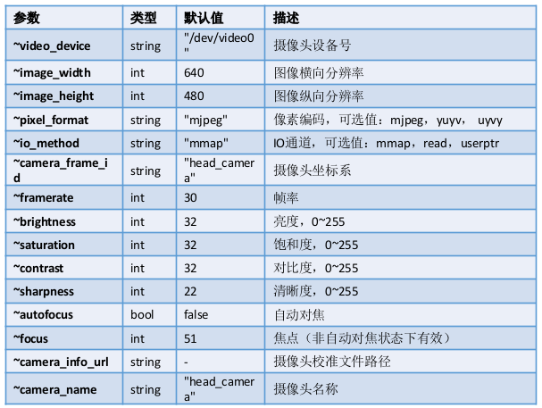
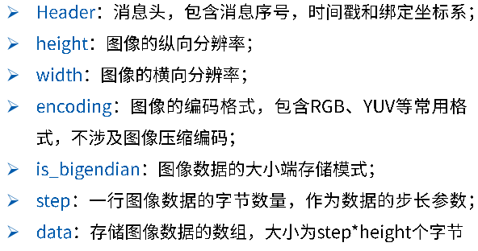
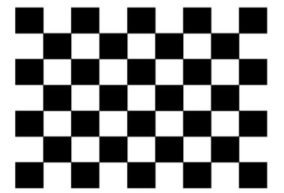
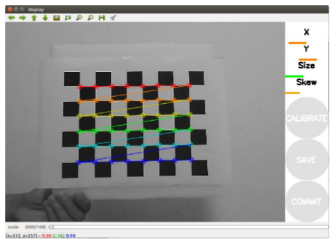
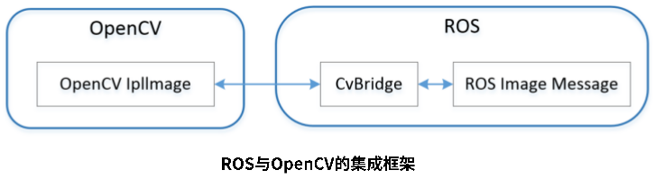

# 摄像头应用

## ubs摄像头驱动

ROS : [usb_cam](http://wiki.ros.org/usb_cam)

安装usb摄像头驱动包 usb_cam

```shell
sudo apt-get install ros-kinetic-usb-cam
```

查看 usb_cam包

```shell
roscd usb_cam
tree
```

```
.
├── cmake
│   ├── usb_camConfig.cmake
│   └── usb_camConfig-version.cmake
├── launch
│   └── usb_cam-test.launch
└── package.xml
```

usb_cam-test.launch 文件：

```xml
<launch>
  <node name="usb_cam" pkg="usb_cam" type="usb_cam_node" output="screen" >
    <param name="video_device" value="/dev/video0" />
    <param name="image_width" value="640" />
    <param name="image_height" value="480" />
    <param name="pixel_format" value="yuyv" />
    <param name="camera_frame_id" value="usb_cam" />
    <param name="io_method" value="mmap"/>
  </node>
  <node name="image_view" pkg="image_view" type="image_view" respawn="false" output="screen">
    <remap from="image" to="/usb_cam/image_raw"/>
    <param name="autosize" value="true" />
  </node>
</launch>
```
usb_cam 功能包中的话题

`~<camera_name>/image` ([sensor_msgs/Image](http://docs.ros.org/api/sensor_msgs/html/msg/Image.html)) 



启动摄像头

```shell
# 启动launch文件，此时启动了两个节点
roslaunch usb_cam usb_cam-test.launch
# 使用rqt工具查看图像
rqt_image_view
```

查看原始图像话题

```shell
rostopic info /usb_cam/image_raw 
```

```
Type: sensor_msgs/Image

Publishers: 
 * /usb_cam (http://lkubuntu:38343/)

Subscribers: 
 * /image_view (http://lkubuntu:36439/)
```

查看 sensor_msgs/Image 消息格式

```shell
rosmsg show sensor_msgs/Image
```

```
std_msgs/Header header
  uint32 seq
  time stamp
  string frame_id
uint32 height
uint32 width
string encoding
uint8 is_bigendian
uint32 step
uint8[] data
```



查看压缩图像话题

```shell
$ rosmsg show sensor_msgs/CompressedImage
# /usb_cam/image_raw/compressed 话题

std_msgs/Header header
  uint32 seq
  time stamp
  string frame_id
string format
uint8[] data
```

- format: 图像的压缩编码格式（jpeg, png, bmp）
- data: 存储图像数据数组

## 摄像头标定

[camera_calibration](http://wiki.ros.org/camera_calibration)

安装摄像头标定功能包

```shell
$ sudo apt-get install ros-kinetic-camera-calibration
```

首先创建一个功能包，为了方便单独启动 usb_cam 节点

```shell
cd ~/catkin_ws/src
catkin_create_pkg robot_vision std_msgs rospy roscpp
roscd robot_vision
mkdir launch
touch launch/usb_cam.launch
```

编辑 usb_cam.launch，以启动 usb_cam_node 节点

```xml
<launch>

  <node name="usb_cam" pkg="usb_cam" type="usb_cam_node" output="screen" >
    <param name="video_device" value="/dev/video0" />
    <param name="image_width" value="640" />
    <param name="image_height" value="480" />
    <param name="pixel_format" value="yuyv" />
    <param name="camera_frame_id" value="usb_cam" />
    <param name="io_method" value="mmap"/>
  </node>

</launch>
```

标定

```shell
# 启动摄像头
roslaunch robot_vision usb_cam.launch
# 启动标定功能包
rosrun camera_calibration cameracalibrator.py --size 8x6 --square 0.024 image:=/usb_cam/image_raw camera:=/usb_cam
```

- size:说明标定棋盘的内部角点个数，这里使用的棋盘一共有6行，每行有8个内部角点
- square:这个参数对应每个棋盘格的边长，单位是厘米
- image和camera：设置摄像头发布的图像话题



标定过程

- x,y,size,skew 分别表示标定靶被移动的进度条
- x：标定靶左右移动
- Y：标定靶上下移动
- Size：标定靶前后移动
- Skew：标定靶倾斜转动
- 当进度条完成后点击caliberate生成标定参数
- 使用save保存参数为文件，保存路径为：/tmp/calibrationdata.tar.gz



使用摄像头标定文件

- 需要将标定生成的 .yaml 文件放到 robot_vision 包内，并命名为camera_calibration.yaml

```shell
# 创建launch文件
touch launch/usb_cam_with_calibration.launch
```

usb_cam_with_calibration.launch：

```xml
<launch>

  <node name="usb_cam" pkg="usb_cam" type="usb_cam_node" output="screen" >
    <param name="video_device" value="/dev/video0" />
    <param name="image_width" value="640" />
    <param name="image_height" value="480" />
    <param name="pixel_format" value="yuyv" />
    <param name="camera_frame_id" value="usb_cam" />
    <param name="io_method" value="mmap"/>
    <param name="camera_info_url" type="string" value="file://$(find robot_vision)/camera_calibration.yaml" />
  </node>

</launch>
```

错误信息处理：
```shell
[head_camera] does not match name narrow_stereo in file /home/likun/catkin_ws/src/robot_vision/camera_calibration.yaml
# 即yaml文件内参数摄像头名称camera_name与实际传感器名称不匹配，将该参数根据提示修改为head_camera即可
```

## 机器视觉 ROS+OpenCV



[vision_opencv](http://wiki.ros.org/vision_opencv)

安装 Opencv

```shell
sudo apt-get install ros-kinetic-vision-opencv libopencv-dev python-opencv
```

创建一个python脚本实现ROS图像消息到Opencv图片的相互转换

```shell
roscd robot_vision
mkdir scripts
touch scripts/cv_bridge_test.py
chmod +x scripts/cv_bridge_test.py
```

cv_bridge_test.py：

```python
#!/usr/bin/env python
# -*- coding: utf-8 -*-

import rospy
import cv2
from cv_bridge import CvBridge, CvBridgeError
from sensor_msgs.msg import Image

class image_converter:
    def __init__(self):    
        # 创建cv_bridge，声明图像的发布者和订阅者
        self.image_pub = rospy.Publisher("cv_bridge_image", Image, queue_size=1)
        self.bridge = CvBridge()
        self.image_sub = rospy.Subscriber("/usb_cam/image_raw", Image, self.callback)

    def callback(self,data):
        # 使用cv_bridge将ROS的图像数据转换成OpenCV的图像格式
        try:
            cv_image = self.bridge.imgmsg_to_cv2(data, "bgr8")
        except CvBridgeError as e:
            print e

        # 在opencv的显示窗口中绘制一个圆，作为标记
        (rows,cols,channels) = cv_image.shape
        if cols > 60 and rows > 60 :
            cv2.circle(cv_image, (60, 60), 30, (0,0,255), -1)

        # 显示Opencv格式的图像
        cv2.imshow("Image window", cv_image)
        cv2.waitKey(3)

        # 再将opencv格式额数据转换成ros image格式的数据发布
        try:
            self.image_pub.publish(self.bridge.cv2_to_imgmsg(cv_image, "bgr8"))
        except CvBridgeError as e:
            print e

if __name__ == '__main__':
    try:
        # 初始化ros节点
        rospy.init_node("cv_bridge_test")
        rospy.loginfo("Starting cv_bridge_test node")
        image_converter()
        rospy.spin()
    except KeyboardInterrupt:
        print "Shutting down cv_bridge_test node."
        cv2.destroyAllWindows()
```

测试：

```shell
roslaunch robot_vision usb_cam.launch
rosrun robot_vision cv_bridge_test.py
rqt_image_view
```

二维码识别


