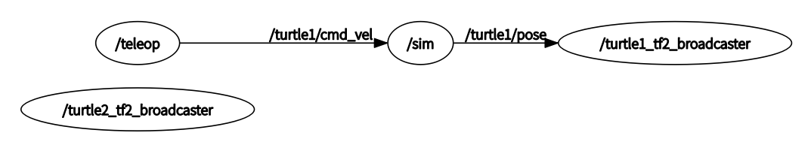
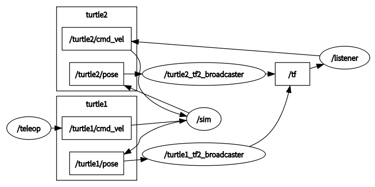
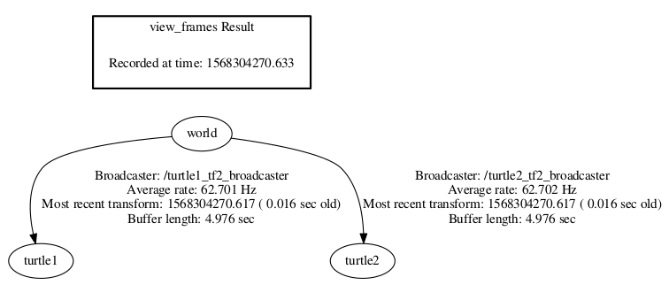
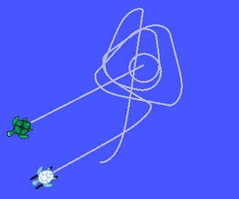

# 	TF2

## TF的本质

使用tf2_ros提供的接口（比如TransformBroadcaster ），向话题 /tf 发送ros定义的一种标准消息   geometry_msgs::TransformStamped ，即两个坐标系之间的变换，然后会有一个节点（抽象的）自动处理这些消息，根据接受到的消息来维护一个 tf树（非闭环），也就各个坐标系之间的相互变换关系。同时可以使用tf2_ros提供的接口 TransformListener 获取想要的两个坐标系之间的变换关系，坐标变换即保存在geometry_msgs::TransformStamped消息中。

同时ros还提供了一些命令行工具用来查询当前 tf 相关的内容。

## 创建一个learning_tf2包

```shell
$ catkin_create_pkg learning_tf2 tf2 tf2_ros roscpp rospy turtlesim
```

- 包依赖于 tf2 tf2_ros roscpp rospy turtlesim

- 自动生成的目录结构：

  ```
  ➜ learning_tf2 tree
  .
  ├── CMakeLists.txt
  ├── include
  │   └── learning_tf2
  ├── package.xml
  └── src
  ```

- 自动生成的CMakeLists.txt

  ```makefile
  cmake_minimum_required(VERSION 2.8.3)
  project(learning_tf2)
  
  find_package(catkin REQUIRED COMPONENTS
    roscpp
    rospy
    tf2
    tf2_ros
    turtlesim
  )
  catkin_package()
  include_directories(
    ${catkin_INCLUDE_DIRS}
  )
  ```

- 自动生成的package.xml

  ```xml
  <?xml version="1.0"?>
  <package format="2">
    <name>learning_tf2</name>
    <version>0.0.0</version>
    <description>The learning_tf2 package</description>
    <maintainer email="likun@todo.todo">likun</maintainer>
  
    <license>TODO</license>
    <buildtool_depend>catkin</buildtool_depend>
    <build_depend>roscpp</build_depend>
    <build_depend>rospy</build_depend>
    <build_depend>tf2</build_depend>
    <build_depend>tf2_ros</build_depend>
    <build_depend>turtlesim</build_depend>
    <build_export_depend>roscpp</build_export_depend>
    <build_export_depend>rospy</build_export_depend>
    <build_export_depend>tf2</build_export_depend>
    <build_export_depend>tf2_ros</build_export_depend>
    <build_export_depend>turtlesim</build_export_depend>
    <exec_depend>roscpp</exec_depend>
    <exec_depend>rospy</exec_depend>
    <exec_depend>tf2</exec_depend>
    <exec_depend>tf2_ros</exec_depend>
    <exec_depend>turtlesim</exec_depend>
  
    <export>
    </export>
  </package>
  ```

## 编写一个tf2静态广播器

目的： 将编写代码以将静态变换发布到tf2。

代码文件：

```shell
 $ roscd learning_tf2
 $ cd src
 $ touch static_turtle_tf2_broadcaster.cpp
 $ subl static_turtle_tf2_broadcaster.cpp
```

static_turtle_tf2_broadcaster.cpp:

```cpp
#include <ros/ros.h>
#include <tf2_ros/static_transform_broadcaster.h> // StaticTransformBroadcaster
#include <geometry_msgs/TransformStamped.h> // 标准tf消息msg文件生成的头文件（TransformStamped.msg）
#include <cstdio> // strcmp()函数
#include <tf2/LinearMath/Quaternion.h> //Quaternion，实现四元数相关的转换


std::string static_turtle_name;

int main(int argc, char **argv)
{
  ros::init(argc,argv, "my_static_tf2_broadcaster");
  if(argc != 8)
  {
    ROS_ERROR("Invalid number of parameters\nusage: static_turtle_tf2_broadcaster child_frame_name x y z roll pitch yaw");
    return -1;
  }
  if(strcmp(argv[1],"world")==0)
  {
    ROS_ERROR("Your static turtle name cannot be 'world'");
    return -1;

  }
  static_turtle_name = argv[1]; // 作为child_frame_name
  static tf2_ros::StaticTransformBroadcaster static_broadcaster; 
    // 静态对象，用来发布tf消息
    // StaticTransformBroadcaster内其实就是声明了nodehandle句柄，
    // 声明ros::Publisher对象，并且使用了publish()函数发布消息
  geometry_msgs::TransformStamped static_transformStamped; //tf消息对象

  static_transformStamped.header.stamp = ros::Time::now();
  static_transformStamped.header.frame_id = "world";
  static_transformStamped.child_frame_id = static_turtle_name;
  static_transformStamped.transform.translation.x = atof(argv[2]); 
    //atof将指针指向的内容转换成浮点数
  static_transformStamped.transform.translation.y = atof(argv[3]);
  static_transformStamped.transform.translation.z = atof(argv[4]);
  tf2::Quaternion quat;
  quat.setRPY(atof(argv[5]), atof(argv[6]), atof(argv[7])); 
    // setRPY将roll pitch yaw 转换成四元数表示
  static_transformStamped.transform.rotation.x = quat.x();
  static_transformStamped.transform.rotation.y = quat.y();
  static_transformStamped.transform.rotation.z = quat.z();
  static_transformStamped.transform.rotation.w = quat.w();
  static_broadcaster.sendTransform(static_transformStamped);
    // 发布填充好的TransformStamped消息
    // sendTransform 成员函数可以直接发布 tf 消息
  ROS_INFO("Spinning until killed publishing %s to world", static_turtle_name.c_str());
  ros::spin(); // 循环且监听回调函数（callback）,这里并没有回调函数???
  return 0;
};
```

geometry_msgs/TransformStamped

```shell
/opt/ros/kinetic/share/geometry_msgs/msg/TransformStamped.msg
# This expresses a transform from coordinate frame header.frame_id
# to the coordinate frame child_frame_id
std_msgs/Header header
  uint32 seq
  time stamp
  string frame_id
string child_frame_id
geometry_msgs/Transform transform
  geometry_msgs/Vector3 translation
    float64 x
    float64 y
    float64 z
  geometry_msgs/Quaternion rotation
    float64 x
    float64 y
    float64 z
    float64 w
```

## 运行节点

修改 `CMakeLists.txt`

```makefile
cmake_minimum_required(VERSION 2.8.3)
project(learning_tf2)
find_package(catkin REQUIRED COMPONENTS roscpp rospy tf2 tf2_ros turtlesim)
catkin_package()
include_directories(${catkin_INCLUDE_DIRS})
add_executable(static_turtle_tf2_broadcaster src/static_turtle_tf2_broadcaster.cpp)
target_link_libraries(static_turtle_tf2_broadcaster  ${catkin_LIBRARIES} )
# 链接ros的其他库文件
```

package.xml可保持不变

## 编译包，并运行：

```shell
$ catkin_make
$ roscore
$ rosrun learning_tf2 static_turtle_tf2_broadcaster mystaticturtle 0 0 1 0 0 0
```

```shell
$ rostopic echo /tf_static
# 查看静态tf话题
```

```
transforms: 
  - 
    header: 
      seq: 0
      stamp: 
        secs: 1568284652
        nsecs: 792928935
      frame_id: "world"
    child_frame_id: "mystaticturtle"
    transform: 
      translation: 
        x: 0.0
        y: 0.0
        z: 1.0
      rotation: 
        x: 0.0
        y: 0.0
        z: 0.0
        w: 1.0
```

## 发布静态转换的正确方法

上面的实例是为了说明如何使用StaticTransformBroadcaster发布静态转换。 但是在实际开发过程中，您不必自己编写此代码，并且应该使用专用的tf2_ros工具来执行此操作。tf2_ros提供了一个名为static_transform_publisher的可执行文件，可用作命令行工具或可添加到启动文件的节点。 

命令行中使用：

```shell
$ static_transform_publisher x y z yaw pitch roll frame_id child_frame_id
## Publish a static coordinate transform to tf2 using an x/y/z offset in meters and yaw/pitch/roll in radians. (yaw is rotation about Z, pitch is rotation about Y, and roll is rotation about X). 

# 或：
$ static_transform_publisher x y z qx qy qz qw frame_id child_frame_id
## Publish a static coordinate transform to tf2 using an x/y/z offset in meters and quaternion. 
```

launch 文件中使用：

```cpp
<launch>
...
<node pkg="tf2_ros" type="static_transform_publisher" name="link1_broadcaster" args="1 0 0 0 0 0 1 link1_parent link1" />
...
</launch>
```

# Writing a tf2 broadcaster

就是把坐标系发到tf

一般流程：

- Call ros::init() to initialize a node. //初始化一个节点

- Construct a tf2_ros::TransformBroadcaster. //构造一个TransformBroadcaster类对象

- Pass a geometry_msgs::TransformStamped message to tf2_ros::TransformBroadcaster::sendTransform().
      Alternatively, pass a vector of geometry_msgs::TransformStamped messages.

  // 将一个geometry_msgs::TransformStamped类的对象传递给函数tf2_ros::TransformBroadcaster::sendTransform()

## Create a learning_tf2 package

继续使用上一节的learning_tf2包

### The Code

```shell
 $ roscd learning_tf2
 $ cd src
 $ touch turtle_tf2_broadcaster.cpp
 $ subl turtle_tf2_broadcaster.cpp
```

turtle_tf2_broadcaster.cpp：

```cpp
#include <ros/ros.h>
#include <tf2/LinearMath/Quaternion.h>
#include <tf2_ros/transform_broadcaster.h> //tf2_ros::TransformBroadcaster
#include <geometry_msgs/TransformStamped.h>
#include <turtlesim/Pose.h> // turtlesim::Pose 消息

std::string turtle_name; // 静态持续性（整个程序运行期间），外部链接性，全局作用域（外部可见）

void poseCallback(const turtlesim::PoseConstPtr& msg){
  static tf2_ros::TransformBroadcaster br;
    //TransformBroadcaster 对象 用于发布tf消息
    //静态对象，br 只有第一次poseCallback函数时被零初始化，函数被第二次调用及以后，都不使用声明语句，
    //也就是br 对象只被初始化一次 
  geometry_msgs::TransformStamped transformStamped; //tf消息
  	// 用于传递给 sendTransform() 函数
  transformStamped.header.stamp = ros::Time::now(); //当前时间
  transformStamped.header.frame_id = "world";
  transformStamped.child_frame_id = turtle_name;
  transformStamped.transform.translation.x = msg->x;
  transformStamped.transform.translation.y = msg->y;
  transformStamped.transform.translation.z = 0.0;
  tf2::Quaternion q;
  q.setRPY(0, 0, msg->theta);
  transformStamped.transform.rotation.x = q.x();
  transformStamped.transform.rotation.y = q.y();
  transformStamped.transform.rotation.z = q.z();
  transformStamped.transform.rotation.w = q.w();

  br.sendTransform(transformStamped); // 发布到tf
}

int main(int argc, char** argv){
  ros::init(argc, argv, "my_tf2_broadcaster");

  ros::NodeHandle private_node("~"); // 使private_node的命名空间为/my_tf2_broadcaster
  // 查询参数服务器是否有参数 “turtle”,查询的是key（字符串）
  // if这里可以先忽略，只看 turtle_name = argv[1]; 这一句就行
  if (! private_node.hasParam("turtle")) //参数全名为： /my_tf2_broadcaster/turtle
  {
    if (argc != 2){ROS_ERROR("need turtle name as argument"); return -1;};
    turtle_name = argv[1]; 
  }
  else
  {
    private_node.getParam("turtle", turtle_name);
  }
    
  ros::NodeHandle node;
  ros::Subscriber sub = node.subscribe(turtle_name+"/pose", 10, &poseCallback);
    // turtle_name+"/pose" 加号运算符将两个string对象连接起来，即string类重载了+运算符
	// 设置消息列队长度为10
  ros::spin(); // 循环处理回调函数
  return 0;
};
```

> you can also publish static transforms on the same pattern by instantiating a StaticTransformBroadcaster (from tf2_ros/static_transform_broadcaster.h) instead of a TransformBroadcaster. The static transforms will be published on the /tf_static topic and will be sent only when required(latched topic) and not periodically.

## Running the broadcaster

编辑learning_tf2包 `CMakeLists.txt`，加入如下：

```makefile
add_executable(turtle_tf2_broadcaster src/turtle_tf2_broadcaster.cpp)
target_link_libraries(turtle_tf2_broadcaster
 ${catkin_LIBRARIES}
)
```

编写 **start_demo.launch** 文件：

```xml
  <launch>
     <!-- Turtlesim Node-->
    <node pkg="turtlesim" type="turtlesim_node" name="sim"/>

    <node pkg="turtlesim" type="turtle_teleop_key" name="teleop" output="screen"/>
    <!-- Axes -->
    <param name="scale_linear" value="2" type="double"/>
    <param name="scale_angular" value="2" type="double"/>

    <node pkg="learning_tf2" type="turtle_tf2_broadcaster"
          args="/turtle1" name="turtle1_tf2_broadcaster" />
    <node pkg="learning_tf2" type="turtle_tf2_broadcaster"
          args="/turtle2" name="turtle2_tf2_broadcaster" />
  </launch>
```

> 注意使用节点rosrun turtlesim turtlesim_node 生成的小海龟默认的名字为 turtle1
>
> 发布的话题为：/turtle1/cmd_vel  /turtle1/color_sensor  /turtle1/pose

如果想要安装 launch文件到ros的 /opt/ros/kinetic/share 文件下，可以在CMakeLists.txt添加：

```makefile
## Mark other files for installation (e.g. launch and bag files, etc.)
install(FILES
 start_demo.launch
 # myfile2
 DESTINATION ${CATKIN_PACKAGE_SHARE_DESTINATION}
)
```

编译和运行：

```shell
$ catkin_make
$ roslaunch learning_tf2 start_demo.launch
$ rosrun tf tf_echo /world /turtle1 # 查看变换是否被发布到tf
```



```
➜ ~ rosrun tf tf_echo /world /turtle1
At time 1568298604.277
- Translation: [5.544, 5.544, 0.000]
- Rotation: in Quaternion [0.000, 0.000, 0.000, 1.000]
            in RPY (radian) [0.000, -0.000, 0.000]
            in RPY (degree) [0.000, -0.000, 0.000]
```

# Writing a tf2 listener

从tf获取坐标信息

一般流程：

- Construct an instance of a class that implements tf2_ros::BufferInterface. //构造实现tf2_ros :: BufferInterface的类的实例
  - tf2_ros::Buffer is the standard implementation which offers a tf2_frames service that can respond to requests with a tf2_msgs::FrameGraph. //tf2_ros :: Buffer是提供tf2_frames服务的标准实现，该服务可以使用tf2_msgs :: FrameGraph响应请求。

- Pass the tf2_ros::Buffer to the constructor of tf2_ros::TransformListener.// 将tf2_ros :: Buffer传递给tf2_ros :: TransformListener的构造函数。

- Use tf2_ros::BufferInterface::transform() to apply a transform on the tf server to an input frame. //使用tf2_ros :: BufferInterface :: transform（）将tf服务器上的转换应用于输入帧。
  - Or, check if a transform is available with tf2_ros::BufferInterface::canTransform(). //    或者，使用tf2_ros :: BufferInterface :: canTransform（）检查转换是否可用。
  - Then, call tf2_ros::BufferInterface::lookupTransform() to get the transform between two frames. //  然后，调用tf2_ros :: BufferInterface :: lookupTransform（）获得两个帧之间的转换。

> 看下面实例如何使用

示例：

```cpp
tf2_ros::Buffer tfBuffer;
tf2_ros::TransformListener tfListener(tfBuffer);

geometry_msgs::TransformStamped transformStamped;
transformStamped = tfBuffer.lookupTransform("turtle2", "turtle1",ros::Time(0));
// lookupTransform（）返回值类型为 geometry_msgs::TransformStamped，即标准tf消息
```


### The Code

src/turtle_tf2_listener.cpp：

```cpp
#include <ros/ros.h>
#include <tf2_ros/transform_listener.h> //tf2_ros::TransformListener
#include <geometry_msgs/TransformStamped.h>
#include <geometry_msgs/Twist.h>
#include <turtlesim/Spawn.h> //由Spawn服务文件生成的头文件，用作turtlesim::Spawn

int main(int argc, char** argv){
  ros::init(argc, argv, "my_tf2_listener");

  ros::NodeHandle node;

  ros::service::waitForService("spawn"); // 等待服务/spawn
  ros::ServiceClient spawner = node.serviceClient<turtlesim::Spawn>("spawn"); 
    // 初始化Spawn客户端
  turtlesim::Spawn turtle;
  turtle.request.x = 4;
  turtle.request.y = 2;
  turtle.request.theta = 0;
  turtle.request.name = "turtle2"; //用作新生成海龟的名字
  spawner.call(turtle); //调用服务生成新的海龟

  ros::Publisher turtle_vel =
    node.advertise<geometry_msgs::Twist>("turtle2/cmd_vel", 10);

  tf2_ros::Buffer tfBuffer;
  tf2_ros::TransformListener tfListener(tfBuffer);

  ros::Rate rate(10.0);
  while (node.ok()){
    geometry_msgs::TransformStamped transformStamped;
    try{
      transformStamped = tfBuffer.lookupTransform("turtle2", "turtle1",
                               ros::Time(0));
        //参数顺序：目标坐标系，原坐标系，时刻
        //可以这么理解： 坐标系turtle1的原点 在 turtle2坐标系中的坐标
        //We want the transform to this frame (target frame) 
        // from this frame (source frame).
		//The time at which we want to transform. 
        // Providing ros::Time(0) will just get us the latest available transform. 
    }
    catch (tf2::TransformException &ex) {
      ROS_WARN("%s",ex.what());
      ros::Duration(1.0).sleep(); // sleep 1 秒
      continue; // 如果查询变换时出现异常，则时程序睡眠1s，然后跳出当前循环，开始下一次循环
    }

    geometry_msgs::Twist vel_msg;

    vel_msg.angular.z = 4.0 * atan2(transformStamped.transform.translation.y,
                                    transformStamped.transform.translation.x);
    vel_msg.linear.x = 0.5 * sqrt(pow(transformStamped.transform.translation.x, 2) +
                                  pow(transformStamped.transform.translation.y, 2));
    turtle_vel.publish(vel_msg); //发布消息用于控制海龟2

    rate.sleep();
  }
  return 0;
};
```

- spawn服务

  ```
  ➜ ~ rossrv show turtlesim/Spawn
  float32 x
  float32 y
  float32 theta
  string name
  ---
  string name
  ```

- Twist消息

  ```
  ➜ ~ rosmsg show geometry_msgs/Twist
  geometry_msgs/Vector3 linear
    float64 x
    float64 y
    float64 z
  geometry_msgs/Vector3 angular
    float64 x
    float64 y
    float64 z
  ```

## Running the listener

编辑 CMakeLists.txt，加入下列内容：

```makefile
add_executable(turtle_tf2_listener src/turtle_tf2_listener.cpp)
target_link_libraries(turtle_tf2_listener
 ${catkin_LIBRARIES})
```

编辑`start_demo.launch`，加入如下内容：

```xml
  <launch>
    ...
    <node pkg="learning_tf2" type="turtle_tf2_listener"
          name="listener" />
  </launch>
```

编译和运行：

```shell
$ catkin_make
$ roslaunch learning_tf2 start_demo.launch
```





# Adding a frame

加入一个除了 word turtle1 和 turtle2之外的坐标系。

为什么加入多个坐标系：对于许多任务，更容易在局部（本地）坐标系内进行思考，例如激光雷达的点云数据以激光雷达坐标为中心是最方便理解的方式。 tf2允许为系统中的每个传感器，构件等定义本地坐标系。 而且，tf2将处理所有引入的额外坐标变换。

tf2 builds up a tree structure of frames;它不允许坐标树中存在闭环。 这意味着一帧只有一个父级，但可以有多个子级。 当前，我们的tf2树包含三个坐标系：world，turtle1和turtle2。 两个turtle是world的子级。 如果要向tf2添加新标标系，则三个现有坐标系之一必须是父级，新坐标系将成为子级。


### 代码

```cpp
 $ roscd learning_tf2/src
 $ touch frame_tf2_broadcaster.cpp
 $ subl frame_tf2_broadcaster.cpp
```

frame_tf2_broadcaster.cpp

```cpp
#include <ros/ros.h>
#include <tf2_ros/transform_broadcaster.h>
#include <tf2/LinearMath/Quaternion.h>

int main(int argc, char** argv)
{
  ros::init(argc, argv, "my_tf2_broadcaster");
  ros::NodeHandle node;

  tf2_ros::TransformBroadcaster tfb;
  geometry_msgs::TransformStamped transformStamped;
  // 新的carrot1坐标系相对与turtle1坐标系在y方向（carrot1坐标系）移动了2m
  transformStamped.header.frame_id = "turtle1";
  transformStamped.child_frame_id = "carrot1";
  transformStamped.transform.translation.x = 0.0;
  transformStamped.transform.translation.y = 2.0;

  transformStamped.transform.translation.z = 0.0;
  tf2::Quaternion q;
        q.setRPY(0, 0, 0);
  transformStamped.transform.rotation.x = q.x();
  transformStamped.transform.rotation.y = q.y();
  transformStamped.transform.rotation.z = q.z();
  transformStamped.transform.rotation.w = q.w();

  ros::Rate rate(10.0);
  while (node.ok())
  {
    transformStamped.header.stamp = ros::Time::now();
    // 可以发布一直变化的坐标变换关系
    // transformStamped.transform.translation.y = 2.0*cos(ros::Time::now().toSec());  
    // transformStamped.transform.translation.x = 2.0*sin(ros::Time::now().toSec());
    tfb.sendTransform(transformStamped);
    rate.sleep();
    printf("sending\n");
  }
};
```

编辑 CMakeLists.txt，加入下列内容：

```cmake
add_executable(frame_tf2_broadcaster src/frame_tf2_broadcaster.cpp)
target_link_libraries(frame_tf2_broadcaster ${catkin_LIBRARIES})
```

编辑 launch文件，加入下列内容：

```xml
  <launch>
    ...
    <node pkg="learning_tf2" type="frame_tf2_broadcaster"
          name="broadcaster_frame" />
  </launch>
```

修改src/turtle_tf2_listener.cpp 文件，使turtle2 追踪 carrot1

```cpp
transformStamped = listener.lookupTransform("/turtle2", "/carrot1",ros::Time(0));
```

### 编译并运行实例

```shell
catkin_make
roslaunch learning_tf2 start_demo.launch
```



