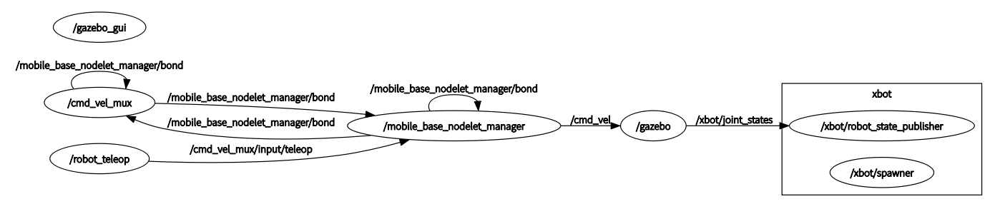

# 安装ROS-Academy-for-Beginners教学包

创建一个名为tutorial_ws的工作空间，在它的的src路径下克隆ROS-Academy-for-Beginners软件包
```shell
$ cd 
$ mkdir -p tutorial_ws/src   #创建catkin工作空间
$ cd tutorial_ws/src         #进入src路径，克隆教学软件包
$ git clone https://github.com/DroidAITech/ROS-Academy-for-Beginners.git
```

安装ROS-Academy-for-Beginners所需要的依赖
```shell
$ cd ~/tutorial_ws
$ rosdep install --from-paths src --ignore-src --rosdistro=kinetic -y
```

编译
```shell
$ cd ~/tutorial_ws
$ catkin_make
$ echo "source ~/tutorial_ws/devel/setup.zsh" >> ~/.zshrc
# 临时：$ source ~/tutorial_ws/devel/setup.zsh
# 重新打开终端 或者：
$ source ~/.zshrc
```

试运行项目
```shell
# 启动机器人节点
$ roslaunch robot_sim_demo robot_spawn.launch
# 启动键盘控制
$ rosrun robot_sim_demo robot_keyboard_teleop.py
```
> 按i、j、l等按键，就可以通过键盘来控制机器人的移动。

项目简单探究：
```
$ rostopic echo /cmd_vel_mux/input/teleop       
linear: 
  x: 0.0
  y: 0.0
  z: 0.0
angular: 
  x: 0.0
  y: 0.0
  z: 0.0
```



以上已经完成了ROS最常见的源码下载-安装依赖-编译-运行的流程，在ROS社区有许许多多这样的软件包，基本都按照这样的流程来运行。

# 二进制包 vs. 源代码包

我们通过apt方式安装了ROS系统以及相关的软件包，我们也通过下载源码编译的方式安装了一个ROS教学软件包。这是两种常见的软件包安装方式，通常我们的软件包(Package)就可以分为二进制和源代码。

- 二进制包里面包括了已经编译完成，可以直接运行的程序。你通过sudo apt-get install来进行下载和解包（安装），执行完该指令后就可以马上使用了。因此这种方式简单快捷，适合比较固定、无需改动的程序。

- 而源代码包里是程序的原始代码，在你的计算机上必须经过编译，生成了可执行的二进制文件，方可运行。一些个人开发的程序、第三方修改或者你希望修改的程序都应当通过源代码包的来编译安装。而源代码包里是程序的原始代码，在你的计算机上必须经过编译，生成了可执行的二进制文件，方可运行。一些个人开发的程序、第三方修改或者你希望修改的程序都应当通过源代码包的来编译安装。

| 区别          | 二进制包                    | 源代码包                         |
|---------------|-----------------------------|----------------------------------|
| 下载方式      | apt-get install/直接下载deb | git clone/直接下载源代码         |
| ROS包存放位置 | /opt/ros/kinetic/           | 通常~/catkin_ws/src              |
| 编译方式      | 无需编译                    | 通过make/cmake/caktin            |
| 来源          | 官方apt软件源               | 开源项目、第三方开发者           |
| 扩展性        | 无法修改                    | 通过源代码修改                   |
| 可读性        | 无法查看源代码              | 方便阅读源代码                   |
| 优点          | 下载简单，安装方便          | 源码可修改，便于定制功能         |
| 缺点          | 无法修改                    | 编译工具、软件包依赖、版本和参数 |
| 应用场景      | 基础软件                    | 需要查看、开发和修改的程序       |

- 我们用apt-get安装了ROS及其组件，因此我们不需要编译就可以运行turtlesim程序。对于这些程序，除非我们做操作系统的设计开发才会去下载源码，否则直接用官方提供的ROS软件包；
- 而ROS-Academy-for-Beginners以源码呈现，你可以看到每个demo下面的C++/Python代码。对于这些源文件我们必须caktin_make编译，然后才能运行。

##  ROS二进制包的安装
在ROS中，我们可能经常会遇到缺少相关的ROS依赖的问题。有些时候你编译或者运行一些ROS程序，系统会提示找不到XXX功能包。

遇到这样的问题，请先注意阅读错误原因，看看是否有解决方法，也可以Google一下。如果是缺少ROS的依赖，通常可以用以下命令来安装：

```shell
$ sudo apt-get install ros-kinetic-PACAKGE
```
比如：
将PACKAGE替换为系统提示缺啥少的软件包，例如

```shell
$ sudo apt-get install ros-kinetic-slam-gmapping   #GMapping-SLAM算法包
$ sudo apt-get install ros-kinetic-turtlebot-description  #Turtlebot机器人模型包
```

> 所有APT官方中的ROS功能包都是按照ros--的形式来命名。

# 使用 IDE

通常ROS的程序都是用C++和Python开发的，为了提高开发的效率，我们建议用IDE来写代码。目前在Ubuntu上已经有许多IDE支持ROS开发，比如Eclipse、Qt Creator。不过这些IDE配置起来会比较麻烦，推荐一款适配ROS的IDE——RoboWare Studio来开发ROS。

# ROS 开源机器人
网站上列出了比较著名的支持ROS的机器人和自动驾驶平台
https://robots.ros.org/

