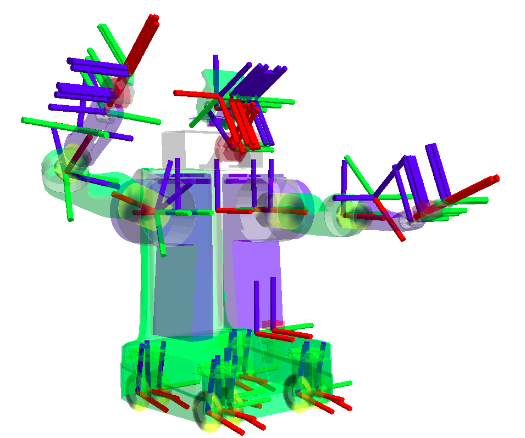
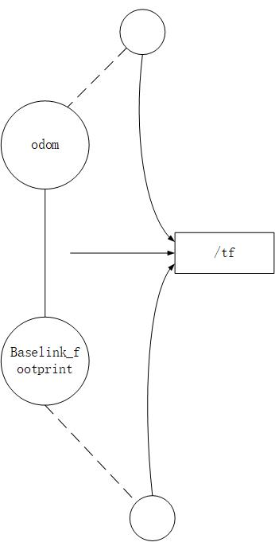

# 三维刚体运动数学基础
[参考文档](./res/三维空间刚体运动.pdf)

#简介
TF是一个ROS世界里的一个基本的也是很重要的概念，所谓TF(TransForm)，就是坐标转换.

坐标变换包括了位置和姿态两个方面的变换，ROS中的tf是一个可以让用户随时记录多个坐标系的软件包。tf保持缓存的树形结构中的坐标系之间的关系，并且允许用户在任何期望的时间点在任何两个坐标系之间转换点，矢量等．

## ROS中的TF
tf的定义不是那么的死板，它可以被当做是一种标准规范，这套标准定义了坐标转换的数据格式和数据结构．tf本质是树状的数据结构，所以我们通常称之为"tf tree",tf也可以看成是一个topic:/tf，话题中的message保存的就是tf tree的数据结构格式．维护了整个机器人的甚至是地图的坐标转换关系．tf还可以看成是一个package,它当中包含了很多的工具．比如可视化，查看关节间的tf,debug tf等等．tf含有一部分的接口，就是我们前面章节介绍的roscpp和rospy里关于tf的API．所以可以看成是话题转换的标准，话题，工具，接口.

 

观察上图，我们可以看到ROS数据结构的一个抽象图，ROS中机器人模型包含大量的部件，这些部件统称之为link,每一个link上面对应着一个frame, 即一个坐标系．link和frame概念是绑定在一起的．像上图pr2模型中我们可以看到又很多的frame,错综复杂的铺置在机器人的各个link上，维护各个坐标系之间的关系，就要靠着tf tree来处理，维护着各个坐标系之间的联通．如下图：

 

上图是我们常用的robot_sim_demo运行起来的tf　tree结构，每一个圆圈代表一个frame,对应着机器人上的一个link，任意的两个frame之间都必须是联通的，如果出现某一环节的断裂，就会引发error系统报错．所以完整的tf tree不能有任何断层的地方，这样我们才能查清楚任意两个frame之间的关系．仔细观察上图，我们发现每两个frame之间都有一个broadcaster,这就是为了使得两个frame之间能够正确连通，中间都会有一个Node来发布消息来broadcaster.如果缺少Node来发布消息维护连通，那么这两个frame之间的连接就会断掉．broadcaster就是一个publisher,如果两个frame之间发生了相对运动，broadcaster就会发布相关消息．

# TF消息
## TransformStamped.msg

上一节在介绍ROS中的TF时候我们已经初步的认识了TF和TF树，了解了在每个frame之间都会有broadcaster来发布消息维系坐标转换．那么这个消息到底是什么样子的呢？这个消息TransformStampde.msg,它就是处理两个frame之间一小段tf的数据格式．

TransformStamped.msg的格式规范如下：
```
std_mags/Header header
        uint32 seq
        time stamp
        string frame_id
string child_frame_id
geometry_msgs/Transform transform
        geometry_msgs/Vector3 translation
                float64 x
                float64 y
                float64 z
        geometry_msgs/Quaternion rotation
                float64 x
                float64 y
                flaot64 z
                float64 w
```

观察标准的格式规范，首先header定义了序号，时间以及frame的名称．接着还写了child_frame，这两个frame之间要做那种变换就是由geometry_msgs/Transform来定义．Vector3三维向量表示平移，Quaternion四元数表示旋转．像下图TF树中的两个frame之间的消息，就是由这种格式来定义的．odom就是frame_id,baselink_footprint就是child_frame_id.我们知道，一个topic上面，可能会有很多个node向上面发送消息。如图所示，不仅有我们看到的frame发送坐标变换个tf，还有别的frame也在同样的向它发送消息。最终，许多的TransformStamped.msg发向tf，形成了TF树。

 

## TF树的数据类型
上面我们讲了，TF tree是由很多的frame之间TF拼接而成。那么TF tree是什么类型呢？如下：

- tf/tfMessage.msg
- tf2_msgs/TFMessage.msg

这里TF的数据类型有两个，主要的原因是版本的迭代。自ROS Hydro以来，tf第一代已被“弃用”，转而支持tf2。tf2相比tf更加简单高效。此外也添加了一些新的功能。

由于tf2是一个重大的变化，tf API一直保持现有的形式。由于tf2具有tf特性的超集和一部分依赖关系，所以tf实现已经被移除，并被引用到tf2下。这意味着所有用户都将与tf2兼容。官网建议新工作直接使用tf2，因为它有一个更清洁的界面，和更好的使用体验。

如何查看自己使用的TF是哪一个版本，使用命令rostopic info /tf即可。

## 格式定义

tf/tfMessage.msg或tf2_msgs/TFMessage标准格式规范如下:

```
geometry_msgs/TransformStamped[] transforms
        std_msgs/Header header
                uint32 seq
                time stamp
                string frame_id
        string child_frame_id
        geometry_msgs/Transform transform
                geometry_msgs/Vector3 translation
                        float64 x
                        float64 y
                        float64 z
                geometry_msgs/Quaternion rotation
                        float64 x
                        float64 y
                        flaot64 z
                        float64 w
```
一个TransformStamped数组就是一个TF tree。 

## TransformStamped.msg 与 tf2_msgs/TFMessage的区别：
- TransformStamped.msg 
	- 处理两个frame之间一小段tf的数据格式
- TransformStamped数组
	- 由多个小段组成的树的数据格式

# tf in python
## 数据类型
TF的相关数据类型，向量、点、四元数、矩阵都可以表示成类似数组形式，就是它们都可以用Tuple，List，Numpy Array来表示。

例如：
```
    t = (1.0,1.5,0) #平移
    q = [1,0,0,0] #四元数
    m = numpy.identity(3) #旋转矩阵
```
第一个平移数据使用Tuple表示的，同时也可以用List表示成t=[1.0,1.5,0],也能用numpy.array(1.0,1.5,0)来表示都是可以的。这些数据类型没有特殊对应，全部是通用的，所以这里也就没有了各种数据类型的转换的麻烦。

## TF库
### tf.transformations类

基本数学运算函数

| 函数                                          | 注释           |
|-----------------------------------------------|----------------|
| euler_matrix(ai,aj,ak,axes='sxyz')            | 欧拉角到矩阵   |
| eulaer_form_matrix(matrix,axes='sxyz')        | 矩阵到欧拉角   |
| eular_from_quaternion(quaternion,axes='sxyz') | 四元数到欧拉角 |
| quaternion_form_euler(ai,aj,ak,axes='sxyz')   | 欧拉角到四元数 |
| quaternion_matrix(quaternion)                 | 四元数到矩阵   |
| quaternion_form_matrix(matrix)                | 矩阵到四元数   |
| ......                                        | ......         |

使用该函数库时候，首先`import tf`，tf.transformations给我们提供了一些基本的数学运算函数如上，使用起来非常方便。在tf_demo中教学包当中，我们列举了一些tf.transformations常见的API和示例代码，具详见下表。

- 第1部分，定义空间点和空间向量

| 编号 | 函数名称                                             | 函数功能                 |
|------|------------------------------------------------------|--------------------------|
| 1.1  | tf.transformations.random_quaternion(rand=None)      | 返回均匀随机单位四元数   |
| 1.2  | tf.transformations.random_rotation_matrix(rand=None) | 返回均匀随机单位旋转矩阵 |
| 1.3  | tf.transformations.random_vector(size)               | 返回均匀随机单位向量     |
| 1.4  | tf.transformations.translation_matrix(v)             | 通过向量来求旋转矩阵     |
| 1.5  | tf.transformations.translation_from_matrix(m)        | 通过旋转矩阵来求向量     |

- 第2部分，定义四元数和欧拉角

| 编号 | 函数名称                                                        | 函数功能                     |
|------|-----------------------------------------------------------------|------------------------------|
| 2.1  | tf.transformations.quaternion_about_axis(angle axis)            | 通过旋转轴和旋转角返回四元数 |
| 2.2  | tf.transformations.quaternion_conjugate(quaternion)             | 返回四元数的共轭             |
| 2.3  | tf.transformations.quaternion_from_euler(ai,aj,ak, axes'ryxz')  | 从欧拉角和旋转轴，求四元数   |
| 2.4  | tf.transformations.quaternion_from_matrix(matrix)               | 从旋转矩阵中，返回四元数     |
| 2.5  | tf.transformations.quaternion_multiply(quaternion1,quaternion2) | 两个四元数相乘               |
| 3.1  | tf.transformations.euler_matrix(ai,aj,ak,axes='xyz') | 由欧拉角和旋转轴返回旋转矩阵       |
| 3.2  | tf.transformations.euler_from_matrix(matrix)         | 由旋转矩阵和特定的旋转轴返回欧拉角 |
| 3.3  | tf.transformations.euler_from_quaternion(quaternion) | 由四元数和特定的轴得到欧拉角       |

示例代码：
```shell
$ cd ~
$ git clone https://github.com/sychaichangkun/ROS-Academy-for-Beginners.git
$ cp -r ROS-Academy-for-Beginners/tf_demo catkin_ws/src
$ cd ~/catkin_ws
$ catkin_make
# 新终端
$ roscore
# 新终端
$ rosrun tf_demo py_coordinate_transformation.py
```
> 需要提前启动roscore

py_coordinate_transformation.py 
```
#!/usr/bin/env python  
# -*- coding:utf-8 -*-  
import rospy  
import math  
import tf  
if __name__ == '__main__':  
    rospy.init_node('py_coordinate_transformation')
#第1部分，定义空间点和空间向量
    print '第1部分，定义空间点和空间向量'
#1.1 返回均匀随机单位四元数
    q=tf.transformations.random_quaternion(rand=None)
    print '定义均匀随机四元数：'
    print q
#1.2 返回均匀随机单位旋转矩阵
    m=tf.transformations.random_rotation_matrix(rand=None)
    print '定义均匀随机单位旋转矩阵：'
    print m
#1.3 返回均匀随机单位向量
    v=tf.transformations.random_vector(3)
    print '定义均匀随机单位向量：'
    print v
#1.4 通过向量来求旋转矩阵
    v_m=tf.transformations.translation_matrix(v)
    print '通过向量来求旋转矩阵：'
    print v_m
#1.5 通过旋转矩阵来求向量
    m_v=tf.transformations.translation_from_matrix(m)
    print '通过旋转矩阵来求向量：'
    print  m_v
#第2部分，定义四元数
    print '第2部分，定义四元数'
#2.1 通过旋转轴和旋转角返回四元数
    axis_q=tf.transformations.quaternion_about_axis(0.123, (1, 0, 0))
    print '通过旋转轴和旋转角返回四元数：'
    print  axis_q
#2.2 返回四元数的共轭
    n_q=tf.transformations.quaternion_conjugate(q)
    print '返回四元数q的共轭：'
    print  n_q
#2.3 从欧拉角和旋转轴，求四元数
    o_q=tf.transformations.quaternion_from_euler(1, 2, 3, 'ryxz')
    print '从欧拉角和旋转轴，求四元数：'
    print  o_q    
#2.4 从旋转矩阵中，返回四元数
    m_q=tf.transformations.quaternion_from_matrix(m)
    print '从旋转矩阵中，返回四元数：'
    print  m_q 
#2.5 两个四元数相乘
    qxq=tf.transformations.quaternion_multiply(q,n_q)
    print '两个四元数相乘'
    print  qxq   
```

### tf.TransformBroadcaster类
tf发布器使用 tf.TransformBroadcaster类。该类的构造函数不需要填值，成员函数有两个如下：

- sendTransform(translation,rotation,time,child,parent)#向/tf发布消息
- sendTransformMessage(transform)#向/tf发布消息

第一个sendTransform()把transform的平移和旋转填好，打上时间戳，然后表示出从父到子的frame流，然后发向/tf的topic。

第二种是发送transform已经封装好的Message（`geometry_msgs.msg.TransformStamped()`）给/tf，这两种不同的发送方式，功能是一致的。在tf_demo教学包当中的scripts/py_tf_broadcaster.py和scripts/py_tf_broadcaster02.py给出了示例程序，详见如下。

```shell
# 新终端
$ roscore
# 新终端
$ rosrun tf_demo py_tf_broadcaster.py
# 或者
$ rosrun tf_demo py_tf_broadcaster02.py
```

py_tf_broadcaster.py

```python
#!/usr/bin/env python  
# -*- coding:utf-8 -*-  

import rospy  
import math  
import tf    
if __name__ == '__main__':  
    rospy.init_node('py_tf_broadcaster')
    print '讲解tf.transformBroadcaster类'
    print '第1种发布方式：sendTransform(translation,rotation,time,child,parent)'
#第一部分，发布sendTransform(translation,rotation,time,child,parent)
    br = tf.TransformBroadcaster()
#输入相对原点的值和欧拉角
    x=1.0 
    y=2.0
    z=3.0  
    roll=0 
    pitch=0
    yaw=1.57 
    rate = rospy.Rate(1)
    while not rospy.is_shutdown(): 
        yaw=yaw+0.1   
        br.sendTransform((x,y,z),  
                     tf.transformations.quaternion_from_euler(roll,pitch,yaw),  
                     rospy.Time.now(),  
                     "base_link",  
                     "link1")  #发布base_link到link1的平移和翻转   
        rate.sleep()

```

py_tf_broadcaster02.py
```python
#!/usr/bin/env python  
# -*- coding:utf-8 -*-  

import rospy 
import geometry_msgs.msg
import tf2_ros.transform_broadcaster
import math  
import tf   

if __name__ == '__main__':  
    rospy.init_node('py_tf_broadcaster')
    print '讲解tf.transformBroadcaster类'
    print '第2种发布方式：sendTransformMessage(transform)'
#第二部分，发布sendTransformMessage(transform)
    m=tf.TransformBroadcaster()
    t = geometry_msgs.msg.TransformStamped()
    t.header.frame_id = 'base_link'
    t.header.stamp = rospy.Time(0)
    t.child_frame_id = 'link1'
    t.transform.translation.x = 1
    t.transform.translation.y = 2
    t.transform.translation.z = 3
    t.transform.rotation.w=1
    t.transform.rotation.x=0
    t.transform.rotation.y=0
    t.transform.rotation.z=0
#输入相对原点的值和欧拉角
    rate = rospy.Rate(1)
    while not rospy.is_shutdown():
        m.sendTransformMessage(t)
        rate.sleep()
```

测试：
```shell
$ rosnode info /py_tf_broadcaster 
--------------------------------------------------------------------------------
Node [/py_tf_broadcaster]
Publications: 
 * /rosout [rosgraph_msgs/Log]
 * /tf [tf2_msgs/TFMessage]
 
Subscriptions: None

Services: 
 * /py_tf_broadcaster/get_loggers
 * /py_tf_broadcaster/set_logger_level
......

$ rosmsg show tf2_msgs/TFMessage
geometry_msgs/TransformStamped[] transforms
  std_msgs/Header header
    uint32 seq
    time stamp
    string frame_id
  string child_frame_id
  geometry_msgs/Transform transform
    geometry_msgs/Vector3 translation
      float64 x
      float64 y
      float64 z
    geometry_msgs/Quaternion rotation
      float64 x
      float64 y
      float64 z
      float64 w
```
> 两种发送方式效果相同。

### tf.TransformListener类
tf.TransformListener类中主要包含三种方法，它的构造函数不需要填值。

| 方法                                                          | 作用                              |
|---------------------------------------------------------------|-----------------------------------|
| canTransform(self,target_frame,source_frame,time)             | frame是否相通                     |
| waitForTransform(self,target_frame,source_frame,time,timeout) | 阻塞直到frame相通                 |
| lookup Transform(self,target_frame,source_frame,time)         | 查看相对的tf，返回（trans，quat） |

首先看lookuptransform()函数，第一个参数是目标坐标系，第二个参数为源坐标系，也即是得到从源坐标系到目标坐标系之间的转换关系，第三个参数为查询时刻。值得注意，第三个参数通常用rospy.Time(0) ,这个表示为最新的坐标转换关系，而rospy.Time.now()则会因为收发延迟的原因，而不能正确获取当前最新的坐标转换关系。canTransform()是用来判断两个transform之间是否连通，waitForTransform()是用来等待某两个transform之间的连通.

除了上述三种重要的方法，这个类中还有一些辅助用的方法如下：

| 方法                                                                 | 作用                               |
|----------------------------------------------------------------------|------------------------------------|
| chain(target_frame,target_time,source_frame,source_time,fixed_frame) | frame的连接关系                    |
| frameExists(self,frame_id)                                           | frame是否存在                      |
| getFrameStrings(self)                                                | 返回所有tf的名称                   |
| fromTranslationRotation(translation,rotation)                        | 根据平移和旋转返回4X4矩阵          |
| transformPoint(target_frame,point_msg)                               | 将PointStamped消息转换到新frame下  |
| transformPose(target_frame,pose_msg)                                 | 将PoseStamped消息转换到新frame下   |
| transformQuaternion(target_frame,quat_msg)                           | 将QuaternionStamped...返回相同类型 |
| ...                                                                  | ...                                |

在tf_demo教学包当中的scripts/py_tf_listerner.py给出了示例程序:

py_tf_listerner.py

```python
#!/usr/bin/env python  
# -*- coding:utf-8 -*-  
import rospy  
import math  
import tf   
if __name__ == '__main__':  
    rospy.init_node('py_tf_turtle')
    #TransformListener创建后就开始接受tf广播信息，最多可以缓存10s
    listener = tf.TransformListener() 
    rate = rospy.Rate(1.0)  
    #1. 阻塞直到frame相通
    print '1. 阻塞直到frame相通'  
    listener.waitForTransform("/base_link", "/link1", rospy.Time(), rospy.Duration(4.0))
    while not rospy.is_shutdown():  
        try:  
        #2. 监听对应的tf,返回平移和旋转
            print '2. 监听对应的tf,返回平移和旋转'  
             #rospy.Time(0)不表示0时刻的tf，而是指最近一帧tf 
            (trans,rot) = listener.lookupTransform('/base_link', '/link1', rospy.Time(0))
        except (tf.LookupException, tf.ConnectivityException, tf.ExtrapolationException):  
            continue    
        rospy.loginfo('距离原点的位置: x=%f ,y= %f，z=%f \n 旋转四元数: w=%f ,x= %f，y=%f z=%f ',trans[0],trans[1],trans[2],rot[0],rot[1],rot[2],rot[3])
        #3. 判断两个frame是否相通
        print '3. 判断两个frame是否相通'
        if listener.canTransform('/link1','/base_link',rospy.Time(0)) :
            print 'true'
        else :
            print 'false'
        rate.sleep()
```

测试发布器和订阅器。
```shell
$ roscore
$ rosrun tf_demo py_tf_broadcaster.py
$ rosrun tf_demo py_tf_listerner.py
```
 

```shell
$ rostopic info /tf 
Type: tf2_msgs/TFMessage

Publishers: 
 * /py_tf_broadcaster (http://Ubuntu16:35335/)

Subscribers: 
 * /py_tf_turtle (http://Ubuntu16:36303/)
```

