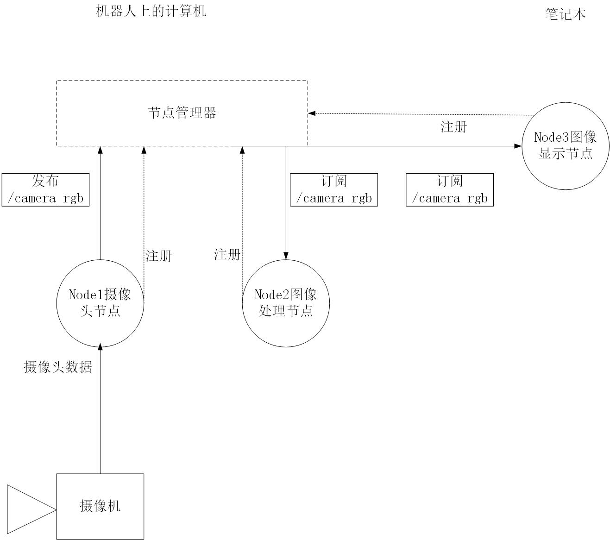
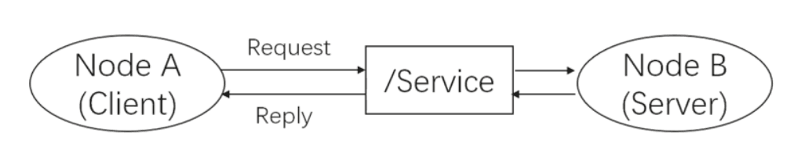

# ROS通信架构

ROS的通信架构是ROS的灵魂，也是整个ROS正常运行的关键所在。ROS通信架构包括各种数据的处理，进程的运行，消息的传递等等。本章主要介绍了通信架构的基础通信方式和相关概念。其中首先介绍了最小的进程单元节点Node,和节点管理器Node master。了解了ROS中的进程都是由很多的Node组成，并且由Node master来管理这些节点。

## Node & Master

### Node

在ROS的世界里，最小的进程单元就是节点（node）。一个软件包里可以有多个可执行文件，可执行文件在运行之后就成了一个进程(process)，这个进程在ROS中就叫做节点。 从程序角度来说，node就是一个可执行文件（通常为C++编译生成的可执行文件、Python脚本）被执行，加载到了内存之中；从功能角度来说，通常一个node负责者机器人的某一个单独的功能。由于机器人的功能模块非常复杂，我们往往不会把所有功能都集中到一个node上，而会采用分布式的方式，把鸡蛋放到不同的篮子里。例如有一个node来控制底盘轮子的运动，有一个node驱动摄像头获取图像，有一个node驱动激光雷达，有一个node根据传感器信息进行路径规划……这样做可以降低程序发生崩溃的可能性，试想一下如果把所有功能都写到一个程序中，模块间的通信、异常处理将会很麻烦。

### Master

由于机器人的元器件很多，功能庞大，因此实际运行时往往会运行众多的node，负责感知世界、控制运动、决策和计算等功能。那么如何合理的进行调配、管理这些node？这就要利用ROS提供给我们的节点管理器master, master在整个网络通信架构里相当于管理中心，管理着各个node。node首先在master处进行注册，之后master会将该node纳入整个ROS程序中。node之间的通信也是先由master进行“牵线”，才能两两的进行点对点通信。当ROS程序启动时，第一步首先启动master，由节点管理器处理依次启动node。

### 启动master和node

当我们要启动ROS时，首先输入命令:
```shell
$ roscore
```

此时ROS master启动，同时启动的还有rosout和parameter server,其中rosout是负责日志输出的一个节点，其作用是告知用户当前系统的状态，包括输出系统的error、warning等等，并且将log记录于日志文件中，parameter server即是参数服务器，它并不是一个node，而是存储参数配置的一个服务器，后文我们会单独介绍。每一次我们运行ROS的节点前，都需要把master启动起来，这样才能够让节点启动和注册。

master之后，节点管理器就开始按照系统的安排协调进行启动具体的节点。节点就是一个进程，只不过在ROS中它被赋予了专用的名字里——node。在第二章我们介绍了ROS的文件系统，我们知道一个package中存放着可执行文件，可执行文件是静态的，当系统执行这些可执行文件，将这些文件加载到内存中，它就成为了动态的node。具体启动node的语句是：
```shell
$ rosrun pkg_name node_name
```

> 通常我们运行ROS，就是按照这样的顺序启动，有时候节点太多，我们会选择用launch文件来启动

Master、Node之间以及Node之间的关系如下图所示：Master、Node之间以及Node之间的关系如下图所示：

 

### rosrun和rosnode命令
rosrun命令的详细用法如下：

```shell
$ rosrun [--prefix cmd] [--debug] pkg_name node_name [ARGS]
```
> rosrun将会寻找PACKAGE下的名为EXECUTABLE的可执行程序，将可选参数ARGS传入。

rosnode命令可以查看help。

## launch文件

roslaunch命令首先会自动进行检测系统的roscore有没有运行，也即是确认节点管理器是否在运行状态中，如果master没有启动，那么roslaunch就会首先启动master，然后再按照launch的规则执行。launch文件里已经配置好了启动的规则。 所以roslaunch就像是一个启动工具，能够一次性把多个节点按照我们预先的配置启动起来，减少我们在终端中一条条输入指令的麻烦。

### 写法与格式
launch文件同样也遵循着xml格式规范，是一种标签文本，它的格式包括以下标签：
```
<launch>    <!--根标签-->
<node>    <!--需要启动的node及其参数-->
<include>    <!--包含其他launch-->
<machine>    <!--指定运行的机器-->
<env-loader>    <!--设置环境变量-->
<param>    <!--定义参数到参数服务器-->
<rosparam>    <!--启动yaml文件参数到参数服务器-->
<arg>    <!--定义变量-->
<remap>    <!--设定参数映射-->
<group>    <!--设定命名空间-->
</launch>    <!--根标签-->
```

>  参考链接:
http://wiki.ros.org/roslaunch/XML

### 示例

launch文件的写法和格式看起来内容比较复杂，我们先来介绍一个最简单的例子如下：
```
<launch>
<node name="talker" pkg="rospy_tutorials" type="talker" />
</launch>
```
> 这是官网给出的一个最小的例子，文本中的信息是，它启动了一个单独的节点talker,该节点是包rospy_tutorials软件包中的节点。

然而实际中的launch文件要复杂很多，我们以Ros-Academy-for-Beginners中的robot_sim_demo为例：

```
<launch>
<!--arg是launch标签中的变量声明，arg的name为变量名，default或者value为值-->
<arg name="robot" default="xbot2"/>
<arg name="debug" default="false"/>
<arg name="gui" default="true"/>
<arg name="headless" default="false"/>

<!-- Start Gazebo with a blank world -->
<include file="$(find gazebo_ros)/launch/empty_world.launch"> <!--include用来嵌套仿真场景的launch文件-->
<arg name="world_name" value="$(find robot_sim_demo)/worlds/ROS-Academy.world"/>
<arg name="debug" value="$(arg debug)" />
<arg name="gui" value="$(arg gui)" />
<arg name="paused" value="false"/>
<arg name="use_sim_time" value="true"/>
<arg name="headless" value="$(arg headless)"/>
</include>

<!-- Oh, you wanted a robot? --> <!--嵌套了机器人的launch文件-->
<include file="$(find robot_sim_demo)/launch/include/$(arg robot).launch.xml" />

<!--如果你想连同RViz一起启动，可以按照以下方式加入RViz这个node-->
<!--node name="rviz" pkg="rviz" type="rviz" args="-d $(find robot_sim_demo)/urdf_gazebo.rviz" /-->
</launch>
```
> 它的作用是：启动gazebo模拟器，导入参数内容，加入机器人模型。

## Topic
ROS中的通信方式中，topic是常用的一种。对于实时性、周期性的消息，使用topic来传输是最佳的选择。topic是一种点对点的单向通信方式，这里的“点”指的是node，也就是说node之间可以通过topic方式来传递信息。topic要经历下面几步的初始化过程：首先，publisher节点和subscriber节点都要到节点管理器进行注册，然后publisher会发布topic，subscriber在master的指挥下会订阅该topic，从而建立起sub-pub之间的通信。注意整个过程是单向的。其结构示意图如下：

 

Subscriber接收消息会进行处理，一般这个过程叫做回调(Callback)。所谓回调就是提前定义好了一个处理函数（写在代码中），当有消息来就会触发这个处理函数，函数会对消息进行处理。

上图就是ROS的topic通信方式的流程示意图。topic通信属于一种异步的通信方式。

### 通信示例

参考下图，我们以摄像头画面的发布、处理、显示为例讲讲topic通信的流程。在机器人上的摄像头拍摄程序是一个node（圆圈表示,我们记作node1），当node1运行启动之后，它作为一个Publisher就开始发布topic。比如它发布了一个topic（方框表示），叫做/camera_rgb，是rgb颜色信息，即采集到的彩色图像。同时，node2假如是图像处理程序,它订阅了/camera_rgb这个topic，经过节点管理器的介绍，它就能建立和摄像头节点（node1）的连接。

那么怎么样来理解“异步”这个概念呢？在node1每发布一次消息之后，就会继续执行下一个动作，至于消息是什么状态、被怎样处理，它不需要了解；而对于node2图像处理程序，它只管接收和处理/camera_rgb上的消息，至于是谁发来的，它不会关心。所以node1、node2两者都是各司其责，不存在协同工作，我们称这样的通信方式是异步的。

 

ROS是一种分布式的架构，一个topic可以被多个节点同时发布，也可以同时被多个节点接收。这就体现了分布式系统通信的好处：扩展性好、软件复用率高。

总结三点：

- topic通信方式是异步的，发送时调用publish()方法，发送完成立即返回，不用等待反馈。
- subscriber通过回调函数的方式来处理消息。
- topic可以同时有多个subscribers，也可以同时有多个publishers。ROS中这样的例子有：/rosout、/tf等等。

### 操作命令
rostopic 
> 可以使用help查看具体用法

### 测试实例
```shell
$ roslaunch robot_sim_demo robot_spawn_launch
$ rostopic list
$ rostopic info /camera/rgb/image_raw
# 查看图片话题发布的图片
# rosrun image_view image_view image:=<image topic> [transport]
$ rosrun image_view image_view image:=/camera/rgb/image_raw
```

## Message

topic有很严格的格式要求，比如上节的摄像头进程中的rgb图像topic，它就必然要遵循ROS中定义好的rgb图像格式。这种数据格式就是Message。Message按照定义解释就是topic内容的数据类型，也称之为topic的格式标准。这里和我们平常用到的Massage直观概念有所不同，这里的Message不单单指一条发布或者订阅的消息，也指定为topic的格式标准。

### 结构与类型
基本的msg包括bool、int8、int16、int32、int64(以及uint)、float、float64、string、time、duration、header、可变长数组array[]、固定长度数组array[C]。那么具体的一个msg是怎么组成的呢？我们用一个具体的msg来了解，例如上例中的msg sensor_msg/image,位置存放在sensor_msgs/msg/image.msg里,它的结构如下：

```
std_msg/Header header
    uint32    seq
    time    stamp
    string    frame_id
uint32    height
uint32    width
string    encoding
uint8    is_bigendian
uint32    step
uint8[]    data
```

> Message不仅仅是我们平时理解的一条一条的消息，而且更是ROS中topic的格式规范。或者可以理解msg是一个“类”，那么我们每次发布的内容可以理解为“对象”，这么对比来理解可能更加容易。 我们实际通常不会把Message概念分的那么清，通常说Message既指的是类，也是指它的对象。而msg文件则相当于类的定义了。

### 操作命令

rosmsg

### 常见message
常见的message类型，包括std_msgs, sensor_msgs, nav_msgs, geometry_msgs等

可以通过命令查看ros自带的消息定义：
```shell
$ roscd std_msgs/
$ pwd
$ tree

/opt/ros/kinetic/share/std_msgs
.
├── cmake
│   ├── std_msgsConfig.cmake
│   ├── std_msgsConfig-version.cmake
│   ├── std_msgs-msg-extras.cmake
│   └── std_msgs-msg-paths.cmake
├── msg
│   ├── Bool.msg
	.......
│   ├── Int64MultiArray.msg
│   ├── Int8.msg
│   ├── Int8MultiArray.msg
│   ├── MultiArrayDimension.msg
	........
│   ├── UInt64MultiArray.msg
│   ├── UInt8.msg
│   └── UInt8MultiArray.msg
└── package.xml
```
> 上面是基本消息的ROS package

与之对应的Python库：
```shell
/opt/ros/kinetic/lib/python2.7/dist-packages/std_msgs

std_msgs
├── __init__.py
├── __init__.pyc
└── msg
    ├── _Bool.py
    ├── _Bool.pyc
    ├── _ByteMultiArray.py
    ├── _ByteMultiArray.pyc
    ├── _Byte.py
    ├── _Byte.pyc
	.......
```

- Vector3.msg
```
#文件位置:geometry_msgs/Vector3.msg

float64 x
float64 y
float64 z
```
- Accel.msg
```
#定义加速度项，包括线性加速度和角加速度
#文件位置:geometry_msgs/Accel.msg
Vector3 linear
Vector3 angular
```
- Header.msg
```
#定义数据的参考时间和参考坐标
#文件位置:std_msgs/Header.msg
uint32 seq      #数据ID
time stamp      #数据时间戳
string frame_id #数据的参考坐标系
```
- Echos.msg
```
#定义超声传感器
#文件位置:自定义msg文件
Header header
uint16 front_left
uint16 front_center
uint16 front_right
uint16 rear_left
uint16 rear_center
uint16 rear_right
```
- Quaternion.msg
```
#消息代表空间中旋转的四元数
#文件位置:geometry_msgs/Quaternion.msg

float64 x
float64 y
float64 z
float64 w
```
- Imu.msg
```
#消息包含了从惯性原件中得到的数据，加速度为m/^2，角速度为rad/s
#如果所有的测量协方差已知，则需要全部填充进来如果只知道方差，则
#只填充协方差矩阵的对角数据即可
#位置：sensor_msgs/Imu.msg

Header header
Quaternion orientation
float64[9] orientation_covariance
Vector3 angular_velocity
float64[9] angular_velocity_covariance
Vector3 linear_acceleration
float64[] linear_acceleration_covariance
```
- LaserScan.msg
```
#平面内的激光测距扫描数据，注意此消息类型仅仅适配激光测距设备
#如果有其他类型的测距设备(如声呐)，需要另外创建不同类型的消息
#位置：sensor_msgs/LaserScan.msg

Header header            #时间戳为接收到第一束激光的时间
float32 angle_min        #扫描开始时的角度(单位为rad)
float32 angle_max        #扫描结束时的角度(单位为rad)
float32 angle_increment    #两次测量之间的角度增量(单位为rad)
float32 time_increment    #两次测量之间的时间增量(单位为s)
float32 scan_time        #两次扫描之间的时间间隔(单位为s)
float32 range_min        #距离最小值(m)
float32 range_max        #距离最大值(m)
float32[] ranges        #测距数据(m,如果数据不在最小数据和最大数据之间，则抛弃)
float32[] intensities    #强度，具体单位由测量设备确定，如果仪器没有强度测量，则数组为空即可
```
- Point.msg
```
#空间中的点的位置
#文件位置:geometry_msgs/Point.msg

float64 x
float64 y
float64 z
```
- Pose.msg
```
#消息定义自由空间中的位姿信息，包括位置和指向信息
#文件位置:geometry_msgs/Pose.msg

Point position
Quaternion orientation
```
- PoseStamped.msg
```
#定义有时空基准的位姿
#文件位置：geometry_msgs/PoseStamped.msg

Header header
Pose pose
```
- PoseWithCovariance.msg
```
#表示空间中含有不确定性的位姿信息
#文件位置：geometry_msgs/PoseWithCovariance.msg

Pose pose
float64[36] covariance
```
- Power.msg
```
#表示电源状态，是否开启
#文件位置：自定义msg文件
Header header
bool power
######################
bool ON  = 1
bool OFF = 0
```
- Twist.msg
```
#定义空间中物体运动的线速度和角速度
#文件位置：geometry_msgs/Twist.msg

Vector3 linear
Vector3 angular
```
- TwistWithCovariance.msg
```
#消息定义了包含不确定性的速度量，协方差矩阵按行分别表示：
#沿x方向速度的不确定性，沿y方向速度的不确定性，沿z方向速度的不确定性
#绕x转动角速度的不确定性，绕y轴转动的角速度的不确定性，绕z轴转动的
#角速度的不确定性
#文件位置：geometry_msgs/TwistWithCovariance.msg

Twist twist
float64[36] covariance  #分别表示[x; y; z; Rx; Ry; Rz]
```
- Odometry.msg
```
#消息描述了自由空间中位置和速度的估计值
#文件位置：nav_msgs/Odometry.msg

Header header
string child_frame_id
PoseWithCovariance pose
TwistWithCovariance twist
```

## Service

topic是ROS中的一种单向的异步通信方式。然而有些时候单向的通信满足不了通信要求，比如当一些节点只是临时而非周期性的需要某些数据，如果用topic通信方式时就会消耗大量不必要的系统资源，造成系统的低效率高功耗。
这种情况下，就需要有另外一种请求-查询式的通信模型。这节我们来介绍ROS通信中的另一种通信方式——service(服务)。

### 工作原理

为了解决以上问题，service方式在通信模型上与topic做了区别。Service通信是双向的，它不仅可以发送消息，同时还会有反馈。所以service包括两部分，一部分是请求方（Clinet），另一部分是应答方/服务提供方（Server）。这时请求方（Client）就会发送一个request，要等待server处理，反馈回一个reply，这样通过类似“请求-应答”的机制完成整个服务通信。

这种通信方式的示意图如下：
Node B是server（应答方），提供了一个服务的接口，叫做/Service，我们一般都会用string类型来指定service的名称，类似于topic。Node A向Node B发起了请求，经过处理后得到了反馈。

 

Service是同步通信方式，所谓同步就是说，此时Node A发布请求后会在原地等待reply，直到Node B处理完了请求并且完成了reply，Node A才会继续执行。Node A等待过程中，是处于阻塞状态的成通信。这样的通信模型没有频繁的消息传递，没有冲突与高系统资源的占用，只有接受请求才执行服务，简单而且高效。

### topic VS service

| 名称     | Topic                            | Service                           |
|----------|----------------------------------|-----------------------------------|
| 通信方式 | 异步通信                         | 同步通信                          |
| 实现原理 | TCP/IP                           | TCP/IP                            |
| 通信模型 | Publish-Subscribe                | Request-Reply                     |
| 映射关系 | Publish-Subscribe(多对多)        | Request-Reply（多对一）           |
| 特点     | 接受者收到数据会回调（Callback） | 远程过程调用（RPC）服务器端的服务 |
| 应用场景 | 连续、高频的数据发布             | 偶尔使用的功能/具体的任务         |
| 举例     | 激光雷达、里程计发布数据         | 开关传感器、拍照、逆解计算        |

>  远程过程调用(Remote Procedure Call，RPC),可以简单通俗的理解为在一个进程里调用另一个进程的函数。

### 操作命令

rosservice

### 测试实例
```shell
$ roslaunch robot_sim_demo robot_spawn.launch
$ rosservice list
$ rosservice info /gazebo/delete_light

Node: /gazebo
URI: rosrpc://Ubuntu16:46359
Type: gazebo_msgs/DeleteLight
Args: light_name
# 这里的类型type也就是srv,传递参数Light_name

$ rosservice call /gazebo/delete_light sun

success: True
status_message: "DeleteLight: sun successfully deleted"
# 这里的sun 是参数名，使我们模拟场景中的唯一光源太阳。操作完成后可以看到场景中的光线消失。
# 可以看到终端的回传信息：success: True和sun successfully deleted。这就是双向通信的信息反馈，通知操作已经成功完成。
```

## Srv
类似msg文件，srv文件是用来描述服务（service数据类型的，service通信的数据格式定义在*.srv中。它声明了一个服务，包括请求(request)和响应（reply）两部分。

其格式声明如下,例如：

msgs_demo/srv/DetectHuman.srv
```
bool start_detect
---
my_pkg/HumanPose[] pose_data
```
> 该服务例子取自OpenNI的人体检测ROS软件包。它是用来查询当前深度摄像头中的人体姿态和关节数的。srv文件格式很固定，第一行是请求的格式，中间用---隔开，第三行是应答的格式。在本例中，请求为是否开始检测，应答为一个数组，数组的每个元素为某个人的姿态（HumanPose）。而对于人的姿态，其实是一个msg，所以srv可以嵌套msg在其中，但它不能嵌套srv。

### 操作命令

rossrv

## 自定义msg/srv 之后
定义完了msg、srv文件，还有重要的一个步骤就是修改package.xml和修改CMakeList.txt。这些文件需要添加一些必要的依赖等，例如：

> “**”所引就是新添加的依赖,实际运行需要去掉。

- package.xml
```
<build_depend>**message_generation **</build_depend>
<run_depend> **message_runtime ** </run_depend>
```

- CMakeList.txt
```
find_package(...roscpp rospy std_msgs ** message_generation **)

catkin_package(
...
CATKIN_DEPENDS ** message_runtime ** ...
...)

add_message_file(
FILES
** DetectHuman.srv **
** HumanPose.msg **
** JointPos.msg **)

** generate_messages(DEPENDENCIES std_msgs) **
```

## Parameter server

参数服务器可以说是特殊的“通信方式”。特殊点在于参数服务器是节点存储参数的地方、用于配置参数，全局共享参数。参数服务器使用互联网传输，在节点管理器中运行，实现整个通信过程。

参数服务器，作为ROS中另外一种数据传输方式，有别于topic和service，它更加的静态。参数服务器维护着一个数据字典，字典里存储着各种参数和配置。

### 维护方式
参数服务器的维护方式非常的简单灵活，总的来讲有三种方式：

- 命令行维护
- launch文件内读写
- node源码

#### 命令行维护
用命令行来维护参数服务器，主要使用rosparam语句来进行操作的各种命令，如下表：

| rosparam 命令                      | 作用           |
|------------------------------------|----------------|
| rosparam set param_key param_value | 设置参数       |
| rosparam get param_key             | 显示参数       |
| rosparam load file_name            | 从文件加载参数 |
| rosparam dump file_name            | 保存参数到文件 |
| rosparam delete                    | 删除参数       |
| rosparam list                      | 列出参数名称   |

load&&dump文件：

load和dump文件需要遵守YAML格式，YAML格式具体示例如下：
```
name:'Zhangsan'
age:20
gender:'M'
score{Chinese:80,Math:90}
score_history:[85,82,88,90]
```
>  格式为键值对，`key : value`

#### launch文件内读写
launch文件中有很多标签，而与参数服务器相关的标签只有两个，一个是`<param>`，另一个是`<rosparam>`

#### 通过修改node源码
除了上述最常用的两种读写参数服务器的方法，还有一种就是修改ROS的源码，也就是利用API来对参数服务器进行操作。

### 参数操作实例：
```shell
$ roslaunch robot_sim_demo robot_spawn.launch

# 查看参数服务器上的param
$ rosparam list

# 查询参数信息
$ rosparam get /gazebo/gravity_z
# 返回 value=-9.8

# 保存参数服务器上的参数到文件
$ rosparam dump param.yaml
```

## Action

Actionlib是ROS中一个很重要的库，类似service通信机制，actionlib也是一种请求响应机制的通信方式，actionlib主要弥补了service通信的一个不足，就是当机器人执行一个长时间的任务时，假如利用service通信方式，那么publisher会很长时间接受不到反馈的reply，致使通信受阻。当service通信不能很好的完成任务时候，actionlib则可以比较适合实现长时间的通信过程，actionlib通信过程可以随时被查看过程进度，也可以终止请求，这样的一个特性，使得它在一些特别的机制中拥有很高的效率。

### 通信原理
Action的工作原理是client-server模式，也是一个双向的通信模式。通信双方在ROS Action Protocol下通过消息进行数据的交流通信。client和server为用户提供一个简单的API来请求目标（在客户端）或通过函数调用和回调来执行目标（在服务器端）。 

工作模式的结构示意图如下：

 

通信双方在ROS Action Protocal下进行交流通信是通过接口来实现,如下图:

 

客户端会向服务器发送目标指令和取消动作指令,而服务器则可以给客户端发送实时的状态信息,结果信息,反馈信息等等,从而完成了service没法做到的部分.

### Action 规范
利用动作库进行请求响应，动作的内容格式应包含三个部分，目标、反馈、结果。

- 目标

机器人执行一个动作，应该有明确的移动目标信息，包括一些参数的设定，方向、角度、速度等等。从而使机器人完成动作任务。

- 反馈

在动作进行的过程中，应该有实时的状态信息反馈给服务器的实施者，告诉实施者动作完成的状态，可以使实施者作出准确的判断去修正命令。

- 结果

当运动完成时，动作服务器把本次运动的结果数据发送给客户端，使客户端得到本次动作的全部信息，例如可能包含机器人的运动时长，最终姿势等等。

### Action规范文件格式
Action规范文件的后缀名是.action，它的内容格式如下：
```
# Define the goal
uint32 dishwasher_id  # Specify which dishwasher we want to use
---
# Define the result
uint32 total_dishes_cleaned
---
# Define a feedback message
float32 percent_complete
```

### 常见srv类型
- AddTwoInts.srv
```
#对两个整数求和，虚线前是输入量，后是返回量
#文件位置：自定义srv文件
int32 a
int32 b
---
int32 sum
```
- Empty.srv
```
#文件位置：std_srvs/Empty.srv
#代表一个空的srv类型

---
```
- GetMap.srv
```
#文件位置:nav_msgs/GetMap.srv
#获取地图，注意请求部分为空

---
nav_msgs/OccupancyGrid map
```
- GetPlan.srv
```
#文件位置:nav_msgs/GetPlan.srv
#得到一条从当前位置到目标点的路径
geometry_msgs/PoseStamped start        #起始点
geometry_msgs/PoseStamped goal        #目标点
float32 tolerance    #到达目标点的x，y方向的容错距离
---
nav_msgs/Path plan
```
- SetBool.srv
```
#文件位置：std_srvs/SetBools.srv
bool data # 启动或者关闭硬件
---
bool success   # 标示硬件是否成功运行
string message # 运行信息
```
- SetCameraInfo.srv
```
#文件位置:sensor_msgs/SetCameraInfo.srv
#通过给定的CameraInfo相机信息，来对相机进行标定
sensor_msgs/CameraInfo camera_info        #相机信息
---
bool success            #如果调用成功，则返回true
string status_message    #给出调用成功的细节
```
- SetMap.srv
```
#文件位置：nav_msgs/SetMap.srv
#以初始位置为基准，设定新的地图
nav_msgs/OccupancyGrid map
geometry_msgs/PoseWithCovarianceStamped initial_pose
---
bool success
```
- TalkerListener.srv
```
#文件位置: 自定义srv文件
---
bool success   # 标示srv是否成功运行
string message # 信息，如错误信息等
```
- Trigger.srv
```
#文件位置:std_srvs/Trigger.srv
---
bool success   # 标示srv是否成功运行
string message # 信息，如错误信息等
```

### 常见action类型

- AddTwoInts.action
```
#文件位置:自定义action文件
#表示将两个整数求和
int64 a
int64 b
---
int64 sum
---
```
- AutoDocking.action
```
#文件位置:自定义action文件
#goal
---
#result
string text
---
#feedback
string state
string text
```
- GetMap.action
```
#文件位置:nav_msgs/GetMap.action
#获取地图信息，响应部分为空

---
nav_msgs/OccupancyGrid map
---
#无返回部分
```
- MoveBase.action
```
#文件位置:geometry_msgs/MoveBase.action
geometry_msgs/PoseStamped target_pose
---
---
geometry_msgs/PoseStamped base_position
```


