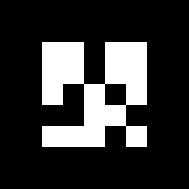

# ar_track_alvar

这是一个可以识别 AR tag 的ROS 库

github源码：

https://github.com/ros-perception/ar_track_alvar/tree/kinetic-devel

## AR tag 简介（ArUco）

- 是有7x7个方块组成，每个方块有黑白两种可能，最外圈只能是黑色
- 必须保证每个 AR tag 不能通过旋转去和其他ID的 AR tag 不能匹配
- 一共提供 1024个ID，即不同的 ARtag
- ARtag-ArUco 标签可以只使用 单目相机+单个标签 实现相机和标签相对位置的确定


## Overview

功能：

- 生成不同大小，分辨率和数据/ ID编码的AR标签
- 识别和跟踪单个AR标签的位姿，并可以整合kinect深度数据（当kinect可用时）以获得更好的位姿估计。
- 识别和跟踪由多个标签组成的“捆绑”的位姿。 这可以使位姿估计更稳定，并且提高对遮挡的鲁棒性以及支持对多边物体的跟踪。
- 使用相机图像自动计算“捆绑”标签之间的空间关系，这样用户就不必手动测量并在XML文件中输入标签位置以使用“捆绑”标签功能（貌似当前不可用）

## 安装

kinetic版本：

```shell
# 安装二进制包：
$ sudo apt-get install ros-kinetic-ar-track-alvar

# 安装源码包：
## 使用git clone 从github下载源码并编译
$ git clone https://github.com/ros-perception/ar_track_alvar.git
...
$ catkin_make
```

二进制包提供了launch文件：

```shell
➜ ar_track_alvar tree
.
├── bundles
│   ├── table_8_9_10.xml
│   ├── tags8and9.xml
│   └── truthTableLeg.xml
├── cmake
│   ├── ar_track_alvarConfig.cmake
│   └── ar_track_alvarConfig-version.cmake
├── launch
│   ├── pr2_bundle.launch
│   ├── pr2_bundle_no_kinect.launch
│   ├── pr2_indiv.launch
│   ├── pr2_indiv_no_kinect.launch
│   └── pr2_train.launch
└── package.xml
# /opt/ros/kinetic/share/ar_track_alvar/launch
```

二进制包提供如下节点：

```shell
➜ ar_track_alvar tree
.
├── createMarker
├── findMarkerBundles
├── findMarkerBundlesNoKinect
├── individualMarkers
├── individualMarkersNoKinect
└── trainMarkerBundle
# /opt/ros/kinetic/lib/ar_track_alvar
```

## 生成 AR tags

使用 createMarker 节点来生成AR tag

```shell
# 如果不带参数则会出现菜单，可以根据菜单进行选择
rosrun ar_track_alvar createMarker

# 可以通过参数指定ARtag
## 使用默认边长，指定ID
rosrun ar_track_alvar createMarker 0
## 指定边长和ID，边长为5cm，ID = 1
rosrun ar_track_alvar createMarker -s 5 1
```

> 由于打印在纸上，边长会变大或变小，所以要实际测量一下边长，然后在launch文件内配置
>
> 在当前目录生成的png图片



## Detecting individual tags

检测和跟踪单个的即非捆绑的ARtag（视频中的所有ARtag都被视为单独的），与之相关的两个节点：

- individualMarkers
  - 默认kinect为相机，因此可以集成深度数据以获得更好的位姿估计
- individualMarkersNoKinect
  - 没有使用kinect时或者不想使用深度数据，即单目摄像机

```shell
├── individualMarkers
├── individualMarkersNoKinect
```

以上两个节点采用以下命令行参数：

- `marker_size` (double) -- The width in centimeters of one side of the black square marker border 

- `max_new_marker_error` (double) -- A threshold determining when new markers can be detected under uncertainty 

- `max_track_error` (double) -- A threshold determining how much tracking error can be observed before an tag is considered to have disappeared 

- `camera_image`  (string) -- The name of the topic that provides camera frames for  detecting the AR tags.  This can be mono or color, but should be an  UNrectified image, since rectification takes place in this package 

- `camera_info` (string) -- The name of the topic that provides the camera calibration parameters so that the image can be rectified 

- `output_frame` (string) -- The name of the frame that the published Cartesian locations of the AR tags will be relative to 

